# Vereteilung der Idikatoren über die Gemeinden und Kreise von 1998 bis 2017 {.tabset}

## Arbeitsdimension


<!-- -->

```
## Saving 7 x 5 in image
```

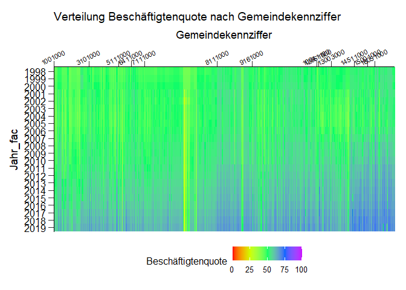<!-- -->

```
## Saving 7 x 5 in image
```

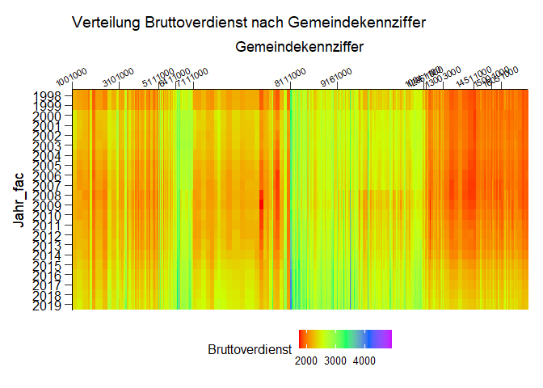<!-- -->

```
## Saving 7 x 5 in image
```

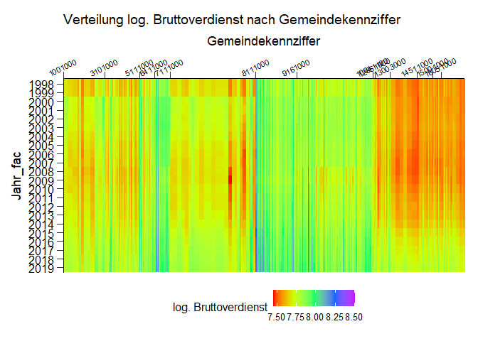<!-- -->

```
## Saving 7 x 5 in image
```


## Einkommensdimension

<!-- -->

```
## Saving 7 x 5 in image
```

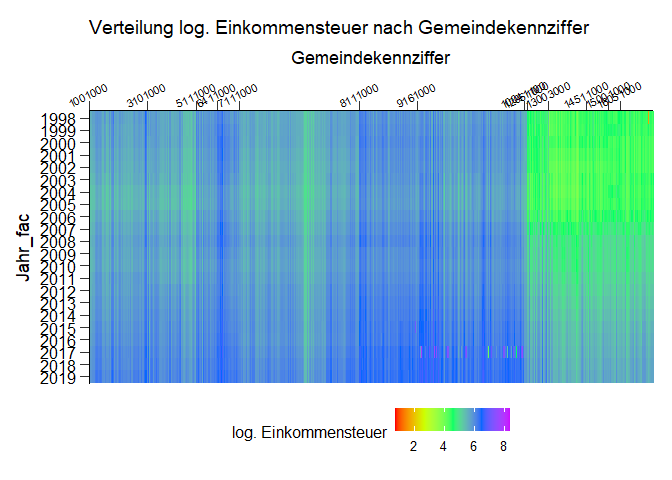<!-- -->

```
## Saving 7 x 5 in image
```

<!-- -->

```
## Saving 7 x 5 in image
```

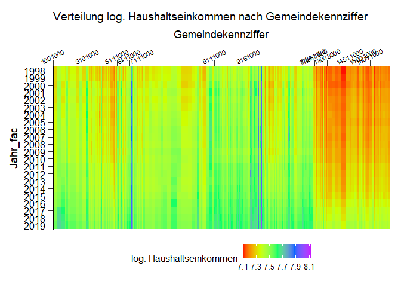<!-- -->

```
## Saving 7 x 5 in image
```

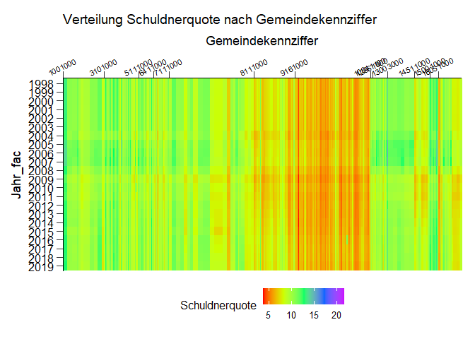<!-- -->

```
## Saving 7 x 5 in image
```


## Bildungsdimension

<!-- -->

```
## Saving 7 x 5 in image
```

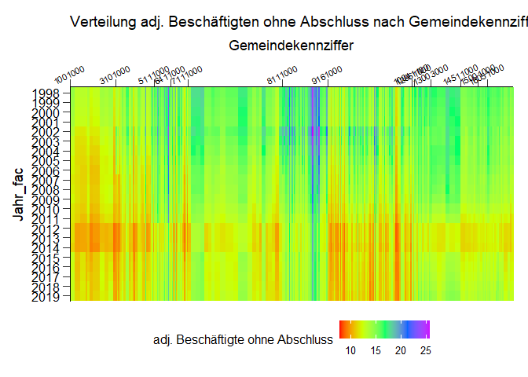<!-- -->

```
## Saving 7 x 5 in image
```

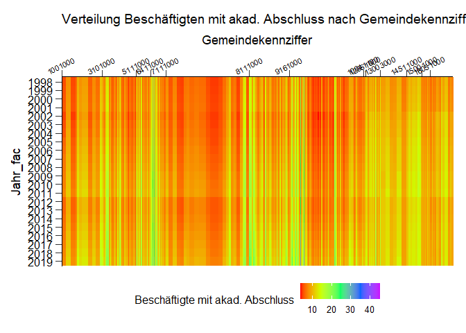<!-- -->

```
## Saving 7 x 5 in image
```

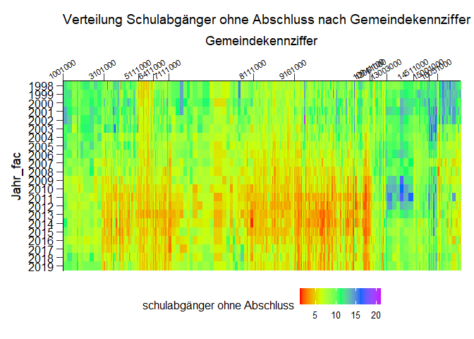<!-- -->

```
## Saving 7 x 5 in image
```

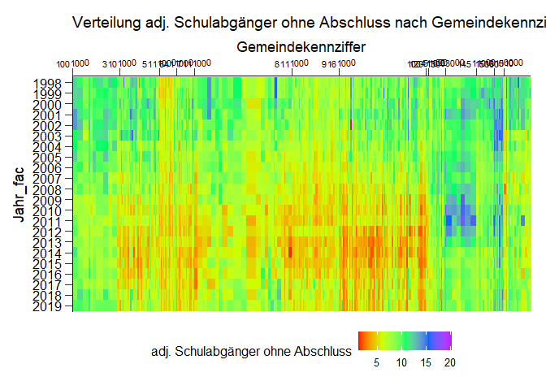<!-- -->

```
## Saving 7 x 5 in image
```

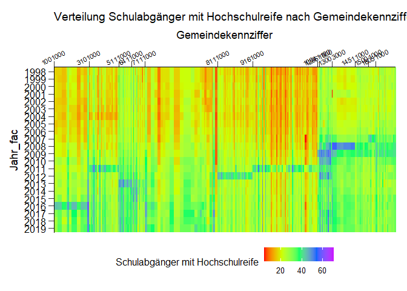<!-- -->

```
## Saving 7 x 5 in image
```

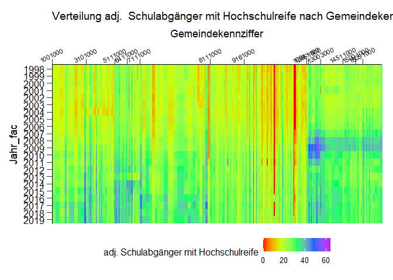<!-- -->

```
## Saving 7 x 5 in image
```
