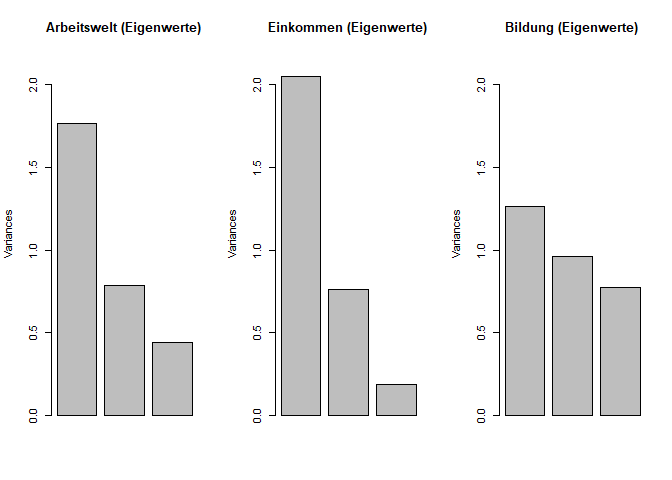
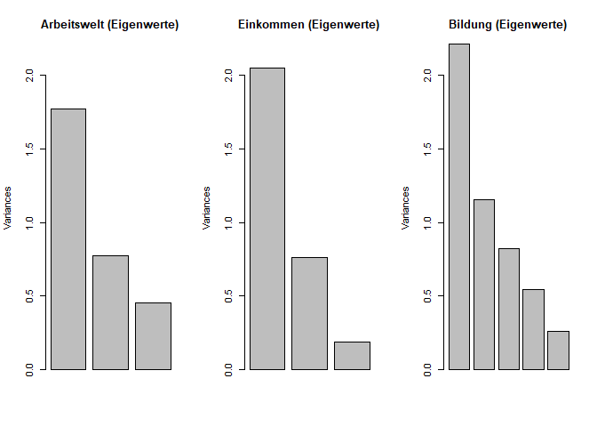
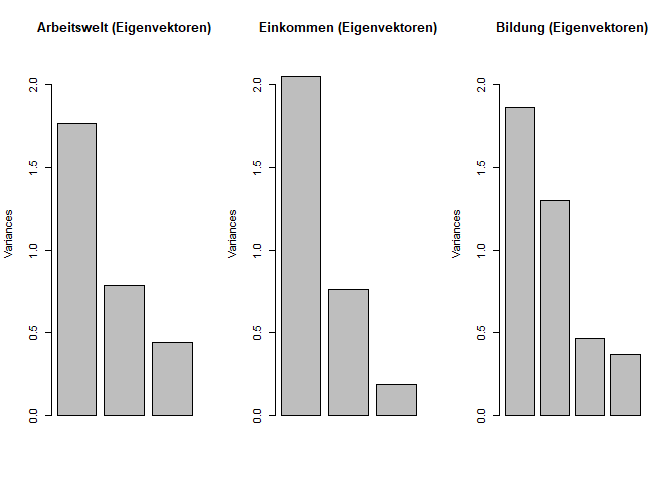
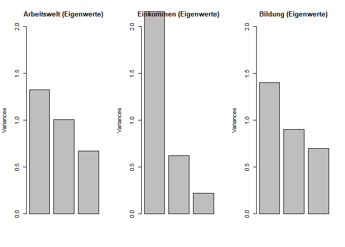
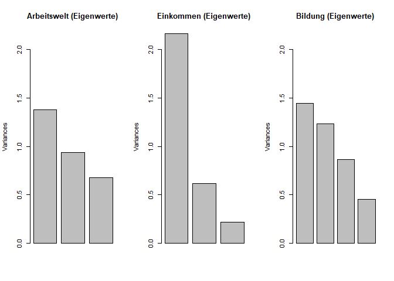
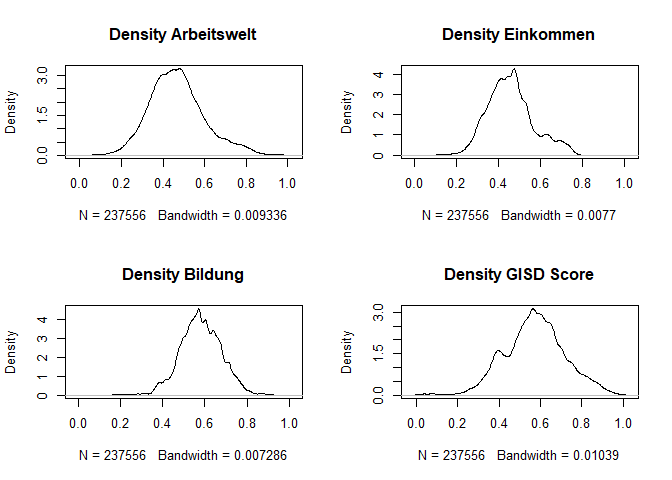

# Info

In diesem Codeblog analysieren wir die Faktorenanalyse des GISD. 


```r
library(tidyverse) # Tidyverse Methods
library(bookdown) 
library(readxl) # Read Excel
library(pastecs) # descriptive stats
library(knitr)
library(ggplot2)

home <- getwd()
setwd(home)

Impdata.imputed <- readRDS("Outfiles/2022/Impdata_check.rds")
```


```r
# Variablenliste für die Faktorenanalyse 
#print(listofdeterminants)

TS_Arbeitswelt <- Impdata.imputed  %>% ungroup() %>% 
  select(Beschaeftigtenquote,Arbeitslosigkeit,Bruttoverdienst_ln)

TS_Einkommen   <- Impdata.imputed %>% select(Einkommensteuer_ln,Haushaltseinkommen_ln,Schuldnerquote) 

TS_Bildung <- Impdata.imputed %>% select(BeschaeftigtemitakadAbschluss_adj,BeschaeftigteohneAbschluss_adj,SchulabgaengerohneAbschluss_adj)

TS_Bildung_NUTS2 <- Impdata.imputed %>% select(BeschaeftigtemitakadAbschluss_adj,BeschaeftigteohneAbschluss_adj,BevoelkerungmitakadAbschluss,BevoelkerungohneAbschluss,SchulabgaengerohneAbschluss_adj)

TS_Bildung_o <- Impdata.imputed %>% select(BeschaeftigtemitakadAbschluss_adj,BeschaeftigteohneAbschluss,SchulabgaengerohneAbschluss)


TS_Bildung_4items <- Impdata.imputed %>% select(BeschaeftigtemitakadAbschluss_adj,BeschaeftigteohneAbschluss_adj,SchulabgaengerohneAbschluss_adj, SchulabgaengermitHochschulreife_adj)

TS_Bildung_4items_o <- Impdata.imputed %>% select(BeschaeftigtemitakadAbschluss_adj,BeschaeftigteohneAbschluss,SchulabgaengerohneAbschluss_adj, SchulabgaengermitHochschulreife_adj)
```

# Verschiedene Faktorenanalysen des GISD {.tabset}


## Gepoolte Querschnitte

Es werden Hauptkomponentenanalysen für jede der drei Subskalen auf Basis der imputierten Daten geschätzt. 


```r
# PCA für die Arbeitsweltdimension
TS_Arbeitswelt.pca <- prcomp(TS_Arbeitswelt, center = TRUE, scale. = TRUE, retx=TRUE, rank. = 1)


# PCA für die Einkommensdimension
TS_Einkommen.pca <- prcomp(TS_Einkommen, center = TRUE, scale. = TRUE, retx=TRUE, rank. = 1) 


# PCA für die Bildungsdimension
TS_Bildung.pca <- prcomp(TS_Bildung, center = TRUE, scale. = TRUE, retx=TRUE, rank. = 1)

TS_Bildung_NUTS2.pca <- prcomp(TS_Bildung_NUTS2, center = TRUE, scale. = TRUE, retx=TRUE, rank. = 1)

TS_Bildung_4items.pca <- prcomp(TS_Bildung_4items, center = TRUE, scale. = TRUE, retx=TRUE, rank. = 1)

TS_Bildung_4items_o.pca <- prcomp(TS_Bildung_4items_o, center = TRUE, scale. = TRUE, retx=TRUE, rank. = 1)
```

### Eigenwerte der Komponenten


```r
par(mfrow=c(1, 3))
plot(TS_Arbeitswelt.pca, main = "Arbeitswelt (Eigenwerte)", ylim=c(0,2.2))
plot(TS_Einkommen.pca, main = "Einkommen (Eigenwerte)", ylim=c(0,2.2))
plot(TS_Bildung.pca, main = "Bildung (Eigenwerte)", ylim=c(0,2.2))
```

<!-- -->


```r
Varianz_tab <- cbind("F_A" = "Faktor1", "Var_A" = round(TS_Arbeitswelt.pca$sdev^2, digits = 3), "Var_E" = round(TS_Einkommen.pca$sdev^2, digits = 3),  "Var_B" = round(TS_Bildung.pca$sdev^2, digits = 3))

Varianz_tab <- cbind(as.data.frame(Varianz_tab))

Varianz_tab$F_A <- c("Faktor 1", "Faktor 2", "Faktor 3")

colnames(Varianz_tab) <- c("Faktoren", "Varianz Arbeitswelt", "Varianz Einkommen", "Varianz Bildung")

kable(Varianz_tab, caption = "Varianz der Faktoren (Eigenwerte)")
```


Table: (\#tab:unnamed-chunk-2)Varianz der Faktoren (Eigenwerte)

|Faktoren |Varianz Arbeitswelt |Varianz Einkommen |Varianz Bildung |
|:--------|:-------------------|:-----------------|:---------------|
|Faktor 1 |1.767               |2.052             |1.663           |
|Faktor 2 |0.791               |0.763             |0.795           |
|Faktor 3 |0.442               |0.185             |0.543           |


### Faktorladungen


```r
# Componentoverview

GISD_Komponents <- cbind("Teildimension"="Arbeitswelt","Faktorladung"=round((TS_Arbeitswelt.pca$rotation*sqrt(abs(TS_Arbeitswelt.pca$sdev[1]^2))), digits = 3),"Component"=round(TS_Arbeitswelt.pca$rotation, digits = 3))

GISD_Komponents <- rbind(GISD_Komponents,cbind("Teildimension"="Einkommen","Faktorladung"=round((TS_Einkommen.pca$rotation*sqrt(abs(TS_Einkommen.pca$sdev[1]^2))), digits = 3),"Component"=round(TS_Einkommen.pca$rotation, digits = 3)))

GISD_Komponents <- rbind(GISD_Komponents,cbind("Teildimension"="Bildung","Faktorladung"=round((TS_Bildung.pca$rotation*sqrt(abs(TS_Bildung.pca$sdev[1]^2))), digits = 3),"Component"=round(TS_Bildung.pca$rotation, digits = 3)))

GISD_Komponents <- cbind("Variables"=as.data.frame(rownames(GISD_Komponents)),as.data.frame(GISD_Komponents))

rownames(GISD_Komponents) <- NULL

colnames(GISD_Komponents) <- c("Variable","Dimension","Faktorladung","Component")

GISD_Komponents$prop_dem <- round(as.numeric(GISD_Komponents$Component)^2*100,digits=1)

GISD_Komponents$prop_GISD <- round(as.numeric(GISD_Komponents$prop_dem)/3, digits = 1)

colnames(GISD_Komponents) <- c("Variable","Dimension","Faktorladung","Component", "Anteil Teilscore", "Anteil GISD")

GISD_Komponents$Variable <- c("Beschäftigtenquote", "Arbeitslosigkeit", "Bruttoverdienst (log.)", "Einkommensteuer (log.)", "Haushaltseinkommen (log.)", "Schuldnerquote", "Beschäftigte mit akad. Abschluss (adj.)", "Beschäftigte ohne Abschluss (adj.)", "Schulabgänger ohne Abschluss (adj.)")

kable(GISD_Komponents, caption = "Faktorladungen und Anteile an den Teilscores sowie am Index")
```


Table: (\#tab:unnamed-chunk-3)Faktorladungen und Anteile an den Teilscores sowie am Index

|Variable                                |Dimension   |Faktorladung |Component | Anteil Teilscore| Anteil GISD|
|:---------------------------------------|:-----------|:------------|:---------|----------------:|-----------:|
|Beschäftigtenquote                      |Arbeitswelt |0.619        |0.465     |             21.6|         7.2|
|Arbeitslosigkeit                        |Arbeitswelt |-0.844       |-0.635    |             40.3|        13.4|
|Bruttoverdienst (log.)                  |Arbeitswelt |0.82         |0.617     |             38.1|        12.7|
|Einkommensteuer (log.)                  |Einkommen   |-0.912       |-0.636    |             40.4|        13.5|
|Haushaltseinkommen (log.)               |Einkommen   |-0.918       |-0.641    |             41.1|        13.7|
|Schuldnerquote                          |Einkommen   |0.615        |0.429     |             18.4|         6.1|
|Beschäftigte mit akad. Abschluss (adj.) |Bildung     |0.79         |0.613     |             37.6|        12.5|
|Beschäftigte ohne Abschluss (adj.)      |Bildung     |-0.802       |-0.622    |             38.7|        12.9|
|Schulabgänger ohne Abschluss (adj.)     |Bildung     |-0.628       |-0.487    |             23.7|         7.9|


## Gepoolte Querschnitte (NUTS2)

### Eigenwerte der Komponenten


```r
par(mfrow=c(1, 3))
plot(TS_Arbeitswelt.pca, main = "Arbeitswelt (Eigenwerte)", ylim=c(0,2.2))
plot(TS_Einkommen.pca, main = "Einkommen (Eigenwerte)", ylim=c(0,2.2))
plot(TS_Bildung_NUTS2.pca, main = "Bildung (Eigenwerte)", ylim=c(0,2.2))
```

<!-- -->


```r
Varianz_NUTS2_tab <- cbind("F_A" = "Faktor1", "Var_A" = round(TS_Arbeitswelt.pca$sdev^2, digits = 3), "Var_E" = round(TS_Einkommen.pca$sdev^2, digits = 3),  "Var_B" = round(TS_Bildung_NUTS2.pca$sdev^2, digits = 3))

Varianz_NUTS2_tab[4,2] = NA
Varianz_NUTS2_tab[4,3] = NA
Varianz_NUTS2_tab[5,2] = NA
Varianz_NUTS2_tab[5,3] = NA

Varianz_NUTS2_tab <- cbind(as.data.frame(Varianz_NUTS2_tab))

Varianz_NUTS2_tab$F_A <- c("Faktor 1", "Faktor 2", "Faktor 3", "Faktor 4", "Faktor 5")

colnames(Varianz_NUTS2_tab) <- c("Faktoren", "Varianz Arbeitswelt", "Varianz Einkommen", "Varianz Bildung")

kable(Varianz_NUTS2_tab, caption = "Varianz der Faktoren (Eigenwerte)")
```


Table: (\#tab:unnamed-chunk-5)Varianz der Faktoren (Eigenwerte)

|Faktoren |Varianz Arbeitswelt |Varianz Einkommen |Varianz Bildung |
|:--------|:-------------------|:-----------------|:---------------|
|Faktor 1 |1.767               |2.052             |2.47            |
|Faktor 2 |0.791               |0.763             |1.103           |
|Faktor 3 |0.442               |0.185             |0.695           |
|Faktor 4 |NA                  |NA                |0.52            |
|Faktor 5 |NA                  |NA                |0.213           |


### Faktorladungen


```r
# Componentoverview

GISD_Komponents <- cbind("Teildimension"="Arbeitswelt","Faktorladung"=round((TS_Arbeitswelt.pca$rotation*sqrt(abs(TS_Arbeitswelt.pca$sdev[1]^2))), digits = 3),"Component"=round(TS_Arbeitswelt.pca$rotation, digits = 3))

GISD_Komponents <- rbind(GISD_Komponents,cbind("Teildimension"="Einkommen","Faktorladung"=round((TS_Einkommen.pca$rotation*sqrt(abs(TS_Einkommen.pca$sdev[1]^2))), digits = 3),"Component"=round(TS_Einkommen.pca$rotation, digits = 3)))

GISD_Komponents <- rbind(GISD_Komponents,cbind("Teildimension"="Bildung","Faktorladung"=round((TS_Bildung_NUTS2.pca$rotation*sqrt(abs(TS_Bildung_NUTS2.pca$sdev[1]^2))), digits = 3),"Component"=round(TS_Bildung_NUTS2.pca$rotation, digits = 3)))

GISD_Komponents <- cbind("Variables"=as.data.frame(rownames(GISD_Komponents)),as.data.frame(GISD_Komponents))

rownames(GISD_Komponents) <- NULL

colnames(GISD_Komponents) <- c("Variable","Dimension","Faktorladung","Component")

GISD_Komponents$prop_dem <- round(as.numeric(GISD_Komponents$Component)^2*100,digits=1)

GISD_Komponents$prop_GISD <- round(as.numeric(GISD_Komponents$prop_dem)/3, digits = 1)

colnames(GISD_Komponents) <- c("Variable","Dimension","Faktorladung","Component", "Anteil Teilscore", "Anteil GISD")

GISD_Komponents$Variable <- c("Beschäftigtenquote", "Arbeitslosigkeit", "Bruttoverdienst (log.)", "Einkommensteuer (log.)", "Haushaltseinkommen (log.)", "Schuldnerquote", "Beschäftigte mit akad. Abschluss", "Beschäftigte ohne Abschluss (adj.)", "Bevölkerung mit akad. Abschluss (adj.)", "Bevölkerung ohne Abschluss", "Schulabgänger ohne Abschluss (adj.)")

kable(GISD_Komponents, caption = "Faktorladungen und Anteile an den Teilscores sowie am Index")
```


Table: (\#tab:unnamed-chunk-6)Faktorladungen und Anteile an den Teilscores sowie am Index

|Variable                               |Dimension   |Faktorladung |Component | Anteil Teilscore| Anteil GISD|
|:--------------------------------------|:-----------|:------------|:---------|----------------:|-----------:|
|Beschäftigtenquote                     |Arbeitswelt |0.619        |0.465     |             21.6|         7.2|
|Arbeitslosigkeit                       |Arbeitswelt |-0.844       |-0.635    |             40.3|        13.4|
|Bruttoverdienst (log.)                 |Arbeitswelt |0.82         |0.617     |             38.1|        12.7|
|Einkommensteuer (log.)                 |Einkommen   |-0.912       |-0.636    |             40.4|        13.5|
|Haushaltseinkommen (log.)              |Einkommen   |-0.918       |-0.641    |             41.1|        13.7|
|Schuldnerquote                         |Einkommen   |0.615        |0.429     |             18.4|         6.1|
|Beschäftigte mit akad. Abschluss       |Bildung     |0.78         |0.496     |             24.6|         8.2|
|Beschäftigte ohne Abschluss (adj.)     |Bildung     |-0.739       |-0.47     |             22.1|         7.4|
|Bevölkerung mit akad. Abschluss (adj.) |Bildung     |0.813        |0.518     |             26.8|         8.9|
|Bevölkerung ohne Abschluss             |Bildung     |-0.73        |-0.464    |             21.5|         7.2|
|Schulabgänger ohne Abschluss (adj.)    |Bildung     |-0.346       |-0.22     |              4.8|         1.6|


## 4 Items Bildung (BoA nicht adjustiert)
Gepoolte Querschnitte mit 4 Bildungsitems und Beschäftigte ohne Abschluss nicht adjustiert.

### Eigenwerte der Komponenten

```r
par(mfrow=c(1, 3))
plot(TS_Arbeitswelt.pca, main = "Arbeitswelt (Eigenwerte)", ylim=c(0,2.2))
plot(TS_Einkommen.pca, main = "Einkommen (Eigenwerte)", ylim=c(0,2.2))
plot(TS_Bildung_4items_o.pca, main = "Bildung (Eigenwerte)", ylim=c(0,2.2))
```

<!-- -->


```r
Varianz_B4_tab <- cbind("F_A" = "Faktor1", "Var_A" = round(TS_Arbeitswelt.pca$sdev^2, digits = 3), "Var_E" = round(TS_Einkommen.pca$sdev^2, digits = 3),  "Var_B" = round(TS_Bildung_4items_o.pca$sdev^2, digits = 3))

Varianz_B4_tab[4,2] = NA
Varianz_B4_tab[4,3] = NA

Varianz_B4_tab <- cbind(as.data.frame(Varianz_B4_tab))

Varianz_B4_tab$F_A <- c("Faktor 1", "Faktor 2", "Faktor 3", "Faktor 4")

colnames(Varianz_B4_tab) <- c("Faktoren", "Varianz Arbeitswelt", "Varianz Einkommen", "Varianz Bildung")

kable(Varianz_B4_tab, caption = "Varianz der Faktoren (Eigenwerte)")
```


Table: (\#tab:unnamed-chunk-8)Varianz der Faktoren (Eigenwerte)

|Faktoren |Varianz Arbeitswelt |Varianz Einkommen |Varianz Bildung |
|:--------|:-------------------|:-----------------|:---------------|
|Faktor 1 |1.767               |2.052             |2.049           |
|Faktor 2 |0.791               |0.763             |1.069           |
|Faktor 3 |0.442               |0.185             |0.488           |
|Faktor 4 |NA                  |NA                |0.394           |

### Faktorladungen


```r
# Componentoverview
GISD_Komponents_4 <- cbind("Teildimension"="Arbeitswelt","Faktorladung"=round((TS_Arbeitswelt.pca$rotation*sqrt(abs(TS_Arbeitswelt.pca$sdev[1]^2))), digits = 3),"Component"=round(TS_Arbeitswelt.pca$rotation, digits = 3))

GISD_Komponents_4 <- rbind(GISD_Komponents_4,cbind("Teildimension"="Einkommen","Faktorladung"=round((TS_Einkommen.pca$rotation*sqrt(abs(TS_Einkommen.pca$sdev[1]^2))), digits = 3),"Component"=round(TS_Einkommen.pca$rotation, digits = 3)))

GISD_Komponents_4 <- rbind(GISD_Komponents_4,cbind("Teildimension"="Bildung","Faktorladung"=round((TS_Bildung_4items_o.pca$rotation[1:4,1]*sqrt(abs(TS_Bildung_4items_o.pca$sdev[1]^2))), digits = 3),"Component"=round(TS_Bildung_4items_o.pca$rotation[1:4,1], digits = 3)))

GISD_Komponents_4 <- cbind("Variables"=as.data.frame(rownames(GISD_Komponents_4)),as.data.frame(GISD_Komponents_4))

rownames(GISD_Komponents_4) <- NULL

colnames(GISD_Komponents_4) <- c("Variable","Dimension","Faktorladung","Component")

GISD_Komponents_4$prop_dem <- round(as.numeric(GISD_Komponents_4$Component)^2*100,digits=1)

GISD_Komponents_4$prop_GISD <- round(as.numeric(GISD_Komponents_4$prop_dem)/3, digits = 1)

colnames(GISD_Komponents_4) <- c("Variable","Dimension","Faktorladung","Component", "Anteil Teilscore", "Anteil GISD")

GISD_Komponents_4$Variable <- c("Beschäftigtenquote", "Arbeitslosigkeit", "Bruttoverdienst (log.)", "Einkommensteuer (log.)", "Haushaltseinkommen (log.)", "Schuldnerquote", "Beschäftigte mit akad. Abschluss (adj.)", "Beschäftigte ohne Abschluss", "Schulabgänger ohne Abschluss (adj.)", "Schulabgänger mit Hochschulreife (adj.)")

kable(GISD_Komponents_4, caption = "Faktorladungen und Anteile an den Teilscores sowie am Index")
```


Table: (\#tab:unnamed-chunk-9)Faktorladungen und Anteile an den Teilscores sowie am Index

|Variable                                |Dimension   |Faktorladung |Component | Anteil Teilscore| Anteil GISD|
|:---------------------------------------|:-----------|:------------|:---------|----------------:|-----------:|
|Beschäftigtenquote                      |Arbeitswelt |0.619        |0.465     |             21.6|         7.2|
|Arbeitslosigkeit                        |Arbeitswelt |-0.844       |-0.635    |             40.3|        13.4|
|Bruttoverdienst (log.)                  |Arbeitswelt |0.82         |0.617     |             38.1|        12.7|
|Einkommensteuer (log.)                  |Einkommen   |-0.912       |-0.636    |             40.4|        13.5|
|Haushaltseinkommen (log.)               |Einkommen   |-0.918       |-0.641    |             41.1|        13.7|
|Schuldnerquote                          |Einkommen   |0.615        |0.429     |             18.4|         6.1|
|Beschäftigte mit akad. Abschluss (adj.) |Bildung     |0.849        |0.593     |             35.2|        11.7|
|Beschäftigte ohne Abschluss             |Bildung     |-0.7         |-0.489    |             23.9|         8.0|
|Schulabgänger ohne Abschluss (adj.)     |Bildung     |-0.314       |-0.219    |              4.8|         1.6|
|Schulabgänger mit Hochschulreife (adj.) |Bildung     |0.86         |0.601     |             36.1|        12.0|


## 4 Items Bildung (BoA adjustiert)
Gepoolte Querschnitte mit 4 Bildungsitems und Beschäftigte ohne Abschluss adjustiert.

### Eigenwerte der Komponenten

```r
par(mfrow=c(1, 3))
plot(TS_Arbeitswelt.pca, main = "Arbeitswelt (Eigenwerte)", ylim=c(0,2.2))
plot(TS_Einkommen.pca, main = "Einkommen (Eigenwerte)", ylim=c(0,2.2))
plot(TS_Bildung_4items.pca, main = "Bildung (Eigenwerte)", ylim=c(0,2.2))
```

<!-- -->


```r
Varianz_B4_tab <- cbind("F_A" = "Faktor1", "Var_A" = round(TS_Arbeitswelt.pca$sdev^2, digits = 3), "Var_E" = round(TS_Einkommen.pca$sdev^2, digits = 3),  "Var_B" = round(TS_Bildung_4items.pca$sdev^2, digits = 3))

Varianz_B4_tab[4,2] = NA
Varianz_B4_tab[4,3] = NA

Varianz_B4_tab <- cbind(as.data.frame(Varianz_B4_tab))

Varianz_B4_tab$F_A <- c("Faktor 1", "Faktor 2", "Faktor 3", "Faktor 4")

colnames(Varianz_B4_tab) <- c("Faktoren", "Varianz Arbeitswelt", "Varianz Einkommen", "Varianz Bildung")

kable(Varianz_B4_tab, caption = "Varianz der Faktoren (Eigenwerte)")
```


Table: (\#tab:unnamed-chunk-11)Varianz der Faktoren (Eigenwerte)

|Faktoren |Varianz Arbeitswelt |Varianz Einkommen |Varianz Bildung |
|:--------|:-------------------|:-----------------|:---------------|
|Faktor 1 |1.767               |2.052             |2.119           |
|Faktor 2 |0.791               |0.763             |0.866           |
|Faktor 3 |0.442               |0.185             |0.626           |
|Faktor 4 |NA                  |NA                |0.388           |

### Faktorladungen


```r
# Componentoverview
GISD_Komponents_4 <- cbind("Teildimension"="Arbeitswelt","Faktorladung"=round((TS_Arbeitswelt.pca$rotation*sqrt(abs(TS_Arbeitswelt.pca$sdev[1]^2))), digits = 3),"Component"=round(TS_Arbeitswelt.pca$rotation, digits = 3))

GISD_Komponents_4 <- rbind(GISD_Komponents_4,cbind("Teildimension"="Einkommen","Faktorladung"=round((TS_Einkommen.pca$rotation*sqrt(abs(TS_Einkommen.pca$sdev[1]^2))), digits = 3),"Component"=round(TS_Einkommen.pca$rotation, digits = 3)))

GISD_Komponents_4 <- rbind(GISD_Komponents_4,cbind("Teildimension"="Bildung","Faktorladung"=round((TS_Bildung_4items.pca$rotation[1:4,1]*sqrt(abs(TS_Bildung_4items.pca$sdev[1]^2))), digits = 3),"Component"=round(TS_Bildung_4items.pca$rotation[1:4,1], digits = 3)))

GISD_Komponents_4 <- cbind("Variables"=as.data.frame(rownames(GISD_Komponents_4)),as.data.frame(GISD_Komponents_4))

rownames(GISD_Komponents_4) <- NULL

colnames(GISD_Komponents_4) <- c("Variable","Dimension","Faktorladung","Component")

GISD_Komponents_4$prop_dem <- round(as.numeric(GISD_Komponents_4$Component)^2*100,digits=1)

GISD_Komponents_4$prop_GISD <- round(as.numeric(GISD_Komponents_4$prop_dem)/3, digits = 1)

colnames(GISD_Komponents_4) <- c("Variable","Dimension","Faktorladung","Component", "Anteil Teilscore", "Anteil GISD")

GISD_Komponents_4$Variable <- c("Beschäftigtenquote", "Arbeitslosigkeit", "Bruttoverdienst (log.)", "Einkommensteuer (log.)", "Haushaltseinkommen (log.)", "Schuldnerquote", "Beschäftigte mit akad. Abschluss (adj.)", "Beschäftigte ohne Abschluss (adj.)", "Schulabgänger ohne Abschluss (adj.)", "Schulabgänger mit Hochschulreife (adj.)")

kable(GISD_Komponents_4, caption = "Faktorladungen und Anteile an den Teilscores sowie am Index")
```


Table: (\#tab:unnamed-chunk-12)Faktorladungen und Anteile an den Teilscores sowie am Index

|Variable                                |Dimension   |Faktorladung |Component | Anteil Teilscore| Anteil GISD|
|:---------------------------------------|:-----------|:------------|:---------|----------------:|-----------:|
|Beschäftigtenquote                      |Arbeitswelt |0.619        |0.465     |             21.6|         7.2|
|Arbeitslosigkeit                        |Arbeitswelt |-0.844       |-0.635    |             40.3|        13.4|
|Bruttoverdienst (log.)                  |Arbeitswelt |0.82         |0.617     |             38.1|        12.7|
|Einkommensteuer (log.)                  |Einkommen   |-0.912       |-0.636    |             40.4|        13.5|
|Haushaltseinkommen (log.)               |Einkommen   |-0.918       |-0.641    |             41.1|        13.7|
|Schuldnerquote                          |Einkommen   |0.615        |0.429     |             18.4|         6.1|
|Beschäftigte mit akad. Abschluss (adj.) |Bildung     |0.837        |0.575     |             33.1|        11.0|
|Beschäftigte ohne Abschluss (adj.)      |Bildung     |-0.733       |-0.504    |             25.4|         8.5|
|Schulabgänger ohne Abschluss (adj.)     |Bildung     |-0.507       |-0.348    |             12.1|         4.0|
|Schulabgänger mit Hochschulreife (adj.) |Bildung     |0.79         |0.543     |             29.5|         9.8|


## Faktorenanalyse nur für Daten des Jahres 2019

Es werden Hauptkomponentenanalysen für jede der drei Subskalen auf Basis der imputierten Daten geschätzt, hier nur mit den Daten von 2019.


```r
# Variablenliste für die Faktorenanalyse mit Einschränkung 2017 

TS_Arbeitswelt_19 <- Impdata.imputed  %>% filter(Jahr == 2019) %>% ungroup() %>% select(Beschaeftigtenquote,Arbeitslosigkeit,Bruttoverdienst_ln) 

TS_Einkommen_19   <- Impdata.imputed %>% filter(Jahr == 2019) %>% select(Einkommensteuer_ln,Haushaltseinkommen_ln,Schuldnerquote) 

TS_Bildung_19 <- Impdata.imputed %>% filter(Jahr == 2019) %>% select(BeschaeftigtemitakadAbschluss_adj,BeschaeftigteohneAbschluss_adj,SchulabgaengerohneAbschluss_adj)

TS_Bildung_4items_19 <- Impdata.imputed %>% filter(Jahr == 2019) %>% select(BeschaeftigtemitakadAbschluss_adj,BeschaeftigteohneAbschluss_adj,SchulabgaengerohneAbschluss_adj, SchulabgaengermitHochschulreife_adj)


#PCA Arbeitswelt 2019
TS_Arbeitswelt_19.pca <- prcomp(TS_Arbeitswelt_19, center = TRUE, scale. = TRUE, retx=TRUE, rank. = 1)


#PCA Einkommen 2019
TS_Einkommen_19.pca <- prcomp(TS_Einkommen_19, center = TRUE, scale. = TRUE, retx=TRUE, rank. = 1)


#PCA Bildung 2019
TS_Bildung_19.pca <- prcomp(TS_Bildung_19, center = TRUE, scale. = TRUE, retx=TRUE, rank. =1 )

#PCA Bildung 4 Items 2019
TS_Bildung_4items_19.pca <- prcomp(TS_Bildung_4items_19, center = TRUE, scale. = TRUE, retx=TRUE, rank. =1 )
```

### Eigenwerte der Komponenten


```r
par(mfrow=c(1, 3))
plot(TS_Arbeitswelt_19.pca, main = "Arbeitswelt (Eigenwerte)", ylim=c(0,2))
plot(TS_Einkommen_19.pca, main = "Einkommen (Eigenwerte)", ylim=c(0,2))
plot(TS_Bildung_19.pca, main = "Bildung (Eigenwerte)", ylim=c(0,2))
```

<!-- -->


```r
Varianz19_tab <- cbind("F_A" = "Faktor1", "Var_A" = round(TS_Arbeitswelt_19.pca$sdev^2, digits = 3), "Var_E" = round(TS_Einkommen_19.pca$sdev^2, digits = 3), "Var_B" = round(TS_Bildung_19.pca$sdev^2, digits = 3))

Varianz19_tab <- cbind(as.data.frame(Varianz19_tab))

Varianz19_tab$F_A <- c("Faktor 1", "Faktor 2", "Faktor 3")


colnames(Varianz19_tab) <- c("Faktoren", "Varianz Arbeitswelt", "Varianz Einkommen", "Varianz Bildung")

kable(Varianz19_tab, caption = "Varianz der Faktoren (Eigenwerte) für 2017")
```


Table: (\#tab:unnamed-chunk-14)Varianz der Faktoren (Eigenwerte) für 2017

|Faktoren |Varianz Arbeitswelt |Varianz Einkommen |Varianz Bildung |
|:--------|:-------------------|:-----------------|:---------------|
|Faktor 1 |1.318               |2.165             |1.398           |
|Faktor 2 |1.002               |0.619             |0.907           |
|Faktor 3 |0.681               |0.217             |0.695           |

### Faktorladungen


```r
# Componentoverview 2017
GISD_Komponents_19 <- cbind("Teildimension"="Arbeitswelt","Faktorladung"=round((TS_Arbeitswelt_19.pca$rotation*sqrt(abs(TS_Arbeitswelt_19.pca$sdev[1]^2))), digits = 3),"Component"=round(TS_Arbeitswelt_19.pca$rotation, digits = 3))

GISD_Komponents_19 <- rbind(GISD_Komponents_19,cbind("Teildimension"="Einkommen","Faktorladung"=round((TS_Einkommen_19.pca$rotation*sqrt(abs(TS_Einkommen_19.pca$sdev[1]^2))), digits = 3),"Component"=round(TS_Einkommen_19.pca$rotation, digits = 3)))

GISD_Komponents_19 <- rbind(GISD_Komponents_19,cbind("Teildimension"="Bildung","Faktorladung"=round((TS_Bildung_19.pca$rotation*sqrt(abs(TS_Bildung_19.pca$sdev[1]^2))), digits = 3),"Component"=round(TS_Bildung_19.pca$rotation, digits = 3)))

GISD_Komponents_19 <- cbind("Variables"=as.data.frame(rownames(GISD_Komponents_19)),as.data.frame(GISD_Komponents_19))

rownames(GISD_Komponents_19) <- NULL

colnames(GISD_Komponents_19) <- c("Variable","Dimension","Faktorladung","Component")

GISD_Komponents_19$prop_dem <- round(as.numeric(GISD_Komponents_19$Component)^2*100,digits=1)

GISD_Komponents_19$prop_GISD <- round(as.numeric(GISD_Komponents_19$prop_dem)/3, digits = 1)

colnames(GISD_Komponents_19) <- c("Variable","Dimension","Faktorladung","Coponent", "Anteil Dimension", "Anteil GISD")

GISD_Komponents_19$Variable <- c("Beschäftigtenquote", "Arbeitslosigkeit", "Bruttoverdienst (log.)", "Einkommensteuer (log.)", "Haushaltseinkommen (log.)", "Schuldnerquote", "Beschäftigte mit akad. Abschluss (adj.)", "Beschäftigte ohne Abschluss (adj.)", "Schulabgänger ohne Abschluss (adj.)")

kable(GISD_Komponents_19, caption = "Komponenten und Anteile der Dimensionen für 2019")
```


Table: (\#tab:unnamed-chunk-15)Komponenten und Anteile der Dimensionen für 2019

|Variable                                |Dimension   |Faktorladung |Coponent | Anteil Dimension| Anteil GISD|
|:---------------------------------------|:-----------|:------------|:--------|----------------:|-----------:|
|Beschäftigtenquote                      |Arbeitswelt |0.062        |0.054    |              0.3|         0.1|
|Arbeitslosigkeit                        |Arbeitswelt |-0.809       |-0.704   |             49.6|        16.5|
|Bruttoverdienst (log.)                  |Arbeitswelt |0.813        |0.708    |             50.1|        16.7|
|Einkommensteuer (log.)                  |Einkommen   |0.898        |0.61     |             37.2|        12.4|
|Haushaltseinkommen (log.)               |Einkommen   |0.908        |0.617    |             38.1|        12.7|
|Schuldnerquote                          |Einkommen   |-0.731       |-0.497   |             24.7|         8.2|
|Beschäftigte mit akad. Abschluss (adj.) |Bildung     |-0.764       |-0.646   |             41.7|        13.9|
|Beschäftigte ohne Abschluss (adj.)      |Bildung     |0.52         |0.44     |             19.4|         6.5|
|Schulabgänger ohne Abschluss (adj.)     |Bildung     |0.737        |0.624    |             38.9|        13.0|


## 4 Items Bildung nur 2019 (Boa adjustiert)
Gepoolte Querschnitte mit 4 Bildungsitems und Beschäftigte ohne Abschluss adjustiert nur für 2019.

### Eigenwerte der Komponenten

```r
par(mfrow=c(1, 3))
plot(TS_Arbeitswelt_19.pca, main = "Arbeitswelt (Eigenwerte)", ylim=c(0,2.2))
plot(TS_Einkommen_19.pca, main = "Einkommen (Eigenwerte)", ylim=c(0,2.2))
plot(TS_Bildung_4items_19.pca, main = "Bildung (Eigenwerte)", ylim=c(0,2.2))
```

<!-- -->


```r
Varianz_B4_tab <- cbind("F_A" = "Faktor1", "Var_A" = round(TS_Arbeitswelt_19.pca$sdev^2, digits = 3), "Var_E" = round(TS_Einkommen_19.pca$sdev^2, digits = 3),  "Var_B" = round(TS_Bildung_4items_19.pca$sdev^2, digits = 3))

Varianz_B4_tab[4,2] = NA
Varianz_B4_tab[4,3] = NA

Varianz_B4_tab <- cbind(as.data.frame(Varianz_B4_tab))

Varianz_B4_tab$F_A <- c("Faktor 1", "Faktor 2", "Faktor 3", "Faktor 4")

colnames(Varianz_B4_tab) <- c("Faktoren", "Varianz Arbeitswelt", "Varianz Einkommen", "Varianz Bildung")

kable(Varianz_B4_tab, caption = "Varianz der Faktoren (Eigenwerte)")
```


Table: (\#tab:unnamed-chunk-17)Varianz der Faktoren (Eigenwerte)

|Faktoren |Varianz Arbeitswelt |Varianz Einkommen |Varianz Bildung |
|:--------|:-------------------|:-----------------|:---------------|
|Faktor 1 |1.318               |2.165             |1.447           |
|Faktor 2 |1.002               |0.619             |1.235           |
|Faktor 3 |0.681               |0.217             |0.866           |
|Faktor 4 |NA                  |NA                |0.453           |

### Faktorladungen


```r
# Componentoverview
GISD_Komponents_4 <- cbind("Teildimension"="Arbeitswelt","Faktorladung"=round((TS_Arbeitswelt_19.pca$rotation*sqrt(abs(TS_Arbeitswelt_19.pca$sdev[1]^2))), digits = 3),"Component"=round(TS_Arbeitswelt_19.pca$rotation, digits = 3))

GISD_Komponents_4 <- rbind(GISD_Komponents_4,cbind("Teildimension"="Einkommen","Faktorladung"=round((TS_Einkommen_19.pca$rotation*sqrt(abs(TS_Einkommen_19.pca$sdev[1]^2))), digits = 3),"Component"=round(TS_Einkommen_19.pca$rotation, digits = 3)))

GISD_Komponents_4 <- rbind(GISD_Komponents_4,cbind("Teildimension"="Bildung","Faktorladung"=round((TS_Bildung_4items_19.pca$rotation[1:4,1]*sqrt(abs(TS_Bildung_4items_19.pca$sdev[1]^2))), digits = 3),"Component"=round(TS_Bildung_4items_19.pca$rotation[1:4,1], digits = 3)))

GISD_Komponents_4 <- cbind("Variables"=as.data.frame(rownames(GISD_Komponents_4)),as.data.frame(GISD_Komponents_4))

rownames(GISD_Komponents_4) <- NULL

colnames(GISD_Komponents_4) <- c("Variable","Dimension","Faktorladung","Component")

GISD_Komponents_4$prop_dem <- round(as.numeric(GISD_Komponents_4$Component)^2*100,digits=1)

GISD_Komponents_4$prop_GISD <- round(as.numeric(GISD_Komponents_4$prop_dem)/3, digits = 1)

colnames(GISD_Komponents_4) <- c("Variable","Dimension","Faktorladung","Component", "Anteil Teilscore", "Anteil GISD")

GISD_Komponents_4$Variable <- c("Beschäftigtenquote", "Arbeitslosigkeit", "Bruttoverdienst (log.)", "Einkommensteuer (log.)", "Haushaltseinkommen (log.)", "Schuldnerquote", "Beschäftigte mit akad. Abschluss (adj.)", "Beschäftigte ohne Abschluss (adj.)", "Schulabgänger ohne Abschluss (adj.)", "Schulabgänger mit Hochschulreife (adj.)")

kable(GISD_Komponents_4, caption = "Faktorladungen und Anteile an den Teilscores sowie am Index für 2019")
```


Table: (\#tab:unnamed-chunk-18)Faktorladungen und Anteile an den Teilscores sowie am Index für 2019

|Variable                                |Dimension   |Faktorladung |Component | Anteil Teilscore| Anteil GISD|
|:---------------------------------------|:-----------|:------------|:---------|----------------:|-----------:|
|Beschäftigtenquote                      |Arbeitswelt |0.062        |0.054     |              0.3|         0.1|
|Arbeitslosigkeit                        |Arbeitswelt |-0.809       |-0.704    |             49.6|        16.5|
|Bruttoverdienst (log.)                  |Arbeitswelt |0.813        |0.708     |             50.1|        16.7|
|Einkommensteuer (log.)                  |Einkommen   |0.898        |0.61      |             37.2|        12.4|
|Haushaltseinkommen (log.)               |Einkommen   |0.908        |0.617     |             38.1|        12.7|
|Schuldnerquote                          |Einkommen   |-0.731       |-0.497    |             24.7|         8.2|
|Beschäftigte mit akad. Abschluss (adj.) |Bildung     |-0.884       |-0.735    |             54.0|        18.0|
|Beschäftigte ohne Abschluss (adj.)      |Bildung     |0.305        |0.254     |              6.5|         2.2|
|Schulabgänger ohne Abschluss (adj.)     |Bildung     |0.581        |0.483     |             23.3|         7.8|
|Schulabgänger mit Hochschulreife (adj.) |Bildung     |-0.484       |-0.402    |             16.2|         5.4|


# Generierung des Faktorscores aus Basis aller Jahre

```r
Resultdataset <- Impdata.imputed
Resultdataset$TS_Arbeitswelt_19 <- as.numeric(predict(TS_Arbeitswelt_19.pca, newdata = Resultdataset))
Resultdataset$TS_Einkommen_19 <- as.numeric(predict(TS_Einkommen_19.pca , newdata = Resultdataset))
Resultdataset$TS_Bildung_19 <- as.numeric(predict(TS_Bildung_19.pca, newdata = Resultdataset))
Resultdataset$TS_Arbeitswelt <- as.numeric(predict(TS_Arbeitswelt.pca, newdata = Resultdataset))
Resultdataset$TS_Einkommen <- as.numeric(predict(TS_Einkommen.pca , newdata = Resultdataset))
Resultdataset$TS_Bildung <- as.numeric(predict(TS_Bildung.pca , newdata = Resultdataset))
Resultdataset$TS_Bildung_4items <- as.numeric(predict(TS_Bildung_4items.pca, newdata = Resultdataset))
```

## Verteilung der Scores nach Faktorprediction

```r
d_TS_Arbeitswelt <- density(Resultdataset$TS_Arbeitswelt)
d_TS_Einkommen <- density(Resultdataset$TS_Einkommen)
d_TS_Bildung <- density(Resultdataset$TS_Bildung)

par(mfrow=c(2, 2))
plot(d_TS_Arbeitswelt, main = "Density Arbeitswelt")
plot(d_TS_Einkommen, main = "Density Einkommen")
plot(d_TS_Bildung, main = "Density Bildung")
```

<!-- -->


```r
# Korrelationen überprüfen
cor_tab <- Resultdataset %>% select(Arbeitslosigkeit,TS_Arbeitswelt,TS_Einkommen,TS_Bildung)  %>% cor( use="pairwise.complete.obs")

cor_tab <- cbind(as.data.frame(cor_tab))

colnames(cor_tab) <- c("Arbeitslosigkeit", "Faktor Arbeitswelt", "Faktor Einkommen", "Faktor Bildung")

rownames(cor_tab) <- c("Arbeitslosigkeit", "Faktor Arbeitswelt", "Faktor Einkommen", "Faktor Bildung")

kable(cor_tab, caption = "Korrelation von Arbeitslosigkeit und Faktoren")
```


Table: (\#tab:unnamed-chunk-21)Korrelation von Arbeitslosigkeit und Faktoren

|                   | Arbeitslosigkeit| Faktor Arbeitswelt| Faktor Einkommen| Faktor Bildung|
|:------------------|----------------:|------------------:|----------------:|--------------:|
|Arbeitslosigkeit   |        1.0000000|         -0.8438075|        0.8272506|     -0.3105016|
|Faktor Arbeitswelt |       -0.8438075|          1.0000000|       -0.8652539|      0.5050399|
|Faktor Einkommen   |        0.8272506|         -0.8652539|        1.0000000|     -0.4981379|
|Faktor Bildung     |       -0.3105016|          0.5050399|       -0.4981379|      1.0000000|


```r
if (cor(Resultdataset$Arbeitslosigkeit, Resultdataset$TS_Bildung,use="pairwise.complete.obs")<0) {
   Resultdataset$TS_Bildung <- Resultdataset$TS_Bildung*-1
   }
if (cor(Resultdataset$Arbeitslosigkeit, Resultdataset$TS_Arbeitswelt,use="pairwise.complete.obs")<0) {
  Resultdataset$TS_Arbeitswelt <- Resultdataset$TS_Arbeitswelt*-1
  }
if (cor(Resultdataset$Arbeitslosigkeit, Resultdataset$TS_Einkommen,use="pairwise.complete.obs")<0) {
  Resultdataset$TS_Einkommen <- Resultdataset$TS_Einkommen*-1
}

# Korrelationen erneut überprüfen
cor_tab_pol <- Resultdataset %>% select(Arbeitslosigkeit,TS_Arbeitswelt,TS_Einkommen,TS_Bildung)  %>% cor( use="pairwise.complete.obs")

cor_tab_pol <- cbind(as.data.frame(cor_tab_pol))

colnames(cor_tab_pol) <- c("Arbeitslosigkeit", "Faktor Arbeitswelt", "Faktor Einkommen", "Faktor Bildung")

rownames(cor_tab_pol) <- c("Arbeitslosigkeit", "Faktor Arbeitswelt", "Faktor Einkommen", "Faktor Bildung")

kable(cor_tab_pol, caption = "Korrelation von Arbeitslosigkeit und Faktoren (gepoolt)")
```


Table: (\#tab:unnamed-chunk-22)Korrelation von Arbeitslosigkeit und Faktoren (gepoolt)

|                   | Arbeitslosigkeit| Faktor Arbeitswelt| Faktor Einkommen| Faktor Bildung|
|:------------------|----------------:|------------------:|----------------:|--------------:|
|Arbeitslosigkeit   |        1.0000000|          0.8438075|        0.8272506|      0.3105016|
|Faktor Arbeitswelt |        0.8438075|          1.0000000|        0.8652539|      0.5050399|
|Faktor Einkommen   |        0.8272506|          0.8652539|        1.0000000|      0.4981379|
|Faktor Bildung     |        0.3105016|          0.5050399|        0.4981379|      1.0000000|


```r
# Normalization
Resultdataset$TS_Arbeitswelt <- (Resultdataset$TS_Arbeitswelt -min(Resultdataset$TS_Arbeitswelt ))/(max(Resultdataset$TS_Arbeitswelt )-min(Resultdataset$TS_Arbeitswelt ))
Resultdataset$TS_Einkommen <- (Resultdataset$TS_Einkommen -min(Resultdataset$TS_Einkommen ))/(max(Resultdataset$TS_Einkommen )-min(Resultdataset$TS_Einkommen ))
Resultdataset$TS_Bildung <- (Resultdataset$TS_Bildung -min(Resultdataset$TS_Bildung ))/(max(Resultdataset$TS_Bildung )-min(Resultdataset$TS_Bildung ))

# GISD
Resultdataset$GISD_Score <- Resultdataset$TS_Arbeitswelt+Resultdataset$TS_Einkommen+Resultdataset$TS_Bildung
Resultdataset <- Resultdataset %>% group_by(Jahr)

for (i in 1998:2019) {
  Resultdataset <- Resultdataset %>% mutate(GISD_Score = ifelse(Jahr == i, (GISD_Score -min(GISD_Score))/(max(GISD_Score )-min(GISD_Score)), GISD_Score))
}
Resultdataset <- Resultdataset %>% ungroup()
```

## Verteilung der Scores nach Normalization

Die Normalization wird innerhalb der Jahre des GISD gepoolt. Das heißt in jedem Jahr gibt es den Minimalwert 0 und den Maximalwert 1.


```r
d_TS_Arbeitswelt_norm <- density(Resultdataset$TS_Arbeitswelt)
d_TS_Einkommen_norm <- density(Resultdataset$TS_Einkommen)
d_TS_Bildung_norm <- density(Resultdataset$TS_Bildung)
d_GISD_Score_norm <- density(Resultdataset$GISD_Score)

par(mfrow=c(2, 2))
plot(d_TS_Arbeitswelt_norm, main = "Density Arbeitswelt")
plot(d_TS_Einkommen_norm, main = "Density Einkommen")
plot(d_TS_Bildung_norm, main = "Density Bildung")
plot(d_GISD_Score_norm, main = "Density GISD Score")
```

<!-- -->


```r
if (cor(Resultdataset$TS_Bildung_19, Resultdataset$TS_Bildung_19,use="pairwise.complete.obs")<0) {
   Resultdataset$TS_Bildung_19 <- Resultdataset$TS_Bildung_19*-1
   }
if (cor(Resultdataset$TS_Arbeitswelt_19, Resultdataset$TS_Arbeitswelt_19,use="pairwise.complete.obs")<0) {
  Resultdataset$TS_Arbeitswelt_19 <- Resultdataset$TS_Arbeitswelt_19*-1
  }
if (cor(Resultdataset$TS_Einkommen_19, Resultdataset$TS_Einkommen_19,use="pairwise.complete.obs")<0) {
  Resultdataset$TS_Einkommen_19 <- Resultdataset$TS_Einkommen_19*-1
}

#Normalization
Resultdataset$TS_Arbeitswelt_19 <- (Resultdataset$TS_Arbeitswelt_19 -min(Resultdataset$TS_Arbeitswelt_19 ))/(max(Resultdataset$TS_Arbeitswelt_19 )-min(Resultdataset$TS_Arbeitswelt_19 ))
Resultdataset$TS_Einkommen_19 <- (Resultdataset$TS_Einkommen_19 -min(Resultdataset$TS_Einkommen_19 ))/(max(Resultdataset$TS_Einkommen_19 )-min(Resultdataset$TS_Einkommen_19 ))
Resultdataset$TS_Bildung_19 <- (Resultdataset$TS_Bildung_19 -min(Resultdataset$TS_Bildung_19 ))/(max(Resultdataset$TS_Bildung_19 )-min(Resultdataset$TS_Bildung_19 ))


# GISD
Resultdataset$GISD_Score_19 <- Resultdataset$TS_Arbeitswelt_19+Resultdataset$TS_Einkommen_19+Resultdataset$TS_Bildung_19
Resultdataset <- Resultdataset %>% group_by(Jahr)

for (i in 1998:2019) {
  Resultdataset <- Resultdataset %>% mutate(GISD_Score_19 = ifelse(Jahr == i, (GISD_Score_19 -min(GISD_Score_19))/(max(GISD_Score_19 )-min(GISD_Score_19)), GISD_Score_19))
}
Resultdataset <- Resultdataset %>% ungroup()
```


```r
if (cor(Resultdataset$TS_Bildung_4items, Resultdataset$TS_Bildung_4items,use="pairwise.complete.obs")<0) {
  Resultdataset$TS_Bildung_4items <- Resultdataset$TS_Bildung_4items*-1
     }
if (cor(Resultdataset$TS_Arbeitswelt, Resultdataset$TS_Arbeitswelt,use="pairwise.complete.obs")<0) {
  Resultdataset$TS_Arbeitswelt <- Resultdataset$TS_Arbeitswelt*-1
  }
if (cor(Resultdataset$TS_Einkommen, Resultdataset$TS_Einkommen,use="pairwise.complete.obs")<0) {
  Resultdataset$TS_Einkommen <- Resultdataset$TS_Einkommen*-1
}

#Normalization
Resultdataset$TS_Arbeitswelt <- (Resultdataset$TS_Arbeitswelt -min(Resultdataset$TS_Arbeitswelt ))/(max(Resultdataset$TS_Arbeitswelt )-min(Resultdataset$TS_Arbeitswelt ))
Resultdataset$TS_Einkommen <- (Resultdataset$TS_Einkommen -min(Resultdataset$TS_Einkommen ))/(max(Resultdataset$TS_Einkommen )-min(Resultdataset$TS_Einkommen ))
Resultdataset$TS_Bildung_4items <- (Resultdataset$TS_Bildung_4items -min(Resultdataset$TS_Bildung_4items ))/(max(Resultdataset$TS_Bildung_4items )-min(Resultdataset$TS_Bildung_4items ))


# GISD
Resultdataset$GISD_Score_B4 <- Resultdataset$TS_Arbeitswelt+Resultdataset$TS_Einkommen+Resultdataset$TS_Bildung_4items
Resultdataset <- Resultdataset %>% group_by(Jahr)

for (i in 1998:2019) {
  Resultdataset <- Resultdataset %>% mutate(GISD_Score_B4 = ifelse(Jahr == i, (GISD_Score_B4 -min(GISD_Score_B4))/(max(GISD_Score_B4 )-min(GISD_Score_B4)), GISD_Score_B4))
}
Resultdataset <- Resultdataset %>% ungroup()
```


```r
cor_tab_GISDscore <- Resultdataset %>% select(GISD_Score, GISD_Score_B4, GISD_Score_19)  %>% cor( use="pairwise.complete.obs")

cor_tab_GISDscore <- cbind(as.data.frame(cor_tab_GISDscore))

colnames(cor_tab_GISDscore) <- c("GISD-Score", "GISD-Score (Bildung 4 Items)", "GISD-Score 2019")

kable(cor_tab_GISDscore, caption = "Korrelation der verschiedenen GISD-Scores")
```


Table: (\#tab:unnamed-chunk-24)Korrelation der verschiedenen GISD-Scores

|              | GISD-Score| GISD-Score (Bildung 4 Items)| GISD-Score 2019|
|:-------------|----------:|----------------------------:|---------------:|
|GISD_Score    |  1.0000000|                    0.7816326|      -0.7601023|
|GISD_Score_B4 |  0.7816326|                    1.0000000|      -0.9637093|
|GISD_Score_19 | -0.7601023|                   -0.9637093|       1.0000000|

```r
#write_rds(Resultdataset, paste0("Outfiles/Resultdata_FaktorCheck.rds"))
```
