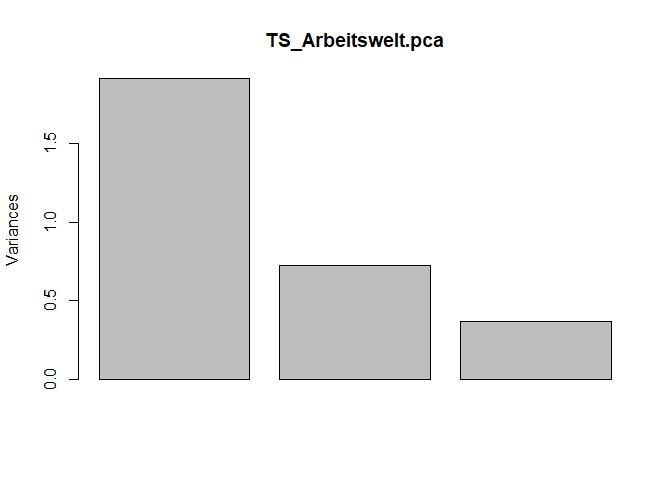
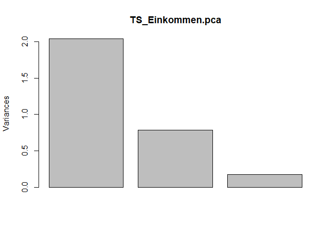
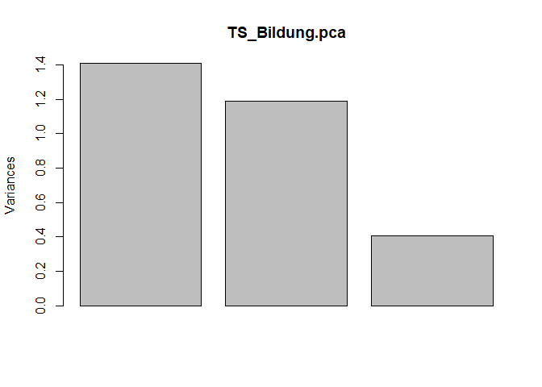

# Intro

Auf diesem Codeblog stelle ich die Generierung des German Index of Socio-Economic Deprivation vor. Dabei handelt es sich um einen Index sozioökonomischer Deprivation auf regionalräumlicher Ebene, der seit 2012 im Fachgebiet Soziale Determinanten der Gesundheit am RKI entwickelt wurde und seither jährlich aktualisiert wird. Für die Generierung werden Indikatoren der INKAR-Datenbank des BBSR verwendet. Es wird die Revision 2020 vorgestellt, die Daten aus den Jahren 1998 bis 2017 verwendet. 
In einer früheren Revision für 2019 tauchten zum Teil starke Abweichungen zur Revision 2018 auf. Der Grund dafür war, dass bei der Addition der Teildimensionen die Bildungsdimension in umgekehrter Richtung in den GISD einging. Ausschlaggebend für diesen Fehler war eine negative Korrelation der Bildungsdimension mit dem Anteil Arbeitsloser, die im Code der vergangenen Revisionen zu einer Umpolung des Teilscores führt. Der Anteil Arbeitsloser wird als Markerindikator verwendet. Die folgende Darstellung zeigt und diskutiert die Problematik und stellt eine Lösung vor.

# Kommentierte Darstellung der Syntax

Das folgende Kapitel stellt die Syntax zur Generierung der Daten mit R vor. Der Code ist optional darstellbar und enthält detaillierte Kommentare.


## 0. Benötigte Pakete

Der Code nutzt im Wesentlichen die Pakete des Tidyverse. 


```r
library("tidyverse") # Tidyverse Methods
library("bookdown") 
library("readxl") # Read Excel
library("zoo")
library("imputeTS") # Impute Missing Features
library("haven") # write Stata-dta
library("sf") # write Stata-dta
library(pastecs) # descriptive stats

# Define Outfiles Directory (default ist außerhalb des GitHub Ordners)
outfiles_dir <- "S:/OE/FG28/205 Regionale Unterschiede/GISD/"

# Create Output directories in working directory if necessary
dir.create("Outfiles", showWarnings=F)
dir.create("Outfiles/2020", showWarnings=F)
dir.create("Outfiles/2020/Bund", showWarnings=F)
dir.create("Outfiles/2020/Other", showWarnings=F)
dir.create("Outfiles/2020/Stata", showWarnings=F)
```

## I.  Generierung eines ID-Datensatzes

Zunächst wird ein Datensatz generiert in dem den kleinsten regionalen Einheiten (Gemeinden) alle übergeordneten regionalen Einheiten und deren Regionalkennziffern zugeordnet werden. Datenquelle ist die Gebietsstandsreferenz von Destatis Stand 31.12.2017.
Es wird insbesondere geprüft, ob die Referenzdaten Missings auf den Regionalkennziffern oder den Namen der Gebietsstände aufweisen.
An diesen ID-Datensatz werden später die Indikatoren angespielt. 


```r
print_missings = function(data) {
  df = data[-1,]; 
  if(sum(is.na(df))>0){print("Missing observations: "); print(df[!complete.cases(df),])}; 
  df}
# Eine Funktion die später häufiger verwendet wird. Erklärung der Befehle:
# 1. Die erste Zeile des Datensatzes wird entfernt, da es sich dabei nicht um 
# eine Beobachtung, sondern nur um eine Variablenbeschreibung handelt
# 2. Wenn es im Datensatz fehlende Werte gibt, werden die dazugehörigen 
# Beobachtungen ausgegeben
# 3. Zuletzt wird der Datensatz aufgerufen damit er in Pipes weiterverarbeitet 
# werden kann

load_dataset = function(sheet) {
  suppressMessages(
    read_excel("Data/Referenz/Referenz_1998_2017.xlsx", sheet = sheet, na = "NA")
  )
}
# Eine Funktion die später häufiger verwendet wird. Sie dient dazu die einzelnen 
# Sheets aus Excel einzulesen. Außerdem werden Warnmeldungen beim Laden der 
# Daten unterdrückt. Zum Aufrufen der Funktion muss der Name des gewünschten
# Excel-Blattes als Argument angegeben werden.

Gemeinden_INKAR <- load_dataset("Gemeinden-GVB") %>% 
  print_missings() %>% na.omit() %>%
  mutate(Kennziffer=as.numeric(gem17),"Kennziffer Gemeindeverband"=vbgem17, fl17=as.numeric(fl17))
# Pipes: 
# 1. Wenn es fehlende Werte gibt, wird man hierdurch benachrichtigt
# 2. Gemeinden ohne fehlende Beobachtungen
# 3. Rename von zwei Variablen; " um Leerzeichen zu berücksichtigen 

Gemeindeverbaende_INKAR <- load_dataset("Gemeindeverbände") %>% 
  print_missings() %>% na.omit() %>% 
  select("Kennziffer Gemeindeverband"=gvb17,"Name des Gemeindeverbands"=gvb17name)
# Das ganze nochmal für Gemeindeverbände  
# Pipes: 
# 1. Wenn es fehlende Werte gibt, wird man hierdurch benachrichtigt
# 2. Missings herausfiltern
# 3. Nur die Variablen gvb17 und Name des Gemeindeverbands ausgewählt

Kreise_INKAR <- load_dataset("KRS") %>%
  print_missings() %>% na.omit() %>% 
  mutate(krs17= as.numeric(krs17)/1000, fl17 = as.numeric(fl17))
# ... und für Kreise
# Pipes: 
# 1. Wenn es fehlende Werte gibt, wird man hierdurch benachrichtigt
# 2. Missings herausfiltern
# 3. Neue Variable generieren, die die Kreisvariable auf Fünfsteller reduzieren

# Die drei Datensätze werden nun ausgehend vom Gemeindedatensatz zu einem ID-Datensatz zusammmengefügt
id_dataset <- Gemeinden_INKAR %>% 
              select(Gemeindekennziffer=Kennziffer,"Name der Gemeinde"=gem17name,"Kennziffer Gemeindeverband") %>% 
              mutate(Kreiskennziffer=floor(Gemeindekennziffer/1000)) %>%
              left_join(.,Kreise_INKAR %>% select("Kreiskennziffer"=krs17,
                                                  "Name des Kreises"=krs17name,
                                                  "Raumordnungsregion Nr"=ROR11,
                                                  Raumordnungsregion=ROR11name,
                                                  NUTS2,
                                                  "NUTS2 Name"=NUTS2name,
                                                  "Bundesland"=...28),by="Kreiskennziffer") %>%
              left_join(.,Gemeindeverbaende_INKAR, by="Kennziffer Gemeindeverband")
# Pipes:  1. (select) Variablenauswahl (gkz, Gemeindename, Gemeindeverband)
#         2. die Kreiskennziffer wird aus der Gemeindekennziffer generiert
#         3. leftjoin spielt Kreisdaten über Kreiskennziffer an
#         3.1 select wdhlt, die anzupielenden Variablen aus, darunter auch NUTS und ROR und Bundesland, dessen Variablenname beim Einlesen zu lang war (...24)
#         3.2 die Kreiskennziffer wurde vor dem leftjoin im Using-Datensatz generiert
#         4. als letztes werden die Gemeindeverbandskennziffern angespielt
```

## II. Erzeugen eines Datensatzes mit Kennziffern als ID unabhängig von der Ebene 

In diesem Code-Abschnitt werden die INKAR-Daten zu den Indikatoren in einem Datensatz zusammengeführt. Die Information für die Indikatoren, die für die Berechnung des GISD verwendet werden, liegt auf unterschiedlichen Ebenen vor. Die Faktorenanalysen sollen später auf Gemeindeebene durchgeführt werden, weshalb Information der Kreisebene an alle Gemeinden dieser Kreise angespielt wird. Percentile des Indexes können so später für jede regionale Ebene separat berechnet werden. Datenbasis sind die INKAR-Daten der jeweiligen Indikatoren im Excel-Format, die zu jeder Revision aus der INKAR-Datenbank heruntergeladen werden. Tabelle \@ref(tab:indicators) stellt die Indikatoren dar.


```r
# Basis erzeugen: Ausgangspunkt Kreisdaten
# Es werden Indikatoren allen Ebenen angespielt, als erstes die Kreise.
Basedata <- Kreise_INKAR %>% select(Kennziffer=krs17) %>% mutate(Jahr=2017)
# Datensatz zum Anspielen der Daten generieren
# Ausgangspunkt Kreisdatensatz
# Pipes:  1. nur Kreiskennzifern ausgewählt
#         2. Jahresvariable generiert (2017)

# Liste der Variablen generieren
inputdataset <- list.files("Data/INKAR_1998_2017/") # Variablenliste der Dateinamen im Ordner

# Einlesen der einzelnen Excelfiles zu den Daten (Schleife) 
# for testing file<-inputdataset[1]
for(file in inputdataset){
  suppressMessages(myimport <- read_excel(paste0("Data/INKAR_1998_2017/",file), skip = 1, sheet = "Daten"))
  names(myimport)[1] <- "Kennziffer"
  myimport[2:3] <- NULL
  myimport <- myimport %>% gather(key = "Jahr", value = "Value" , -"Kennziffer", convert=T, na.rm = T) %>%
    mutate(Kennziffer=as.numeric(as.character(Kennziffer)), Value=as.numeric(Value))
  names(myimport)[3] <- strsplit(strsplit(file,"_")[[1]][2],"[.]")[[1]][1]
  Basedata <- full_join(Basedata, myimport, by=c("Kennziffer", "Jahr"))
}
# Schleife für jedes Excel-File
# 1. Einlesen der Exceldatei; jeweils das Sheet "Daten"; erste Zeile wird geskippt, die Daten werden als Text eingelesen
# 2. Die erste Splate wird als Kennziffer benannt
# 3. Die zweite und dritte Zeile werden gelöscht
# 4. Die Daten werde reshaped, um die Jahresinfos im langen Format zu speichern; convert konvertiert die Jahreszahlen zu Integern;
# rm.na entfert Zeilen, bei denen der "Value" fehlt; -"Kennziffer" sorgt dafür, dass jeder Kennziffer mehrere Jahre zugeordnet werden
# 5. von innen nach außen 
# 5.1 das innere strsplit(file, "_") teilt den Filenamen inkl. Dateiendung beim "_"; mit [[1]][2] wird das zweite Element davon ausgewählt
# 5.3 das äußere strsplit teilt dies dann beim ".", sodass nur noch der Dateiname übrig bleibt, der mit [[1]][1] ausgewählt wird
# 5.5 names(import)[3] nimmt diesen Dateinamen als Variablennamen für die dritte Spalte
# 6. Jedes file der Schleife wird an Basedata gejoint über Kennziffer und Jahr; full_join übernimmt dabei jede Zeile und Spalte jeder Seite,
# auch wenn die Werte auf einer Seite missing enthalten

rm(inputdataset) 


# Liste der Indikatoren erstellen
listofdeterminants <- names(Basedata)[3:length(Basedata)]

# Regionale Tiefe der Indikatoren 
ind_level <- c("Gemeindeverband","Gemeindeverband","Kreis", "Kreis", "Kreis", "Kreis", "Kreis", "Gemeindeverband", "Kreis", "Kreis")
level_table <- cbind(listofdeterminants,ind_level)
# Tabelle der Indikatoren mit regionaler Tiefe
ind_col = c("Indikator","Tiefe des Indikators")

# Datensatz für die Gemeindeverbandsebene generieren
Basedata_Gemeindeverbandsebene <- Basedata %>% select(Kennziffer,Jahr,Arbeitslosigkeit,Beschaeftigtenquote,Einkommensteuer) %>%   
  gather(key,value,3:5) %>% filter(!is.na(value)) %>% spread(key,value) %>% filter(Jahr>=1998) %>% rename("Gemeindeverband"=Kennziffer)
# Pipes:  1. Auswahl der Variablen 
#         2. Reshape der Daten von wide nach long      
#         3. Auswahl von Non-Missing 
#         4. Reshape von long nach wide 
#         5. Auswahl der Daten Jahr>=1998
#         6. Umbenennung der Kennziffervariable

# Datensatz für die Kreisebene generieren 
Basedata_Kreisebene <- Basedata %>% select(krs15=Kennziffer,Jahr,listofdeterminants) %>% 
  select(-Arbeitslosigkeit,-Einkommensteuer,-Beschaeftigtenquote) %>% rename(Kreis=krs15)
# Pipes:  1. neben der Kennziffer, die einen anderen Namen bekommt wird das Jahr und die Variablenliste ausgewählt
#         2. drei Variablen werden aus der Auswahl ausgeschlossen
#         3. die Kreisvariable wird in Kreis umbenannt, weil im nächsten Schritt Kreisinfos an die Gemeinden angespielt werden

# Hinweis: für die Gemeindeebene wird kein Basedata-Datensatz erstell, da es keine Infos auf der Gemeindeebene gibt

# Join different levels
# Nun werden die Daten bezogen auf die Ebenen gemergt
# Dazu wird erstmal ein Leerdatensatz im Longformat erstellt, der Fälle für alle Gemeinden für jedes Jahr generiert
Workfile <- as.data.frame(expand.grid("Kennziffer"=Gemeinden_INKAR %>% pull(Kennziffer),"Jahr"=seq(min(Basedata$Jahr):max(Basedata$Jahr)) + min(Basedata$Jahr)-1)) %>% mutate(Kreiskennziffer=floor(as.numeric(Kennziffer)/1000)) %>% as_tibble() %>%
   left_join(. , Gemeinden_INKAR,by=c("Kennziffer"))  %>%
   select(Gemeindekennziffer=Kennziffer,Kreis=Kreiskennziffer,Gemeindeverband="Kennziffer Gemeindeverband",Jahr,Bevoelkerung=bev17) %>% mutate(Gemeindeverband=as.numeric(Gemeindeverband), Bevoelkerung=as.numeric(Bevoelkerung)) %>% 
  arrange(Gemeindekennziffer,Jahr) %>% # Join Metadata
   left_join(. , Basedata_Kreisebene,by=c("Kreis","Jahr")) %>% # Hier wird über Kreis gematched
   left_join(. , Basedata_Gemeindeverbandsebene,by=c("Gemeindeverband","Jahr")) %>%  # Join Indicators for Level: Gemeindeverband 
   filter(Jahr>=1998)
# als erstes wird ein data.frame erzeugt (Workfile); der alle Gemeindewellen (1998-201x) in den Zeilen stehen hat
# 1. expand.grid erzeugt ein tibble mit allen Kombinationen von Kennziffern und Jahren
#     pull erzeugt einen Vektor für die Variablenwerte von Kennziffer aus dem Datensatz
#     + min(...) wird zu der Sequenz von Jahren aus dem Basedata addiert (1 bis X) damit auch Jahreswerte weitergeben werden[ist das nötig?]
#     stringAsFactors sorgt dafür, dass die Kennziffern nicht als Factors sondern als Strings geladen werden und es damit keine Probleme bei der Weiterverarbeitung gibt
# 2. mutate generiert eine Kreiskennziffer
# 3. as_tibble erzeugt einen tibble, damit left_join genutzt werden kann
# 4. erstes left_join spielt die Gemeindedaten über Kennziffer an, das geht so, weil Gemeinden_INKAR als tibble gespeichert ist
# 5. select, wählt die inhaltlichen Variablen aus, und ändert die Variablennamen
# 6. arrange im select sortiert nach Gemeindekennziffer und Jahr
# 7. zweites left_join spielt die Daten der Kreisebene via Kreis und Jahr an
# 8. drittes left_join spielt die Daten der Gemeindeverbandsebene via Gemeindeverband und Jahr an
# Notiz: . in den Befehlen bezieht sich auf den tibble bzw. data.frame der in der Pipe bearbeitet wird

rm(myimport)

# Stata-Datensatz rausschreiben
write_dta(Workfile, paste0("S:/OE/FG28/205 Regionale Unterschiede/GISD/Plausibilitätschecks/workfile.dta"))

# Ende Generierung Basisdatensatz
```


Table: (\#tab:indicators)Liste der Indikatoren

|Indikator                       |Tiefe des Indikators |
|:-------------------------------|:--------------------|
|Arbeitslosigkeit                |Gemeindeverband      |
|Beschaeftigtenquote             |Gemeindeverband      |
|Bruttoverdienst                 |Kreis                |
|BeschaeftigtemitakadAbschluss   |Kreis                |
|BeschaeftigteohneAbschluss      |Kreis                |
|SchulabgaengermitHochschulreife |Kreis                |
|SchulabgaengerohneAbschluss     |Kreis                |
|Einkommensteuer                 |Gemeindeverband      |
|Haushaltseinkommen              |Kreis                |
|Schuldnerquote                  |Kreis                |

Es gibt noch einige Probleme bei der Auswahl der Indikatoren, die erst später zum Tragen kommen. Insbesondere der Bildungsindikator Schulabgänger ohne Abschluss macht Probleme, weil der nicht mit dem Anteil Beschäftigter mit akademischem Bildungsabschluss korreliert. 
Eine Betrachtung des alternativen Indikators Schulabgänger mit Hochschulreife zeigt, dass dieser besser mit dem Anteil Beschäftigter mit akademischem Bildungsabschluss korreliert, aber dafür recht stark negativ mit dem Anteil der Beschäftigten ohne Abschluss. Das kann daran liegen, dass dort wo der Anteil von Personen mit akademischem Abschluss hoch ist, auch der Druck für Schulabgänger einen Abschluss zu machen geringer ist.


## III.Imputation fehlender Werte

Das bisherige Imputationsmodell nutzt Arbeitslosigkeit als Prädiktoren. In den Daten für 2016 fehlen für diese Variable 6 Werte.
Der Einfachheit halber werden diese interpoliert. 


```r
# Anzahl der Missings für die Indikatoren
missings_table = as.data.frame(expand.grid("Jahr"=1998:max(Basedata$Jahr)))
predictors_list = data.frame(Variable=character(), Missings=double(), stringsAsFactors = FALSE)
for (column in level_table[,1]){
  for (year in 1998:max(Basedata$Jahr)){
    missings_table[year-1997,column] = Workfile %>% filter(Jahr==year, Bevoelkerung>0, is.na(Workfile[,column])) %>% nrow()
  }
  predictors_list[nrow(predictors_list) + 1,] = c(column, Workfile %>% filter(Bevoelkerung>0, is.na(Workfile[,column])) %>% nrow())
}
predictors_list = predictors_list %>% mutate(Missings=as.integer(Missings))
predictors_list = predictors_list[order(predictors_list$Missings),]
predictors_list
```

```
##                           Variable Missings
## 7      SchulabgaengerohneAbschluss        0
## 1                 Arbeitslosigkeit        6
## 6  SchulabgaengermitHochschulreife       36
## 3                  Bruttoverdienst    22108
## 9               Haushaltseinkommen    22108
## 8                  Einkommensteuer    33164
## 2              Beschaeftigtenquote    33168
## 10                  Schuldnerquote    66324
## 4    BeschaeftigtemitakadAbschluss   154756
## 5       BeschaeftigteohneAbschluss   154756
```

```r
Missing_on_Imputationsvars <- Workfile %>%  filter(Jahr>=1998, Bevoelkerung>0, is.na(Arbeitslosigkeit) | is.na(SchulabgaengermitHochschulreife))
Missing_on_Imputationsvars
```

```
## # A tibble: 42 x 15
##    Gemeindekennzif~ Kreis Gemeindeverband  Jahr Bevoelkerung Bruttoverdienst
##               <dbl> <dbl>           <dbl> <dbl>        <dbl>           <dbl>
##  1          5154028  5154         5154028  2016        12458           2284.
##  2          5554052  5554         5554052  2016         7066           2399.
##  3          5762004  5762         5762004  2016        18930           2300.
##  4          5762012  5762         5762012  2016         8669           2300.
##  5          5962016  5962         5962016  2016        34016           2785.
##  6          5978036  5978         5978036  2016        57158           2567.
##  7          9471111  9471         9471111  2016         2101           2492.
##  8          9471115  9471         9471901  2016         4056           2492.
##  9          9471117  9471         9471117  2016         6080           2492.
## 10          9471119  9471         9471119  2016         4541           2492.
## # ... with 32 more rows, and 9 more variables:
## #   BeschaeftigtemitakadAbschluss <dbl>, BeschaeftigteohneAbschluss <dbl>,
## #   SchulabgaengermitHochschulreife <dbl>, SchulabgaengerohneAbschluss <dbl>,
## #   Haushaltseinkommen <dbl>, Schuldnerquote <dbl>, Arbeitslosigkeit <dbl>,
## #   Beschaeftigtenquote <dbl>, Einkommensteuer <dbl>
```

```r
# das betrifft nur Arbeitslosigkeit in 6 Gemeinden in 2016
# für Schulabgänger mit Hochschulreife 36 Gemeinden in 2016

# Fälle betrachten: Beispiel 5154028 
TimeSeries_for_Missing <- Workfile %>%  filter(Gemeindekennziffer==5154028 ) %>% select(Gemeindekennziffer, Jahr, Arbeitslosigkeit, SchulabgaengermitHochschulreife) %>% arrange(Gemeindekennziffer, Jahr)
TimeSeries_for_Missing
```

```
## # A tibble: 20 x 4
##    Gemeindekennziffer  Jahr Arbeitslosigkeit SchulabgaengermitHochschulreife
##                 <dbl> <dbl>            <dbl>                           <dbl>
##  1            5154028  1998             47                              19.2
##  2            5154028  1999             47.8                            19.4
##  3            5154028  2000             46.3                            19.6
##  4            5154028  2001             42.8                            20.3
##  5            5154028  2002             43.5                            19.1
##  6            5154028  2003             46.5                            17.6
##  7            5154028  2004             46.3                            18.1
##  8            5154028  2005             51.3                            17.7
##  9            5154028  2006             44.6                            20.3
## 10            5154028  2007             32.6                            22.0
## 11            5154028  2008             29.7                            21.4
## 12            5154028  2009             34.2                            22.8
## 13            5154028  2010             24.2                            25.1
## 14            5154028  2011             19.9                            27.5
## 15            5154028  2012             23.2                            28.6
## 16            5154028  2013             30                              39.7
## 17            5154028  2014             30.8                            29.9
## 18            5154028  2015             27.8                            30.4
## 19            5154028  2016             NA                              29.9
## 20            5154028  2017             26.4                            30.1
```

```r
# Interpolation der fehlenden Werte über die Zeitreihe (Mittelwert: Vorjahr, Nachjahr)
Workfile <- Workfile %>%  filter(Jahr>=1998, Bevoelkerung>0) %>%  group_by(Gemeindeverband) %>% mutate(impu_arblos = na.approx(Arbeitslosigkeit), impu_mA = na.approx(SchulabgaengermitHochschulreife)) %>% select(-Arbeitslosigkeit, -SchulabgaengermitHochschulreife) %>% rename(Arbeitslosigkeit=impu_arblos, SchulabgaengermitHochschulreife=impu_mA) %>% ungroup()

# zweites Problem: drei Landkreise (Bamberg et al.) mit 0.0 auf SchulabgaengermitHochschulreife (kein Problem, wenn Variable erstmal nicht benutzt wird)
#   mutate(SchulabgaengermitHochschulreife = na_if(SchulabgaengermitHochschulreife, 0.0)

# Check der Interpolation
TimeSeries <- Workfile %>%  filter(Gemeindekennziffer==5154028) %>% select(Gemeindekennziffer, Jahr, Arbeitslosigkeit, SchulabgaengerohneAbschluss) %>% arrange(Gemeindekennziffer, Jahr)
TimeSeries
```

```
## # A tibble: 20 x 4
##    Gemeindekennziffer  Jahr Arbeitslosigkeit SchulabgaengerohneAbschluss
##                 <dbl> <dbl>            <dbl>                       <dbl>
##  1            5154028  1998             47                          6.62
##  2            5154028  1999             47.8                        7.5 
##  3            5154028  2000             46.3                        5.68
##  4            5154028  2001             42.8                        5.75
##  5            5154028  2002             43.5                        5.53
##  6            5154028  2003             46.5                        7.93
##  7            5154028  2004             46.3                        6.70
##  8            5154028  2005             51.3                        7.90
##  9            5154028  2006             44.6                        7.00
## 10            5154028  2007             32.6                        6.16
## 11            5154028  2008             29.7                        6.31
## 12            5154028  2009             34.2                        4.91
## 13            5154028  2010             24.2                        5.03
## 14            5154028  2011             19.9                        5.15
## 15            5154028  2012             23.2                        4.91
## 16            5154028  2013             30                          5.49
## 17            5154028  2014             30.8                        6.66
## 18            5154028  2015             27.8                        6.45
## 19            5154028  2016             27.1                        7.85
## 20            5154028  2017             26.4                        7.62
```

Die Missings auf der Arbeitslosigkeit finden sich in unterschiedlichen Gemeinden verschiedener Landkreise in NRW.


```r
# Anzahl der Missings über die Indikatoren
# summary(Workfile %>% select(all_of(listofdeterminants)))
# sapply(Workfile  %>% select(listofdeterminants) , function(x) sum(is.na(x)))

# Imputation
imputationsliste <- subset(listofdeterminants , !(listofdeterminants %in%
                                                    c('Arbeitslosigkeit','SchulabgaengermitHochschulreife','SchulabgaengerohneAbschluss')))
# Variablenliste für die Regressionsimputation wird erstellt
# das betrifft alle Variablen, außer die im angebenen Vektor
# letztere sind frei von Missings und können im Imputationsmodell genutzt werden 


Impdata <-  Workfile %>%  dplyr::filter(Jahr>=1998, Bevoelkerung>0) %>% 
  gather(key,value,6:15) %>% mutate(value=ifelse(value<0.00001,NA,value)) %>% spread(key,value)
# Imputationsdatensatz generieren: Jahr>=1998, Bevoelkerung>0 
# gather und spread identifiziern key-Variablen automatisch 
# es geht hier vor allem darum Werten<0 ein NA zuzuordnen
# vor allem auf der Variablen Schulabgänger mit Hochschulreife gibt es ebenfalls viele 0-Werte,
# Es ist möglich, dass es in manchen Kreisen keine Schulen mit gymnasialer Oberstufe gibt, 
# das sollte allerdings kein Grund sein, diese im GISD abzustufen. Deshalb werden auch diese Wert auf NA kodiert und 
# im Folgenden imputiert
 

# sapply(Impdata  %>% select(listofdeterminants) , function(x) sum(is.na(x)))
# Einige Missings basierten auf Gebietsständen ohne Bevölkerung, diese sind entfernt 


# Als erstes wird die Imputationsfunktion erstellt (hier werden noch keine Daten generiert)
# Impute_function (NOT FOR GROUPED DATA!)
my_ts_imputer <- function(data,outcome_name){
  mydata   <- data %>% group_by(Gemeindekennziffer) %>%
    select(Gemeindekennziffer,Jahr,Arbeitslosigkeit,SchulabgaengerohneAbschluss,"Outcome"=paste(outcome_name)) %>% 
    mutate(MEAN=mean(Outcome , na.rm=T)) %>% ungroup()
  mymodell <- lm(Outcome ~
                  I(Jahr*Jahr*MEAN) + I(Jahr*MEAN) + Arbeitslosigkeit + 
                   SchulabgaengerohneAbschluss,
                   data = mydata  , na.action="na.exclude")
  mydata %>% select(Outcome) %>% mutate(Imputed = predict(mymodell, newdata =mydata )) %>%
    mutate(Outcome=ifelse(is.na(Outcome),Imputed,Outcome)) %>% 
    mutate(Outcome=ifelse(Outcome<0,0,Outcome)) %>% pull(Outcome)
  }
# Hier wird eine Funktion generiert, die im Datensatz (data) fehlende Daten für ausgewählte Variablen (outcome_name) imputiert
# 1. zunächst werden Mittelwerte für das Outcome (siehe select) jeweils für die Gemeinde generiert, d.h. über alle Wellen aggregiert
# 2. mymodell definiert das Modell (lm); "I()" sichert ab, dass der Operator * erkannt wird und dass ein Spaltenvektor in die Formel eingeht
# 3. zweites mydata: es wird eine Variable Imputed generiert, die sich aus der prediction aus mymodell ergibt
#    während der vorherige Befehl (mymodell) die Koeffizienten generiert, werden nun auf Basis dieses Modells predictions generiert, 
#    und zwar auch für Fälle mit Missing auf den Outcomes
# 4. fehlende Werte in den Outcomes werden durch Werte auf der Variable Imputed ersetzt
# 5. Für einige Fälle erzeugt die prediction unplausible Werte (negative Outcomes), diese werden auf 0 gesetzt
# 6. pull kreiert einen Vektor (hier Variable Outcome), die im nächsten Befehl verwendet wird

# Test Function if necessary
# Impdata %>% mutate(Test=my_ts_imputer(.,"Bruttoverdienst")) %>% select(Gemeindekennziffer,Jahr,Bruttoverdienst,Test) %>% head()

Impdata.imputed <- Impdata %>% mutate(
  Beschaeftigtenquote=my_ts_imputer(.,"Beschaeftigtenquote"),
  Bruttoverdienst=my_ts_imputer(.,"Bruttoverdienst"),
  BeschaeftigtemitakadAbschluss=my_ts_imputer(.,"BeschaeftigtemitakadAbschluss"),
  BeschaeftigteohneAbschluss=my_ts_imputer(.,"BeschaeftigteohneAbschluss"),
  Einkommensteuer=my_ts_imputer(.,"Einkommensteuer"),
  Haushaltseinkommen=my_ts_imputer(.,"Haushaltseinkommen"),
  Schuldnerquote=my_ts_imputer(.,"Schuldnerquote"),
  SchulabgaengermitHochschulreife=my_ts_imputer(.,"SchulabgaengermitHochschulreife")    
  )
# hier wird der Datensatz mit den imputierten Werten generiert. Die Funktion my_ts_imputer wird auf jeden Indikator mit Missings angewendet

# Result of Imputation
summary(as.data.frame(Impdata.imputed) %>% ungroup()  %>% select(listofdeterminants))
```

```
##  Arbeitslosigkeit Beschaeftigtenquote Bruttoverdienst
##  Min.   :  0.40   Min.   :  8.318     Min.   :1341   
##  1st Qu.: 32.30   1st Qu.: 48.296     1st Qu.:1825   
##  Median : 45.00   Median : 52.427     Median :2032   
##  Mean   : 56.05   Mean   : 52.621     Mean   :2064   
##  3rd Qu.: 66.50   3rd Qu.: 57.012     3rd Qu.:2269   
##  Max.   :299.80   Max.   :102.033     Max.   :4367   
##                                                      
##  BeschaeftigtemitakadAbschluss BeschaeftigteohneAbschluss
##  Min.   : 1.456                Min.   : 3.703            
##  1st Qu.: 4.113                1st Qu.: 9.401            
##  Median : 5.785                Median :11.653            
##  Mean   : 6.364                Mean   :10.733            
##  3rd Qu.: 7.953                3rd Qu.:12.899            
##  Max.   :33.156                Max.   :21.164            
##                                                          
##  SchulabgaengermitHochschulreife SchulabgaengerohneAbschluss Einkommensteuer 
##  Min.   : 0.2596                 Min.   : 1.126              Min.   :   0.0  
##  1st Qu.:18.2305                 1st Qu.: 5.653              1st Qu.: 174.0  
##  Median :23.3126                 Median : 7.513              Median : 249.7  
##  Mean   :24.0680                 Mean   : 7.712              Mean   : 264.1  
##  3rd Qu.:28.9929                 3rd Qu.: 9.536              3rd Qu.: 342.1  
##  Max.   :70.3226                 Max.   :21.249              Max.   :4433.0  
##  NA's   :1300                                                                
##  Haushaltseinkommen Schuldnerquote  
##  Min.   : 924.6     Min.   : 3.620  
##  1st Qu.:1315.3     1st Qu.: 7.410  
##  Median :1500.7     Median : 8.975  
##  Mean   :1516.4     Mean   : 8.902  
##  3rd Qu.:1699.2     3rd Qu.:10.370  
##  Max.   :3260.9     Max.   :20.992  
## 
```

```r
# Percentile für ausgewählte Variablen bilden
# 
# Impdata.imputed <- Impdata.imputed %>% 
#           mutate(Bruttoverdienst2 = findInterval(Bruttoverdienst, quantile(Bruttoverdienst, probs=0:100/100 , type=9)),
#           Haushaltseinkommen2 = findInterval(Haushaltseinkommen, quantile(Haushaltseinkommen, probs=0:100/100 , type=9)),
#           Einkommensteuer2 = findInterval(Einkommensteuer, quantile(Einkommensteuer, probs=0:100/100 , type=9)),
#           SchulabgaengermitHochschulreife2 = findInterval(SchulabgaengermitHochschulreife, quantile(SchulabgaengermitHochschulreife, # probs=0:100/100 , type=9)),
#           SchulabgaengerohneAbschluss2 = findInterval(SchulabgaengerohneAbschluss, quantile(SchulabgaengerohneAbschluss, probs=0:100/100 , # type=9)),
#           BeschaeftigtemitakadAbschluss2 = findInterval(BeschaeftigtemitakadAbschluss, quantile(BeschaeftigtemitakadAbschluss, # probs=0:100/100 , type=9))) 
# 


# Stata-Datensatz rausschreiben
# write_dta(Impdata.imputed, paste0("Outfiles/2020/Stata/impdata.dta"))
```


## IV. Faktorenanalyse (Hauptkomponentenanalyse) inklusive Generierung der Faktorscores

```
##  [1] "Arbeitslosigkeit"                "Beschaeftigtenquote"            
##  [3] "Bruttoverdienst"                 "BeschaeftigtemitakadAbschluss"  
##  [5] "BeschaeftigteohneAbschluss"      "SchulabgaengermitHochschulreife"
##  [7] "SchulabgaengerohneAbschluss"     "Einkommensteuer"                
##  [9] "Haushaltseinkommen"              "Schuldnerquote"
```

# Faktorenanalyse basierend auf Hauptkomponentenanalyse für jede der drei Subscalen

```
## Standard deviations (1, .., p=3):
## [1] 1.3831399 0.8494894 0.6043936
## 
## Rotation (n x k) = (3 x 3):
##                            PC1         PC2        PC3
## Beschaeftigtenquote  0.5155536  0.79163575  0.3278983
## Arbeitslosigkeit    -0.5713341  0.60278522 -0.5569805
## Bruttoverdienst      0.6385779 -0.09981385 -0.7630567
```

```
## [1] 1.3831399 0.8494894 0.6043936
```

<!-- -->

```
## Standard deviations (1, .., p=3):
## [1] 1.3831399 0.8494894 0.6043936
## 
## Rotation (n x k) = (3 x 3):
##                            PC1         PC2        PC3
## Beschaeftigtenquote  0.5155536  0.79163575  0.3278983
## Arbeitslosigkeit    -0.5713341  0.60278522 -0.5569805
## Bruttoverdienst      0.6385779 -0.09981385 -0.7630567
```

```
## Standard deviations (1, .., p=3):
## [1] 1.3831399 0.8494894 0.6043936
## 
## Rotation (n x k) = (3 x 1):
##                            PC1
## Beschaeftigtenquote  0.5155536
## Arbeitslosigkeit    -0.5713341
## Bruttoverdienst      0.6385779
```

<!-- -->

```
## Standard deviations (1, .., p=3):
## [1] 1.4285122 0.8846121 0.4204930
## 
## Rotation (n x k) = (3 x 1):
##                           PC1
## Einkommensteuer     0.6473357
## Haushaltseinkommen  0.6381592
## Schuldnerquote     -0.4167844
```

<!-- -->

```
## Standard deviations (1, .., p=3):
## [1] 1.1864164 1.0891291 0.6373493
## 
## Rotation (n x k) = (3 x 1):
##                                      PC1
## BeschaeftigtemitakadAbschluss  0.3519298
## BeschaeftigteohneAbschluss     0.5370107
## SchulabgaengerohneAbschluss   -0.7666583
```

```
## Standard deviations (1, .., p=3):
## [1] 1.179337 1.098183 0.634948
## 
## Rotation (n x k) = (3 x 3):
##                                      PC1        PC2       PC3
## BeschaeftigtemitakadAbschluss  0.2442560  0.8185418 0.5199311
## BeschaeftigteohneAbschluss     0.5994825 -0.5488999 0.5825201
## SchulabgaengerohneAbschluss   -0.7622072 -0.1694056 0.6247735
```

# Nun wird die Generierung der Faktorscores vorbereitet.

```
##  TS_Arbeitswelt      TS_Einkommen        TS_Bildung      
##  Min.   :-5.88044   Min.   :-4.35655   Min.   :-4.82922  
##  1st Qu.:-0.86781   1st Qu.:-1.00239   1st Qu.:-0.80833  
##  Median : 0.04311   Median :-0.07425   Median : 0.05966  
##  Mean   : 0.00000   Mean   : 0.00000   Mean   : 0.00000  
##  3rd Qu.: 0.93875   3rd Qu.: 0.89348   3rd Qu.: 0.89643  
##  Max.   : 5.52923   Max.   :21.37885   Max.   : 4.79850
```

```
##                  Arbeitslosigkeit TS_Arbeitswelt TS_Einkommen TS_Bildung
## Arbeitslosigkeit        1.0000000     -0.7902351   -0.7231216 -0.6682309
## TS_Arbeitswelt         -0.7902351      1.0000000    0.8665283  0.7190783
## TS_Einkommen           -0.7231216      0.8665283    1.0000000  0.7546876
## TS_Bildung             -0.6682309      0.7190783    0.7546876  1.0000000
```

```
##                  Arbeitslosigkeit TS_Arbeitswelt TS_Einkommen TS_Bildung
## Arbeitslosigkeit        1.0000000      0.7902351    0.7231216  0.6682309
## TS_Arbeitswelt          0.7902351      1.0000000    0.8665283  0.7190783
## TS_Einkommen            0.7231216      0.8665283    1.0000000  0.7546876
## TS_Bildung              0.6682309      0.7190783    0.7546876  1.0000000
```

```
##                        Variable   Dimension            Anteil
## 1           Beschaeftigtenquote Arbeitswelt  0.26579556325114
## 2              Arbeitslosigkeit Arbeitswelt 0.326422700821903
## 3               Bruttoverdienst Arbeitswelt 0.407781735926956
## 4               Einkommensteuer   Einkommen 0.419043538153737
## 5            Haushaltseinkommen   Einkommen 0.407247223031142
## 6                Schuldnerquote   Einkommen 0.173709238815121
## 7 BeschaeftigtemitakadAbschluss     Bildung 0.123854588037721
## 8    BeschaeftigteohneAbschluss     Bildung 0.288380505614181
## 9   SchulabgaengerohneAbschluss     Bildung 0.587764906348098
##                Score GISD Proportion
## 1  0.515553647306602 GISD       26.6
## 2 -0.571334141131005 GISD       32.6
## 3  0.638577901220326 GISD       40.8
## 4  0.647335722908706 GISD       41.9
## 5  0.638159245824381 GISD       40.7
## 6 -0.416784403277187 GISD       17.4
## 7  0.351929805554632 GISD       12.4
## 8   0.53701071275551 GISD       28.8
## 9 -0.766658272210049 GISD       58.8
```

```
##  TS_Arbeitswelt    TS_Einkommen      TS_Bildung       GISD_Score    
##  Min.   :0.0000   Min.   :0.0000   Min.   :0.0000   Min.   :0.0000  
##  1st Qu.:0.4023   1st Qu.:0.7960   1st Qu.:0.4053   1st Qu.:0.5639  
##  Median :0.4808   Median :0.8336   Median :0.4922   Median :0.6396  
##  Mean   :0.4846   Mean   :0.8307   Mean   :0.4984   Mean   :0.6418  
##  3rd Qu.:0.5607   3rd Qu.:0.8697   3rd Qu.:0.5824   3rd Qu.:0.7125  
##  Max.   :1.0000   Max.   :1.0000   Max.   :1.0000   Max.   :1.0000
```

```
## tibble [221,080 x 4] (S3: tbl_df/tbl/data.frame)
##  $ TS_Arbeitswelt: num [1:221080] 0.707 0.68 0.638 0.587 0.58 ...
##  $ TS_Einkommen  : num [1:221080] 0.968 0.961 0.95 0.928 0.927 ...
##  $ TS_Bildung    : num [1:221080] 0.493 0.486 0.436 0.465 0.523 ...
##  $ GISD_Score    : num [1:221080] 0.785 0.769 0.727 0.709 0.729 ...
```

## V.  Datenexport - Erstellung der Datensätze 

```
## [1] "Level: Name der Gemeinde Label: Gemeinde"
```

```
## Note: Using an external vector in selections is ambiguous.
## i Use `all_of(mykennziffer)` instead of `mykennziffer` to silence this message.
## i See <https://tidyselect.r-lib.org/reference/faq-external-vector.html>.
## This message is displayed once per session.
```

```
## Note: Using an external vector in selections is ambiguous.
## i Use `all_of(myname)` instead of `myname` to silence this message.
## i See <https://tidyselect.r-lib.org/reference/faq-external-vector.html>.
## This message is displayed once per session.
```

```
## `summarise()` regrouping output by 'Group' (override with `.groups` argument)
```

```
## [1] "Level: Name des Kreises Label: Kreis"
```

```
## `summarise()` regrouping output by 'Group' (override with `.groups` argument)
```

```
## [1] "Level: Name des Gemeindeverbands Label: Gemeindeverband"
```

```
## `summarise()` regrouping output by 'Group' (override with `.groups` argument)
```

```
## [1] "Level: Raumordnungsregion Label: Raumordnungsregion"
```

```
## `summarise()` regrouping output by 'Group' (override with `.groups` argument)
```

```
## [1] "Level: NUTS2 Name Label: NUTS2"
```

```
## `summarise()` regrouping output by 'Group' (override with `.groups` argument)
```


## VI.  Datensätze für PLZ generieren


# Allgemeine SOP für die Revision (nach Lars Kroll)
1. Neue Daten und Gebietsstände aus der INKAR-Datenbank herunterladen. Variablennamen und Formate überprüfen.
2. Postleitzahlen in GISD_generate_postcodes.R anhand der Gebietsstandsdatei überprüfen.
3. GISD_Generate.R ausführen

# Anknüpfungungspunkte für eine grundsätzliche Überarbeitung der GISD-Generierung 

Es gibt gute Gründe dafür am Konzept Bildung, Einkommen und Arbeitsweltindikatoren im GISD zu vereinen, auch wenn die Korrelation der Teildimensionen mit Einzelindikatoren der anderen Teildimensionen nur gering korrelieren. 
Es gibt andererseits Möglichkeiten den GISD weiter zu verbessern. Einzelne Schwachstellen sollen hier kurz erwdähnt werden.

1. Missing Data 
* Hoher Anteil an Missing Data in den frühen Wellen
* Umgang mit Missing Data kann verbessert werden
2. Faktorenanalyse
* Bisher wird die Faktorenanalyse per pcf-Verfahren durchgeführt. Hier wäre zu prüfen, ob Common Factor-Verfahren oder konfirmatorische Faktorenanalyse zu einer Verbesserung führen könnten.
3.Indikatorenauswahl 
* Die Struktur der Faktorladungen der Bildungsindikatoren ist nicht robust gegenüber Datenschwankungen. Der erste Faktor bildet die intendierte Kompomente ab. Es gibt einen zweiten Faktor mit Eigenwert über 1. Die Gewichte der Faktorladungen der Indikatoren BeschaeftigteohneAbschluss und Schulgaengerohneabschluss variieren sehr stark zwischen den Revisionen 2018 und 2019. Hier könnte man über eine andere Auswahl von Indikatoren nachdenken. Die bisherigen Indikatoren BeschaeftigteohneAbschluss und BeschaeftigtemitHochschulabschluss dieser Teildimension weisen die höchsten Anteile an MissingData auf (75%). Zudem wurde bisher noch nicht berücksichtigt, dass die  zwischenzeitliche Verkürzung der Schulzeit für das Abitur (G8 Reform) und die spätere Rücknahme dieser Reform in einigen Bundesldndern im Untersuchungszeitraum zu statistischen Artefakten in den Schulabgdngerquoten führt.
4. Methodologische Grundlagen
* Diskussion der dem Messmodell zugrunde liegende Kausalmechanismen 
Dimensionen sozioökonomischer Deprivation auf räumlicher Ebene: Einkommen, Arbeitswelt, Bildung
- Einkommen: (HH-Einkommen, Steueraufkommen, Schuldnerquote)
- Kaufkraft berücksichtigen, Vermögen berücksichtigen
- betrifft Handlungsspielräume der Kommunen, Proxy für Wirtschaftskraft der Kommunen


