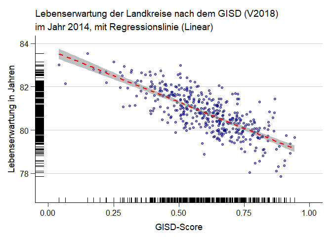
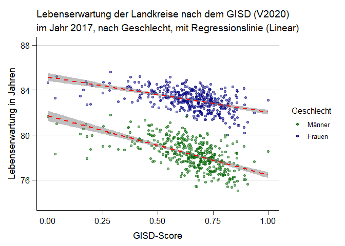
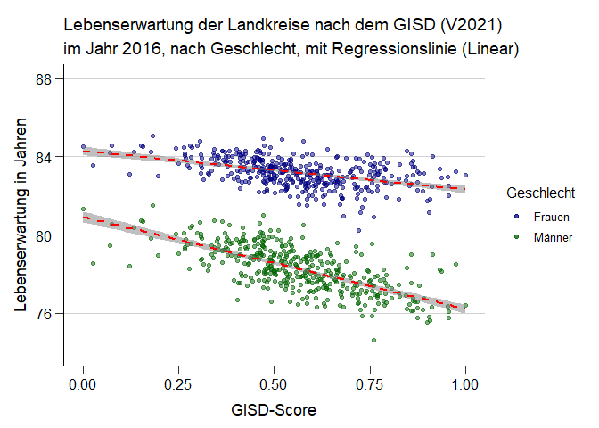
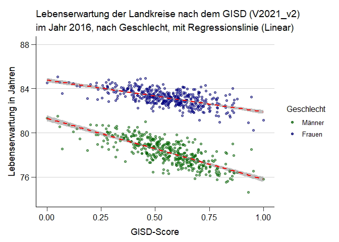
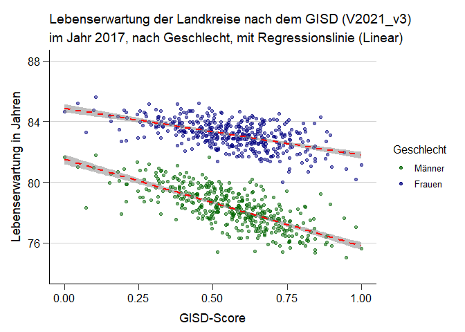
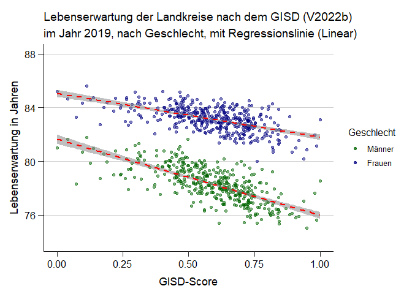
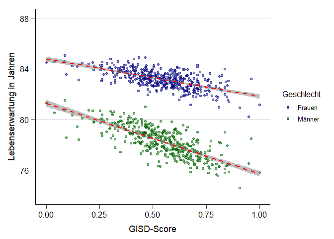

```r
dat_2018 <- read_dta("Outfiles/2018/Bund/Gemeinde/Gemeinde_long.dta") %>% mutate(Kreis = round(Gemeindekennziffer/1000), digits = 0)

dat_2020 <- read.csv("Outfiles/2020/Bund/Gemeinde/Gemeinde.csv") %>% mutate(Kreis = round(Gemeindekennziffer/1000), digits = 0)

dat_2021 <- read.csv("Outfiles/2021/Bund/Gemeinde/Gemeinde.csv") %>% mutate(Kreis = round(Gemeindekennziffer/1000), digits = 0)

dat_2021_v2 <- read.csv("Outfiles/2021_v2/Bund/Gemeinde/Gemeinde.csv") %>% mutate(Kreis = round(Gemeindekennziffer/1000), digits = 0)

dat_2021_v3 <- read.csv("Outfiles/2021_v3/Bund/Gemeinde/Gemeinde.csv") %>% mutate(Kreis = round(Gemeindekennziffer/1000), digits = 0)

dat_2022 <- read.csv("Outfiles/2022/Bund/Gemeinde/Gemeinde.csv") %>% mutate(Kreis = round(Gemeindekennziffer/1000), digits = 0)

dat_2022b <- read.csv("Outfiles/2022b/Bund/Gemeinde/Gemeinde.csv") %>% mutate(Kreis = round(Gemeindekennziffer/1000), digits = 0)

dat_2022_v3 <- read.csv("Outfiles/2022_v03/Bund/Gemeinde/Gemeinde.csv") %>% mutate(Kreis = round(Gemeindekennziffer/1000), digits = 0)


Lebenserwartung_Frauen <- read_excel("Data/Lebenserwartung/Lebenserwartung_female_13_17.xlsx", skip = 1, sheet = "Daten")
names(Lebenserwartung_Frauen)[1] <- "Kreis"
Lebenserwartung_Frauen[2:3] <- NULL
Lebenserwartung_Frauen <- Lebenserwartung_Frauen %>% gather(key = "Jahr", value = "Value" , -"Kreis", convert=T, na.rm = T) %>% mutate(Kreis = as.numeric(Kreis))

Lebenserwartung_Frauen_2014 <- Lebenserwartung_Frauen %>% filter(Jahr < 2016) %>% group_by(Kreis) %>% mutate(Lebenserwartung_Frauen_2014 = mean(Value)) %>% ungroup() %>% filter(Jahr == 2014) %>% select(Kreis,Lebenserwartung_Frauen_2014)
                                                                                                             
Lebenserwartung_Frauen_2016 <- Lebenserwartung_Frauen %>% filter(Jahr > 2014) %>% group_by(Kreis) %>% mutate(Lebenserwartung_Frauen_2016 = mean(Value)) %>% ungroup() %>% filter(Jahr == 2016) %>% select(Kreis,Lebenserwartung_Frauen_2016)

Lebenserwartung_Frauen <- Lebenserwartung_Frauen_2014 %>% left_join(Lebenserwartung_Frauen_2016, by = "Kreis")


Lebenserwartung_Männer <- read_excel("Data/Lebenserwartung/Lebenserwartung_male_13_17.xlsx", skip = 1, sheet = "Daten")
names(Lebenserwartung_Männer)[1] <- "Kreis"
Lebenserwartung_Männer[2:3] <- NULL
Lebenserwartung_Männer <- Lebenserwartung_Männer %>% gather(key = "Jahr", value = "Value" , -"Kreis", convert=T, na.rm = T) %>% mutate(Kreis = as.numeric(Kreis))

Lebenserwartung_Männer_2014 <- Lebenserwartung_Männer %>% filter(Jahr < 2016) %>% group_by(Kreis) %>% mutate(Lebenserwartung_Männer_2014 = mean(Value)) %>% ungroup() %>% filter(Jahr == 2014) %>% select(Kreis,Lebenserwartung_Männer_2014)
                                                                                                             
Lebenserwartung_Männer_2016 <- Lebenserwartung_Männer %>% filter(Jahr > 2014) %>% group_by(Kreis) %>% mutate(Lebenserwartung_Männer_2016 = mean(Value)) %>% ungroup() %>% filter(Jahr == 2016) %>% select(Kreis,Lebenserwartung_Männer_2016)

Lebenserwartung_Männer <- Lebenserwartung_Männer_2014 %>% left_join(Lebenserwartung_Männer_2016, by = "Kreis")

dat_Lebenserwartung <- Lebenserwartung_Frauen %>% left_join(Lebenserwartung_Männer, by = "Kreis")


rm(Lebenserwartung_Frauen, Lebenserwartung_Frauen_2014, Lebenserwartung_Frauen_2016, Lebenserwartung_Männer, Lebenserwartung_Männer_2014, Lebenserwartung_Männer_2016)


dat_Leberw_2018 <- dat_2018 %>% filter(Jahr == 2014) %>% left_join(dat_Lebenserwartung, by = "Kreis") %>% select(- Lebenserwartung_Frauen_2016, - Lebenserwartung_Männer_2016) %>% distinct(Kreis, .keep_all = TRUE) %>% unique()

dat_Leberw_2020 <- dat_2020 %>% filter(Jahr == 2016) %>% left_join(dat_Lebenserwartung, by = "Kreis") %>% select(- Lebenserwartung_Frauen_2014, - Lebenserwartung_Männer_2014) %>% distinct(Kreis, .keep_all = TRUE) %>% unique()

dat_Leberw_2021 <- dat_2021 %>% filter(Jahr == 2016) %>% left_join(dat_Lebenserwartung, by = "Kreis") %>% select(- Lebenserwartung_Frauen_2014, - Lebenserwartung_Männer_2014) %>% distinct(Kreis, .keep_all = TRUE) %>% unique()

dat_Leberw_2021_v2 <- dat_2021_v2 %>% filter(Jahr == 2016) %>% left_join(dat_Lebenserwartung, by = "Kreis") %>% select(- Lebenserwartung_Frauen_2014, - Lebenserwartung_Männer_2014) %>% distinct(Kreis, .keep_all = TRUE) %>% unique()

dat_Leberw_2021_v3 <- dat_2021_v3 %>% filter(Jahr == 2016) %>% left_join(dat_Lebenserwartung, by = "Kreis") %>% select(- Lebenserwartung_Frauen_2014, - Lebenserwartung_Männer_2014) %>% distinct(Kreis, .keep_all = TRUE) %>% unique()

dat_Leberw_2022 <- dat_2022 %>% filter(Jahr == 2016) %>% left_join(dat_Lebenserwartung, by = "Kreis") %>% select(- Lebenserwartung_Frauen_2014, - Lebenserwartung_Männer_2014) %>% distinct(Kreis, .keep_all = TRUE) %>% unique()

dat_Leberw_2022b <- dat_2022b %>% filter(Jahr == 2016) %>% left_join(dat_Lebenserwartung, by = "Kreis") %>% select(- Lebenserwartung_Frauen_2014, - Lebenserwartung_Männer_2014) %>% distinct(Kreis, .keep_all = TRUE) %>% unique()

dat_Leberw_2022_v3 <- dat_2022_v3 %>% filter(Jahr == 2016) %>% left_join(dat_Lebenserwartung, by = "Kreis") %>% select(- Lebenserwartung_Frauen_2014, - Lebenserwartung_Männer_2014) %>% distinct(Kreis, .keep_all = TRUE) %>% unique()

Gemeindekennziffer <- c("9162000", "16053000", "7317000", "1001000", "14625020", "9188139")
```


```r
dat_Leberw_2018$GISD_Score <- (dat_Leberw_2018$GISD_Score -min(dat_Leberw_2018$GISD_Score ))/(max(dat_Leberw_2018$GISD_Score )-min(dat_Leberw_2018$GISD_Score))

dat_Leberw_2020$GISD_Score <- (dat_Leberw_2020$GISD_Score -min(dat_Leberw_2020$GISD_Score ))/(max(dat_Leberw_2020$GISD_Score )-min(dat_Leberw_2020$GISD_Score))

dat_Leberw_2021$GISD_Score <- (dat_Leberw_2021$GISD_Score -min(dat_Leberw_2021$GISD_Score ))/(max(dat_Leberw_2021$GISD_Score )-min(dat_Leberw_2021$GISD_Score))

dat_Leberw_2021_v2$GISD_Score <- (dat_Leberw_2021_v2$GISD_Score -min(dat_Leberw_2021_v2$GISD_Score ))/(max(dat_Leberw_2021_v2$GISD_Score )-min(dat_Leberw_2021_v2$GISD_Score))

dat_Leberw_2021_v3$GISD_Score <- (dat_Leberw_2021_v3$GISD_Score -min(dat_Leberw_2021_v3$GISD_Score ))/(max(dat_Leberw_2021_v3$GISD_Score )-min(dat_Leberw_2021_v3$GISD_Score))

dat_Leberw_2022$GISD_Score <- (dat_Leberw_2022$GISD_Score -min(dat_Leberw_2022$GISD_Score ))/(max(dat_Leberw_2022$GISD_Score )-min(dat_Leberw_2022$GISD_Score))

dat_Leberw_2022b$GISD_Score <- (dat_Leberw_2022b$GISD_Score -min(dat_Leberw_2022b$GISD_Score ))/(max(dat_Leberw_2022b$GISD_Score )-min(dat_Leberw_2022b$GISD_Score))

dat_Leberw_2022_v3$GISD_Score <- (dat_Leberw_2022_v3$GISD_Score -min(dat_Leberw_2022_v3$GISD_Score ))/(max(dat_Leberw_2022_v3$GISD_Score )-min(dat_Leberw_2022_v3$GISD_Score))
```

## Versionen des GISD-Scores über die Zeit {.tabset}

### München

```r
Tabelle_GISD_München <- cbind("Jahr" = "1998", "GISD-Score V2018" = round(dat_2018$GISD_Score[dat_2018$Jahr == "1998" & dat_2018$Gemeindekennziffer == "9162000"], digits = 2), "Perzentil V2018" = dat_2018$GISD_10[dat_2018$Jahr == "1998" & dat_2018$Gemeindekennziffer == "9162000"],
                              
                              "GISD-Score V2020" = round(dat_2020$GISD_Score[dat_2020$Jahr == "1998" & dat_2020$Gemeindekennziffer == "9162000"], digits = 2), "Perzentil V2020" = dat_2020$GISD_10[dat_2020$Jahr == "1998" & dat_2020$Gemeindekennziffer == "9162000"],
                              
                              "GISD-Score V2021" = round(dat_2021$GISD_Score[dat_2021$Jahr == "1998" & dat_2021$Gemeindekennziffer == "9162000"], digits = 2), "Perzentil V2021" = dat_2021$GISD_10[dat_2021$Jahr == "1998" & dat_2021$Gemeindekennziffer == "9162000"],
                              
                              "GISD-Score V2021_v2" = round(dat_2021_v2$GISD_Score[dat_2021_v2$Jahr == "1998" & dat_2021_v2$Gemeindekennziffer == "9162000"], digits = 2), "Perzentil V2021_v2" = dat_2021_v2$GISD_10[dat_2021_v2$Jahr == "1999" & dat_2021_v2$Gemeindekennziffer == "9162000"])

                              
Tabelle_GISD_München <- rbind(Tabelle_GISD_München, cbind("Jahr" = "1999", "GISD-Score V2018" = round(dat_2018$GISD_Score[dat_2018$Jahr == "1999" & dat_2018$Gemeindekennziffer == "9162000"], digits = 2), "Perzentil V2018" = dat_2018$GISD_10[dat_2018$Jahr == "1999" & dat_2018$Gemeindekennziffer == "9162000"],
                              
                              "GISD-Score V2020" = round(dat_2020$GISD_Score[dat_2020$Jahr == "1999" & dat_2020$Gemeindekennziffer == "9162000"], digits = 2), "Perzentil V2020" = dat_2020$GISD_10[dat_2020$Jahr == "1999" & dat_2020$Gemeindekennziffer == "9162000"],
                              
                              "GISD-Score V2021" = round(dat_2021$GISD_Score[dat_2021$Jahr == "1999" & dat_2021$Gemeindekennziffer == "9162000"], digits = 2), "Perzentil V2021" = dat_2021$GISD_10[dat_2021$Jahr == "1999" & dat_2021$Gemeindekennziffer == "9162000"],
                              
                              "GISD-Score V2021_v2" = round(dat_2021_v2$GISD_Score[dat_2021_v2$Jahr == "1999" & dat_2021_v2$Gemeindekennziffer == "9162000"], digits = 2), "Perzentil V2021_v2" = dat_2021_v2$GISD_10[dat_2021_v2$Jahr == "1999" & dat_2021_v2$Gemeindekennziffer == "9162000"]))


Tabelle_GISD_München <- rbind(Tabelle_GISD_München, cbind("Jahr" = "2000", "GISD-Score V2018" = round(dat_2018$GISD_Score[dat_2018$Jahr == "2000" & dat_2018$Gemeindekennziffer == "9162000"], digits = 2), "Perzentil V2018" = dat_2018$GISD_10[dat_2018$Jahr == "2000" & dat_2018$Gemeindekennziffer == "9162000"],
                              
                              "GISD-Score V2020" = round(dat_2020$GISD_Score[dat_2020$Jahr == "2000" & dat_2020$Gemeindekennziffer == "9162000"], digits = 2), "Perzentil V2020" = dat_2020$GISD_10[dat_2020$Jahr == "2000" & dat_2020$Gemeindekennziffer == "9162000"],
                              
                              "GISD-Score V2021" = round(dat_2021$GISD_Score[dat_2021$Jahr == "2000" & dat_2021$Gemeindekennziffer == "9162000"], digits = 2), "Perzentil V2021" = dat_2021$GISD_10[dat_2021$Jahr == "2000" & dat_2021$Gemeindekennziffer == "9162000"],
                              
                              "GISD-Score V2021_v2" = round(dat_2021_v2$GISD_Score[dat_2021_v2$Jahr == "2000" & dat_2021_v2$Gemeindekennziffer == "9162000"], digits = 2), "Perzentil V2021_v2" = dat_2021_v2$GISD_10[dat_2021_v2$Jahr == "2000" & dat_2021_v2$Gemeindekennziffer == "9162000"]))


Tabelle_GISD_München <- rbind(Tabelle_GISD_München, cbind("Jahr" = "2001", "GISD-Score V2018" = round(dat_2018$GISD_Score[dat_2018$Jahr == "2001" & dat_2018$Gemeindekennziffer == "9162000"], digits = 2), "Perzentil V2018" = dat_2018$GISD_10[dat_2018$Jahr == "2001" & dat_2018$Gemeindekennziffer == "9162000"],
                              
                              "GISD-Score V2020" = round(dat_2020$GISD_Score[dat_2020$Jahr == "2001" & dat_2020$Gemeindekennziffer == "9162000"], digits = 2), "Perzentil V2020" = dat_2020$GISD_10[dat_2020$Jahr == "2001" & dat_2020$Gemeindekennziffer == "9162000"],
                              
                              "GISD-Score V2021" = round(dat_2021$GISD_Score[dat_2021$Jahr == "2001" & dat_2021$Gemeindekennziffer == "9162000"], digits = 2), "Perzentil V2021" = dat_2021$GISD_10[dat_2021$Jahr == "2001" & dat_2021$Gemeindekennziffer == "9162000"],
                              
                              "GISD-Score V2021_v2" = round(dat_2021_v2$GISD_Score[dat_2021_v2$Jahr == "2001" & dat_2021_v2$Gemeindekennziffer == "9162000"], digits = 2), "Perzentil V2021_v2" = dat_2021_v2$GISD_10[dat_2021_v2$Jahr == "2001" & dat_2021_v2$Gemeindekennziffer == "9162000"]))


Tabelle_GISD_München <- rbind(Tabelle_GISD_München, cbind("Jahr" = "2002", "GISD-Score V2018" = round(dat_2018$GISD_Score[dat_2018$Jahr == "2002" & dat_2018$Gemeindekennziffer == "9162000"], digits = 2), "Perzentil V2018" = dat_2018$GISD_10[dat_2018$Jahr == "2002" & dat_2018$Gemeindekennziffer == "9162000"],
                              
                              "GISD-Score V2020" = round(dat_2020$GISD_Score[dat_2020$Jahr == "2002" & dat_2020$Gemeindekennziffer == "9162000"], digits = 2), "Perzentil V2020" = dat_2020$GISD_10[dat_2020$Jahr == "2002" & dat_2020$Gemeindekennziffer == "9162000"],
                              
                              "GISD-Score V2021" = round(dat_2021$GISD_Score[dat_2021$Jahr == "2002" & dat_2021$Gemeindekennziffer == "9162000"], digits = 2), "Perzentil V2021" = dat_2021$GISD_10[dat_2021$Jahr == "2002" & dat_2021$Gemeindekennziffer == "9162000"],
                              
                              "GISD-Score V2021_v2" = round(dat_2021_v2$GISD_Score[dat_2021_v2$Jahr == "2002" & dat_2021_v2$Gemeindekennziffer == "9162000"], digits = 2), "Perzentil V2021_v2" = dat_2021_v2$GISD_10[dat_2021_v2$Jahr == "2002" & dat_2021_v2$Gemeindekennziffer == "9162000"]))


Tabelle_GISD_München <- rbind(Tabelle_GISD_München, cbind("Jahr" = "2003", "GISD-Score V2018" = round(dat_2018$GISD_Score[dat_2018$Jahr == "2003" & dat_2018$Gemeindekennziffer == "9162000"], digits = 2), "Perzentil V2018" = dat_2018$GISD_10[dat_2018$Jahr == "2003" & dat_2018$Gemeindekennziffer == "9162000"],

                              "GISD-Score V2020" = round(dat_2020$GISD_Score[dat_2020$Jahr == "2003" & dat_2020$Gemeindekennziffer == "9162000"], digits = 2), "Perzentil V2020" = dat_2020$GISD_10[dat_2020$Jahr == "2003" & dat_2020$Gemeindekennziffer == "9162000"],
                              
                              "GISD-Score V2021" = round(dat_2021$GISD_Score[dat_2021$Jahr == "2003" & dat_2021$Gemeindekennziffer == "9162000"], digits = 2), "Perzentil V2021" = dat_2021$GISD_10[dat_2021$Jahr == "2003" & dat_2021$Gemeindekennziffer == "9162000"],
                              
                              "GISD-Score V2021_v2" = round(dat_2021_v2$GISD_Score[dat_2021_v2$Jahr == "2003" & dat_2021_v2$Gemeindekennziffer == "9162000"], digits = 2), "Perzentil V2021_v2" = dat_2021_v2$GISD_10[dat_2021_v2$Jahr == "2003" & dat_2021_v2$Gemeindekennziffer == "9162000"]))


Tabelle_GISD_München <- rbind(Tabelle_GISD_München, cbind("Jahr" = "2004", "GISD-Score V2018" = round(dat_2018$GISD_Score[dat_2018$Jahr == "2004" & dat_2018$Gemeindekennziffer == "9162000"], digits = 2), "Perzentil V2018" = dat_2018$GISD_10[dat_2018$Jahr == "2004" & dat_2018$Gemeindekennziffer == "9162000"],
                              
                              "GISD-Score V2020" = round(dat_2020$GISD_Score[dat_2020$Jahr == "2004" & dat_2020$Gemeindekennziffer == "9162000"], digits = 2), "Perzentil V2020" = dat_2020$GISD_10[dat_2020$Jahr == "2004" & dat_2020$Gemeindekennziffer == "9162000"],
                              
                              "GISD-Score V2021" = round(dat_2021$GISD_Score[dat_2021$Jahr == "2004" & dat_2021$Gemeindekennziffer == "9162000"], digits = 2), "Perzentil V2021" = dat_2021$GISD_10[dat_2021$Jahr == "2004" & dat_2021$Gemeindekennziffer == "9162000"],
                              
                              "GISD-Score V2021_v2" = round(dat_2021_v2$GISD_Score[dat_2021_v2$Jahr == "2004" & dat_2021_v2$Gemeindekennziffer == "9162000"], digits = 2), "Perzentil V2021_v2" = dat_2021_v2$GISD_10[dat_2021_v2$Jahr == "2004" & dat_2021_v2$Gemeindekennziffer == "9162000"]))


Tabelle_GISD_München <- rbind(Tabelle_GISD_München, cbind("Jahr" = "2005", "GISD-Score V2018" = round(dat_2018$GISD_Score[dat_2018$Jahr == "2005" & dat_2018$Gemeindekennziffer == "9162000"], digits = 2), "Perzentil V2018" = dat_2018$GISD_10[dat_2018$Jahr == "2005" & dat_2018$Gemeindekennziffer == "9162000"],

                              "GISD-Score V2020" = round(dat_2020$GISD_Score[dat_2020$Jahr == "2005" & dat_2020$Gemeindekennziffer == "9162000"], digits = 2), "Perzentil V2020" = dat_2020$GISD_10[dat_2020$Jahr == "2005" & dat_2020$Gemeindekennziffer == "9162000"],
                              
                              "GISD-Score V2021" = round(dat_2021$GISD_Score[dat_2021$Jahr == "2005" & dat_2021$Gemeindekennziffer == "9162000"], digits = 2), "Perzentil V2021" = dat_2021$GISD_10[dat_2021$Jahr == "2005" & dat_2021$Gemeindekennziffer == "9162000"],
                              
                              "GISD-Score V2021_v2" = round(dat_2021_v2$GISD_Score[dat_2021_v2$Jahr == "2005" & dat_2021_v2$Gemeindekennziffer == "9162000"], digits = 2), "Perzentil V2021_v2" = dat_2021_v2$GISD_10[dat_2021_v2$Jahr == "2005" & dat_2021_v2$Gemeindekennziffer == "9162000"]))


Tabelle_GISD_München <- rbind(Tabelle_GISD_München, cbind("Jahr" = "2006", "GISD-Score V2018" = round(dat_2018$GISD_Score[dat_2018$Jahr == "2006" & dat_2018$Gemeindekennziffer == "9162000"], digits = 2), "Perzentil V2018" = dat_2018$GISD_10[dat_2018$Jahr == "2006" & dat_2018$Gemeindekennziffer == "9162000"],
                              
                              "GISD-Score V2020" = round(dat_2020$GISD_Score[dat_2020$Jahr == "2006" & dat_2020$Gemeindekennziffer == "9162000"], digits = 2), "Perzentil V2020" = dat_2020$GISD_10[dat_2020$Jahr == "2006" & dat_2020$Gemeindekennziffer == "9162000"],
                              
                              "GISD-Score V2021" = round(dat_2021$GISD_Score[dat_2021$Jahr == "2006" & dat_2021$Gemeindekennziffer == "9162000"], digits = 2), "Perzentil V2021" = dat_2021$GISD_10[dat_2021$Jahr == "2006" & dat_2021$Gemeindekennziffer == "9162000"],
                              
                              "GISD-Score V2021_v2" = round(dat_2021_v2$GISD_Score[dat_2021_v2$Jahr == "2006" & dat_2021_v2$Gemeindekennziffer == "9162000"], digits = 2), "Perzentil V2021_v2" = dat_2021_v2$GISD_10[dat_2021_v2$Jahr == "2006" & dat_2021_v2$Gemeindekennziffer == "9162000"]))


Tabelle_GISD_München <- rbind(Tabelle_GISD_München, cbind("Jahr" = "2007", "GISD-Score V2018" = round(dat_2018$GISD_Score[dat_2018$Jahr == "2007" & dat_2018$Gemeindekennziffer == "9162000"], digits = 2), "Perzentil V2018" = dat_2018$GISD_10[dat_2018$Jahr == "2007" & dat_2018$Gemeindekennziffer == "9162000"],
                              
                              "GISD-Score V2020" = round(dat_2020$GISD_Score[dat_2020$Jahr == "2007" & dat_2020$Gemeindekennziffer == "9162000"], digits = 2), "Perzentil V2020" = dat_2020$GISD_10[dat_2020$Jahr == "2007" & dat_2020$Gemeindekennziffer == "9162000"],
                              
                              "GISD-Score V2021" = round(dat_2021$GISD_Score[dat_2021$Jahr == "2007" & dat_2021$Gemeindekennziffer == "9162000"], digits = 2), "Perzentil V2021" = dat_2021$GISD_10[dat_2021$Jahr == "2007" & dat_2021$Gemeindekennziffer == "9162000"],
                              
                              "GISD-Score V2021_v2" = round(dat_2021_v2$GISD_Score[dat_2021_v2$Jahr == "2007" & dat_2021_v2$Gemeindekennziffer == "9162000"], digits = 2), "Perzentil V2021_v2" = dat_2021_v2$GISD_10[dat_2021_v2$Jahr == "2007" & dat_2021_v2$Gemeindekennziffer == "9162000"]))


Tabelle_GISD_München <- rbind(Tabelle_GISD_München, cbind("Jahr" = "2008", "GISD-Score V2018" = round(dat_2018$GISD_Score[dat_2018$Jahr == "2008" & dat_2018$Gemeindekennziffer == "9162000"], digits = 2), "Perzentil V2018" = dat_2018$GISD_10[dat_2018$Jahr == "2008" & dat_2018$Gemeindekennziffer == "9162000"],
                              
                              "GISD-Score V2020" = round(dat_2020$GISD_Score[dat_2020$Jahr == "2008" & dat_2020$Gemeindekennziffer == "9162000"], digits = 2), "Perzentil V2020" = dat_2020$GISD_10[dat_2020$Jahr == "2008" & dat_2020$Gemeindekennziffer == "9162000"],
                              
                              "GISD-Score V2021" = round(dat_2021$GISD_Score[dat_2021$Jahr == "2008" & dat_2021$Gemeindekennziffer == "9162000"], digits = 2), "Perzentil V2021" = dat_2021$GISD_10[dat_2021$Jahr == "2008" & dat_2021$Gemeindekennziffer == "9162000"],
                              
                              "GISD-Score V2021_v2" = round(dat_2021_v2$GISD_Score[dat_2021_v2$Jahr == "2008" & dat_2021_v2$Gemeindekennziffer == "9162000"], digits = 2), "Perzentil V2021_v2" = dat_2021_v2$GISD_10[dat_2021_v2$Jahr == "2008" & dat_2021_v2$Gemeindekennziffer == "9162000"]))


Tabelle_GISD_München <- rbind(Tabelle_GISD_München, cbind("Jahr" = "2009", "GISD-Score V2018" = round(dat_2018$GISD_Score[dat_2018$Jahr == "2009" & dat_2018$Gemeindekennziffer == "9162000"], digits = 2), "Perzentil V2018" = dat_2018$GISD_10[dat_2018$Jahr == "2009" & dat_2018$Gemeindekennziffer == "9162000"],
                              
                              "GISD-Score V2020" = round(dat_2020$GISD_Score[dat_2020$Jahr == "2009" & dat_2020$Gemeindekennziffer == "9162000"], digits = 2), "Perzentil V2020" = dat_2020$GISD_10[dat_2020$Jahr == "2009" & dat_2020$Gemeindekennziffer == "9162000"],
                              
                              "GISD-Score V2021" = round(dat_2021$GISD_Score[dat_2021$Jahr == "2009" & dat_2021$Gemeindekennziffer == "9162000"], digits = 2), "Perzentil V2021" = dat_2021$GISD_10[dat_2021$Jahr == "2009" & dat_2021$Gemeindekennziffer == "9162000"],
                              
                              "GISD-Score V2021_v2" = round(dat_2021_v2$GISD_Score[dat_2021_v2$Jahr == "2009" & dat_2021_v2$Gemeindekennziffer == "9162000"], digits = 2), "Perzentil V2021_v2" = dat_2021_v2$GISD_10[dat_2021_v2$Jahr == "2009" & dat_2021_v2$Gemeindekennziffer == "9162000"]))


Tabelle_GISD_München <- rbind(Tabelle_GISD_München, cbind("Jahr" = "2010", "GISD-Score V2018" = round(dat_2018$GISD_Score[dat_2018$Jahr == "2010" & dat_2018$Gemeindekennziffer == "9162000"], digits = 2), "Perzentil V2018" = dat_2018$GISD_10[dat_2018$Jahr == "2010" & dat_2018$Gemeindekennziffer == "9162000"],
                              
                              "GISD-Score V2020" = round(dat_2020$GISD_Score[dat_2020$Jahr == "2010" & dat_2020$Gemeindekennziffer == "9162000"], digits = 2), "Perzentil V2020" = dat_2020$GISD_10[dat_2020$Jahr == "2010" & dat_2020$Gemeindekennziffer == "9162000"],
                              
                              "GISD-Score V2021" = round(dat_2021$GISD_Score[dat_2021$Jahr == "2010" & dat_2021$Gemeindekennziffer == "9162000"], digits = 2), "Perzentil V2021" = dat_2021$GISD_10[dat_2021$Jahr == "2010" & dat_2021$Gemeindekennziffer == "9162000"],
                              
                              "GISD-Score V2021_v2" = round(dat_2021_v2$GISD_Score[dat_2021_v2$Jahr == "2010" & dat_2021_v2$Gemeindekennziffer == "9162000"], digits = 2), "Perzentil V2021_v2" = dat_2021_v2$GISD_10[dat_2021_v2$Jahr == "2010" & dat_2021_v2$Gemeindekennziffer == "9162000"]))


Tabelle_GISD_München <- rbind(Tabelle_GISD_München, cbind("Jahr" = "2011", "GISD-Score V2018" = round(dat_2018$GISD_Score[dat_2018$Jahr == "2011" & dat_2018$Gemeindekennziffer == "9162000"], digits = 2), "Perzentil V2018" = dat_2018$GISD_10[dat_2018$Jahr == "2011" & dat_2018$Gemeindekennziffer == "9162000"],
                              
                              "GISD-Score V2020" = round(dat_2020$GISD_Score[dat_2020$Jahr == "2011" & dat_2020$Gemeindekennziffer == "9162000"], digits = 2), "Perzentil V2020" = dat_2020$GISD_10[dat_2020$Jahr == "2011" & dat_2020$Gemeindekennziffer == "9162000"],
                              
                              "GISD-Score V2021" = round(dat_2021$GISD_Score[dat_2021$Jahr == "2011" & dat_2021$Gemeindekennziffer == "9162000"], digits = 2), "Perzentil V2021" = dat_2021$GISD_10[dat_2021$Jahr == "2011" & dat_2021$Gemeindekennziffer == "9162000"],
                              
                              "GISD-Score V2021_v2" = round(dat_2021_v2$GISD_Score[dat_2021_v2$Jahr == "2011" & dat_2021_v2$Gemeindekennziffer == "9162000"], digits = 2), "Perzentil V2021_v2" = dat_2021_v2$GISD_10[dat_2021_v2$Jahr == "2011" & dat_2021_v2$Gemeindekennziffer == "9162000"]))


Tabelle_GISD_München <- rbind(Tabelle_GISD_München, cbind("Jahr" = "2012", "GISD-Score V2018" = round(dat_2018$GISD_Score[dat_2018$Jahr == "2012" & dat_2018$Gemeindekennziffer == "9162000"], digits = 2), "Perzentil V2018" = dat_2018$GISD_10[dat_2018$Jahr == "2012" & dat_2018$Gemeindekennziffer == "9162000"],
                              
                              "GISD-Score V2020" = round(dat_2020$GISD_Score[dat_2020$Jahr == "2012" & dat_2020$Gemeindekennziffer == "9162000"], digits = 2), "Perzentil V2020" = dat_2020$GISD_10[dat_2020$Jahr == "2012" & dat_2020$Gemeindekennziffer == "9162000"],
                              
                              "GISD-Score V2021" = round(dat_2021$GISD_Score[dat_2021$Jahr == "2012" & dat_2021$Gemeindekennziffer == "9162000"], digits = 2), "Perzentil V2021" = dat_2021$GISD_10[dat_2021$Jahr == "2012" & dat_2021$Gemeindekennziffer == "9162000"],
                              
                              "GISD-Score V2021_v2" = round(dat_2021_v2$GISD_Score[dat_2021_v2$Jahr == "2012" & dat_2021_v2$Gemeindekennziffer == "9162000"], digits = 2), "Perzentil V2021_v2" = dat_2021_v2$GISD_10[dat_2021_v2$Jahr == "2012" & dat_2021_v2$Gemeindekennziffer == "9162000"]))


Tabelle_GISD_München <- rbind(Tabelle_GISD_München, cbind("Jahr" = "2013", "GISD-Score V2018" = round(dat_2018$GISD_Score[dat_2018$Jahr == "2013" & dat_2018$Gemeindekennziffer == "9162000"], digits = 2), "Perzentil V2018" = dat_2018$GISD_10[dat_2018$Jahr == "2013" & dat_2018$Gemeindekennziffer == "9162000"],
                              
                              "GISD-Score V2020" = round(dat_2020$GISD_Score[dat_2020$Jahr == "2013" & dat_2020$Gemeindekennziffer == "9162000"], digits = 2), "Perzentil V2020" = dat_2020$GISD_10[dat_2020$Jahr == "2013" & dat_2020$Gemeindekennziffer == "9162000"],
                              
                              "GISD-Score V2021" = round(dat_2021$GISD_Score[dat_2021$Jahr == "2013" & dat_2021$Gemeindekennziffer == "9162000"], digits = 2), "Perzentil V2021" = dat_2021$GISD_10[dat_2021$Jahr == "2013" & dat_2021$Gemeindekennziffer == "9162000"],
                              
                              "GISD-Score V2021_v2" = round(dat_2021_v2$GISD_Score[dat_2021_v2$Jahr == "2013" & dat_2021_v2$Gemeindekennziffer == "9162000"], digits = 2), "Perzentil V2021_v2" = dat_2021_v2$GISD_10[dat_2021_v2$Jahr == "2013" & dat_2021_v2$Gemeindekennziffer == "9162000"]))


Tabelle_GISD_München <- rbind(Tabelle_GISD_München, cbind("Jahr" = "2014", "GISD-Score V2018" = round(dat_2018$GISD_Score[dat_2018$Jahr == "2014" & dat_2018$Gemeindekennziffer == "9162000"], digits = 2), "Perzentil V2018" = dat_2018$GISD_10[dat_2018$Jahr == "2014" & dat_2018$Gemeindekennziffer == "9162000"],
                              
                              "GISD-Score V2020" = round(dat_2020$GISD_Score[dat_2020$Jahr == "2014" & dat_2020$Gemeindekennziffer == "9162000"], digits = 2), "Perzentil V2020" = dat_2020$GISD_10[dat_2020$Jahr == "2014" & dat_2020$Gemeindekennziffer == "9162000"],
                              
                              "GISD-Score V2021" = round(dat_2021$GISD_Score[dat_2021$Jahr == "2014" & dat_2021$Gemeindekennziffer == "9162000"], digits = 2), "Perzentil V2021" = dat_2021$GISD_10[dat_2021$Jahr == "2014" & dat_2021$Gemeindekennziffer == "9162000"],
                              
                              "GISD-Score V2021_v2" = round(dat_2021_v2$GISD_Score[dat_2021_v2$Jahr == "2014" & dat_2021_v2$Gemeindekennziffer == "9162000"], digits = 2), "Perzentil V2021_v2" = dat_2021_v2$GISD_10[dat_2021_v2$Jahr == "2014" & dat_2021_v2$Gemeindekennziffer == "9162000"]))


Tabelle_GISD_München <- rbind(Tabelle_GISD_München, cbind("Jahr" = "2015", "GISD-Score V2018" = "-", "Perzentil V2018" = "-",
                              
                              "GISD-Score V2020" = round(dat_2020$GISD_Score[dat_2020$Jahr == "2015" & dat_2020$Gemeindekennziffer == "9162000"], digits = 2), "Perzentil V2020" = dat_2020$GISD_10[dat_2020$Jahr == "2015" & dat_2020$Gemeindekennziffer == "9162000"],
                              
                              "GISD-Score V2021" = round(dat_2021$GISD_Score[dat_2021$Jahr == "2015" & dat_2021$Gemeindekennziffer == "9162000"], digits = 2), "Perzentil V2021" = dat_2021$GISD_10[dat_2021$Jahr == "2015" & dat_2021$Gemeindekennziffer == "9162000"],
                              
                              "GISD-Score V2021_v2" = round(dat_2021_v2$GISD_Score[dat_2021_v2$Jahr == "2015" & dat_2021_v2$Gemeindekennziffer == "9162000"], digits = 2), "Perzentil V2021_v2" = dat_2021_v2$GISD_10[dat_2021_v2$Jahr == "2015" & dat_2021_v2$Gemeindekennziffer == "9162000"]))


Tabelle_GISD_München <- rbind(Tabelle_GISD_München, cbind("Jahr" = "2016", "GISD-Score V2018" = "-", "Perzentil V2018" = "-",
                              
                              "GISD-Score V2020" = round(dat_2020$GISD_Score[dat_2020$Jahr == "2016" & dat_2020$Gemeindekennziffer == "9162000"], digits = 2), "Perzentil V2020" = dat_2020$GISD_10[dat_2020$Jahr == "2016" & dat_2020$Gemeindekennziffer == "9162000"],
                              
                              "GISD-Score V2021" = round(dat_2021$GISD_Score[dat_2021$Jahr == "2016" & dat_2021$Gemeindekennziffer == "9162000"], digits = 2), "Perzentil V2021" = dat_2021$GISD_10[dat_2021$Jahr == "2016" & dat_2021$Gemeindekennziffer == "9162000"],
                              
                              "GISD-Score V2021_v2" = round(dat_2021_v2$GISD_Score[dat_2021_v2$Jahr == "2016" & dat_2021_v2$Gemeindekennziffer == "9162000"], digits = 2), "Perzentil V2021_v2" = dat_2021_v2$GISD_10[dat_2021_v2$Jahr == "2015" & dat_2021_v2$Gemeindekennziffer == "9162000"]))


Tabelle_GISD_München <- rbind(Tabelle_GISD_München, cbind("Jahr" = "2017", "GISD-Score V2018" = "-", "Perzentil V2018" = "-",
                              
                              "GISD-Score V2020" = round(dat_2020$GISD_Score[dat_2020$Jahr == "2017" & dat_2020$Gemeindekennziffer == "9162000"], digits = 2), "Perzentil V2020" = dat_2020$GISD_10[dat_2020$Jahr == "2017" & dat_2020$Gemeindekennziffer == "9162000"],
                              
                              "GISD-Score V2021" = round(dat_2021$GISD_Score[dat_2021$Jahr == "2017" & dat_2021$Gemeindekennziffer == "9162000"], digits = 2), "Perzentil V2021" = dat_2021$GISD_10[dat_2021$Jahr == "2017" & dat_2021$Gemeindekennziffer == "9162000"],
                              
                              "GISD-Score V2021_v2" = round(dat_2021_v2$GISD_Score[dat_2021_v2$Jahr == "2017" & dat_2021_v2$Gemeindekennziffer == "9162000"], digits = 2), "Perzentil V2021_v2" = dat_2021_v2$GISD_10[dat_2021_v2$Jahr == "2017" & dat_2021_v2$Gemeindekennziffer == "9162000"]))


Tabelle_GISD_München <- Tabelle_GISD_München %>% as_tibble()
kable(Tabelle_GISD_München)
```


|Jahr |GISD-Score V2018 |Perzentil V2018 |GISD-Score V2020 |Perzentil V2020 |GISD-Score V2021 |Perzentil V2021 |GISD-Score V2021_v2 |Perzentil V2021_v2 |
|:----|:----------------|:---------------|:----------------|:---------------|:----------------|:---------------|:-------------------|:------------------|
|1998 |0.2              |1               |0.69             |1               |0.63             |1               |0.39                |1                  |
|1999 |0.17             |1               |0.66             |1               |0.6              |1               |0.36                |1                  |
|2000 |0.12             |1               |0.63             |1               |0.57             |1               |0.32                |1                  |
|2001 |0.12             |1               |0.59             |1               |0.55             |1               |0.3                 |1                  |
|2002 |0.11             |1               |0.57             |1               |0.52             |1               |0.28                |1                  |
|2003 |0.14             |1               |0.57             |1               |0.52             |1               |0.28                |1                  |
|2004 |0.11             |1               |0.56             |1               |0.52             |1               |0.28                |1                  |
|2005 |0.15             |1               |0.55             |1               |0.52             |1               |0.29                |1                  |
|2006 |0.17             |1               |0.53             |1               |0.5              |1               |0.28                |1                  |
|2007 |0.17             |1               |0.5              |1               |0.47             |1               |0.26                |1                  |
|2008 |0.19             |1               |0.45             |1               |0.43             |1               |0.22                |1                  |
|2009 |0.19             |1               |0.45             |1               |0.44             |1               |0.22                |1                  |
|2010 |0.18             |1               |0.44             |1               |0.42             |1               |0.21                |1                  |
|2011 |0.16             |1               |0.4              |1               |0.37             |1               |0.18                |1                  |
|2012 |0.17             |1               |0.39             |1               |0.38             |1               |0.18                |1                  |
|2013 |0.15             |1               |0.36             |1               |0.35             |1               |0.16                |1                  |
|2014 |0.17             |1               |0.32             |1               |0.33             |1               |0.13                |1                  |
|2015 |-                |-               |0.3              |1               |0.31             |1               |0.11                |1                  |
|2016 |-                |-               |0.27             |1               |0.28             |1               |0.09                |1                  |
|2017 |-                |-               |0.24             |1               |0.26             |1               |0.07                |1                  |

### Flensburg

```r
Tabelle_GISD_Flensburg <- cbind("Jahr" = "1998", "GISD-Score V2018" = round(dat_2018$GISD_Score[dat_2018$Jahr == "1998" & dat_2018$Gemeindekennziffer == "1001000"], digits = 2), "Perzentil V2018" = dat_2018$GISD_10[dat_2018$Jahr == "1998" & dat_2018$Gemeindekennziffer == "1001000"],
                              
                              "GISD-Score V2020" = round(dat_2020$GISD_Score[dat_2020$Jahr == "1998" & dat_2020$Gemeindekennziffer == "1001000"], digits = 2), "Perzentil V2020" = dat_2020$GISD_10[dat_2020$Jahr == "1998" & dat_2020$Gemeindekennziffer == "1001000"],
                              
                              "GISD-Score V2021" = round(dat_2021$GISD_Score[dat_2021$Jahr == "1998" & dat_2021$Gemeindekennziffer == "1001000"], digits = 2), "Perzentil V2021" = dat_2021$GISD_10[dat_2021$Jahr == "1998" & dat_2021$Gemeindekennziffer == "1001000"],
                              
                              "GISD-Score V2021_v2" = round(dat_2021_v2$GISD_Score[dat_2021_v2$Jahr == "1998" & dat_2021_v2$Gemeindekennziffer == "1001000"], digits = 2), "Perzentil V2021_v2" = dat_2021_v2$GISD_10[dat_2021_v2$Jahr == "1999" & dat_2021_v2$Gemeindekennziffer == "1001000"])

                              
Tabelle_GISD_Flensburg <- rbind(Tabelle_GISD_Flensburg, cbind("Jahr" = "1999", "GISD-Score V2018" = round(dat_2018$GISD_Score[dat_2018$Jahr == "1999" & dat_2018$Gemeindekennziffer == "1001000"], digits = 2), "Perzentil V2018" = dat_2018$GISD_10[dat_2018$Jahr == "1999" & dat_2018$Gemeindekennziffer == "1001000"],
                              
                              "GISD-Score V2020" = round(dat_2020$GISD_Score[dat_2020$Jahr == "1999" & dat_2020$Gemeindekennziffer == "1001000"], digits = 2), "Perzentil V2020" = dat_2020$GISD_10[dat_2020$Jahr == "1999" & dat_2020$Gemeindekennziffer == "1001000"],
                              
                              "GISD-Score V2021" = round(dat_2021$GISD_Score[dat_2021$Jahr == "1999" & dat_2021$Gemeindekennziffer == "1001000"], digits = 2), "Perzentil V2021" = dat_2021$GISD_10[dat_2021$Jahr == "1999" & dat_2021$Gemeindekennziffer == "1001000"],
                              
                              "GISD-Score V2021_v2" = round(dat_2021_v2$GISD_Score[dat_2021_v2$Jahr == "1999" & dat_2021_v2$Gemeindekennziffer == "1001000"], digits = 2), "Perzentil V2021_v2" = dat_2021_v2$GISD_10[dat_2021_v2$Jahr == "1999" & dat_2021_v2$Gemeindekennziffer == "1001000"]))


Tabelle_GISD_Flensburg <- rbind(Tabelle_GISD_Flensburg, cbind("Jahr" = "2000", "GISD-Score V2018" = round(dat_2018$GISD_Score[dat_2018$Jahr == "2000" & dat_2018$Gemeindekennziffer == "1001000"], digits = 2), "Perzentil V2018" = dat_2018$GISD_10[dat_2018$Jahr == "2000" & dat_2018$Gemeindekennziffer == "1001000"],
                              
                              "GISD-Score V2020" = round(dat_2020$GISD_Score[dat_2020$Jahr == "2000" & dat_2020$Gemeindekennziffer == "1001000"], digits = 2), "Perzentil V2020" = dat_2020$GISD_10[dat_2020$Jahr == "2000" & dat_2020$Gemeindekennziffer == "1001000"],
                              
                              "GISD-Score V2021" = round(dat_2021$GISD_Score[dat_2021$Jahr == "2000" & dat_2021$Gemeindekennziffer == "1001000"], digits = 2), "Perzentil V2021" = dat_2021$GISD_10[dat_2021$Jahr == "2000" & dat_2021$Gemeindekennziffer == "1001000"],
                              
                              "GISD-Score V2021_v2" = round(dat_2021_v2$GISD_Score[dat_2021_v2$Jahr == "2000" & dat_2021_v2$Gemeindekennziffer == "1001000"], digits = 2), "Perzentil V2021_v2" = dat_2021_v2$GISD_10[dat_2021_v2$Jahr == "2000" & dat_2021_v2$Gemeindekennziffer == "1001000"]))


Tabelle_GISD_Flensburg <- rbind(Tabelle_GISD_Flensburg, cbind("Jahr" = "2001", "GISD-Score V2018" = round(dat_2018$GISD_Score[dat_2018$Jahr == "2001" & dat_2018$Gemeindekennziffer == "1001000"], digits = 2), "Perzentil V2018" = dat_2018$GISD_10[dat_2018$Jahr == "2001" & dat_2018$Gemeindekennziffer == "1001000"],
                              
                              "GISD-Score V2020" = round(dat_2020$GISD_Score[dat_2020$Jahr == "2001" & dat_2020$Gemeindekennziffer == "1001000"], digits = 2), "Perzentil V2020" = dat_2020$GISD_10[dat_2020$Jahr == "2001" & dat_2020$Gemeindekennziffer == "1001000"],
                              
                              "GISD-Score V2021" = round(dat_2021$GISD_Score[dat_2021$Jahr == "2001" & dat_2021$Gemeindekennziffer == "1001000"], digits = 2), "Perzentil V2021" = dat_2021$GISD_10[dat_2021$Jahr == "2001" & dat_2021$Gemeindekennziffer == "1001000"],
                              
                              "GISD-Score V2021_v2" = round(dat_2021_v2$GISD_Score[dat_2021_v2$Jahr == "2001" & dat_2021_v2$Gemeindekennziffer == "1001000"], digits = 2), "Perzentil V2021_v2" = dat_2021_v2$GISD_10[dat_2021_v2$Jahr == "2001" & dat_2021_v2$Gemeindekennziffer == "1001000"]))


Tabelle_GISD_Flensburg <- rbind(Tabelle_GISD_Flensburg, cbind("Jahr" = "2002", "GISD-Score V2018" = round(dat_2018$GISD_Score[dat_2018$Jahr == "2002" & dat_2018$Gemeindekennziffer == "1001000"], digits = 2), "Perzentil V2018" = dat_2018$GISD_10[dat_2018$Jahr == "2002" & dat_2018$Gemeindekennziffer == "1001000"],
                              
                              "GISD-Score V2020" = round(dat_2020$GISD_Score[dat_2020$Jahr == "2002" & dat_2020$Gemeindekennziffer == "1001000"], digits = 2), "Perzentil V2020" = dat_2020$GISD_10[dat_2020$Jahr == "2002" & dat_2020$Gemeindekennziffer == "1001000"],
                              
                              "GISD-Score V2021" = round(dat_2021$GISD_Score[dat_2021$Jahr == "2002" & dat_2021$Gemeindekennziffer == "1001000"], digits = 2), "Perzentil V2021" = dat_2021$GISD_10[dat_2021$Jahr == "2002" & dat_2021$Gemeindekennziffer == "1001000"],
                              
                              "GISD-Score V2021_v2" = round(dat_2021_v2$GISD_Score[dat_2021_v2$Jahr == "2002" & dat_2021_v2$Gemeindekennziffer == "1001000"], digits = 2), "Perzentil V2021_v2" = dat_2021_v2$GISD_10[dat_2021_v2$Jahr == "2002" & dat_2021_v2$Gemeindekennziffer == "1001000"]))


Tabelle_GISD_Flensburg <- rbind(Tabelle_GISD_Flensburg, cbind("Jahr" = "2003", "GISD-Score V2018" = round(dat_2018$GISD_Score[dat_2018$Jahr == "2003" & dat_2018$Gemeindekennziffer == "1001000"], digits = 2), "Perzentil V2018" = dat_2018$GISD_10[dat_2018$Jahr == "2003" & dat_2018$Gemeindekennziffer == "1001000"],
                              
                              "GISD-Score V2020" = round(dat_2020$GISD_Score[dat_2020$Jahr == "2003" & dat_2020$Gemeindekennziffer == "1001000"], digits = 2), "Perzentil V2020" = dat_2020$GISD_10[dat_2020$Jahr == "2003" & dat_2020$Gemeindekennziffer == "1001000"],
                              
                              "GISD-Score V2021" = round(dat_2021$GISD_Score[dat_2021$Jahr == "2003" & dat_2021$Gemeindekennziffer == "1001000"], digits = 2), "Perzentil V2021" = dat_2021$GISD_10[dat_2021$Jahr == "2003" & dat_2021$Gemeindekennziffer == "1001000"],
                              
                              "GISD-Score V2021_v2" = round(dat_2021_v2$GISD_Score[dat_2021_v2$Jahr == "2003" & dat_2021_v2$Gemeindekennziffer == "1001000"], digits = 2), "Perzentil V2021_v2" = dat_2021_v2$GISD_10[dat_2021_v2$Jahr == "2003" & dat_2021_v2$Gemeindekennziffer == "1001000"]))


Tabelle_GISD_Flensburg <- rbind(Tabelle_GISD_Flensburg, cbind("Jahr" = "2004", "GISD-Score V2018" = round(dat_2018$GISD_Score[dat_2018$Jahr == "2004" & dat_2018$Gemeindekennziffer == "1001000"], digits = 2), "Perzentil V2018" = dat_2018$GISD_10[dat_2018$Jahr == "2004" & dat_2018$Gemeindekennziffer == "1001000"],
                              
                              "GISD-Score V2020" = round(dat_2020$GISD_Score[dat_2020$Jahr == "2004" & dat_2020$Gemeindekennziffer == "1001000"], digits = 2), "Perzentil V2020" = dat_2020$GISD_10[dat_2020$Jahr == "2004" & dat_2020$Gemeindekennziffer == "1001000"],
                              
                              "GISD-Score V2021" = round(dat_2021$GISD_Score[dat_2021$Jahr == "2004" & dat_2021$Gemeindekennziffer == "1001000"], digits = 2), "Perzentil V2021" = dat_2021$GISD_10[dat_2021$Jahr == "2004" & dat_2021$Gemeindekennziffer == "1001000"],
                              
                              "GISD-Score V2021_v2" = round(dat_2021_v2$GISD_Score[dat_2021_v2$Jahr == "2004" & dat_2021_v2$Gemeindekennziffer == "1001000"], digits = 2), "Perzentil V2021_v2" = dat_2021_v2$GISD_10[dat_2021_v2$Jahr == "2004" & dat_2021_v2$Gemeindekennziffer == "1001000"]))


Tabelle_GISD_Flensburg <- rbind(Tabelle_GISD_Flensburg, cbind("Jahr" = "2005", "GISD-Score V2018" = round(dat_2018$GISD_Score[dat_2018$Jahr == "2005" & dat_2018$Gemeindekennziffer == "1001000"], digits = 2), "Perzentil V2018" = dat_2018$GISD_10[dat_2018$Jahr == "2005" & dat_2018$Gemeindekennziffer == "1001000"],
                              
                              "GISD-Score V2020" = round(dat_2020$GISD_Score[dat_2020$Jahr == "2005" & dat_2020$Gemeindekennziffer == "1001000"], digits = 2), "Perzentil V2020" = dat_2020$GISD_10[dat_2020$Jahr == "2005" & dat_2020$Gemeindekennziffer == "1001000"],
                              
                              "GISD-Score V2021" = round(dat_2021$GISD_Score[dat_2021$Jahr == "2005" & dat_2021$Gemeindekennziffer == "1001000"], digits = 2), "Perzentil V2021" = dat_2021$GISD_10[dat_2021$Jahr == "2005" & dat_2021$Gemeindekennziffer == "1001000"],
                              
                              "GISD-Score V2021_v2" = round(dat_2021_v2$GISD_Score[dat_2021_v2$Jahr == "2005" & dat_2021_v2$Gemeindekennziffer == "1001000"], digits = 2), "Perzentil V2021_v2" = dat_2021_v2$GISD_10[dat_2021_v2$Jahr == "2005" & dat_2021_v2$Gemeindekennziffer == "1001000"]))


Tabelle_GISD_Flensburg <- rbind(Tabelle_GISD_Flensburg, cbind("Jahr" = "2006", "GISD-Score V2018" = round(dat_2018$GISD_Score[dat_2018$Jahr == "2006" & dat_2018$Gemeindekennziffer == "1001000"], digits = 2), "Perzentil V2018" = dat_2018$GISD_10[dat_2018$Jahr == "2006" & dat_2018$Gemeindekennziffer == "1001000"],
                              
                              "GISD-Score V2020" = round(dat_2020$GISD_Score[dat_2020$Jahr == "2006" & dat_2020$Gemeindekennziffer == "1001000"], digits = 2), "Perzentil V2020" = dat_2020$GISD_10[dat_2020$Jahr == "2006" & dat_2020$Gemeindekennziffer == "1001000"],
                              
                              "GISD-Score V2021" = round(dat_2021$GISD_Score[dat_2021$Jahr == "2006" & dat_2021$Gemeindekennziffer == "1001000"], digits = 2), "Perzentil V2021" = dat_2021$GISD_10[dat_2021$Jahr == "2006" & dat_2021$Gemeindekennziffer == "1001000"],
                              
                              "GISD-Score V2021_v2" = round(dat_2021_v2$GISD_Score[dat_2021_v2$Jahr == "2006" & dat_2021_v2$Gemeindekennziffer == "1001000"], digits = 2), "Perzentil V2021_v2" = dat_2021_v2$GISD_10[dat_2021_v2$Jahr == "2006" & dat_2021_v2$Gemeindekennziffer == "1001000"]))


Tabelle_GISD_Flensburg <- rbind(Tabelle_GISD_Flensburg, cbind("Jahr" = "2007", "GISD-Score V2018" = round(dat_2018$GISD_Score[dat_2018$Jahr == "2007" & dat_2018$Gemeindekennziffer == "1001000"], digits = 2), "Perzentil V2018" = dat_2018$GISD_10[dat_2018$Jahr == "2007" & dat_2018$Gemeindekennziffer == "1001000"],
                              
                              "GISD-Score V2020" = round(dat_2020$GISD_Score[dat_2020$Jahr == "2007" & dat_2020$Gemeindekennziffer == "1001000"], digits = 2), "Perzentil V2020" = dat_2020$GISD_10[dat_2020$Jahr == "2007" & dat_2020$Gemeindekennziffer == "1001000"],
                              
                              "GISD-Score V2021" = round(dat_2021$GISD_Score[dat_2021$Jahr == "2007" & dat_2021$Gemeindekennziffer == "1001000"], digits = 2), "Perzentil V2021" = dat_2021$GISD_10[dat_2021$Jahr == "2007" & dat_2021$Gemeindekennziffer == "1001000"],
                              
                              "GISD-Score V2021_v2" = round(dat_2021_v2$GISD_Score[dat_2021_v2$Jahr == "2007" & dat_2021_v2$Gemeindekennziffer == "1001000"], digits = 2), "Perzentil V2021_v2" = dat_2021_v2$GISD_10[dat_2021_v2$Jahr == "2007" & dat_2021_v2$Gemeindekennziffer == "1001000"]))


Tabelle_GISD_Flensburg <- rbind(Tabelle_GISD_Flensburg, cbind("Jahr" = "2008", "GISD-Score V2018" = round(dat_2018$GISD_Score[dat_2018$Jahr == "2008" & dat_2018$Gemeindekennziffer == "1001000"], digits = 2), "Perzentil V2018" = dat_2018$GISD_10[dat_2018$Jahr == "2008" & dat_2018$Gemeindekennziffer == "1001000"],
                              
                              "GISD-Score V2020" = round(dat_2020$GISD_Score[dat_2020$Jahr == "2008" & dat_2020$Gemeindekennziffer == "1001000"], digits = 2), "Perzentil V2020" = dat_2020$GISD_10[dat_2020$Jahr == "2008" & dat_2020$Gemeindekennziffer == "1001000"],
                              
                              "GISD-Score V2021" = round(dat_2021$GISD_Score[dat_2021$Jahr == "2008" & dat_2021$Gemeindekennziffer == "1001000"], digits = 2), "Perzentil V2021" = dat_2021$GISD_10[dat_2021$Jahr == "2008" & dat_2021$Gemeindekennziffer == "1001000"],
                              
                              "GISD-Score V2021_v2" = round(dat_2021_v2$GISD_Score[dat_2021_v2$Jahr == "2008" & dat_2021_v2$Gemeindekennziffer == "1001000"], digits = 2), "Perzentil V2021_v2" = dat_2021_v2$GISD_10[dat_2021_v2$Jahr == "2008" & dat_2021_v2$Gemeindekennziffer == "1001000"]))


Tabelle_GISD_Flensburg <- rbind(Tabelle_GISD_Flensburg, cbind("Jahr" = "2009", "GISD-Score V2018" = round(dat_2018$GISD_Score[dat_2018$Jahr == "2009" & dat_2018$Gemeindekennziffer == "1001000"], digits = 2), "Perzentil V2018" = dat_2018$GISD_10[dat_2018$Jahr == "2009" & dat_2018$Gemeindekennziffer == "1001000"],
                              
                              "GISD-Score V2020" = round(dat_2020$GISD_Score[dat_2020$Jahr == "2009" & dat_2020$Gemeindekennziffer == "1001000"], digits = 2), "Perzentil V2020" = dat_2020$GISD_10[dat_2020$Jahr == "2009" & dat_2020$Gemeindekennziffer == "1001000"],
                              
                              "GISD-Score V2021" = round(dat_2021$GISD_Score[dat_2021$Jahr == "2009" & dat_2021$Gemeindekennziffer == "1001000"], digits = 2), "Perzentil V2021" = dat_2021$GISD_10[dat_2021$Jahr == "2009" & dat_2021$Gemeindekennziffer == "1001000"],
                              
                              "GISD-Score V2021_v2" = round(dat_2021_v2$GISD_Score[dat_2021_v2$Jahr == "2009" & dat_2021_v2$Gemeindekennziffer == "1001000"], digits = 2), "Perzentil V2021_v2" = dat_2021_v2$GISD_10[dat_2021_v2$Jahr == "2009" & dat_2021_v2$Gemeindekennziffer == "1001000"]))


Tabelle_GISD_Flensburg <- rbind(Tabelle_GISD_Flensburg, cbind("Jahr" = "2010", "GISD-Score V2018" = round(dat_2018$GISD_Score[dat_2018$Jahr == "2010" & dat_2018$Gemeindekennziffer == "1001000"], digits = 2), "Perzentil V2018" = dat_2018$GISD_10[dat_2018$Jahr == "2010" & dat_2018$Gemeindekennziffer == "1001000"],
                              
                              "GISD-Score V2020" = round(dat_2020$GISD_Score[dat_2020$Jahr == "2010" & dat_2020$Gemeindekennziffer == "1001000"], digits = 2), "Perzentil V2020" = dat_2020$GISD_10[dat_2020$Jahr == "2010" & dat_2020$Gemeindekennziffer == "1001000"],
                              
                              "GISD-Score V2021" = round(dat_2021$GISD_Score[dat_2021$Jahr == "2010" & dat_2021$Gemeindekennziffer == "1001000"], digits = 2), "Perzentil V2021" = dat_2021$GISD_10[dat_2021$Jahr == "2010" & dat_2021$Gemeindekennziffer == "1001000"],
                              
                              "GISD-Score V2021_v2" = round(dat_2021_v2$GISD_Score[dat_2021_v2$Jahr == "2010" & dat_2021_v2$Gemeindekennziffer == "1001000"], digits = 2), "Perzentil V2021_v2" = dat_2021_v2$GISD_10[dat_2021_v2$Jahr == "2010" & dat_2021_v2$Gemeindekennziffer == "1001000"]))


Tabelle_GISD_Flensburg <- rbind(Tabelle_GISD_Flensburg, cbind("Jahr" = "2011", "GISD-Score V2018" = round(dat_2018$GISD_Score[dat_2018$Jahr == "2011" & dat_2018$Gemeindekennziffer == "1001000"], digits = 2), "Perzentil V2018" = dat_2018$GISD_10[dat_2018$Jahr == "2011" & dat_2018$Gemeindekennziffer == "1001000"],
                              
                              "GISD-Score V2020" = round(dat_2020$GISD_Score[dat_2020$Jahr == "2011" & dat_2020$Gemeindekennziffer == "1001000"], digits = 2), "Perzentil V2020" = dat_2020$GISD_10[dat_2020$Jahr == "2011" & dat_2020$Gemeindekennziffer == "1001000"],
                              
                              "GISD-Score V2021" = round(dat_2021$GISD_Score[dat_2021$Jahr == "2011" & dat_2021$Gemeindekennziffer == "1001000"], digits = 2), "Perzentil V2021" = dat_2021$GISD_10[dat_2021$Jahr == "2011" & dat_2021$Gemeindekennziffer == "1001000"],
                              
                              "GISD-Score V2021_v2" = round(dat_2021_v2$GISD_Score[dat_2021_v2$Jahr == "2011" & dat_2021_v2$Gemeindekennziffer == "1001000"], digits = 2), "Perzentil V2021_v2" = dat_2021_v2$GISD_10[dat_2021_v2$Jahr == "2011" & dat_2021_v2$Gemeindekennziffer == "1001000"]))


Tabelle_GISD_Flensburg <- rbind(Tabelle_GISD_Flensburg, cbind("Jahr" = "2012", "GISD-Score V2018" = round(dat_2018$GISD_Score[dat_2018$Jahr == "2012" & dat_2018$Gemeindekennziffer == "1001000"], digits = 2), "Perzentil V2018" = dat_2018$GISD_10[dat_2018$Jahr == "2012" & dat_2018$Gemeindekennziffer == "1001000"],
                              
                              "GISD-Score V2020" = round(dat_2020$GISD_Score[dat_2020$Jahr == "2012" & dat_2020$Gemeindekennziffer == "1001000"], digits = 2), "Perzentil V2020" = dat_2020$GISD_10[dat_2020$Jahr == "2012" & dat_2020$Gemeindekennziffer == "1001000"],
                              
                              "GISD-Score V2021" = round(dat_2021$GISD_Score[dat_2021$Jahr == "2012" & dat_2021$Gemeindekennziffer == "1001000"], digits = 2), "Perzentil V2021" = dat_2021$GISD_10[dat_2021$Jahr == "2012" & dat_2021$Gemeindekennziffer == "1001000"],
                              
                              "GISD-Score V2021_v2" = round(dat_2021_v2$GISD_Score[dat_2021_v2$Jahr == "2012" & dat_2021_v2$Gemeindekennziffer == "1001000"], digits = 2), "Perzentil V2021_v2" = dat_2021_v2$GISD_10[dat_2021_v2$Jahr == "2012" & dat_2021_v2$Gemeindekennziffer == "1001000"]))


Tabelle_GISD_Flensburg <- rbind(Tabelle_GISD_Flensburg, cbind("Jahr" = "2013", "GISD-Score V2018" = round(dat_2018$GISD_Score[dat_2018$Jahr == "2013" & dat_2018$Gemeindekennziffer == "1001000"], digits = 2), "Perzentil V2018" = dat_2018$GISD_10[dat_2018$Jahr == "2013" & dat_2018$Gemeindekennziffer == "1001000"],
                              
                              "GISD-Score V2020" = round(dat_2020$GISD_Score[dat_2020$Jahr == "2013" & dat_2020$Gemeindekennziffer == "1001000"], digits = 2), "Perzentil V2020" = dat_2020$GISD_10[dat_2020$Jahr == "2013" & dat_2020$Gemeindekennziffer == "1001000"],
                              
                              "GISD-Score V2021" = round(dat_2021$GISD_Score[dat_2021$Jahr == "2013" & dat_2021$Gemeindekennziffer == "1001000"], digits = 2), "Perzentil V2021" = dat_2021$GISD_10[dat_2021$Jahr == "2013" & dat_2021$Gemeindekennziffer == "1001000"],
                              
                              "GISD-Score V2021_v2" = round(dat_2021_v2$GISD_Score[dat_2021_v2$Jahr == "2013" & dat_2021_v2$Gemeindekennziffer == "1001000"], digits = 2), "Perzentil V2021_v2" = dat_2021_v2$GISD_10[dat_2021_v2$Jahr == "2013" & dat_2021_v2$Gemeindekennziffer == "1001000"]))


Tabelle_GISD_Flensburg <- rbind(Tabelle_GISD_Flensburg, cbind("Jahr" = "2014", "GISD-Score V2018" = round(dat_2018$GISD_Score[dat_2018$Jahr == "2014" & dat_2018$Gemeindekennziffer == "1001000"], digits = 2), "Perzentil V2018" = dat_2018$GISD_10[dat_2018$Jahr == "2014" & dat_2018$Gemeindekennziffer == "1001000"],
                              
                              "GISD-Score V2020" = round(dat_2020$GISD_Score[dat_2020$Jahr == "2014" & dat_2020$Gemeindekennziffer == "1001000"], digits = 2), "Perzentil V2020" = dat_2020$GISD_10[dat_2020$Jahr == "2014" & dat_2020$Gemeindekennziffer == "1001000"],
                              
                              "GISD-Score V2021" = round(dat_2021$GISD_Score[dat_2021$Jahr == "2014" & dat_2021$Gemeindekennziffer == "1001000"], digits = 2), "Perzentil V2021" = dat_2021$GISD_10[dat_2021$Jahr == "2014" & dat_2021$Gemeindekennziffer == "1001000"],
                              
                              "GISD-Score V2021_v2" = round(dat_2021_v2$GISD_Score[dat_2021_v2$Jahr == "2014" & dat_2021_v2$Gemeindekennziffer == "1001000"], digits = 2), "Perzentil V2021_v2" = dat_2021_v2$GISD_10[dat_2021_v2$Jahr == "2014" & dat_2021_v2$Gemeindekennziffer == "1001000"]))


Tabelle_GISD_Flensburg <- rbind(Tabelle_GISD_Flensburg, cbind("Jahr" = "2015", "GISD-Score V2018" = "-", "Perzentil V2018" = "-",
                              
                              "GISD-Score V2020" = round(dat_2020$GISD_Score[dat_2020$Jahr == "2015" & dat_2020$Gemeindekennziffer == "1001000"], digits = 2), "Perzentil V2020" = dat_2020$GISD_10[dat_2020$Jahr == "2015" & dat_2020$Gemeindekennziffer == "1001000"],
                              
                              "GISD-Score V2021" = round(dat_2021$GISD_Score[dat_2021$Jahr == "2015" & dat_2021$Gemeindekennziffer == "1001000"], digits = 2), "Perzentil V2021" = dat_2021$GISD_10[dat_2021$Jahr == "2015" & dat_2021$Gemeindekennziffer == "1001000"],
                              
                              "GISD-Score V2021_v2" = round(dat_2021_v2$GISD_Score[dat_2021_v2$Jahr == "2015" & dat_2021_v2$Gemeindekennziffer == "1001000"], digits = 2), "Perzentil V2021_v2" = dat_2021_v2$GISD_10[dat_2021_v2$Jahr == "2015" & dat_2021_v2$Gemeindekennziffer == "1001000"]))


Tabelle_GISD_Flensburg <- rbind(Tabelle_GISD_Flensburg, cbind("Jahr" = "2016", "GISD-Score V2018" = "-", "Perzentil V2018" = "-",
                              
                              "GISD-Score V2020" = round(dat_2020$GISD_Score[dat_2020$Jahr == "2016" & dat_2020$Gemeindekennziffer == "1001000"], digits = 2), "Perzentil V2020" = dat_2020$GISD_10[dat_2020$Jahr == "2016" & dat_2020$Gemeindekennziffer == "1001000"],
                              
                              "GISD-Score V2021" = round(dat_2021$GISD_Score[dat_2021$Jahr == "2016" & dat_2021$Gemeindekennziffer == "1001000"], digits = 2), "Perzentil V2021" = dat_2021$GISD_10[dat_2021$Jahr == "2016" & dat_2021$Gemeindekennziffer == "1001000"],
                              
                              "GISD-Score V2021_v2" = round(dat_2021_v2$GISD_Score[dat_2021_v2$Jahr == "2016" & dat_2021_v2$Gemeindekennziffer == "1001000"], digits = 2), "Perzentil V2021_v2" = dat_2021_v2$GISD_10[dat_2021_v2$Jahr == "2015" & dat_2021_v2$Gemeindekennziffer == "1001000"]))


Tabelle_GISD_Flensburg <- rbind(Tabelle_GISD_Flensburg, cbind("Jahr" = "2017", "GISD-Score V2018" = "-", "Perzentil V2018" = "-",
                              
                              "GISD-Score V2020" = round(dat_2020$GISD_Score[dat_2020$Jahr == "2017" & dat_2020$Gemeindekennziffer == "1001000"], digits = 2), "Perzentil V2020" = dat_2020$GISD_10[dat_2020$Jahr == "2017" & dat_2020$Gemeindekennziffer == "1001000"],
                              
                              "GISD-Score V2021" = round(dat_2021$GISD_Score[dat_2021$Jahr == "2017" & dat_2021$Gemeindekennziffer == "1001000"], digits = 2), "Perzentil V2021" = dat_2021$GISD_10[dat_2021$Jahr == "2017" & dat_2021$Gemeindekennziffer == "1001000"],
                              
                              "GISD-Score V2021_v2" = round(dat_2021_v2$GISD_Score[dat_2021_v2$Jahr == "2017" & dat_2021_v2$Gemeindekennziffer == "1001000"], digits = 2), "Perzentil V2021_v2" = dat_2021_v2$GISD_10[dat_2021_v2$Jahr == "2017" & dat_2021_v2$Gemeindekennziffer == "1001000"]))


Tabelle_GISD_Flensburg <- Tabelle_GISD_Flensburg %>% as_tibble()
kable(Tabelle_GISD_Flensburg)
```


|Jahr |GISD-Score V2018 |Perzentil V2018 |GISD-Score V2020 |Perzentil V2020 |GISD-Score V2021 |Perzentil V2021 |GISD-Score V2021_v2 |Perzentil V2021_v2 |
|:----|:----------------|:---------------|:----------------|:---------------|:----------------|:---------------|:-------------------|:------------------|
|1998 |0.86             |10              |0.9              |9               |0.79             |8               |0.74                |9                  |
|1999 |0.83             |10              |0.88             |9               |0.77             |7               |0.72                |9                  |
|2000 |0.76             |9               |0.85             |8               |0.73             |6               |0.67                |8                  |
|2001 |0.71             |8               |0.82             |7               |0.71             |6               |0.64                |8                  |
|2002 |0.77             |9               |0.82             |8               |0.73             |7               |0.65                |8                  |
|2003 |0.74             |9               |0.81             |7               |0.7              |6               |0.64                |8                  |
|2004 |0.75             |9               |0.82             |8               |0.72             |7               |0.66                |9                  |
|2005 |0.83             |10              |0.84             |9               |0.75             |8               |0.69                |9                  |
|2006 |0.85             |10              |0.83             |9               |0.73             |8               |0.68                |9                  |
|2007 |0.87             |10              |0.81             |9               |0.72             |8               |0.67                |9                  |
|2008 |0.85             |10              |0.78             |9               |0.68             |8               |0.63                |9                  |
|2009 |0.84             |10              |0.78             |9               |0.68             |8               |0.63                |9                  |
|2010 |0.83             |10              |0.77             |9               |0.67             |8               |0.62                |9                  |
|2011 |0.79             |9               |0.74             |9               |0.64             |8               |0.59                |9                  |
|2012 |0.8              |9               |0.73             |9               |0.63             |8               |0.59                |9                  |
|2013 |0.82             |10              |0.73             |9               |0.65             |8               |0.59                |10                 |
|2014 |0.79             |9               |0.71             |9               |0.62             |8               |0.57                |10                 |
|2015 |-                |-               |0.7              |9               |0.62             |9               |0.58                |10                 |
|2016 |-                |-               |0.67             |8               |0.57             |7               |0.56                |10                 |
|2017 |-                |-               |0.67             |9               |0.59             |8               |0.56                |10                 |

### Jena

```r
Tabelle_GISD_Jena <- cbind("Jahr" = "1998", "GISD-Score V2018" = round(dat_2018$GISD_Score[dat_2018$Jahr == "1998" & dat_2018$Gemeindekennziffer == "16053000"], digits = 2), "Perzentil V2018" = dat_2018$GISD_10[dat_2018$Jahr == "1998" & dat_2018$Gemeindekennziffer == "16053000"],
                              
                              "GISD-Score V2020" = round(dat_2020$GISD_Score[dat_2020$Jahr == "1998" & dat_2020$Gemeindekennziffer == "16053000"], digits = 2), "Perzentil V2020" = dat_2020$GISD_10[dat_2020$Jahr == "1998" & dat_2020$Gemeindekennziffer == "16053000"],
                              
                              "GISD-Score V2021" = round(dat_2021$GISD_Score[dat_2021$Jahr == "1998" & dat_2021$Gemeindekennziffer == "16053000"], digits = 2), "Perzentil V2021" = dat_2021$GISD_10[dat_2021$Jahr == "1998" & dat_2021$Gemeindekennziffer == "16053000"],
                              
                              "GISD-Score V2021_v2" = round(dat_2021_v2$GISD_Score[dat_2021_v2$Jahr == "1998" & dat_2021_v2$Gemeindekennziffer == "16053000"], digits = 2), "Perzentil V2021_v2" = dat_2021_v2$GISD_10[dat_2021_v2$Jahr == "1999" & dat_2021_v2$Gemeindekennziffer == "16053000"])

                              
Tabelle_GISD_Jena <- rbind(Tabelle_GISD_Jena, cbind("Jahr" = "1999", "GISD-Score V2018" = round(dat_2018$GISD_Score[dat_2018$Jahr == "1999" & dat_2018$Gemeindekennziffer == "16053000"], digits = 2), "Perzentil V2018" = dat_2018$GISD_10[dat_2018$Jahr == "1999" & dat_2018$Gemeindekennziffer == "16053000"],
                              
                              "GISD-Score V2020" = round(dat_2020$GISD_Score[dat_2020$Jahr == "1999" & dat_2020$Gemeindekennziffer == "16053000"], digits = 2), "Perzentil V2020" = dat_2020$GISD_10[dat_2020$Jahr == "1999" & dat_2020$Gemeindekennziffer == "16053000"],
                              
                              "GISD-Score V2021" = round(dat_2021$GISD_Score[dat_2021$Jahr == "1999" & dat_2021$Gemeindekennziffer == "16053000"], digits = 2), "Perzentil V2021" = dat_2021$GISD_10[dat_2021$Jahr == "1999" & dat_2021$Gemeindekennziffer == "16053000"],
                              
                              "GISD-Score V2021_v2" = round(dat_2021_v2$GISD_Score[dat_2021_v2$Jahr == "1999" & dat_2021_v2$Gemeindekennziffer == "16053000"], digits = 2), "Perzentil V2021_v2" = dat_2021_v2$GISD_10[dat_2021_v2$Jahr == "1999" & dat_2021_v2$Gemeindekennziffer == "16053000"]))


Tabelle_GISD_Jena <- rbind(Tabelle_GISD_Jena, cbind("Jahr" = "2000", "GISD-Score V2018" = round(dat_2018$GISD_Score[dat_2018$Jahr == "2000" & dat_2018$Gemeindekennziffer == "16053000"], digits = 2), "Perzentil V2018" = dat_2018$GISD_10[dat_2018$Jahr == "2000" & dat_2018$Gemeindekennziffer == "16053000"],
                              
                              "GISD-Score V2020" = round(dat_2020$GISD_Score[dat_2020$Jahr == "2000" & dat_2020$Gemeindekennziffer == "16053000"], digits = 2), "Perzentil V2020" = dat_2020$GISD_10[dat_2020$Jahr == "2000" & dat_2020$Gemeindekennziffer == "16053000"],
                              
                              "GISD-Score V2021" = round(dat_2021$GISD_Score[dat_2021$Jahr == "2000" & dat_2021$Gemeindekennziffer == "16053000"], digits = 2), "Perzentil V2021" = dat_2021$GISD_10[dat_2021$Jahr == "2000" & dat_2021$Gemeindekennziffer == "16053000"],
                              
                              "GISD-Score V2021_v2" = round(dat_2021_v2$GISD_Score[dat_2021_v2$Jahr == "2000" & dat_2021_v2$Gemeindekennziffer == "16053000"], digits = 2), "Perzentil V2021_v2" = dat_2021_v2$GISD_10[dat_2021_v2$Jahr == "2000" & dat_2021_v2$Gemeindekennziffer == "16053000"]))


Tabelle_GISD_Jena <- rbind(Tabelle_GISD_Jena, cbind("Jahr" = "2001", "GISD-Score V2018" = round(dat_2018$GISD_Score[dat_2018$Jahr == "2001" & dat_2018$Gemeindekennziffer == "16053000"], digits = 2), "Perzentil V2018" = dat_2018$GISD_10[dat_2018$Jahr == "2001" & dat_2018$Gemeindekennziffer == "16053000"],
                              
                              "GISD-Score V2020" = round(dat_2020$GISD_Score[dat_2020$Jahr == "2001" & dat_2020$Gemeindekennziffer == "16053000"], digits = 2), "Perzentil V2020" = dat_2020$GISD_10[dat_2020$Jahr == "2001" & dat_2020$Gemeindekennziffer == "16053000"],
                              
                              "GISD-Score V2021" = round(dat_2021$GISD_Score[dat_2021$Jahr == "2001" & dat_2021$Gemeindekennziffer == "16053000"], digits = 2), "Perzentil V2021" = dat_2021$GISD_10[dat_2021$Jahr == "2001" & dat_2021$Gemeindekennziffer == "16053000"],
                              
                              "GISD-Score V2021_v2" = round(dat_2021_v2$GISD_Score[dat_2021_v2$Jahr == "2001" & dat_2021_v2$Gemeindekennziffer == "16053000"], digits = 2), "Perzentil V2021_v2" = dat_2021_v2$GISD_10[dat_2021_v2$Jahr == "2001" & dat_2021_v2$Gemeindekennziffer == "16053000"]))


Tabelle_GISD_Jena <- rbind(Tabelle_GISD_Jena, cbind("Jahr" = "2002", "GISD-Score V2018" = round(dat_2018$GISD_Score[dat_2018$Jahr == "2002" & dat_2018$Gemeindekennziffer == "16053000"], digits = 2), "Perzentil V2018" = dat_2018$GISD_10[dat_2018$Jahr == "2002" & dat_2018$Gemeindekennziffer == "16053000"],
                              
                              "GISD-Score V2020" = round(dat_2020$GISD_Score[dat_2020$Jahr == "2002" & dat_2020$Gemeindekennziffer == "16053000"], digits = 2), "Perzentil V2020" = dat_2020$GISD_10[dat_2020$Jahr == "2002" & dat_2020$Gemeindekennziffer == "16053000"],
                              
                              "GISD-Score V2021" = round(dat_2021$GISD_Score[dat_2021$Jahr == "2002" & dat_2021$Gemeindekennziffer == "16053000"], digits = 2), "Perzentil V2021" = dat_2021$GISD_10[dat_2021$Jahr == "2002" & dat_2021$Gemeindekennziffer == "16053000"],
                              
                              "GISD-Score V2021_v2" = round(dat_2021_v2$GISD_Score[dat_2021_v2$Jahr == "2002" & dat_2021_v2$Gemeindekennziffer == "16053000"], digits = 2), "Perzentil V2021_v2" = dat_2021_v2$GISD_10[dat_2021_v2$Jahr == "2002" & dat_2021_v2$Gemeindekennziffer == "16053000"]))


Tabelle_GISD_Jena <- rbind(Tabelle_GISD_Jena, cbind("Jahr" = "2003", "GISD-Score V2018" = round(dat_2018$GISD_Score[dat_2018$Jahr == "2003" & dat_2018$Gemeindekennziffer == "16053000"], digits = 2), "Perzentil V2018" = dat_2018$GISD_10[dat_2018$Jahr == "2003" & dat_2018$Gemeindekennziffer == "16053000"],
                              
                              "GISD-Score V2020" = round(dat_2020$GISD_Score[dat_2020$Jahr == "2003" & dat_2020$Gemeindekennziffer == "16053000"], digits = 2), "Perzentil V2020" = dat_2020$GISD_10[dat_2020$Jahr == "2003" & dat_2020$Gemeindekennziffer == "16053000"],
                              
                              "GISD-Score V2021" = round(dat_2021$GISD_Score[dat_2021$Jahr == "2003" & dat_2021$Gemeindekennziffer == "16053000"], digits = 2), "Perzentil V2021" = dat_2021$GISD_10[dat_2021$Jahr == "2003" & dat_2021$Gemeindekennziffer == "16053000"],
                              
                              "GISD-Score V2021_v2" = round(dat_2021_v2$GISD_Score[dat_2021_v2$Jahr == "2003" & dat_2021_v2$Gemeindekennziffer == "16053000"], digits = 2), "Perzentil V2021_v2" = dat_2021_v2$GISD_10[dat_2021_v2$Jahr == "2003" & dat_2021_v2$Gemeindekennziffer == "16053000"]))


Tabelle_GISD_Jena <- rbind(Tabelle_GISD_Jena, cbind("Jahr" = "2004", "GISD-Score V2018" = round(dat_2018$GISD_Score[dat_2018$Jahr == "2004" & dat_2018$Gemeindekennziffer == "16053000"], digits = 2), "Perzentil V2018" = dat_2018$GISD_10[dat_2018$Jahr == "2004" & dat_2018$Gemeindekennziffer == "16053000"],
                              
                              "GISD-Score V2020" = round(dat_2020$GISD_Score[dat_2020$Jahr == "2004" & dat_2020$Gemeindekennziffer == "16053000"], digits = 2), "Perzentil V2020" = dat_2020$GISD_10[dat_2020$Jahr == "2004" & dat_2020$Gemeindekennziffer == "16053000"],
                              
                              "GISD-Score V2021" = round(dat_2021$GISD_Score[dat_2021$Jahr == "2004" & dat_2021$Gemeindekennziffer == "16053000"], digits = 2), "Perzentil V2021" = dat_2021$GISD_10[dat_2021$Jahr == "2004" & dat_2021$Gemeindekennziffer == "16053000"],
                              
                              "GISD-Score V2021_v2" = round(dat_2021_v2$GISD_Score[dat_2021_v2$Jahr == "2004" & dat_2021_v2$Gemeindekennziffer == "16053000"], digits = 2), "Perzentil V2021_v2" = dat_2021_v2$GISD_10[dat_2021_v2$Jahr == "2004" & dat_2021_v2$Gemeindekennziffer == "16053000"]))


Tabelle_GISD_Jena <- rbind(Tabelle_GISD_Jena, cbind("Jahr" = "2005", "GISD-Score V2018" = round(dat_2018$GISD_Score[dat_2018$Jahr == "2005" & dat_2018$Gemeindekennziffer == "16053000"], digits = 2), "Perzentil V2018" = dat_2018$GISD_10[dat_2018$Jahr == "2005" & dat_2018$Gemeindekennziffer == "16053000"],
                              
                              "GISD-Score V2020" = round(dat_2020$GISD_Score[dat_2020$Jahr == "2005" & dat_2020$Gemeindekennziffer == "16053000"], digits = 2), "Perzentil V2020" = dat_2020$GISD_10[dat_2020$Jahr == "2005" & dat_2020$Gemeindekennziffer == "16053000"],
                              
                              "GISD-Score V2021" = round(dat_2021$GISD_Score[dat_2021$Jahr == "2005" & dat_2021$Gemeindekennziffer == "16053000"], digits = 2), "Perzentil V2021" = dat_2021$GISD_10[dat_2021$Jahr == "2005" & dat_2021$Gemeindekennziffer == "16053000"],
                              
                              "GISD-Score V2021_v2" = round(dat_2021_v2$GISD_Score[dat_2021_v2$Jahr == "2005" & dat_2021_v2$Gemeindekennziffer == "16053000"], digits = 2), "Perzentil V2021_v2" = dat_2021_v2$GISD_10[dat_2021_v2$Jahr == "2005" & dat_2021_v2$Gemeindekennziffer == "16053000"]))


Tabelle_GISD_Jena <- rbind(Tabelle_GISD_Jena, cbind("Jahr" = "2006", "GISD-Score V2018" = round(dat_2018$GISD_Score[dat_2018$Jahr == "2006" & dat_2018$Gemeindekennziffer == "16053000"], digits = 2), "Perzentil V2018" = dat_2018$GISD_10[dat_2018$Jahr == "2006" & dat_2018$Gemeindekennziffer == "16053000"],
                              
                              "GISD-Score V2020" = round(dat_2020$GISD_Score[dat_2020$Jahr == "2006" & dat_2020$Gemeindekennziffer == "16053000"], digits = 2), "Perzentil V2020" = dat_2020$GISD_10[dat_2020$Jahr == "2006" & dat_2020$Gemeindekennziffer == "16053000"],
                              
                              "GISD-Score V2021" = round(dat_2021$GISD_Score[dat_2021$Jahr == "2006" & dat_2021$Gemeindekennziffer == "16053000"], digits = 2), "Perzentil V2021" = dat_2021$GISD_10[dat_2021$Jahr == "2006" & dat_2021$Gemeindekennziffer == "16053000"],
                              
                              "GISD-Score V2021_v2" = round(dat_2021_v2$GISD_Score[dat_2021_v2$Jahr == "2006" & dat_2021_v2$Gemeindekennziffer == "16053000"], digits = 2), "Perzentil V2021_v2" = dat_2021_v2$GISD_10[dat_2021_v2$Jahr == "2006" & dat_2021_v2$Gemeindekennziffer == "16053000"]))


Tabelle_GISD_Jena <- rbind(Tabelle_GISD_Jena, cbind("Jahr" = "2007", "GISD-Score V2018" = round(dat_2018$GISD_Score[dat_2018$Jahr == "2007" & dat_2018$Gemeindekennziffer == "16053000"], digits = 2), "Perzentil V2018" = dat_2018$GISD_10[dat_2018$Jahr == "2007" & dat_2018$Gemeindekennziffer == "16053000"],
                              
                              "GISD-Score V2020" = round(dat_2020$GISD_Score[dat_2020$Jahr == "2007" & dat_2020$Gemeindekennziffer == "16053000"], digits = 2), "Perzentil V2020" = dat_2020$GISD_10[dat_2020$Jahr == "2007" & dat_2020$Gemeindekennziffer == "16053000"],
                              
                              "GISD-Score V2021" = round(dat_2021$GISD_Score[dat_2021$Jahr == "2007" & dat_2021$Gemeindekennziffer == "16053000"], digits = 2), "Perzentil V2021" = dat_2021$GISD_10[dat_2021$Jahr == "2007" & dat_2021$Gemeindekennziffer == "16053000"],
                              
                              "GISD-Score V2021_v2" = round(dat_2021_v2$GISD_Score[dat_2021_v2$Jahr == "2007" & dat_2021_v2$Gemeindekennziffer == "16053000"], digits = 2), "Perzentil V2021_v2" = dat_2021_v2$GISD_10[dat_2021_v2$Jahr == "2007" & dat_2021_v2$Gemeindekennziffer == "16053000"]))


Tabelle_GISD_Jena <- rbind(Tabelle_GISD_Jena, cbind("Jahr" = "2008", "GISD-Score V2018" = round(dat_2018$GISD_Score[dat_2018$Jahr == "2008" & dat_2018$Gemeindekennziffer == "16053000"], digits = 2), "Perzentil V2018" = dat_2018$GISD_10[dat_2018$Jahr == "2008" & dat_2018$Gemeindekennziffer == "16053000"],
                              
                              "GISD-Score V2020" = round(dat_2020$GISD_Score[dat_2020$Jahr == "2008" & dat_2020$Gemeindekennziffer == "16053000"], digits = 2), "Perzentil V2020" = dat_2020$GISD_10[dat_2020$Jahr == "2008" & dat_2020$Gemeindekennziffer == "16053000"],
                              
                              "GISD-Score V2021" = round(dat_2021$GISD_Score[dat_2021$Jahr == "2008" & dat_2021$Gemeindekennziffer == "16053000"], digits = 2), "Perzentil V2021" = dat_2021$GISD_10[dat_2021$Jahr == "2008" & dat_2021$Gemeindekennziffer == "16053000"],
                              
                              "GISD-Score V2021_v2" = round(dat_2021_v2$GISD_Score[dat_2021_v2$Jahr == "2008" & dat_2021_v2$Gemeindekennziffer == "16053000"], digits = 2), "Perzentil V2021_v2" = dat_2021_v2$GISD_10[dat_2021_v2$Jahr == "2008" & dat_2021_v2$Gemeindekennziffer == "16053000"]))


Tabelle_GISD_Jena <- rbind(Tabelle_GISD_Jena, cbind("Jahr" = "2009", "GISD-Score V2018" = round(dat_2018$GISD_Score[dat_2018$Jahr == "2009" & dat_2018$Gemeindekennziffer == "16053000"], digits = 2), "Perzentil V2018" = dat_2018$GISD_10[dat_2018$Jahr == "2009" & dat_2018$Gemeindekennziffer == "16053000"],
                              
                              "GISD-Score V2020" = round(dat_2020$GISD_Score[dat_2020$Jahr == "2009" & dat_2020$Gemeindekennziffer == "16053000"], digits = 2), "Perzentil V2020" = dat_2020$GISD_10[dat_2020$Jahr == "2009" & dat_2020$Gemeindekennziffer == "16053000"],
                              
                              "GISD-Score V2021" = round(dat_2021$GISD_Score[dat_2021$Jahr == "2009" & dat_2021$Gemeindekennziffer == "16053000"], digits = 2), "Perzentil V2021" = dat_2021$GISD_10[dat_2021$Jahr == "2009" & dat_2021$Gemeindekennziffer == "16053000"],
                              
                              "GISD-Score V2021_v2" = round(dat_2021_v2$GISD_Score[dat_2021_v2$Jahr == "2009" & dat_2021_v2$Gemeindekennziffer == "16053000"], digits = 2), "Perzentil V2021_v2" = dat_2021_v2$GISD_10[dat_2021_v2$Jahr == "2009" & dat_2021_v2$Gemeindekennziffer == "16053000"]))


Tabelle_GISD_Jena <- rbind(Tabelle_GISD_Jena, cbind("Jahr" = "2010", "GISD-Score V2018" = round(dat_2018$GISD_Score[dat_2018$Jahr == "2010" & dat_2018$Gemeindekennziffer == "16053000"], digits = 2), "Perzentil V2018" = dat_2018$GISD_10[dat_2018$Jahr == "2010" & dat_2018$Gemeindekennziffer == "16053000"],
                              
                              "GISD-Score V2020" = round(dat_2020$GISD_Score[dat_2020$Jahr == "2010" & dat_2020$Gemeindekennziffer == "16053000"], digits = 2), "Perzentil V2020" = dat_2020$GISD_10[dat_2020$Jahr == "2010" & dat_2020$Gemeindekennziffer == "16053000"],
                              
                              "GISD-Score V2021" = round(dat_2021$GISD_Score[dat_2021$Jahr == "2010" & dat_2021$Gemeindekennziffer == "16053000"], digits = 2), "Perzentil V2021" = dat_2021$GISD_10[dat_2021$Jahr == "2010" & dat_2021$Gemeindekennziffer == "16053000"],
                              
                              "GISD-Score V2021_v2" = round(dat_2021_v2$GISD_Score[dat_2021_v2$Jahr == "2010" & dat_2021_v2$Gemeindekennziffer == "16053000"], digits = 2), "Perzentil V2021_v2" = dat_2021_v2$GISD_10[dat_2021_v2$Jahr == "2010" & dat_2021_v2$Gemeindekennziffer == "16053000"]))


Tabelle_GISD_Jena <- rbind(Tabelle_GISD_Jena, cbind("Jahr" = "2011", "GISD-Score V2018" = round(dat_2018$GISD_Score[dat_2018$Jahr == "2011" & dat_2018$Gemeindekennziffer == "16053000"], digits = 2), "Perzentil V2018" = dat_2018$GISD_10[dat_2018$Jahr == "2011" & dat_2018$Gemeindekennziffer == "16053000"],
                              
                              "GISD-Score V2020" = round(dat_2020$GISD_Score[dat_2020$Jahr == "2011" & dat_2020$Gemeindekennziffer == "16053000"], digits = 2), "Perzentil V2020" = dat_2020$GISD_10[dat_2020$Jahr == "2011" & dat_2020$Gemeindekennziffer == "16053000"],
                              
                              "GISD-Score V2021" = round(dat_2021$GISD_Score[dat_2021$Jahr == "2011" & dat_2021$Gemeindekennziffer == "16053000"], digits = 2), "Perzentil V2021" = dat_2021$GISD_10[dat_2021$Jahr == "2011" & dat_2021$Gemeindekennziffer == "16053000"],
                              
                              "GISD-Score V2021_v2" = round(dat_2021_v2$GISD_Score[dat_2021_v2$Jahr == "2011" & dat_2021_v2$Gemeindekennziffer == "16053000"], digits = 2), "Perzentil V2021_v2" = dat_2021_v2$GISD_10[dat_2021_v2$Jahr == "2011" & dat_2021_v2$Gemeindekennziffer == "16053000"]))


Tabelle_GISD_Jena <- rbind(Tabelle_GISD_Jena, cbind("Jahr" = "2012", "GISD-Score V2018" = round(dat_2018$GISD_Score[dat_2018$Jahr == "2012" & dat_2018$Gemeindekennziffer == "16053000"], digits = 2), "Perzentil V2018" = dat_2018$GISD_10[dat_2018$Jahr == "2012" & dat_2018$Gemeindekennziffer == "16053000"],
                              
                              "GISD-Score V2020" = round(dat_2020$GISD_Score[dat_2020$Jahr == "2012" & dat_2020$Gemeindekennziffer == "16053000"], digits = 2), "Perzentil V2020" = dat_2020$GISD_10[dat_2020$Jahr == "2012" & dat_2020$Gemeindekennziffer == "16053000"],
                              
                              "GISD-Score V2021" = round(dat_2021$GISD_Score[dat_2021$Jahr == "2012" & dat_2021$Gemeindekennziffer == "16053000"], digits = 2), "Perzentil V2021" = dat_2021$GISD_10[dat_2021$Jahr == "2012" & dat_2021$Gemeindekennziffer == "16053000"],
                              
                              "GISD-Score V2021_v2" = round(dat_2021_v2$GISD_Score[dat_2021_v2$Jahr == "2012" & dat_2021_v2$Gemeindekennziffer == "16053000"], digits = 2), "Perzentil V2021_v2" = dat_2021_v2$GISD_10[dat_2021_v2$Jahr == "2012" & dat_2021_v2$Gemeindekennziffer == "16053000"]))


Tabelle_GISD_Jena <- rbind(Tabelle_GISD_Jena, cbind("Jahr" = "2013", "GISD-Score V2018" = round(dat_2018$GISD_Score[dat_2018$Jahr == "2013" & dat_2018$Gemeindekennziffer == "16053000"], digits = 2), "Perzentil V2018" = dat_2018$GISD_10[dat_2018$Jahr == "2013" & dat_2018$Gemeindekennziffer == "16053000"],
                              
                              "GISD-Score V2020" = round(dat_2020$GISD_Score[dat_2020$Jahr == "2013" & dat_2020$Gemeindekennziffer == "16053000"], digits = 2), "Perzentil V2020" = dat_2020$GISD_10[dat_2020$Jahr == "2013" & dat_2020$Gemeindekennziffer == "16053000"],
                              
                              "GISD-Score V2021" = round(dat_2021$GISD_Score[dat_2021$Jahr == "2013" & dat_2021$Gemeindekennziffer == "16053000"], digits = 2), "Perzentil V2021" = dat_2021$GISD_10[dat_2021$Jahr == "2013" & dat_2021$Gemeindekennziffer == "16053000"],
                              
                              "GISD-Score V2021_v2" = round(dat_2021_v2$GISD_Score[dat_2021_v2$Jahr == "2013" & dat_2021_v2$Gemeindekennziffer == "16053000"], digits = 2), "Perzentil V2021_v2" = dat_2021_v2$GISD_10[dat_2021_v2$Jahr == "2013" & dat_2021_v2$Gemeindekennziffer == "16053000"]))


Tabelle_GISD_Jena <- rbind(Tabelle_GISD_Jena, cbind("Jahr" = "2014", "GISD-Score V2018" = round(dat_2018$GISD_Score[dat_2018$Jahr == "2014" & dat_2018$Gemeindekennziffer == "16053000"], digits = 2), "Perzentil V2018" = dat_2018$GISD_10[dat_2018$Jahr == "2014" & dat_2018$Gemeindekennziffer == "16053000"],
                              
                              "GISD-Score V2020" = round(dat_2020$GISD_Score[dat_2020$Jahr == "2014" & dat_2020$Gemeindekennziffer == "16053000"], digits = 2), "Perzentil V2020" = dat_2020$GISD_10[dat_2020$Jahr == "2014" & dat_2020$Gemeindekennziffer == "16053000"],
                              
                              "GISD-Score V2021" = round(dat_2021$GISD_Score[dat_2021$Jahr == "2014" & dat_2021$Gemeindekennziffer == "16053000"], digits = 2), "Perzentil V2021" = dat_2021$GISD_10[dat_2021$Jahr == "2014" & dat_2021$Gemeindekennziffer == "16053000"],
                              
                              "GISD-Score V2021_v2" = round(dat_2021_v2$GISD_Score[dat_2021_v2$Jahr == "2014" & dat_2021_v2$Gemeindekennziffer == "16053000"], digits = 2), "Perzentil V2021_v2" = dat_2021_v2$GISD_10[dat_2021_v2$Jahr == "2014" & dat_2021_v2$Gemeindekennziffer == "16053000"]))


Tabelle_GISD_Jena <- rbind(Tabelle_GISD_Jena, cbind("Jahr" = "2015", "GISD-Score V2018" = "-", "Perzentil V2018" = "-",
                              
                              "GISD-Score V2020" = round(dat_2020$GISD_Score[dat_2020$Jahr == "2015" & dat_2020$Gemeindekennziffer == "16053000"], digits = 2), "Perzentil V2020" = dat_2020$GISD_10[dat_2020$Jahr == "2015" & dat_2020$Gemeindekennziffer == "16053000"],
                              
                              "GISD-Score V2021" = round(dat_2021$GISD_Score[dat_2021$Jahr == "2015" & dat_2021$Gemeindekennziffer == "16053000"], digits = 2), "Perzentil V2021" = dat_2021$GISD_10[dat_2021$Jahr == "2015" & dat_2021$Gemeindekennziffer == "16053000"],
                              
                              "GISD-Score V2021_v2" = round(dat_2021_v2$GISD_Score[dat_2021_v2$Jahr == "2015" & dat_2021_v2$Gemeindekennziffer == "16053000"], digits = 2), "Perzentil V2021_v2" = dat_2021_v2$GISD_10[dat_2021_v2$Jahr == "2015" & dat_2021_v2$Gemeindekennziffer == "16053000"]))


Tabelle_GISD_Jena <- rbind(Tabelle_GISD_Jena, cbind("Jahr" = "2016", "GISD-Score V2018" = "-", "Perzentil V2018" = "-",
                              
                              "GISD-Score V2020" = round(dat_2020$GISD_Score[dat_2020$Jahr == "2016" & dat_2020$Gemeindekennziffer == "16053000"], digits = 2), "Perzentil V2020" = dat_2020$GISD_10[dat_2020$Jahr == "2016" & dat_2020$Gemeindekennziffer == "16053000"],
                              
                              "GISD-Score V2021" = round(dat_2021$GISD_Score[dat_2021$Jahr == "2016" & dat_2021$Gemeindekennziffer == "16053000"], digits = 2), "Perzentil V2021" = dat_2021$GISD_10[dat_2021$Jahr == "2016" & dat_2021$Gemeindekennziffer == "16053000"],
                              
                              "GISD-Score V2021_v2" = round(dat_2021_v2$GISD_Score[dat_2021_v2$Jahr == "2016" & dat_2021_v2$Gemeindekennziffer == "16053000"], digits = 2), "Perzentil V2021_v2" = dat_2021_v2$GISD_10[dat_2021_v2$Jahr == "2015" & dat_2021_v2$Gemeindekennziffer == "16053000"]))


Tabelle_GISD_Jena <- rbind(Tabelle_GISD_Jena, cbind("Jahr" = "2017", "GISD-Score V2018" = "-", "Perzentil V2018" = "-",
                              
                              "GISD-Score V2020" = round(dat_2020$GISD_Score[dat_2020$Jahr == "2017" & dat_2020$Gemeindekennziffer == "16053000"], digits = 2), "Perzentil V2020" = dat_2020$GISD_10[dat_2020$Jahr == "2017" & dat_2020$Gemeindekennziffer == "16053000"],
                              
                              "GISD-Score V2021" = round(dat_2021$GISD_Score[dat_2021$Jahr == "2017" & dat_2021$Gemeindekennziffer == "16053000"], digits = 2), "Perzentil V2021" = dat_2021$GISD_10[dat_2021$Jahr == "2017" & dat_2021$Gemeindekennziffer == "16053000"],
                              
                              "GISD-Score V2021_v2" = round(dat_2021_v2$GISD_Score[dat_2021_v2$Jahr == "2017" & dat_2021_v2$Gemeindekennziffer == "16053000"], digits = 2), "Perzentil V2021_v2" = dat_2021_v2$GISD_10[dat_2021_v2$Jahr == "2017" & dat_2021_v2$Gemeindekennziffer == "16053000"]))


Tabelle_GISD_Jena <- Tabelle_GISD_Jena %>% as_tibble()
kable(Tabelle_GISD_Jena)
```


|Jahr |GISD-Score V2018 |Perzentil V2018 |GISD-Score V2020 |Perzentil V2020 |GISD-Score V2021 |Perzentil V2021 |GISD-Score V2021_v2 |Perzentil V2021_v2 |
|:----|:----------------|:---------------|:----------------|:---------------|:----------------|:---------------|:-------------------|:------------------|
|1998 |0.44             |2               |0.8              |2               |0.78             |7               |0.59                |4                  |
|1999 |0.45             |2               |0.78             |2               |0.78             |8               |0.56                |4                  |
|2000 |0.39             |1               |0.75             |2               |0.73             |6               |0.52                |3                  |
|2001 |0.38             |1               |0.71             |1               |0.7              |6               |0.49                |3                  |
|2002 |0.38             |1               |0.69             |1               |0.68             |5               |0.47                |3                  |
|2003 |0.37             |1               |0.67             |1               |0.66             |4               |0.46                |2                  |
|2004 |0.36             |1               |0.67             |1               |0.68             |6               |0.48                |3                  |
|2005 |0.36             |1               |0.65             |1               |0.65             |4               |0.47                |2                  |
|2006 |0.35             |1               |0.62             |1               |0.62             |3               |0.43                |2                  |
|2007 |0.39             |1               |0.6              |1               |0.61             |3               |0.42                |2                  |
|2008 |0.41             |1               |0.56             |1               |0.57             |3               |0.38                |1                  |
|2009 |0.39             |1               |0.55             |1               |0.57             |3               |0.37                |1                  |
|2010 |0.38             |1               |0.53             |1               |0.56             |3               |0.35                |1                  |
|2011 |0.37             |1               |0.5              |1               |0.53             |3               |0.33                |1                  |
|2012 |0.36             |1               |0.46             |1               |0.5              |2               |0.3                 |1                  |
|2013 |0.37             |1               |0.45             |1               |0.51             |3               |0.29                |1                  |
|2014 |0.39             |1               |0.43             |1               |0.49             |3               |0.27                |1                  |
|2015 |-                |-               |0.42             |1               |0.47             |2               |0.25                |1                  |
|2016 |-                |-               |0.4              |1               |0.47             |3               |0.24                |1                  |
|2017 |-                |-               |0.37             |1               |0.42             |1               |0.21                |1                  |


### Pirmasens

```r
Tabelle_GISD_Pirmasens <- cbind("Jahr" = "1998", "GISD-Score V2018" = round(dat_2018$GISD_Score[dat_2018$Jahr == "1998" & dat_2018$Gemeindekennziffer == "7317000"], digits = 2), "Perzentil V2018" = dat_2018$GISD_10[dat_2018$Jahr == "1998" & dat_2018$Gemeindekennziffer == "7317000"],
                              
                              "GISD-Score V2020" = round(dat_2020$GISD_Score[dat_2020$Jahr == "1998" & dat_2020$Gemeindekennziffer == "7317000"], digits = 2), "Perzentil V2020" = dat_2020$GISD_10[dat_2020$Jahr == "1998" & dat_2020$Gemeindekennziffer == "7317000"],
                              
                              "GISD-Score V2021" = round(dat_2021$GISD_Score[dat_2021$Jahr == "1998" & dat_2021$Gemeindekennziffer == "7317000"], digits = 2), "Perzentil V2021" = dat_2021$GISD_10[dat_2021$Jahr == "1998" & dat_2021$Gemeindekennziffer == "7317000"],
                              
                              "GISD-Score V2021_v2" = round(dat_2021_v2$GISD_Score[dat_2021_v2$Jahr == "1998" & dat_2021_v2$Gemeindekennziffer == "7317000"], digits = 2), "Perzentil V2021_v2" = dat_2021_v2$GISD_10[dat_2021_v2$Jahr == "1999" & dat_2021_v2$Gemeindekennziffer == "7317000"])

                              
Tabelle_GISD_Pirmasens <- rbind(Tabelle_GISD_Pirmasens, cbind("Jahr" = "1999", "GISD-Score V2018" = round(dat_2018$GISD_Score[dat_2018$Jahr == "1999" & dat_2018$Gemeindekennziffer == "7317000"], digits = 2), "Perzentil V2018" = dat_2018$GISD_10[dat_2018$Jahr == "1999" & dat_2018$Gemeindekennziffer == "7317000"],
                              
                              "GISD-Score V2020" = round(dat_2020$GISD_Score[dat_2020$Jahr == "1999" & dat_2020$Gemeindekennziffer == "7317000"], digits = 2), "Perzentil V2020" = dat_2020$GISD_10[dat_2020$Jahr == "1999" & dat_2020$Gemeindekennziffer == "7317000"],
                              
                              "GISD-Score V2021" = round(dat_2021$GISD_Score[dat_2021$Jahr == "1999" & dat_2021$Gemeindekennziffer == "7317000"], digits = 2), "Perzentil V2021" = dat_2021$GISD_10[dat_2021$Jahr == "1999" & dat_2021$Gemeindekennziffer == "7317000"],
                              
                              "GISD-Score V2021_v2" = round(dat_2021_v2$GISD_Score[dat_2021_v2$Jahr == "1999" & dat_2021_v2$Gemeindekennziffer == "7317000"], digits = 2), "Perzentil V2021_v2" = dat_2021_v2$GISD_10[dat_2021_v2$Jahr == "1999" & dat_2021_v2$Gemeindekennziffer == "7317000"]))


Tabelle_GISD_Pirmasens <- rbind(Tabelle_GISD_Pirmasens, cbind("Jahr" = "2000", "GISD-Score V2018" = round(dat_2018$GISD_Score[dat_2018$Jahr == "2000" & dat_2018$Gemeindekennziffer == "7317000"], digits = 2), "Perzentil V2018" = dat_2018$GISD_10[dat_2018$Jahr == "2000" & dat_2018$Gemeindekennziffer == "7317000"],
                              
                              "GISD-Score V2020" = round(dat_2020$GISD_Score[dat_2020$Jahr == "2000" & dat_2020$Gemeindekennziffer == "7317000"], digits = 2), "Perzentil V2020" = dat_2020$GISD_10[dat_2020$Jahr == "2000" & dat_2020$Gemeindekennziffer == "7317000"],
                              
                              "GISD-Score V2021" = round(dat_2021$GISD_Score[dat_2021$Jahr == "2000" & dat_2021$Gemeindekennziffer == "7317000"], digits = 2), "Perzentil V2021" = dat_2021$GISD_10[dat_2021$Jahr == "2000" & dat_2021$Gemeindekennziffer == "7317000"],
                              
                              "GISD-Score V2021_v2" = round(dat_2021_v2$GISD_Score[dat_2021_v2$Jahr == "2000" & dat_2021_v2$Gemeindekennziffer == "7317000"], digits = 2), "Perzentil V2021_v2" = dat_2021_v2$GISD_10[dat_2021_v2$Jahr == "2000" & dat_2021_v2$Gemeindekennziffer == "7317000"]))


Tabelle_GISD_Pirmasens <- rbind(Tabelle_GISD_Pirmasens, cbind("Jahr" = "2001", "GISD-Score V2018" = round(dat_2018$GISD_Score[dat_2018$Jahr == "2001" & dat_2018$Gemeindekennziffer == "7317000"], digits = 2), "Perzentil V2018" = dat_2018$GISD_10[dat_2018$Jahr == "2001" & dat_2018$Gemeindekennziffer == "7317000"],
                              
                              "GISD-Score V2020" = round(dat_2020$GISD_Score[dat_2020$Jahr == "2001" & dat_2020$Gemeindekennziffer == "7317000"], digits = 2), "Perzentil V2020" = dat_2020$GISD_10[dat_2020$Jahr == "2001" & dat_2020$Gemeindekennziffer == "7317000"],
                              
                              "GISD-Score V2021" = round(dat_2021$GISD_Score[dat_2021$Jahr == "2001" & dat_2021$Gemeindekennziffer == "7317000"], digits = 2), "Perzentil V2021" = dat_2021$GISD_10[dat_2021$Jahr == "2001" & dat_2021$Gemeindekennziffer == "7317000"],
                              
                              "GISD-Score V2021_v2" = round(dat_2021_v2$GISD_Score[dat_2021_v2$Jahr == "2001" & dat_2021_v2$Gemeindekennziffer == "7317000"], digits = 2), "Perzentil V2021_v2" = dat_2021_v2$GISD_10[dat_2021_v2$Jahr == "2001" & dat_2021_v2$Gemeindekennziffer == "7317000"]))


Tabelle_GISD_Pirmasens <- rbind(Tabelle_GISD_Pirmasens, cbind("Jahr" = "2002", "GISD-Score V2018" = round(dat_2018$GISD_Score[dat_2018$Jahr == "2002" & dat_2018$Gemeindekennziffer == "7317000"], digits = 2), "Perzentil V2018" = dat_2018$GISD_10[dat_2018$Jahr == "2002" & dat_2018$Gemeindekennziffer == "7317000"],
                              
                              "GISD-Score V2020" = round(dat_2020$GISD_Score[dat_2020$Jahr == "2002" & dat_2020$Gemeindekennziffer == "7317000"], digits = 2), "Perzentil V2020" = dat_2020$GISD_10[dat_2020$Jahr == "2002" & dat_2020$Gemeindekennziffer == "7317000"],
                              
                              "GISD-Score V2021" = round(dat_2021$GISD_Score[dat_2021$Jahr == "2002" & dat_2021$Gemeindekennziffer == "7317000"], digits = 2), "Perzentil V2021" = dat_2021$GISD_10[dat_2021$Jahr == "2002" & dat_2021$Gemeindekennziffer == "7317000"],
                              
                              "GISD-Score V2021_v2" = round(dat_2021_v2$GISD_Score[dat_2021_v2$Jahr == "2002" & dat_2021_v2$Gemeindekennziffer == "7317000"], digits = 2), "Perzentil V2021_v2" = dat_2021_v2$GISD_10[dat_2021_v2$Jahr == "2002" & dat_2021_v2$Gemeindekennziffer == "7317000"]))


Tabelle_GISD_Pirmasens <- rbind(Tabelle_GISD_Pirmasens, cbind("Jahr" = "2003", "GISD-Score V2018" = round(dat_2018$GISD_Score[dat_2018$Jahr == "2003" & dat_2018$Gemeindekennziffer == "7317000"], digits = 2), "Perzentil V2018" = dat_2018$GISD_10[dat_2018$Jahr == "2003" & dat_2018$Gemeindekennziffer == "7317000"],
                              
                              "GISD-Score V2020" = round(dat_2020$GISD_Score[dat_2020$Jahr == "2003" & dat_2020$Gemeindekennziffer == "7317000"], digits = 2), "Perzentil V2020" = dat_2020$GISD_10[dat_2020$Jahr == "2003" & dat_2020$Gemeindekennziffer == "7317000"],
                              
                              "GISD-Score V2021" = round(dat_2021$GISD_Score[dat_2021$Jahr == "2003" & dat_2021$Gemeindekennziffer == "7317000"], digits = 2), "Perzentil V2021" = dat_2021$GISD_10[dat_2021$Jahr == "2003" & dat_2021$Gemeindekennziffer == "7317000"],
                              
                              "GISD-Score V2021_v2" = round(dat_2021_v2$GISD_Score[dat_2021_v2$Jahr == "2003" & dat_2021_v2$Gemeindekennziffer == "7317000"], digits = 2), "Perzentil V2021_v2" = dat_2021_v2$GISD_10[dat_2021_v2$Jahr == "2003" & dat_2021_v2$Gemeindekennziffer == "7317000"]))


Tabelle_GISD_Pirmasens <- rbind(Tabelle_GISD_Pirmasens, cbind("Jahr" = "2004", "GISD-Score V2018" = round(dat_2018$GISD_Score[dat_2018$Jahr == "2004" & dat_2018$Gemeindekennziffer == "7317000"], digits = 2), "Perzentil V2018" = dat_2018$GISD_10[dat_2018$Jahr == "2004" & dat_2018$Gemeindekennziffer == "7317000"],
                              
                              "GISD-Score V2020" = round(dat_2020$GISD_Score[dat_2020$Jahr == "2004" & dat_2020$Gemeindekennziffer == "7317000"], digits = 2), "Perzentil V2020" = dat_2020$GISD_10[dat_2020$Jahr == "2004" & dat_2020$Gemeindekennziffer == "7317000"],
                              
                              "GISD-Score V2021" = round(dat_2021$GISD_Score[dat_2021$Jahr == "2004" & dat_2021$Gemeindekennziffer == "7317000"], digits = 2), "Perzentil V2021" = dat_2021$GISD_10[dat_2021$Jahr == "2004" & dat_2021$Gemeindekennziffer == "7317000"],
                              
                              "GISD-Score V2021_v2" = round(dat_2021_v2$GISD_Score[dat_2021_v2$Jahr == "2004" & dat_2021_v2$Gemeindekennziffer == "7317000"], digits = 2), "Perzentil V2021_v2" = dat_2021_v2$GISD_10[dat_2021_v2$Jahr == "2004" & dat_2021_v2$Gemeindekennziffer == "7317000"]))


Tabelle_GISD_Pirmasens <- rbind(Tabelle_GISD_Pirmasens, cbind("Jahr" = "2005", "GISD-Score V2018" = round(dat_2018$GISD_Score[dat_2018$Jahr == "2005" & dat_2018$Gemeindekennziffer == "7317000"], digits = 2), "Perzentil V2018" = dat_2018$GISD_10[dat_2018$Jahr == "2005" & dat_2018$Gemeindekennziffer == "7317000"],
                              
                              "GISD-Score V2020" = round(dat_2020$GISD_Score[dat_2020$Jahr == "2005" & dat_2020$Gemeindekennziffer == "7317000"], digits = 2), "Perzentil V2020" = dat_2020$GISD_10[dat_2020$Jahr == "2005" & dat_2020$Gemeindekennziffer == "7317000"],
                              
                              "GISD-Score V2021" = round(dat_2021$GISD_Score[dat_2021$Jahr == "2005" & dat_2021$Gemeindekennziffer == "7317000"], digits = 2), "Perzentil V2021" = dat_2021$GISD_10[dat_2021$Jahr == "2005" & dat_2021$Gemeindekennziffer == "7317000"],
                              
                              "GISD-Score V2021_v2" = round(dat_2021_v2$GISD_Score[dat_2021_v2$Jahr == "2005" & dat_2021_v2$Gemeindekennziffer == "7317000"], digits = 2), "Perzentil V2021_v2" = dat_2021_v2$GISD_10[dat_2021_v2$Jahr == "2005" & dat_2021_v2$Gemeindekennziffer == "7317000"]))


Tabelle_GISD_Pirmasens <- rbind(Tabelle_GISD_Pirmasens, cbind("Jahr" = "2006", "GISD-Score V2018" = round(dat_2018$GISD_Score[dat_2018$Jahr == "2006" & dat_2018$Gemeindekennziffer == "7317000"], digits = 2), "Perzentil V2018" = dat_2018$GISD_10[dat_2018$Jahr == "2006" & dat_2018$Gemeindekennziffer == "7317000"],
                              
                              "GISD-Score V2020" = round(dat_2020$GISD_Score[dat_2020$Jahr == "2006" & dat_2020$Gemeindekennziffer == "7317000"], digits = 2), "Perzentil V2020" = dat_2020$GISD_10[dat_2020$Jahr == "2006" & dat_2020$Gemeindekennziffer == "7317000"],
                              
                              "GISD-Score V2021" = round(dat_2021$GISD_Score[dat_2021$Jahr == "2006" & dat_2021$Gemeindekennziffer == "7317000"], digits = 2), "Perzentil V2021" = dat_2021$GISD_10[dat_2021$Jahr == "2006" & dat_2021$Gemeindekennziffer == "7317000"],
                              
                              "GISD-Score V2021_v2" = round(dat_2021_v2$GISD_Score[dat_2021_v2$Jahr == "2006" & dat_2021_v2$Gemeindekennziffer == "7317000"], digits = 2), "Perzentil V2021_v2" = dat_2021_v2$GISD_10[dat_2021_v2$Jahr == "2006" & dat_2021_v2$Gemeindekennziffer == "7317000"]))


Tabelle_GISD_Pirmasens <- rbind(Tabelle_GISD_Pirmasens, cbind("Jahr" = "2007", "GISD-Score V2018" = round(dat_2018$GISD_Score[dat_2018$Jahr == "2007" & dat_2018$Gemeindekennziffer == "7317000"], digits = 2), "Perzentil V2018" = dat_2018$GISD_10[dat_2018$Jahr == "2007" & dat_2018$Gemeindekennziffer == "7317000"],
                              
                              "GISD-Score V2020" = round(dat_2020$GISD_Score[dat_2020$Jahr == "2007" & dat_2020$Gemeindekennziffer == "7317000"], digits = 2), "Perzentil V2020" = dat_2020$GISD_10[dat_2020$Jahr == "2007" & dat_2020$Gemeindekennziffer == "7317000"],
                              
                              "GISD-Score V2021" = round(dat_2021$GISD_Score[dat_2021$Jahr == "2007" & dat_2021$Gemeindekennziffer == "7317000"], digits = 2), "Perzentil V2021" = dat_2021$GISD_10[dat_2021$Jahr == "2007" & dat_2021$Gemeindekennziffer == "7317000"],
                              
                              "GISD-Score V2021_v2" = round(dat_2021_v2$GISD_Score[dat_2021_v2$Jahr == "2007" & dat_2021_v2$Gemeindekennziffer == "7317000"], digits = 2), "Perzentil V2021_v2" = dat_2021_v2$GISD_10[dat_2021_v2$Jahr == "2007" & dat_2021_v2$Gemeindekennziffer == "7317000"]))


Tabelle_GISD_Pirmasens <- rbind(Tabelle_GISD_Pirmasens, cbind("Jahr" = "2008", "GISD-Score V2018" = round(dat_2018$GISD_Score[dat_2018$Jahr == "2008" & dat_2018$Gemeindekennziffer == "7317000"], digits = 2), "Perzentil V2018" = dat_2018$GISD_10[dat_2018$Jahr == "2008" & dat_2018$Gemeindekennziffer == "7317000"],
                              
                              "GISD-Score V2020" = round(dat_2020$GISD_Score[dat_2020$Jahr == "2008" & dat_2020$Gemeindekennziffer == "7317000"], digits = 2), "Perzentil V2020" = dat_2020$GISD_10[dat_2020$Jahr == "2008" & dat_2020$Gemeindekennziffer == "7317000"],
                              
                              "GISD-Score V2021" = round(dat_2021$GISD_Score[dat_2021$Jahr == "2008" & dat_2021$Gemeindekennziffer == "7317000"], digits = 2), "Perzentil V2021" = dat_2021$GISD_10[dat_2021$Jahr == "2008" & dat_2021$Gemeindekennziffer == "7317000"],
                              
                              "GISD-Score V2021_v2" = round(dat_2021_v2$GISD_Score[dat_2021_v2$Jahr == "2008" & dat_2021_v2$Gemeindekennziffer == "7317000"], digits = 2), "Perzentil V2021_v2" = dat_2021_v2$GISD_10[dat_2021_v2$Jahr == "2008" & dat_2021_v2$Gemeindekennziffer == "7317000"]))


Tabelle_GISD_Pirmasens <- rbind(Tabelle_GISD_Pirmasens, cbind("Jahr" = "2009", "GISD-Score V2018" = round(dat_2018$GISD_Score[dat_2018$Jahr == "2009" & dat_2018$Gemeindekennziffer == "7317000"], digits = 2), "Perzentil V2018" = dat_2018$GISD_10[dat_2018$Jahr == "2009" & dat_2018$Gemeindekennziffer == "7317000"],
                              
                              "GISD-Score V2020" = round(dat_2020$GISD_Score[dat_2020$Jahr == "2009" & dat_2020$Gemeindekennziffer == "7317000"], digits = 2), "Perzentil V2020" = dat_2020$GISD_10[dat_2020$Jahr == "2009" & dat_2020$Gemeindekennziffer == "7317000"],
                              
                              "GISD-Score V2021" = round(dat_2021$GISD_Score[dat_2021$Jahr == "2009" & dat_2021$Gemeindekennziffer == "7317000"], digits = 2), "Perzentil V2021" = dat_2021$GISD_10[dat_2021$Jahr == "2009" & dat_2021$Gemeindekennziffer == "7317000"],
                              
                              "GISD-Score V2021_v2" = round(dat_2021_v2$GISD_Score[dat_2021_v2$Jahr == "2009" & dat_2021_v2$Gemeindekennziffer == "7317000"], digits = 2), "Perzentil V2021_v2" = dat_2021_v2$GISD_10[dat_2021_v2$Jahr == "2009" & dat_2021_v2$Gemeindekennziffer == "7317000"]))


Tabelle_GISD_Pirmasens <- rbind(Tabelle_GISD_Pirmasens, cbind("Jahr" = "2010", "GISD-Score V2018" = round(dat_2018$GISD_Score[dat_2018$Jahr == "2010" & dat_2018$Gemeindekennziffer == "7317000"], digits = 2), "Perzentil V2018" = dat_2018$GISD_10[dat_2018$Jahr == "2010" & dat_2018$Gemeindekennziffer == "7317000"],
                              
                              "GISD-Score V2020" = round(dat_2020$GISD_Score[dat_2020$Jahr == "2010" & dat_2020$Gemeindekennziffer == "7317000"], digits = 2), "Perzentil V2020" = dat_2020$GISD_10[dat_2020$Jahr == "2010" & dat_2020$Gemeindekennziffer == "7317000"],
                              
                              "GISD-Score V2021" = round(dat_2021$GISD_Score[dat_2021$Jahr == "2010" & dat_2021$Gemeindekennziffer == "7317000"], digits = 2), "Perzentil V2021" = dat_2021$GISD_10[dat_2021$Jahr == "2010" & dat_2021$Gemeindekennziffer == "7317000"],
                              
                              "GISD-Score V2021_v2" = round(dat_2021_v2$GISD_Score[dat_2021_v2$Jahr == "2010" & dat_2021_v2$Gemeindekennziffer == "7317000"], digits = 2), "Perzentil V2021_v2" = dat_2021_v2$GISD_10[dat_2021_v2$Jahr == "2010" & dat_2021_v2$Gemeindekennziffer == "7317000"]))


Tabelle_GISD_Pirmasens <- rbind(Tabelle_GISD_Pirmasens, cbind("Jahr" = "2011", "GISD-Score V2018" = round(dat_2018$GISD_Score[dat_2018$Jahr == "2011" & dat_2018$Gemeindekennziffer == "7317000"], digits = 2), "Perzentil V2018" = dat_2018$GISD_10[dat_2018$Jahr == "2011" & dat_2018$Gemeindekennziffer == "7317000"],
                              
                              "GISD-Score V2020" = round(dat_2020$GISD_Score[dat_2020$Jahr == "2011" & dat_2020$Gemeindekennziffer == "7317000"], digits = 2), "Perzentil V2020" = dat_2020$GISD_10[dat_2020$Jahr == "2011" & dat_2020$Gemeindekennziffer == "7317000"],
                              
                              "GISD-Score V2021" = round(dat_2021$GISD_Score[dat_2021$Jahr == "2011" & dat_2021$Gemeindekennziffer == "7317000"], digits = 2), "Perzentil V2021" = dat_2021$GISD_10[dat_2021$Jahr == "2011" & dat_2021$Gemeindekennziffer == "7317000"],
                              
                              "GISD-Score V2021_v2" = round(dat_2021_v2$GISD_Score[dat_2021_v2$Jahr == "2011" & dat_2021_v2$Gemeindekennziffer == "7317000"], digits = 2), "Perzentil V2021_v2" = dat_2021_v2$GISD_10[dat_2021_v2$Jahr == "2011" & dat_2021_v2$Gemeindekennziffer == "7317000"]))


Tabelle_GISD_Pirmasens <- rbind(Tabelle_GISD_Pirmasens, cbind("Jahr" = "2012", "GISD-Score V2018" = round(dat_2018$GISD_Score[dat_2018$Jahr == "2012" & dat_2018$Gemeindekennziffer == "7317000"], digits = 2), "Perzentil V2018" = dat_2018$GISD_10[dat_2018$Jahr == "2012" & dat_2018$Gemeindekennziffer == "7317000"],
                              
                              "GISD-Score V2020" = round(dat_2020$GISD_Score[dat_2020$Jahr == "2012" & dat_2020$Gemeindekennziffer == "7317000"], digits = 2), "Perzentil V2020" = dat_2020$GISD_10[dat_2020$Jahr == "2012" & dat_2020$Gemeindekennziffer == "7317000"],
                              
                              "GISD-Score V2021" = round(dat_2021$GISD_Score[dat_2021$Jahr == "2012" & dat_2021$Gemeindekennziffer == "7317000"], digits = 2), "Perzentil V2021" = dat_2021$GISD_10[dat_2021$Jahr == "2012" & dat_2021$Gemeindekennziffer == "7317000"],
                              
                              "GISD-Score V2021_v2" = round(dat_2021_v2$GISD_Score[dat_2021_v2$Jahr == "2012" & dat_2021_v2$Gemeindekennziffer == "7317000"], digits = 2), "Perzentil V2021_v2" = dat_2021_v2$GISD_10[dat_2021_v2$Jahr == "2012" & dat_2021_v2$Gemeindekennziffer == "7317000"]))


Tabelle_GISD_Pirmasens <- rbind(Tabelle_GISD_Pirmasens, cbind("Jahr" = "2013", "GISD-Score V2018" = round(dat_2018$GISD_Score[dat_2018$Jahr == "2013" & dat_2018$Gemeindekennziffer == "7317000"], digits = 2), "Perzentil V2018" = dat_2018$GISD_10[dat_2018$Jahr == "2013" & dat_2018$Gemeindekennziffer == "7317000"],
                              
                              "GISD-Score V2020" = round(dat_2020$GISD_Score[dat_2020$Jahr == "2013" & dat_2020$Gemeindekennziffer == "7317000"], digits = 2), "Perzentil V2020" = dat_2020$GISD_10[dat_2020$Jahr == "2013" & dat_2020$Gemeindekennziffer == "7317000"],
                              
                              "GISD-Score V2021" = round(dat_2021$GISD_Score[dat_2021$Jahr == "2013" & dat_2021$Gemeindekennziffer == "7317000"], digits = 2), "Perzentil V2021" = dat_2021$GISD_10[dat_2021$Jahr == "2013" & dat_2021$Gemeindekennziffer == "7317000"],
                              
                              "GISD-Score V2021_v2" = round(dat_2021_v2$GISD_Score[dat_2021_v2$Jahr == "2013" & dat_2021_v2$Gemeindekennziffer == "7317000"], digits = 2), "Perzentil V2021_v2" = dat_2021_v2$GISD_10[dat_2021_v2$Jahr == "2013" & dat_2021_v2$Gemeindekennziffer == "7317000"]))


Tabelle_GISD_Pirmasens <- rbind(Tabelle_GISD_Pirmasens, cbind("Jahr" = "2014", "GISD-Score V2018" = round(dat_2018$GISD_Score[dat_2018$Jahr == "2014" & dat_2018$Gemeindekennziffer == "7317000"], digits = 2), "Perzentil V2018" = dat_2018$GISD_10[dat_2018$Jahr == "2014" & dat_2018$Gemeindekennziffer == "7317000"],
                              
                              "GISD-Score V2020" = round(dat_2020$GISD_Score[dat_2020$Jahr == "2014" & dat_2020$Gemeindekennziffer == "7317000"], digits = 2), "Perzentil V2020" = dat_2020$GISD_10[dat_2020$Jahr == "2014" & dat_2020$Gemeindekennziffer == "7317000"],
                              
                              "GISD-Score V2021" = round(dat_2021$GISD_Score[dat_2021$Jahr == "2014" & dat_2021$Gemeindekennziffer == "7317000"], digits = 2), "Perzentil V2021" = dat_2021$GISD_10[dat_2021$Jahr == "2014" & dat_2021$Gemeindekennziffer == "7317000"],
                              
                              "GISD-Score V2021_v2" = round(dat_2021_v2$GISD_Score[dat_2021_v2$Jahr == "2014" & dat_2021_v2$Gemeindekennziffer == "7317000"], digits = 2), "Perzentil V2021_v2" = dat_2021_v2$GISD_10[dat_2021_v2$Jahr == "2014" & dat_2021_v2$Gemeindekennziffer == "7317000"]))


Tabelle_GISD_Pirmasens <- rbind(Tabelle_GISD_Pirmasens, cbind("Jahr" = "2015", "GISD-Score V2018" = "-", "Perzentil V2018" = "-",
                              
                              "GISD-Score V2020" = round(dat_2020$GISD_Score[dat_2020$Jahr == "2015" & dat_2020$Gemeindekennziffer == "7317000"], digits = 2), "Perzentil V2020" = dat_2020$GISD_10[dat_2020$Jahr == "2015" & dat_2020$Gemeindekennziffer == "7317000"],
                              
                              "GISD-Score V2021" = round(dat_2021$GISD_Score[dat_2021$Jahr == "2015" & dat_2021$Gemeindekennziffer == "7317000"], digits = 2), "Perzentil V2021" = dat_2021$GISD_10[dat_2021$Jahr == "2015" & dat_2021$Gemeindekennziffer == "7317000"],
                              
                              "GISD-Score V2021_v2" = round(dat_2021_v2$GISD_Score[dat_2021_v2$Jahr == "2015" & dat_2021_v2$Gemeindekennziffer == "7317000"], digits = 2), "Perzentil V2021_v2" = dat_2021_v2$GISD_10[dat_2021_v2$Jahr == "2015" & dat_2021_v2$Gemeindekennziffer == "7317000"]))


Tabelle_GISD_Pirmasens <- rbind(Tabelle_GISD_Pirmasens, cbind("Jahr" = "2016", "GISD-Score V2018" = "-", "Perzentil V2018" = "-",
                              
                              "GISD-Score V2020" = round(dat_2020$GISD_Score[dat_2020$Jahr == "2016" & dat_2020$Gemeindekennziffer == "7317000"], digits = 2), "Perzentil V2020" = dat_2020$GISD_10[dat_2020$Jahr == "2016" & dat_2020$Gemeindekennziffer == "7317000"],
                              
                              "GISD-Score V2021" = round(dat_2021$GISD_Score[dat_2021$Jahr == "2016" & dat_2021$Gemeindekennziffer == "7317000"], digits = 2), "Perzentil V2021" = dat_2021$GISD_10[dat_2021$Jahr == "2016" & dat_2021$Gemeindekennziffer == "7317000"],
                              
                              "GISD-Score V2021_v2" = round(dat_2021_v2$GISD_Score[dat_2021_v2$Jahr == "2016" & dat_2021_v2$Gemeindekennziffer == "7317000"], digits = 2), "Perzentil V2021_v2" = dat_2021_v2$GISD_10[dat_2021_v2$Jahr == "2015" & dat_2021_v2$Gemeindekennziffer == "7317000"]))


Tabelle_GISD_Pirmasens <- rbind(Tabelle_GISD_Pirmasens, cbind("Jahr" = "2017", "GISD-Score V2018" = "-", "Perzentil V2018" = "-",
                              
                              "GISD-Score V2020" = round(dat_2020$GISD_Score[dat_2020$Jahr == "2017" & dat_2020$Gemeindekennziffer == "7317000"], digits = 2), "Perzentil V2020" = dat_2020$GISD_10[dat_2020$Jahr == "2017" & dat_2020$Gemeindekennziffer == "7317000"],
                              
                              "GISD-Score V2021" = round(dat_2021$GISD_Score[dat_2021$Jahr == "2017" & dat_2021$Gemeindekennziffer == "7317000"], digits = 2), "Perzentil V2021" = dat_2021$GISD_10[dat_2021$Jahr == "2017" & dat_2021$Gemeindekennziffer == "7317000"],
                              
                              "GISD-Score V2021_v2" = round(dat_2021_v2$GISD_Score[dat_2021_v2$Jahr == "2017" & dat_2021_v2$Gemeindekennziffer == "7317000"], digits = 2), "Perzentil V2021_v2" = dat_2021_v2$GISD_10[dat_2021_v2$Jahr == "2017" & dat_2021_v2$Gemeindekennziffer == "7317000"]))


Tabelle_GISD_Pirmasens <- Tabelle_GISD_Pirmasens %>% as_tibble()
kable(Tabelle_GISD_Pirmasens)
```


|Jahr |GISD-Score V2018 |Perzentil V2018 |GISD-Score V2020 |Perzentil V2020 |GISD-Score V2021 |Perzentil V2021 |GISD-Score V2021_v2 |Perzentil V2021_v2 |
|:----|:----------------|:---------------|:----------------|:---------------|:----------------|:---------------|:-------------------|:------------------|
|1998 |1                |10              |0.94             |10              |0.82             |8               |0.83                |10                 |
|1999 |0.98             |10              |0.92             |10              |0.81             |8               |0.81                |10                 |
|2000 |0.95             |10              |0.91             |10              |0.8              |8               |0.78                |10                 |
|2001 |0.88             |10              |0.88             |10              |0.78             |8               |0.75                |10                 |
|2002 |0.86             |10              |0.86             |9               |0.73             |7               |0.73                |9                  |
|2003 |0.87             |10              |0.86             |9               |0.74             |8               |0.74                |10                 |
|2004 |0.89             |10              |0.88             |10              |0.77             |9               |0.76                |10                 |
|2005 |0.91             |10              |0.87             |10              |0.76             |8               |0.76                |10                 |
|2006 |0.93             |10              |0.86             |10              |0.75             |8               |0.75                |10                 |
|2007 |0.92             |10              |0.84             |10              |0.71             |8               |0.73                |10                 |
|2008 |0.91             |10              |0.81             |10              |0.68             |8               |0.7                 |10                 |
|2009 |0.9              |10              |0.8              |10              |0.67             |8               |0.69                |10                 |
|2010 |0.88             |10              |0.78             |10              |0.64             |7               |0.67                |10                 |
|2011 |0.92             |10              |0.8              |10              |0.68             |9               |0.7                 |10                 |
|2012 |0.94             |10              |0.79             |10              |0.68             |9               |0.71                |10                 |
|2013 |0.89             |10              |0.76             |10              |0.63             |8               |0.67                |10                 |
|2014 |0.89             |10              |0.75             |10              |0.63             |8               |0.66                |10                 |
|2015 |-                |-               |0.73             |10              |0.58             |7               |0.66                |10                 |
|2016 |-                |-               |0.73             |10              |0.59             |8               |0.66                |10                 |
|2017 |-                |-               |0.71             |10              |0.58             |8               |0.65                |10                 |


### Bautzen

```r
Tabelle_GISD_Bautzen <- cbind("Jahr" = "1998", "GISD-Score V2018" = round(dat_2018$GISD_Score[dat_2018$Jahr == "1998" & dat_2018$Gemeindekennziffer == "14625020"], digits = 2), "Perzentil V2018" = dat_2018$GISD_10[dat_2018$Jahr == "1998" & dat_2018$Gemeindekennziffer == "14625020"],
                              
                              "GISD-Score V2020" = round(dat_2020$GISD_Score[dat_2020$Jahr == "1998" & dat_2020$Gemeindekennziffer == "14625020"], digits = 2), "Perzentil V2020" = dat_2020$GISD_10[dat_2020$Jahr == "1998" & dat_2020$Gemeindekennziffer == "14625020"],
                              
                              "GISD-Score V2021" = round(dat_2021$GISD_Score[dat_2021$Jahr == "1998" & dat_2021$Gemeindekennziffer == "14625020"], digits = 2), "Perzentil V2021" = dat_2021$GISD_10[dat_2021$Jahr == "1998" & dat_2021$Gemeindekennziffer == "14625020"],
                              
                              "GISD-Score V2021_v2" = round(dat_2021_v2$GISD_Score[dat_2021_v2$Jahr == "1998" & dat_2021_v2$Gemeindekennziffer == "14625020"], digits = 2), "Perzentil V2021_v2" = dat_2021_v2$GISD_10[dat_2021_v2$Jahr == "1999" & dat_2021_v2$Gemeindekennziffer == "14625020"])

                              
Tabelle_GISD_Bautzen <- rbind(Tabelle_GISD_Bautzen, cbind("Jahr" = "1999", "GISD-Score V2018" = round(dat_2018$GISD_Score[dat_2018$Jahr == "1999" & dat_2018$Gemeindekennziffer == "14625020"], digits = 2), "Perzentil V2018" = dat_2018$GISD_10[dat_2018$Jahr == "1999" & dat_2018$Gemeindekennziffer == "14625020"],
                              
                              "GISD-Score V2020" = round(dat_2020$GISD_Score[dat_2020$Jahr == "1999" & dat_2020$Gemeindekennziffer == "14625020"], digits = 2), "Perzentil V2020" = dat_2020$GISD_10[dat_2020$Jahr == "1999" & dat_2020$Gemeindekennziffer == "14625020"],
                              
                              "GISD-Score V2021" = round(dat_2021$GISD_Score[dat_2021$Jahr == "1999" & dat_2021$Gemeindekennziffer == "14625020"], digits = 2), "Perzentil V2021" = dat_2021$GISD_10[dat_2021$Jahr == "1999" & dat_2021$Gemeindekennziffer == "14625020"],
                              
                              "GISD-Score V2021_v2" = round(dat_2021_v2$GISD_Score[dat_2021_v2$Jahr == "1999" & dat_2021_v2$Gemeindekennziffer == "14625020"], digits = 2), "Perzentil V2021_v2" = dat_2021_v2$GISD_10[dat_2021_v2$Jahr == "1999" & dat_2021_v2$Gemeindekennziffer == "14625020"]))


Tabelle_GISD_Bautzen <- rbind(Tabelle_GISD_Bautzen, cbind("Jahr" = "2000", "GISD-Score V2018" = round(dat_2018$GISD_Score[dat_2018$Jahr == "2000" & dat_2018$Gemeindekennziffer == "14625020"], digits = 2), "Perzentil V2018" = dat_2018$GISD_10[dat_2018$Jahr == "2000" & dat_2018$Gemeindekennziffer == "14625020"],
                              
                              "GISD-Score V2020" = round(dat_2020$GISD_Score[dat_2020$Jahr == "2000" & dat_2020$Gemeindekennziffer == "14625020"], digits = 2), "Perzentil V2020" = dat_2020$GISD_10[dat_2020$Jahr == "2000" & dat_2020$Gemeindekennziffer == "14625020"],
                              
                              "GISD-Score V2021" = round(dat_2021$GISD_Score[dat_2021$Jahr == "2000" & dat_2021$Gemeindekennziffer == "14625020"], digits = 2), "Perzentil V2021" = dat_2021$GISD_10[dat_2021$Jahr == "2000" & dat_2021$Gemeindekennziffer == "14625020"],
                              
                              "GISD-Score V2021_v2" = round(dat_2021_v2$GISD_Score[dat_2021_v2$Jahr == "2000" & dat_2021_v2$Gemeindekennziffer == "14625020"], digits = 2), "Perzentil V2021_v2" = dat_2021_v2$GISD_10[dat_2021_v2$Jahr == "2000" & dat_2021_v2$Gemeindekennziffer == "14625020"]))


Tabelle_GISD_Bautzen <- rbind(Tabelle_GISD_Bautzen, cbind("Jahr" = "2001", "GISD-Score V2018" = round(dat_2018$GISD_Score[dat_2018$Jahr == "2001" & dat_2018$Gemeindekennziffer == "14625020"], digits = 2), "Perzentil V2018" = dat_2018$GISD_10[dat_2018$Jahr == "2001" & dat_2018$Gemeindekennziffer == "14625020"],
                              
                              "GISD-Score V2020" = round(dat_2020$GISD_Score[dat_2020$Jahr == "2001" & dat_2020$Gemeindekennziffer == "14625020"], digits = 2), "Perzentil V2020" = dat_2020$GISD_10[dat_2020$Jahr == "2001" & dat_2020$Gemeindekennziffer == "14625020"],
                              
                              "GISD-Score V2021" = round(dat_2021$GISD_Score[dat_2021$Jahr == "2001" & dat_2021$Gemeindekennziffer == "14625020"], digits = 2), "Perzentil V2021" = dat_2021$GISD_10[dat_2021$Jahr == "2001" & dat_2021$Gemeindekennziffer == "14625020"],
                              
                              "GISD-Score V2021_v2" = round(dat_2021_v2$GISD_Score[dat_2021_v2$Jahr == "2001" & dat_2021_v2$Gemeindekennziffer == "14625020"], digits = 2), "Perzentil V2021_v2" = dat_2021_v2$GISD_10[dat_2021_v2$Jahr == "2001" & dat_2021_v2$Gemeindekennziffer == "14625020"]))


Tabelle_GISD_Bautzen <- rbind(Tabelle_GISD_Bautzen, cbind("Jahr" = "2002", "GISD-Score V2018" = round(dat_2018$GISD_Score[dat_2018$Jahr == "2002" & dat_2018$Gemeindekennziffer == "14625020"], digits = 2), "Perzentil V2018" = dat_2018$GISD_10[dat_2018$Jahr == "2002" & dat_2018$Gemeindekennziffer == "14625020"],
                              
                              "GISD-Score V2020" = round(dat_2020$GISD_Score[dat_2020$Jahr == "2002" & dat_2020$Gemeindekennziffer == "14625020"], digits = 2), "Perzentil V2020" = dat_2020$GISD_10[dat_2020$Jahr == "2002" & dat_2020$Gemeindekennziffer == "14625020"],
                              
                              "GISD-Score V2021" = round(dat_2021$GISD_Score[dat_2021$Jahr == "2002" & dat_2021$Gemeindekennziffer == "14625020"], digits = 2), "Perzentil V2021" = dat_2021$GISD_10[dat_2021$Jahr == "2002" & dat_2021$Gemeindekennziffer == "14625020"],
                              
                              "GISD-Score V2021_v2" = round(dat_2021_v2$GISD_Score[dat_2021_v2$Jahr == "2002" & dat_2021_v2$Gemeindekennziffer == "14625020"], digits = 2), "Perzentil V2021_v2" = dat_2021_v2$GISD_10[dat_2021_v2$Jahr == "2002" & dat_2021_v2$Gemeindekennziffer == "14625020"]))


Tabelle_GISD_Bautzen <- rbind(Tabelle_GISD_Bautzen, cbind("Jahr" = "2003", "GISD-Score V2018" = round(dat_2018$GISD_Score[dat_2018$Jahr == "2003" & dat_2018$Gemeindekennziffer == "14625020"], digits = 2), "Perzentil V2018" = dat_2018$GISD_10[dat_2018$Jahr == "2003" & dat_2018$Gemeindekennziffer == "14625020"],
                              
                              "GISD-Score V2020" = round(dat_2020$GISD_Score[dat_2020$Jahr == "2003" & dat_2020$Gemeindekennziffer == "14625020"], digits = 2), "Perzentil V2020" = dat_2020$GISD_10[dat_2020$Jahr == "2003" & dat_2020$Gemeindekennziffer == "14625020"],
                              
                              "GISD-Score V2021" = round(dat_2021$GISD_Score[dat_2021$Jahr == "2003" & dat_2021$Gemeindekennziffer == "14625020"], digits = 2), "Perzentil V2021" = dat_2021$GISD_10[dat_2021$Jahr == "2003" & dat_2021$Gemeindekennziffer == "14625020"],
                              
                              "GISD-Score V2021_v2" = round(dat_2021_v2$GISD_Score[dat_2021_v2$Jahr == "2003" & dat_2021_v2$Gemeindekennziffer == "14625020"], digits = 2), "Perzentil V2021_v2" = dat_2021_v2$GISD_10[dat_2021_v2$Jahr == "2003" & dat_2021_v2$Gemeindekennziffer == "14625020"]))


Tabelle_GISD_Bautzen <- rbind(Tabelle_GISD_Bautzen, cbind("Jahr" = "2004", "GISD-Score V2018" = round(dat_2018$GISD_Score[dat_2018$Jahr == "2004" & dat_2018$Gemeindekennziffer == "14625020"], digits = 2), "Perzentil V2018" = dat_2018$GISD_10[dat_2018$Jahr == "2004" & dat_2018$Gemeindekennziffer == "14625020"],
                              
                              "GISD-Score V2020" = round(dat_2020$GISD_Score[dat_2020$Jahr == "2004" & dat_2020$Gemeindekennziffer == "14625020"], digits = 2), "Perzentil V2020" = dat_2020$GISD_10[dat_2020$Jahr == "2004" & dat_2020$Gemeindekennziffer == "14625020"],
                              
                              "GISD-Score V2021" = round(dat_2021$GISD_Score[dat_2021$Jahr == "2004" & dat_2021$Gemeindekennziffer == "14625020"], digits = 2), "Perzentil V2021" = dat_2021$GISD_10[dat_2021$Jahr == "2004" & dat_2021$Gemeindekennziffer == "14625020"],
                              
                              "GISD-Score V2021_v2" = round(dat_2021_v2$GISD_Score[dat_2021_v2$Jahr == "2004" & dat_2021_v2$Gemeindekennziffer == "14625020"], digits = 2), "Perzentil V2021_v2" = dat_2021_v2$GISD_10[dat_2021_v2$Jahr == "2004" & dat_2021_v2$Gemeindekennziffer == "14625020"]))


Tabelle_GISD_Bautzen <- rbind(Tabelle_GISD_Bautzen, cbind("Jahr" = "2005", "GISD-Score V2018" = round(dat_2018$GISD_Score[dat_2018$Jahr == "2005" & dat_2018$Gemeindekennziffer == "14625020"], digits = 2), "Perzentil V2018" = dat_2018$GISD_10[dat_2018$Jahr == "2005" & dat_2018$Gemeindekennziffer == "14625020"],
                              
                              "GISD-Score V2020" = round(dat_2020$GISD_Score[dat_2020$Jahr == "2005" & dat_2020$Gemeindekennziffer == "14625020"], digits = 2), "Perzentil V2020" = dat_2020$GISD_10[dat_2020$Jahr == "2005" & dat_2020$Gemeindekennziffer == "14625020"],
                              
                              "GISD-Score V2021" = round(dat_2021$GISD_Score[dat_2021$Jahr == "2005" & dat_2021$Gemeindekennziffer == "14625020"], digits = 2), "Perzentil V2021" = dat_2021$GISD_10[dat_2021$Jahr == "2005" & dat_2021$Gemeindekennziffer == "14625020"],
                              
                              "GISD-Score V2021_v2" = round(dat_2021_v2$GISD_Score[dat_2021_v2$Jahr == "2005" & dat_2021_v2$Gemeindekennziffer == "14625020"], digits = 2), "Perzentil V2021_v2" = dat_2021_v2$GISD_10[dat_2021_v2$Jahr == "2005" & dat_2021_v2$Gemeindekennziffer == "14625020"]))


Tabelle_GISD_Bautzen <- rbind(Tabelle_GISD_Bautzen, cbind("Jahr" = "2006", "GISD-Score V2018" = round(dat_2018$GISD_Score[dat_2018$Jahr == "2006" & dat_2018$Gemeindekennziffer == "14625020"], digits = 2), "Perzentil V2018" = dat_2018$GISD_10[dat_2018$Jahr == "2006" & dat_2018$Gemeindekennziffer == "14625020"],
                              
                              "GISD-Score V2020" = round(dat_2020$GISD_Score[dat_2020$Jahr == "2006" & dat_2020$Gemeindekennziffer == "14625020"], digits = 2), "Perzentil V2020" = dat_2020$GISD_10[dat_2020$Jahr == "2006" & dat_2020$Gemeindekennziffer == "14625020"],
                              
                              "GISD-Score V2021" = round(dat_2021$GISD_Score[dat_2021$Jahr == "2006" & dat_2021$Gemeindekennziffer == "14625020"], digits = 2), "Perzentil V2021" = dat_2021$GISD_10[dat_2021$Jahr == "2006" & dat_2021$Gemeindekennziffer == "14625020"],
                              
                              "GISD-Score V2021_v2" = round(dat_2021_v2$GISD_Score[dat_2021_v2$Jahr == "2006" & dat_2021_v2$Gemeindekennziffer == "14625020"], digits = 2), "Perzentil V2021_v2" = dat_2021_v2$GISD_10[dat_2021_v2$Jahr == "2006" & dat_2021_v2$Gemeindekennziffer == "14625020"]))


Tabelle_GISD_Bautzen <- rbind(Tabelle_GISD_Bautzen, cbind("Jahr" = "2007", "GISD-Score V2018" = round(dat_2018$GISD_Score[dat_2018$Jahr == "2007" & dat_2018$Gemeindekennziffer == "14625020"], digits = 2), "Perzentil V2018" = dat_2018$GISD_10[dat_2018$Jahr == "2007" & dat_2018$Gemeindekennziffer == "14625020"],
                              
                              "GISD-Score V2020" = round(dat_2020$GISD_Score[dat_2020$Jahr == "2007" & dat_2020$Gemeindekennziffer == "14625020"], digits = 2), "Perzentil V2020" = dat_2020$GISD_10[dat_2020$Jahr == "2007" & dat_2020$Gemeindekennziffer == "14625020"],
                              
                              "GISD-Score V2021" = round(dat_2021$GISD_Score[dat_2021$Jahr == "2007" & dat_2021$Gemeindekennziffer == "14625020"], digits = 2), "Perzentil V2021" = dat_2021$GISD_10[dat_2021$Jahr == "2007" & dat_2021$Gemeindekennziffer == "14625020"],
                              
                              "GISD-Score V2021_v2" = round(dat_2021_v2$GISD_Score[dat_2021_v2$Jahr == "2007" & dat_2021_v2$Gemeindekennziffer == "14625020"], digits = 2), "Perzentil V2021_v2" = dat_2021_v2$GISD_10[dat_2021_v2$Jahr == "2007" & dat_2021_v2$Gemeindekennziffer == "14625020"]))


Tabelle_GISD_Bautzen <- rbind(Tabelle_GISD_Bautzen, cbind("Jahr" = "2008", "GISD-Score V2018" = round(dat_2018$GISD_Score[dat_2018$Jahr == "2008" & dat_2018$Gemeindekennziffer == "14625020"], digits = 2), "Perzentil V2018" = dat_2018$GISD_10[dat_2018$Jahr == "2008" & dat_2018$Gemeindekennziffer == "14625020"],
                              
                              "GISD-Score V2020" = round(dat_2020$GISD_Score[dat_2020$Jahr == "2008" & dat_2020$Gemeindekennziffer == "14625020"], digits = 2), "Perzentil V2020" = dat_2020$GISD_10[dat_2020$Jahr == "2008" & dat_2020$Gemeindekennziffer == "14625020"],
                              
                              "GISD-Score V2021" = round(dat_2021$GISD_Score[dat_2021$Jahr == "2008" & dat_2021$Gemeindekennziffer == "14625020"], digits = 2), "Perzentil V2021" = dat_2021$GISD_10[dat_2021$Jahr == "2008" & dat_2021$Gemeindekennziffer == "14625020"],
                              
                              "GISD-Score V2021_v2" = round(dat_2021_v2$GISD_Score[dat_2021_v2$Jahr == "2008" & dat_2021_v2$Gemeindekennziffer == "14625020"], digits = 2), "Perzentil V2021_v2" = dat_2021_v2$GISD_10[dat_2021_v2$Jahr == "2008" & dat_2021_v2$Gemeindekennziffer == "14625020"]))


Tabelle_GISD_Bautzen <- rbind(Tabelle_GISD_Bautzen, cbind("Jahr" = "2009", "GISD-Score V2018" = round(dat_2018$GISD_Score[dat_2018$Jahr == "2009" & dat_2018$Gemeindekennziffer == "14625020"], digits = 2), "Perzentil V2018" = dat_2018$GISD_10[dat_2018$Jahr == "2009" & dat_2018$Gemeindekennziffer == "14625020"],
                              
                              "GISD-Score V2020" = round(dat_2020$GISD_Score[dat_2020$Jahr == "2009" & dat_2020$Gemeindekennziffer == "14625020"], digits = 2), "Perzentil V2020" = dat_2020$GISD_10[dat_2020$Jahr == "2009" & dat_2020$Gemeindekennziffer == "14625020"],
                              
                              "GISD-Score V2021" = round(dat_2021$GISD_Score[dat_2021$Jahr == "2009" & dat_2021$Gemeindekennziffer == "14625020"], digits = 2), "Perzentil V2021" = dat_2021$GISD_10[dat_2021$Jahr == "2009" & dat_2021$Gemeindekennziffer == "14625020"],
                              
                              "GISD-Score V2021_v2" = round(dat_2021_v2$GISD_Score[dat_2021_v2$Jahr == "2009" & dat_2021_v2$Gemeindekennziffer == "14625020"], digits = 2), "Perzentil V2021_v2" = dat_2021_v2$GISD_10[dat_2021_v2$Jahr == "2009" & dat_2021_v2$Gemeindekennziffer == "14625020"]))


Tabelle_GISD_Bautzen <- rbind(Tabelle_GISD_Bautzen, cbind("Jahr" = "2010", "GISD-Score V2018" = round(dat_2018$GISD_Score[dat_2018$Jahr == "2010" & dat_2018$Gemeindekennziffer == "14625020"], digits = 2), "Perzentil V2018" = dat_2018$GISD_10[dat_2018$Jahr == "2010" & dat_2018$Gemeindekennziffer == "14625020"],
                              
                              "GISD-Score V2020" = round(dat_2020$GISD_Score[dat_2020$Jahr == "2010" & dat_2020$Gemeindekennziffer == "14625020"], digits = 2), "Perzentil V2020" = dat_2020$GISD_10[dat_2020$Jahr == "2010" & dat_2020$Gemeindekennziffer == "14625020"],
                              
                              "GISD-Score V2021" = round(dat_2021$GISD_Score[dat_2021$Jahr == "2010" & dat_2021$Gemeindekennziffer == "14625020"], digits = 2), "Perzentil V2021" = dat_2021$GISD_10[dat_2021$Jahr == "2010" & dat_2021$Gemeindekennziffer == "14625020"],
                              
                              "GISD-Score V2021_v2" = round(dat_2021_v2$GISD_Score[dat_2021_v2$Jahr == "2010" & dat_2021_v2$Gemeindekennziffer == "14625020"], digits = 2), "Perzentil V2021_v2" = dat_2021_v2$GISD_10[dat_2021_v2$Jahr == "2010" & dat_2021_v2$Gemeindekennziffer == "14625020"]))


Tabelle_GISD_Bautzen <- rbind(Tabelle_GISD_Bautzen, cbind("Jahr" = "2011", "GISD-Score V2018" = round(dat_2018$GISD_Score[dat_2018$Jahr == "2011" & dat_2018$Gemeindekennziffer == "14625020"], digits = 2), "Perzentil V2018" = dat_2018$GISD_10[dat_2018$Jahr == "2011" & dat_2018$Gemeindekennziffer == "14625020"],
                              
                              "GISD-Score V2020" = round(dat_2020$GISD_Score[dat_2020$Jahr == "2011" & dat_2020$Gemeindekennziffer == "14625020"], digits = 2), "Perzentil V2020" = dat_2020$GISD_10[dat_2020$Jahr == "2011" & dat_2020$Gemeindekennziffer == "14625020"],
                              
                              "GISD-Score V2021" = round(dat_2021$GISD_Score[dat_2021$Jahr == "2011" & dat_2021$Gemeindekennziffer == "14625020"], digits = 2), "Perzentil V2021" = dat_2021$GISD_10[dat_2021$Jahr == "2011" & dat_2021$Gemeindekennziffer == "14625020"],
                              
                              "GISD-Score V2021_v2" = round(dat_2021_v2$GISD_Score[dat_2021_v2$Jahr == "2011" & dat_2021_v2$Gemeindekennziffer == "14625020"], digits = 2), "Perzentil V2021_v2" = dat_2021_v2$GISD_10[dat_2021_v2$Jahr == "2011" & dat_2021_v2$Gemeindekennziffer == "14625020"]))


Tabelle_GISD_Bautzen <- rbind(Tabelle_GISD_Bautzen, cbind("Jahr" = "2012", "GISD-Score V2018" = round(dat_2018$GISD_Score[dat_2018$Jahr == "2012" & dat_2018$Gemeindekennziffer == "14625020"], digits = 2), "Perzentil V2018" = dat_2018$GISD_10[dat_2018$Jahr == "2012" & dat_2018$Gemeindekennziffer == "14625020"],
                              
                              "GISD-Score V2020" = round(dat_2020$GISD_Score[dat_2020$Jahr == "2012" & dat_2020$Gemeindekennziffer == "14625020"], digits = 2), "Perzentil V2020" = dat_2020$GISD_10[dat_2020$Jahr == "2012" & dat_2020$Gemeindekennziffer == "14625020"],
                              
                              "GISD-Score V2021" = round(dat_2021$GISD_Score[dat_2021$Jahr == "2012" & dat_2021$Gemeindekennziffer == "14625020"], digits = 2), "Perzentil V2021" = dat_2021$GISD_10[dat_2021$Jahr == "2012" & dat_2021$Gemeindekennziffer == "14625020"],
                              
                              "GISD-Score V2021_v2" = round(dat_2021_v2$GISD_Score[dat_2021_v2$Jahr == "2012" & dat_2021_v2$Gemeindekennziffer == "14625020"], digits = 2), "Perzentil V2021_v2" = dat_2021_v2$GISD_10[dat_2021_v2$Jahr == "2012" & dat_2021_v2$Gemeindekennziffer == "14625020"]))


Tabelle_GISD_Bautzen <- rbind(Tabelle_GISD_Bautzen, cbind("Jahr" = "2013", "GISD-Score V2018" = round(dat_2018$GISD_Score[dat_2018$Jahr == "2013" & dat_2018$Gemeindekennziffer == "14625020"], digits = 2), "Perzentil V2018" = dat_2018$GISD_10[dat_2018$Jahr == "2013" & dat_2018$Gemeindekennziffer == "14625020"],
                              
                              "GISD-Score V2020" = round(dat_2020$GISD_Score[dat_2020$Jahr == "2013" & dat_2020$Gemeindekennziffer == "14625020"], digits = 2), "Perzentil V2020" = dat_2020$GISD_10[dat_2020$Jahr == "2013" & dat_2020$Gemeindekennziffer == "14625020"],
                              
                              "GISD-Score V2021" = round(dat_2021$GISD_Score[dat_2021$Jahr == "2013" & dat_2021$Gemeindekennziffer == "14625020"], digits = 2), "Perzentil V2021" = dat_2021$GISD_10[dat_2021$Jahr == "2013" & dat_2021$Gemeindekennziffer == "14625020"],
                              
                              "GISD-Score V2021_v2" = round(dat_2021_v2$GISD_Score[dat_2021_v2$Jahr == "2013" & dat_2021_v2$Gemeindekennziffer == "14625020"], digits = 2), "Perzentil V2021_v2" = dat_2021_v2$GISD_10[dat_2021_v2$Jahr == "2013" & dat_2021_v2$Gemeindekennziffer == "14625020"]))


Tabelle_GISD_Bautzen <- rbind(Tabelle_GISD_Bautzen, cbind("Jahr" = "2014", "GISD-Score V2018" = round(dat_2018$GISD_Score[dat_2018$Jahr == "2014" & dat_2018$Gemeindekennziffer == "14625020"], digits = 2), "Perzentil V2018" = dat_2018$GISD_10[dat_2018$Jahr == "2014" & dat_2018$Gemeindekennziffer == "14625020"],
                              
                              "GISD-Score V2020" = round(dat_2020$GISD_Score[dat_2020$Jahr == "2014" & dat_2020$Gemeindekennziffer == "14625020"], digits = 2), "Perzentil V2020" = dat_2020$GISD_10[dat_2020$Jahr == "2014" & dat_2020$Gemeindekennziffer == "14625020"],
                              
                              "GISD-Score V2021" = round(dat_2021$GISD_Score[dat_2021$Jahr == "2014" & dat_2021$Gemeindekennziffer == "14625020"], digits = 2), "Perzentil V2021" = dat_2021$GISD_10[dat_2021$Jahr == "2014" & dat_2021$Gemeindekennziffer == "14625020"],
                              
                              "GISD-Score V2021_v2" = round(dat_2021_v2$GISD_Score[dat_2021_v2$Jahr == "2014" & dat_2021_v2$Gemeindekennziffer == "14625020"], digits = 2), "Perzentil V2021_v2" = dat_2021_v2$GISD_10[dat_2021_v2$Jahr == "2014" & dat_2021_v2$Gemeindekennziffer == "14625020"]))


Tabelle_GISD_Bautzen <- rbind(Tabelle_GISD_Bautzen, cbind("Jahr" = "2015", "GISD-Score V2018" = "-", "Perzentil V2018" = "-",
                              
                              "GISD-Score V2020" = round(dat_2020$GISD_Score[dat_2020$Jahr == "2015" & dat_2020$Gemeindekennziffer == "14625020"], digits = 2), "Perzentil V2020" = dat_2020$GISD_10[dat_2020$Jahr == "2015" & dat_2020$Gemeindekennziffer == "14625020"],
                              
                              "GISD-Score V2021" = round(dat_2021$GISD_Score[dat_2021$Jahr == "2015" & dat_2021$Gemeindekennziffer == "14625020"], digits = 2), "Perzentil V2021" = dat_2021$GISD_10[dat_2021$Jahr == "2015" & dat_2021$Gemeindekennziffer == "14625020"],
                              
                              "GISD-Score V2021_v2" = round(dat_2021_v2$GISD_Score[dat_2021_v2$Jahr == "2015" & dat_2021_v2$Gemeindekennziffer == "14625020"], digits = 2), "Perzentil V2021_v2" = dat_2021_v2$GISD_10[dat_2021_v2$Jahr == "2015" & dat_2021_v2$Gemeindekennziffer == "14625020"]))


Tabelle_GISD_Bautzen <- rbind(Tabelle_GISD_Bautzen, cbind("Jahr" = "2016", "GISD-Score V2018" = "-", "Perzentil V2018" = "-",
                              
                              "GISD-Score V2020" = round(dat_2020$GISD_Score[dat_2020$Jahr == "2016" & dat_2020$Gemeindekennziffer == "14625020"], digits = 2), "Perzentil V2020" = dat_2020$GISD_10[dat_2020$Jahr == "2016" & dat_2020$Gemeindekennziffer == "14625020"],
                              
                              "GISD-Score V2021" = round(dat_2021$GISD_Score[dat_2021$Jahr == "2016" & dat_2021$Gemeindekennziffer == "14625020"], digits = 2), "Perzentil V2021" = dat_2021$GISD_10[dat_2021$Jahr == "2016" & dat_2021$Gemeindekennziffer == "14625020"],
                              
                              "GISD-Score V2021_v2" = round(dat_2021_v2$GISD_Score[dat_2021_v2$Jahr == "2016" & dat_2021_v2$Gemeindekennziffer == "14625020"], digits = 2), "Perzentil V2021_v2" = dat_2021_v2$GISD_10[dat_2021_v2$Jahr == "2015" & dat_2021_v2$Gemeindekennziffer == "14625020"]))


Tabelle_GISD_Bautzen <- rbind(Tabelle_GISD_Bautzen, cbind("Jahr" = "2017", "GISD-Score V2018" = "-", "Perzentil V2018" = "-",
                              
                              "GISD-Score V2020" = round(dat_2020$GISD_Score[dat_2020$Jahr == "2017" & dat_2020$Gemeindekennziffer == "14625020"], digits = 2), "Perzentil V2020" = dat_2020$GISD_10[dat_2020$Jahr == "2017" & dat_2020$Gemeindekennziffer == "14625020"],
                              
                              "GISD-Score V2021" = round(dat_2021$GISD_Score[dat_2021$Jahr == "2017" & dat_2021$Gemeindekennziffer == "14625020"], digits = 2), "Perzentil V2021" = dat_2021$GISD_10[dat_2021$Jahr == "2017" & dat_2021$Gemeindekennziffer == "14625020"],
                              
                              "GISD-Score V2021_v2" = round(dat_2021_v2$GISD_Score[dat_2021_v2$Jahr == "2017" & dat_2021_v2$Gemeindekennziffer == "14625020"], digits = 2), "Perzentil V2021_v2" = dat_2021_v2$GISD_10[dat_2021_v2$Jahr == "2017" & dat_2021_v2$Gemeindekennziffer == "14625020"]))


Tabelle_GISD_Bautzen <- Tabelle_GISD_Bautzen %>% as_tibble()
kable(Tabelle_GISD_Bautzen)
```


|Jahr |GISD-Score V2018 |Perzentil V2018 |GISD-Score V2020 |Perzentil V2020 |GISD-Score V2021 |Perzentil V2021 |GISD-Score V2021_v2 |Perzentil V2021_v2 |
|:----|:----------------|:---------------|:----------------|:---------------|:----------------|:---------------|:-------------------|:------------------|
|1998 |0.78             |9               |0.91             |10              |0.88             |10              |0.75                |10                 |
|1999 |0.8              |9               |0.91             |10              |0.88             |10              |0.75                |10                 |
|2000 |0.78             |9               |0.89             |10              |0.87             |10              |0.73                |9                  |
|2001 |0.73             |9               |0.87             |9               |0.84             |9               |0.7                 |9                  |
|2002 |0.77             |9               |0.87             |9               |0.84             |9               |0.7                 |9                  |
|2003 |0.76             |9               |0.86             |9               |0.83             |10              |0.7                 |9                  |
|2004 |0.74             |9               |0.85             |9               |0.82             |9               |0.69                |9                  |
|2005 |0.76             |9               |0.84             |9               |0.82             |9               |0.69                |9                  |
|2006 |0.8              |9               |0.85             |9               |0.82             |10              |0.7                 |9                  |
|2007 |0.8              |9               |0.81             |9               |0.79             |10              |0.66                |9                  |
|2008 |0.8              |9               |0.78             |9               |0.76             |10              |0.62                |9                  |
|2009 |0.79             |9               |0.77             |9               |0.76             |10              |0.61                |9                  |
|2010 |0.78             |9               |0.76             |9               |0.75             |9               |0.6                 |9                  |
|2011 |0.76             |9               |0.74             |9               |0.73             |9               |0.58                |9                  |
|2012 |0.78             |9               |0.72             |8               |0.72             |10              |0.58                |9                  |
|2013 |0.75             |9               |0.7              |8               |0.69             |9               |0.54                |9                  |
|2014 |0.75             |9               |0.67             |7               |0.65             |9               |0.51                |8                  |
|2015 |-                |-               |0.67             |8               |0.66             |10              |0.51                |9                  |
|2016 |-                |-               |0.65             |7               |0.64             |9               |0.49                |9                  |
|2017 |-                |-               |0.63             |7               |0.6              |9               |0.46                |8                  |

### Starnberg

```r
Tabelle_GISD_Starnberg <- cbind("Jahr" = "1998", "GISD-Score V2018" = round(dat_2018$GISD_Score[dat_2018$Jahr == "1998" & dat_2018$Gemeindekennziffer == "9188139"], digits = 2), "Perzentil V2018" = dat_2018$GISD_10[dat_2018$Jahr == "1998" & dat_2018$Gemeindekennziffer == "9188139"],
                              
                              "GISD-Score V2020" = round(dat_2020$GISD_Score[dat_2020$Jahr == "1998" & dat_2020$Gemeindekennziffer == "9188139"], digits = 2), "Perzentil V2020" = dat_2020$GISD_10[dat_2020$Jahr == "1998" & dat_2020$Gemeindekennziffer == "9188139"],
                              
                              "GISD-Score V2021" = round(dat_2021$GISD_Score[dat_2021$Jahr == "1998" & dat_2021$Gemeindekennziffer == "9188139"], digits = 2), "Perzentil V2021" = dat_2021$GISD_10[dat_2021$Jahr == "1998" & dat_2021$Gemeindekennziffer == "9188139"],
                              
                              "GISD-Score V2021_v2" = round(dat_2021_v2$GISD_Score[dat_2021_v2$Jahr == "1998" & dat_2021_v2$Gemeindekennziffer == "9188139"], digits = 2), "Perzentil V2021_v2" = dat_2021_v2$GISD_10[dat_2021_v2$Jahr == "1999" & dat_2021_v2$Gemeindekennziffer == "9188139"])

                              
Tabelle_GISD_Starnberg <- rbind(Tabelle_GISD_Starnberg, cbind("Jahr" = "1999", "GISD-Score V2018" = round(dat_2018$GISD_Score[dat_2018$Jahr == "1999" & dat_2018$Gemeindekennziffer == "9188139"], digits = 2), "Perzentil V2018" = dat_2018$GISD_10[dat_2018$Jahr == "1999" & dat_2018$Gemeindekennziffer == "9188139"],
                              
                              "GISD-Score V2020" = round(dat_2020$GISD_Score[dat_2020$Jahr == "1999" & dat_2020$Gemeindekennziffer == "9188139"], digits = 2), "Perzentil V2020" = dat_2020$GISD_10[dat_2020$Jahr == "1999" & dat_2020$Gemeindekennziffer == "9188139"],
                              
                              "GISD-Score V2021" = round(dat_2021$GISD_Score[dat_2021$Jahr == "1999" & dat_2021$Gemeindekennziffer == "9188139"], digits = 2), "Perzentil V2021" = dat_2021$GISD_10[dat_2021$Jahr == "1999" & dat_2021$Gemeindekennziffer == "9188139"],
                              
                              "GISD-Score V2021_v2" = round(dat_2021_v2$GISD_Score[dat_2021_v2$Jahr == "1999" & dat_2021_v2$Gemeindekennziffer == "9188139"], digits = 2), "Perzentil V2021_v2" = dat_2021_v2$GISD_10[dat_2021_v2$Jahr == "1999" & dat_2021_v2$Gemeindekennziffer == "9188139"]))


Tabelle_GISD_Starnberg <- rbind(Tabelle_GISD_Starnberg, cbind("Jahr" = "2000", "GISD-Score V2018" = round(dat_2018$GISD_Score[dat_2018$Jahr == "2000" & dat_2018$Gemeindekennziffer == "9188139"], digits = 2), "Perzentil V2018" = dat_2018$GISD_10[dat_2018$Jahr == "2000" & dat_2018$Gemeindekennziffer == "9188139"],
                              
                              "GISD-Score V2020" = round(dat_2020$GISD_Score[dat_2020$Jahr == "2000" & dat_2020$Gemeindekennziffer == "9188139"], digits = 2), "Perzentil V2020" = dat_2020$GISD_10[dat_2020$Jahr == "2000" & dat_2020$Gemeindekennziffer == "9188139"],
                              
                              "GISD-Score V2021" = round(dat_2021$GISD_Score[dat_2021$Jahr == "2000" & dat_2021$Gemeindekennziffer == "9188139"], digits = 2), "Perzentil V2021" = dat_2021$GISD_10[dat_2021$Jahr == "2000" & dat_2021$Gemeindekennziffer == "9188139"],
                              
                              "GISD-Score V2021_v2" = round(dat_2021_v2$GISD_Score[dat_2021_v2$Jahr == "2000" & dat_2021_v2$Gemeindekennziffer == "9188139"], digits = 2), "Perzentil V2021_v2" = dat_2021_v2$GISD_10[dat_2021_v2$Jahr == "2000" & dat_2021_v2$Gemeindekennziffer == "9188139"]))


Tabelle_GISD_Starnberg <- rbind(Tabelle_GISD_Starnberg, cbind("Jahr" = "2001", "GISD-Score V2018" = round(dat_2018$GISD_Score[dat_2018$Jahr == "2001" & dat_2018$Gemeindekennziffer == "9188139"], digits = 2), "Perzentil V2018" = dat_2018$GISD_10[dat_2018$Jahr == "2001" & dat_2018$Gemeindekennziffer == "9188139"],
                              
                              "GISD-Score V2020" = round(dat_2020$GISD_Score[dat_2020$Jahr == "2001" & dat_2020$Gemeindekennziffer == "9188139"], digits = 2), "Perzentil V2020" = dat_2020$GISD_10[dat_2020$Jahr == "2001" & dat_2020$Gemeindekennziffer == "9188139"],
                              
                              "GISD-Score V2021" = round(dat_2021$GISD_Score[dat_2021$Jahr == "2001" & dat_2021$Gemeindekennziffer == "9188139"], digits = 2), "Perzentil V2021" = dat_2021$GISD_10[dat_2021$Jahr == "2001" & dat_2021$Gemeindekennziffer == "9188139"],
                              
                              "GISD-Score V2021_v2" = round(dat_2021_v2$GISD_Score[dat_2021_v2$Jahr == "2001" & dat_2021_v2$Gemeindekennziffer == "9188139"], digits = 2), "Perzentil V2021_v2" = dat_2021_v2$GISD_10[dat_2021_v2$Jahr == "2001" & dat_2021_v2$Gemeindekennziffer == "9188139"]))


Tabelle_GISD_Starnberg <- rbind(Tabelle_GISD_Starnberg, cbind("Jahr" = "2002", "GISD-Score V2018" = round(dat_2018$GISD_Score[dat_2018$Jahr == "2002" & dat_2018$Gemeindekennziffer == "9188139"], digits = 2), "Perzentil V2018" = dat_2018$GISD_10[dat_2018$Jahr == "2002" & dat_2018$Gemeindekennziffer == "9188139"],
                              
                              "GISD-Score V2020" = round(dat_2020$GISD_Score[dat_2020$Jahr == "2002" & dat_2020$Gemeindekennziffer == "9188139"], digits = 2), "Perzentil V2020" = dat_2020$GISD_10[dat_2020$Jahr == "2002" & dat_2020$Gemeindekennziffer == "9188139"],
                              
                              "GISD-Score V2021" = round(dat_2021$GISD_Score[dat_2021$Jahr == "2002" & dat_2021$Gemeindekennziffer == "9188139"], digits = 2), "Perzentil V2021" = dat_2021$GISD_10[dat_2021$Jahr == "2002" & dat_2021$Gemeindekennziffer == "9188139"],
                              
                              "GISD-Score V2021_v2" = round(dat_2021_v2$GISD_Score[dat_2021_v2$Jahr == "2002" & dat_2021_v2$Gemeindekennziffer == "9188139"], digits = 2), "Perzentil V2021_v2" = dat_2021_v2$GISD_10[dat_2021_v2$Jahr == "2002" & dat_2021_v2$Gemeindekennziffer == "9188139"]))


Tabelle_GISD_Starnberg <- rbind(Tabelle_GISD_Starnberg, cbind("Jahr" = "2003", "GISD-Score V2018" = round(dat_2018$GISD_Score[dat_2018$Jahr == "2003" & dat_2018$Gemeindekennziffer == "9188139"], digits = 2), "Perzentil V2018" = dat_2018$GISD_10[dat_2018$Jahr == "2003" & dat_2018$Gemeindekennziffer == "9188139"],
                              
                              "GISD-Score V2020" = round(dat_2020$GISD_Score[dat_2020$Jahr == "2003" & dat_2020$Gemeindekennziffer == "9188139"], digits = 2), "Perzentil V2020" = dat_2020$GISD_10[dat_2020$Jahr == "2003" & dat_2020$Gemeindekennziffer == "9188139"],
                              
                              "GISD-Score V2021" = round(dat_2021$GISD_Score[dat_2021$Jahr == "2003" & dat_2021$Gemeindekennziffer == "9188139"], digits = 2), "Perzentil V2021" = dat_2021$GISD_10[dat_2021$Jahr == "2003" & dat_2021$Gemeindekennziffer == "9188139"],
                              
                              "GISD-Score V2021_v2" = round(dat_2021_v2$GISD_Score[dat_2021_v2$Jahr == "2003" & dat_2021_v2$Gemeindekennziffer == "9188139"], digits = 2), "Perzentil V2021_v2" = dat_2021_v2$GISD_10[dat_2021_v2$Jahr == "2003" & dat_2021_v2$Gemeindekennziffer == "9188139"]))


Tabelle_GISD_Starnberg <- rbind(Tabelle_GISD_Starnberg, cbind("Jahr" = "2004", "GISD-Score V2018" = round(dat_2018$GISD_Score[dat_2018$Jahr == "2004" & dat_2018$Gemeindekennziffer == "9188139"], digits = 2), "Perzentil V2018" = dat_2018$GISD_10[dat_2018$Jahr == "2004" & dat_2018$Gemeindekennziffer == "9188139"],
                              
                              "GISD-Score V2020" = round(dat_2020$GISD_Score[dat_2020$Jahr == "2004" & dat_2020$Gemeindekennziffer == "9188139"], digits = 2), "Perzentil V2020" = dat_2020$GISD_10[dat_2020$Jahr == "2004" & dat_2020$Gemeindekennziffer == "9188139"],
                              
                              "GISD-Score V2021" = round(dat_2021$GISD_Score[dat_2021$Jahr == "2004" & dat_2021$Gemeindekennziffer == "9188139"], digits = 2), "Perzentil V2021" = dat_2021$GISD_10[dat_2021$Jahr == "2004" & dat_2021$Gemeindekennziffer == "9188139"],
                              
                              "GISD-Score V2021_v2" = round(dat_2021_v2$GISD_Score[dat_2021_v2$Jahr == "2004" & dat_2021_v2$Gemeindekennziffer == "9188139"], digits = 2), "Perzentil V2021_v2" = dat_2021_v2$GISD_10[dat_2021_v2$Jahr == "2004" & dat_2021_v2$Gemeindekennziffer == "9188139"]))


Tabelle_GISD_Starnberg <- rbind(Tabelle_GISD_Starnberg, cbind("Jahr" = "2005", "GISD-Score V2018" = round(dat_2018$GISD_Score[dat_2018$Jahr == "2005" & dat_2018$Gemeindekennziffer == "9188139"], digits = 2), "Perzentil V2018" = dat_2018$GISD_10[dat_2018$Jahr == "2005" & dat_2018$Gemeindekennziffer == "9188139"],
                              
                              "GISD-Score V2020" = round(dat_2020$GISD_Score[dat_2020$Jahr == "2005" & dat_2020$Gemeindekennziffer == "9188139"], digits = 2), "Perzentil V2020" = dat_2020$GISD_10[dat_2020$Jahr == "2005" & dat_2020$Gemeindekennziffer == "9188139"],
                              
                              "GISD-Score V2021" = round(dat_2021$GISD_Score[dat_2021$Jahr == "2005" & dat_2021$Gemeindekennziffer == "9188139"], digits = 2), "Perzentil V2021" = dat_2021$GISD_10[dat_2021$Jahr == "2005" & dat_2021$Gemeindekennziffer == "9188139"],
                              
                              "GISD-Score V2021_v2" = round(dat_2021_v2$GISD_Score[dat_2021_v2$Jahr == "2005" & dat_2021_v2$Gemeindekennziffer == "9188139"], digits = 2), "Perzentil V2021_v2" = dat_2021_v2$GISD_10[dat_2021_v2$Jahr == "2005" & dat_2021_v2$Gemeindekennziffer == "9188139"]))


Tabelle_GISD_Starnberg <- rbind(Tabelle_GISD_Starnberg, cbind("Jahr" = "2006", "GISD-Score V2018" = round(dat_2018$GISD_Score[dat_2018$Jahr == "2006" & dat_2018$Gemeindekennziffer == "9188139"], digits = 2), "Perzentil V2018" = dat_2018$GISD_10[dat_2018$Jahr == "2006" & dat_2018$Gemeindekennziffer == "9188139"],
                              
                              "GISD-Score V2020" = round(dat_2020$GISD_Score[dat_2020$Jahr == "2006" & dat_2020$Gemeindekennziffer == "9188139"], digits = 2), "Perzentil V2020" = dat_2020$GISD_10[dat_2020$Jahr == "2006" & dat_2020$Gemeindekennziffer == "9188139"],
                              
                              "GISD-Score V2021" = round(dat_2021$GISD_Score[dat_2021$Jahr == "2006" & dat_2021$Gemeindekennziffer == "9188139"], digits = 2), "Perzentil V2021" = dat_2021$GISD_10[dat_2021$Jahr == "2006" & dat_2021$Gemeindekennziffer == "9188139"],
                              
                              "GISD-Score V2021_v2" = round(dat_2021_v2$GISD_Score[dat_2021_v2$Jahr == "2006" & dat_2021_v2$Gemeindekennziffer == "9188139"], digits = 2), "Perzentil V2021_v2" = dat_2021_v2$GISD_10[dat_2021_v2$Jahr == "2006" & dat_2021_v2$Gemeindekennziffer == "9188139"]))


Tabelle_GISD_Starnberg <- rbind(Tabelle_GISD_Starnberg, cbind("Jahr" = "2007", "GISD-Score V2018" = round(dat_2018$GISD_Score[dat_2018$Jahr == "2007" & dat_2018$Gemeindekennziffer == "9188139"], digits = 2), "Perzentil V2018" = dat_2018$GISD_10[dat_2018$Jahr == "2007" & dat_2018$Gemeindekennziffer == "9188139"],
                              
                              "GISD-Score V2020" = round(dat_2020$GISD_Score[dat_2020$Jahr == "2007" & dat_2020$Gemeindekennziffer == "9188139"], digits = 2), "Perzentil V2020" = dat_2020$GISD_10[dat_2020$Jahr == "2007" & dat_2020$Gemeindekennziffer == "9188139"],
                              
                              "GISD-Score V2021" = round(dat_2021$GISD_Score[dat_2021$Jahr == "2007" & dat_2021$Gemeindekennziffer == "9188139"], digits = 2), "Perzentil V2021" = dat_2021$GISD_10[dat_2021$Jahr == "2007" & dat_2021$Gemeindekennziffer == "9188139"],
                              
                              "GISD-Score V2021_v2" = round(dat_2021_v2$GISD_Score[dat_2021_v2$Jahr == "2007" & dat_2021_v2$Gemeindekennziffer == "9188139"], digits = 2), "Perzentil V2021_v2" = dat_2021_v2$GISD_10[dat_2021_v2$Jahr == "2007" & dat_2021_v2$Gemeindekennziffer == "9188139"]))


Tabelle_GISD_Starnberg <- rbind(Tabelle_GISD_Starnberg, cbind("Jahr" = "2008", "GISD-Score V2018" = round(dat_2018$GISD_Score[dat_2018$Jahr == "2008" & dat_2018$Gemeindekennziffer == "9188139"], digits = 2), "Perzentil V2018" = dat_2018$GISD_10[dat_2018$Jahr == "2008" & dat_2018$Gemeindekennziffer == "9188139"],
                              
                              "GISD-Score V2020" = round(dat_2020$GISD_Score[dat_2020$Jahr == "2008" & dat_2020$Gemeindekennziffer == "9188139"], digits = 2), "Perzentil V2020" = dat_2020$GISD_10[dat_2020$Jahr == "2008" & dat_2020$Gemeindekennziffer == "9188139"],
                              
                              "GISD-Score V2021" = round(dat_2021$GISD_Score[dat_2021$Jahr == "2008" & dat_2021$Gemeindekennziffer == "9188139"], digits = 2), "Perzentil V2021" = dat_2021$GISD_10[dat_2021$Jahr == "2008" & dat_2021$Gemeindekennziffer == "9188139"],
                              
                              "GISD-Score V2021_v2" = round(dat_2021_v2$GISD_Score[dat_2021_v2$Jahr == "2008" & dat_2021_v2$Gemeindekennziffer == "9188139"], digits = 2), "Perzentil V2021_v2" = dat_2021_v2$GISD_10[dat_2021_v2$Jahr == "2008" & dat_2021_v2$Gemeindekennziffer == "9188139"]))


Tabelle_GISD_Starnberg <- rbind(Tabelle_GISD_Starnberg, cbind("Jahr" = "2009", "GISD-Score V2018" = round(dat_2018$GISD_Score[dat_2018$Jahr == "2009" & dat_2018$Gemeindekennziffer == "9188139"], digits = 2), "Perzentil V2018" = dat_2018$GISD_10[dat_2018$Jahr == "2009" & dat_2018$Gemeindekennziffer == "9188139"],
                              
                              "GISD-Score V2020" = round(dat_2020$GISD_Score[dat_2020$Jahr == "2009" & dat_2020$Gemeindekennziffer == "9188139"], digits = 2), "Perzentil V2020" = dat_2020$GISD_10[dat_2020$Jahr == "2009" & dat_2020$Gemeindekennziffer == "9188139"],
                              
                              "GISD-Score V2021" = round(dat_2021$GISD_Score[dat_2021$Jahr == "2009" & dat_2021$Gemeindekennziffer == "9188139"], digits = 2), "Perzentil V2021" = dat_2021$GISD_10[dat_2021$Jahr == "2009" & dat_2021$Gemeindekennziffer == "9188139"],
                              
                              "GISD-Score V2021_v2" = round(dat_2021_v2$GISD_Score[dat_2021_v2$Jahr == "2009" & dat_2021_v2$Gemeindekennziffer == "9188139"], digits = 2), "Perzentil V2021_v2" = dat_2021_v2$GISD_10[dat_2021_v2$Jahr == "2009" & dat_2021_v2$Gemeindekennziffer == "9188139"]))


Tabelle_GISD_Starnberg <- rbind(Tabelle_GISD_Starnberg, cbind("Jahr" = "2010", "GISD-Score V2018" = round(dat_2018$GISD_Score[dat_2018$Jahr == "2010" & dat_2018$Gemeindekennziffer == "9188139"], digits = 2), "Perzentil V2018" = dat_2018$GISD_10[dat_2018$Jahr == "2010" & dat_2018$Gemeindekennziffer == "9188139"],
                              
                              "GISD-Score V2020" = round(dat_2020$GISD_Score[dat_2020$Jahr == "2010" & dat_2020$Gemeindekennziffer == "9188139"], digits = 2), "Perzentil V2020" = dat_2020$GISD_10[dat_2020$Jahr == "2010" & dat_2020$Gemeindekennziffer == "9188139"],
                              
                              "GISD-Score V2021" = round(dat_2021$GISD_Score[dat_2021$Jahr == "2010" & dat_2021$Gemeindekennziffer == "9188139"], digits = 2), "Perzentil V2021" = dat_2021$GISD_10[dat_2021$Jahr == "2010" & dat_2021$Gemeindekennziffer == "9188139"],
                              
                              "GISD-Score V2021_v2" = round(dat_2021_v2$GISD_Score[dat_2021_v2$Jahr == "2010" & dat_2021_v2$Gemeindekennziffer == "9188139"], digits = 2), "Perzentil V2021_v2" = dat_2021_v2$GISD_10[dat_2021_v2$Jahr == "2010" & dat_2021_v2$Gemeindekennziffer == "9188139"]))


Tabelle_GISD_Starnberg <- rbind(Tabelle_GISD_Starnberg, cbind("Jahr" = "2011", "GISD-Score V2018" = round(dat_2018$GISD_Score[dat_2018$Jahr == "2011" & dat_2018$Gemeindekennziffer == "9188139"], digits = 2), "Perzentil V2018" = dat_2018$GISD_10[dat_2018$Jahr == "2011" & dat_2018$Gemeindekennziffer == "9188139"],
                              
                              "GISD-Score V2020" = round(dat_2020$GISD_Score[dat_2020$Jahr == "2011" & dat_2020$Gemeindekennziffer == "9188139"], digits = 2), "Perzentil V2020" = dat_2020$GISD_10[dat_2020$Jahr == "2011" & dat_2020$Gemeindekennziffer == "9188139"],
                              
                              "GISD-Score V2021" = round(dat_2021$GISD_Score[dat_2021$Jahr == "2011" & dat_2021$Gemeindekennziffer == "9188139"], digits = 2), "Perzentil V2021" = dat_2021$GISD_10[dat_2021$Jahr == "2011" & dat_2021$Gemeindekennziffer == "9188139"],
                              
                              "GISD-Score V2021_v2" = round(dat_2021_v2$GISD_Score[dat_2021_v2$Jahr == "2011" & dat_2021_v2$Gemeindekennziffer == "9188139"], digits = 2), "Perzentil V2021_v2" = dat_2021_v2$GISD_10[dat_2021_v2$Jahr == "2011" & dat_2021_v2$Gemeindekennziffer == "9188139"]))


Tabelle_GISD_Starnberg <- rbind(Tabelle_GISD_Starnberg, cbind("Jahr" = "2012", "GISD-Score V2018" = round(dat_2018$GISD_Score[dat_2018$Jahr == "2012" & dat_2018$Gemeindekennziffer == "9188139"], digits = 2), "Perzentil V2018" = dat_2018$GISD_10[dat_2018$Jahr == "2012" & dat_2018$Gemeindekennziffer == "9188139"],
                              
                              "GISD-Score V2020" = round(dat_2020$GISD_Score[dat_2020$Jahr == "2012" & dat_2020$Gemeindekennziffer == "9188139"], digits = 2), "Perzentil V2020" = dat_2020$GISD_10[dat_2020$Jahr == "2012" & dat_2020$Gemeindekennziffer == "9188139"],
                              
                              "GISD-Score V2021" = round(dat_2021$GISD_Score[dat_2021$Jahr == "2012" & dat_2021$Gemeindekennziffer == "9188139"], digits = 2), "Perzentil V2021" = dat_2021$GISD_10[dat_2021$Jahr == "2012" & dat_2021$Gemeindekennziffer == "9188139"],
                              
                              "GISD-Score V2021_v2" = round(dat_2021_v2$GISD_Score[dat_2021_v2$Jahr == "2012" & dat_2021_v2$Gemeindekennziffer == "9188139"], digits = 2), "Perzentil V2021_v2" = dat_2021_v2$GISD_10[dat_2021_v2$Jahr == "2012" & dat_2021_v2$Gemeindekennziffer == "9188139"]))


Tabelle_GISD_Starnberg <- rbind(Tabelle_GISD_Starnberg, cbind("Jahr" = "2013", "GISD-Score V2018" = round(dat_2018$GISD_Score[dat_2018$Jahr == "2013" & dat_2018$Gemeindekennziffer == "9188139"], digits = 2), "Perzentil V2018" = dat_2018$GISD_10[dat_2018$Jahr == "2013" & dat_2018$Gemeindekennziffer == "9188139"],
                              
                              "GISD-Score V2020" = round(dat_2020$GISD_Score[dat_2020$Jahr == "2013" & dat_2020$Gemeindekennziffer == "9188139"], digits = 2), "Perzentil V2020" = dat_2020$GISD_10[dat_2020$Jahr == "2013" & dat_2020$Gemeindekennziffer == "9188139"],
                              
                              "GISD-Score V2021" = round(dat_2021$GISD_Score[dat_2021$Jahr == "2013" & dat_2021$Gemeindekennziffer == "9188139"], digits = 2), "Perzentil V2021" = dat_2021$GISD_10[dat_2021$Jahr == "2013" & dat_2021$Gemeindekennziffer == "9188139"],
                              
                              "GISD-Score V2021_v2" = round(dat_2021_v2$GISD_Score[dat_2021_v2$Jahr == "2013" & dat_2021_v2$Gemeindekennziffer == "9188139"], digits = 2), "Perzentil V2021_v2" = dat_2021_v2$GISD_10[dat_2021_v2$Jahr == "2013" & dat_2021_v2$Gemeindekennziffer == "9188139"]))


Tabelle_GISD_Starnberg <- rbind(Tabelle_GISD_Starnberg, cbind("Jahr" = "2014", "GISD-Score V2018" = round(dat_2018$GISD_Score[dat_2018$Jahr == "2014" & dat_2018$Gemeindekennziffer == "9188139"], digits = 2), "Perzentil V2018" = dat_2018$GISD_10[dat_2018$Jahr == "2014" & dat_2018$Gemeindekennziffer == "9188139"],
                              
                              "GISD-Score V2020" = round(dat_2020$GISD_Score[dat_2020$Jahr == "2014" & dat_2020$Gemeindekennziffer == "9188139"], digits = 2), "Perzentil V2020" = dat_2020$GISD_10[dat_2020$Jahr == "2014" & dat_2020$Gemeindekennziffer == "9188139"],
                              
                              "GISD-Score V2021" = round(dat_2021$GISD_Score[dat_2021$Jahr == "2014" & dat_2021$Gemeindekennziffer == "9188139"], digits = 2), "Perzentil V2021" = dat_2021$GISD_10[dat_2021$Jahr == "2014" & dat_2021$Gemeindekennziffer == "9188139"],
                              
                              "GISD-Score V2021_v2" = round(dat_2021_v2$GISD_Score[dat_2021_v2$Jahr == "2014" & dat_2021_v2$Gemeindekennziffer == "9188139"], digits = 2), "Perzentil V2021_v2" = dat_2021_v2$GISD_10[dat_2021_v2$Jahr == "2014" & dat_2021_v2$Gemeindekennziffer == "9188139"]))


Tabelle_GISD_Starnberg <- rbind(Tabelle_GISD_Starnberg, cbind("Jahr" = "2015", "GISD-Score V2018" = "-", "Perzentil V2018" = "-",
                              
                              "GISD-Score V2020" = round(dat_2020$GISD_Score[dat_2020$Jahr == "2015" & dat_2020$Gemeindekennziffer == "9188139"], digits = 2), "Perzentil V2020" = dat_2020$GISD_10[dat_2020$Jahr == "2015" & dat_2020$Gemeindekennziffer == "9188139"],
                              
                              "GISD-Score V2021" = round(dat_2021$GISD_Score[dat_2021$Jahr == "2015" & dat_2021$Gemeindekennziffer == "9188139"], digits = 2), "Perzentil V2021" = dat_2021$GISD_10[dat_2021$Jahr == "2015" & dat_2021$Gemeindekennziffer == "9188139"],
                              
                              "GISD-Score V2021_v2" = round(dat_2021_v2$GISD_Score[dat_2021_v2$Jahr == "2015" & dat_2021_v2$Gemeindekennziffer == "9188139"], digits = 2), "Perzentil V2021_v2" = dat_2021_v2$GISD_10[dat_2021_v2$Jahr == "2015" & dat_2021_v2$Gemeindekennziffer == "9188139"]))


Tabelle_GISD_Starnberg <- rbind(Tabelle_GISD_Starnberg, cbind("Jahr" = "2016", "GISD-Score V2018" = "-", "Perzentil V2018" = "-",
                              
                              "GISD-Score V2020" = round(dat_2020$GISD_Score[dat_2020$Jahr == "2016" & dat_2020$Gemeindekennziffer == "9188139"], digits = 2), "Perzentil V2020" = dat_2020$GISD_10[dat_2020$Jahr == "2016" & dat_2020$Gemeindekennziffer == "9188139"],
                              
                              "GISD-Score V2021" = round(dat_2021$GISD_Score[dat_2021$Jahr == "2016" & dat_2021$Gemeindekennziffer == "9188139"], digits = 2), "Perzentil V2021" = dat_2021$GISD_10[dat_2021$Jahr == "2016" & dat_2021$Gemeindekennziffer == "9188139"],
                              
                              "GISD-Score V2021_v2" = round(dat_2021_v2$GISD_Score[dat_2021_v2$Jahr == "2016" & dat_2021_v2$Gemeindekennziffer == "9188139"], digits = 2), "Perzentil V2021_v2" = dat_2021_v2$GISD_10[dat_2021_v2$Jahr == "2015" & dat_2021_v2$Gemeindekennziffer == "9188139"]))


Tabelle_GISD_Starnberg <- rbind(Tabelle_GISD_Starnberg, cbind("Jahr" = "2017", "GISD-Score V2018" = "-", "Perzentil V2018" = "-",
                              
                              "GISD-Score V2020" = round(dat_2020$GISD_Score[dat_2020$Jahr == "2017" & dat_2020$Gemeindekennziffer == "9188139"], digits = 2), "Perzentil V2020" = dat_2020$GISD_10[dat_2020$Jahr == "2017" & dat_2020$Gemeindekennziffer == "9188139"],
                              
                              "GISD-Score V2021" = round(dat_2021$GISD_Score[dat_2021$Jahr == "2017" & dat_2021$Gemeindekennziffer == "9188139"], digits = 2), "Perzentil V2021" = dat_2021$GISD_10[dat_2021$Jahr == "2017" & dat_2021$Gemeindekennziffer == "9188139"],
                              
                              "GISD-Score V2021_v2" = round(dat_2021_v2$GISD_Score[dat_2021_v2$Jahr == "2017" & dat_2021_v2$Gemeindekennziffer == "9188139"], digits = 2), "Perzentil V2021_v2" = dat_2021_v2$GISD_10[dat_2021_v2$Jahr == "2017" & dat_2021_v2$Gemeindekennziffer == "9188139"]))


Tabelle_GISD_Starnberg <- Tabelle_GISD_Starnberg %>% as_tibble()
kable(Tabelle_GISD_Starnberg)
```


|Jahr |GISD-Score V2018 |Perzentil V2018 |GISD-Score V2020 |Perzentil V2020 |GISD-Score V2021 |Perzentil V2021 |GISD-Score V2021_v2 |Perzentil V2021_v2 |
|:----|:----------------|:---------------|:----------------|:---------------|:----------------|:---------------|:-------------------|:------------------|
|1998 |0.09             |1               |0.7              |1               |0.62             |1               |0.33                |1                  |
|1999 |0.09             |1               |0.68             |1               |0.61             |1               |0.31                |1                  |
|2000 |0.04             |1               |0.66             |1               |0.59             |1               |0.28                |1                  |
|2001 |0.08             |1               |0.64             |1               |0.58             |1               |0.27                |1                  |
|2002 |0.08             |1               |0.62             |1               |0.55             |1               |0.26                |1                  |
|2003 |0.09             |1               |0.61             |1               |0.55             |1               |0.26                |1                  |
|2004 |0.04             |1               |0.59             |1               |0.53             |1               |0.25                |1                  |
|2005 |0.05             |1               |0.58             |1               |0.52             |1               |0.24                |1                  |
|2006 |0.05             |1               |0.56             |1               |0.49             |1               |0.22                |1                  |
|2007 |0.07             |1               |0.53             |1               |0.48             |1               |0.21                |1                  |
|2008 |0.12             |1               |0.51             |1               |0.45             |1               |0.19                |1                  |
|2009 |0.11             |1               |0.5              |1               |0.45             |1               |0.18                |1                  |
|2010 |0.12             |1               |0.49             |1               |0.44             |1               |0.17                |1                  |
|2011 |0.08             |1               |0.45             |1               |0.39             |1               |0.15                |1                  |
|2012 |0.06             |1               |0.42             |1               |0.37             |1               |0.12                |1                  |
|2013 |0.06             |1               |0.41             |1               |0.37             |1               |0.12                |1                  |
|2014 |0.11             |1               |0.38             |1               |0.34             |1               |0.09                |1                  |
|2015 |-                |-               |0.37             |1               |0.33             |1               |0.08                |1                  |
|2016 |-                |-               |0.34             |1               |0.31             |1               |0.07                |1                  |
|2017 |-                |-               |0.32             |1               |0.29             |1               |0.06                |1                  |


### Berlin

```r
#Tabelle_GISD_Berlin <- cbind(
#                            "GISD-Score V2019" = round(dat_2015$GISD_Score[dat_2015$Jahr == "1998" & dat_2015$Kreis #== "11000"], digits = 2), "Perzentil V2019" = dat_2015$GISD_10[dat_2015$Jahr == "1998" & dat_2015$Gemeindekennziffer #== "11000"], digits = 2)
#                             "GISD-Score V2020" = round(dat_2020$GISD_Score[dat_2020$Jahr == "1998" & #dat_2020$Gemeindekennziffer == "11000"], digits = 2), "Perzentil V2020" = dat_2020$GISD_10[dat_2020$Jahr == "1998" & #dat_2020$Gemeindekennziffer == "11000"],
#                              
#                              "GISD-Score V2021" = round(dat_2021$GISD_Score[dat_2021$Jahr == "1998" & #dat_2021$Gemeindekennziffer == "11000"], digits = 2), "Perzentil V2021" = dat_2021$GISD_10[dat_2021$Jahr == "1998" & #dat_2021$Gemeindekennziffer == "11000"],
#                              
#                              "GISD-Score V2021_v2" = round(dat_2021_v2$GISD_Score[dat_2021_v2$Jahr == "1998" & #dat_2021_v2$Gemeindekennziffer == "11000"], digits = 2), "Perzentil V2021_v2" = dat_2021_v2$GISD_10[dat_2021_v2$Jahr #== "1998" & dat_2021_v2$Gemeindekennziffer == "11000"])
#
#                              
#Tabelle_GISD_Berlin <- rbind(Tabelle_GISD_Berlin, cbind("Jahr" = "1999", "GISD-Score V2018" = #round(dat_2018$GISD_Score[dat_2018$Jahr == "1999" & dat_2018$Gemeindekennziffer == "11000000"], digits = 2), #"Perzentil V2018" = dat_2018$GISD_10[dat_2018$Jahr == "1999" & dat_2018$Gemeindekennziffer == "11000000"],
#                              
#                              "GISD-Score V2019" = round(dat_2015$GISD_Score[dat_2015$Jahr == "1999" & #dat_2015$Gemeindekennziffer == "11000000"], digits = 2),"Perzentil V2019" = dat_2015$GISD_10[dat_2015$Jahr == "1999" & #dat_2015$Gemeindekennziffer == "11000000"],
#                              
#                              "GISD-Score V2020" = round(dat_2020$GISD_Score[dat_2020$Jahr == "1999" & #dat_2020$Gemeindekennziffer == "11000000"], digits = 2), "Perzentil V2020" = dat_2020$GISD_10[dat_2020$Jahr == "1999" #& dat_2020$Gemeindekennziffer == "11000000"],
#                              
#                              "GISD-Score V2021" = round(dat_2021$GISD_Score[dat_2021$Jahr == "1999" & #dat_2021$Gemeindekennziffer == "11000000"], digits = 2), "Perzentil V2021" = dat_2021$GISD_10[dat_2021$Jahr == "1999" #& dat_2021$Gemeindekennziffer == "11000000"],
#                              
#                              "GISD-Score V2021_v2" = round(dat_2021_v2$GISD_Score[dat_2021_v2$Jahr == "1999" & #dat_2021_v2$Gemeindekennziffer == "11000000"], digits = 2), "Perzentil V2021_v2" = #dat_2021_v2$GISD_10[dat_2021_v2$Jahr == "1999" & dat_2021_v2$Gemeindekennziffer == "11000000"]))
#
#
#Tabelle_GISD_Berlin <- rbind(Tabelle_GISD_Berlin, cbind("Jahr" = "2000", "GISD-Score V2018" = #round(dat_2018$GISD_Score[dat_2018$Jahr == "2000" & dat_2018$Gemeindekennziffer == "11000000"], digits = 2), #"Perzentil V2018" = dat_2018$GISD_10[dat_2018$Jahr == "2000" & dat_2018$Gemeindekennziffer == "11000000"],
#                              
#                              "GISD-Score V2019" = round(dat_2015$GISD_Score[dat_2015$Jahr == "2000" & #dat_2015$Gemeindekennziffer == "11000000"], digits = 2),"Perzentil V2019" = dat_2015$GISD_10[dat_2015$Jahr == "2000" & #dat_2015$Gemeindekennziffer == "11000000"],
#                              
#                              "GISD-Score V2020" = round(dat_2020$GISD_Score[dat_2020$Jahr == "2000" & #dat_2020$Gemeindekennziffer == "11000000"], digits = 2), "Perzentil V2020" = dat_2020$GISD_10[dat_2020$Jahr == "2000" #& dat_2020$Gemeindekennziffer == "11000000"],
#                              
#                              "GISD-Score V2021" = round(dat_2021$GISD_Score[dat_2021$Jahr == "2000" & #dat_2021$Gemeindekennziffer == "11000000"], digits = 2), "Perzentil V2021" = dat_2021$GISD_10[dat_2021$Jahr == "2000" #& dat_2021$Gemeindekennziffer == "11000000"],
#                              
#                              "GISD-Score V2021_v2" = round(dat_2021_v2$GISD_Score[dat_2021_v2$Jahr == "2000" & #dat_2021_v2$Gemeindekennziffer == "11000000"], digits = 2), "Perzentil V2021_v2" = #dat_2021_v2$GISD_10[dat_2021_v2$Jahr == "2000" & dat_2021_v2$Gemeindekennziffer == "11000000"]))
#
#
#Tabelle_GISD_Berlin <- rbind(Tabelle_GISD_Berlin, cbind("Jahr" = "2001", "GISD-Score V2018" = #round(dat_2018$GISD_Score[dat_2018$Jahr == "2001" & dat_2018$Gemeindekennziffer == "11000000"], digits = 2), #"Perzentil V2018" = dat_2018$GISD_10[dat_2018$Jahr == "2001" & dat_2018$Gemeindekennziffer == "11000000"],
#                              
#                              "GISD-Score V2019" = round(dat_2015$GISD_Score[dat_2015$Jahr == "2001" & #dat_2015$Gemeindekennziffer == "11000000"], digits = 2),"Perzentil V2019" = dat_2015$GISD_10[dat_2015$Jahr == "2001" & #dat_2015$Gemeindekennziffer == "11000000"],
#                              
#                              "GISD-Score V2020" = round(dat_2020$GISD_Score[dat_2020$Jahr == "2001" & #dat_2020$Gemeindekennziffer == "11000000"], digits = 2), "Perzentil V2020" = dat_2020$GISD_10[dat_2020$Jahr == "2001" #& dat_2020$Gemeindekennziffer == "11000000"],
#                              
#                              "GISD-Score V2021" = round(dat_2021$GISD_Score[dat_2021$Jahr == "2001" & #dat_2021$Gemeindekennziffer == "11000000"], digits = 2), "Perzentil V2021" = dat_2021$GISD_10[dat_2021$Jahr == "2001" #& dat_2021$Gemeindekennziffer == "11000000"],
#                              
#                              "GISD-Score V2021_v2" = round(dat_2021_v2$GISD_Score[dat_2021_v2$Jahr == "2001" & #dat_2021_v2$Gemeindekennziffer == "11000000"], digits = 2), "Perzentil V2021_v2" = #dat_2021_v2$GISD_10[dat_2021_v2$Jahr == "2001" & dat_2021_v2$Gemeindekennziffer == "11000000"]))
#
#
#Tabelle_GISD_Berlin <- rbind(Tabelle_GISD_Berlin, cbind("Jahr" = "2002", "GISD-Score V2018" = #round(dat_2018$GISD_Score[dat_2018$Jahr == "2002" & dat_2018$Gemeindekennziffer == "11000000"], digits = 2), #"Perzentil V2018" = dat_2018$GISD_10[dat_2018$Jahr == "2002" & dat_2018$Gemeindekennziffer == "11000000"],
#                              
#                              "GISD-Score V2019" = round(dat_2015$GISD_Score[dat_2015$Jahr == "2002" & #dat_2015$Gemeindekennziffer == "11000000"], digits = 2),"Perzentil V2019" = dat_2015$GISD_10[dat_2015$Jahr == "2002" & #dat_2015$Gemeindekennziffer == "11000000"],
#                              
#                              "GISD-Score V2020" = round(dat_2020$GISD_Score[dat_2020$Jahr == "2002" & #dat_2020$Gemeindekennziffer == "11000000"], digits = 2), "Perzentil V2020" = dat_2020$GISD_10[dat_2020$Jahr == "2002" #& dat_2020$Gemeindekennziffer == "11000000"],
#                              
#                              "GISD-Score V2021" = round(dat_2021$GISD_Score[dat_2021$Jahr == "2002" & #dat_2021$Gemeindekennziffer == "11000000"], digits = 2), "Perzentil V2021" = dat_2021$GISD_10[dat_2021$Jahr == "2002" #& dat_2021$Gemeindekennziffer == "11000000"],
#                              
#                              "GISD-Score V2021_v2" = round(dat_2021_v2$GISD_Score[dat_2021_v2$Jahr == "2002" & #dat_2021_v2$Gemeindekennziffer == "11000000"], digits = 2), "Perzentil V2021_v2" = #dat_2021_v2$GISD_10[dat_2021_v2$Jahr == "2002" & dat_2021_v2$Gemeindekennziffer == "11000000"]))
#
#
#Tabelle_GISD_Berlin <- rbind(Tabelle_GISD_Berlin, cbind("Jahr" = "2003", "GISD-Score V2018" = #round(dat_2018$GISD_Score[dat_2018$Jahr == "2003" & dat_2018$Gemeindekennziffer == "11000000"], digits = 2), #"Perzentil V2018" = dat_2018$GISD_10[dat_2018$Jahr == "2003" & dat_2018$Gemeindekennziffer == "11000000"],
#                              
#                              "GISD-Score V2019" = round(dat_2015$GISD_Score[dat_2015$Jahr == "2003" & #dat_2015$Gemeindekennziffer == "11000000"], digits = 2),"Perzentil V2019" = dat_2015$GISD_10[dat_2015$Jahr == "2003" & #dat_2015$Gemeindekennziffer == "11000000"],
#                              
#                              "GISD-Score V2020" = round(dat_2020$GISD_Score[dat_2020$Jahr == "2003" & #dat_2020$Gemeindekennziffer == "11000000"], digits = 2), "Perzentil V2020" = dat_2020$GISD_10[dat_2020$Jahr == "2003" #& dat_2020$Gemeindekennziffer == "11000000"],
#                              
#                              "GISD-Score V2021" = round(dat_2021$GISD_Score[dat_2021$Jahr == "2003" & #dat_2021$Gemeindekennziffer == "11000000"], digits = 2), "Perzentil V2021" = dat_2021$GISD_10[dat_2021$Jahr == "2003" #& dat_2021$Gemeindekennziffer == "11000000"],
#                              
#                              "GISD-Score V2021_v2" = round(dat_2021_v2$GISD_Score[dat_2021_v2$Jahr == "2003" & #dat_2021_v2$Gemeindekennziffer == "11000000"], digits = 2), "Perzentil V2021_v2" = #dat_2021_v2$GISD_10[dat_2021_v2$Jahr == "2003" & dat_2021_v2$Gemeindekennziffer == "11000000"]))
#
#
#Tabelle_GISD_Berlin <- rbind(Tabelle_GISD_Berlin, cbind("Jahr" = "2004", "GISD-Score V2018" = #round(dat_2018$GISD_Score[dat_2018$Jahr == "2004" & dat_2018$Gemeindekennziffer == "11000000"], digits = 2), #"Perzentil V2018" = dat_2018$GISD_10[dat_2018$Jahr == "2004" & dat_2018$Gemeindekennziffer == "11000000"],
#                              
#                              "GISD-Score V2019" = round(dat_2015$GISD_Score[dat_2015$Jahr == "2004" & #dat_2015$Gemeindekennziffer == "11000000"], digits = 2),"Perzentil V2019" = dat_2015$GISD_10[dat_2015$Jahr == "2004" & #dat_2015$Gemeindekennziffer == "11000000"],
#                              
#                              "GISD-Score V2020" = round(dat_2020$GISD_Score[dat_2020$Jahr == "2004" & #dat_2020$Gemeindekennziffer == "11000000"], digits = 2), "Perzentil V2020" = dat_2020$GISD_10[dat_2020$Jahr == "2004" #& dat_2020$Gemeindekennziffer == "11000000"],
#                              
#                              "GISD-Score V2021" = round(dat_2021$GISD_Score[dat_2021$Jahr == "2004" & #dat_2021$Gemeindekennziffer == "11000000"], digits = 2), "Perzentil V2021" = dat_2021$GISD_10[dat_2021$Jahr == "2004" #& dat_2021$Gemeindekennziffer == "11000000"],
#                              
#                              "GISD-Score V2021_v2" = round(dat_2021_v2$GISD_Score[dat_2021_v2$Jahr == "2004" & #dat_2021_v2$Gemeindekennziffer == "11000000"], digits = 2), "Perzentil V2021_v2" = #dat_2021_v2$GISD_10[dat_2021_v2$Jahr == "2004" & dat_2021_v2$Gemeindekennziffer == "11000000"]))
#
#
#Tabelle_GISD_Berlin <- rbind(Tabelle_GISD_Berlin, cbind("Jahr" = "2005", "GISD-Score V2018" = #round(dat_2018$GISD_Score[dat_2018$Jahr == "2005" & dat_2018$Gemeindekennziffer == "11000000"], digits = 2), #"Perzentil V2018" = dat_2018$GISD_10[dat_2018$Jahr == "2005" & dat_2018$Gemeindekennziffer == "11000000"],
#                              
#                              "GISD-Score V2019" = round(dat_2015$GISD_Score[dat_2015$Jahr == "2005" & #dat_2015$Gemeindekennziffer == "11000000"], digits = 2),"Perzentil V2019" = dat_2015$GISD_10[dat_2015$Jahr == "2005" & #dat_2015$Gemeindekennziffer == "11000000"],
#                              
#                              "GISD-Score V2020" = round(dat_2020$GISD_Score[dat_2020$Jahr == "2005" & #dat_2020$Gemeindekennziffer == "11000000"], digits = 2), "Perzentil V2020" = dat_2020$GISD_10[dat_2020$Jahr == "2005" #& dat_2020$Gemeindekennziffer == "11000000"],
#                              
#                              "GISD-Score V2021" = round(dat_2021$GISD_Score[dat_2021$Jahr == "2005" & #dat_2021$Gemeindekennziffer == "11000000"], digits = 2), "Perzentil V2021" = dat_2021$GISD_10[dat_2021$Jahr == "2005" #& dat_2021$Gemeindekennziffer == "11000000"],
#                              
#                              "GISD-Score V2021_v2" = round(dat_2021_v2$GISD_Score[dat_2021_v2$Jahr == "2005" & #dat_2021_v2$Gemeindekennziffer == "11000000"], digits = 2), "Perzentil V2021_v2" = #dat_2021_v2$GISD_10[dat_2021_v2$Jahr == "2005" & dat_2021_v2$Gemeindekennziffer == "11000000"]))
#
#
#Tabelle_GISD_Berlin <- rbind(Tabelle_GISD_Berlin, cbind("Jahr" = "2006", "GISD-Score V2018" = #round(dat_2018$GISD_Score[dat_2018$Jahr == "2006" & dat_2018$Gemeindekennziffer == "11000000"], digits = 2), #"Perzentil V2018" = dat_2018$GISD_10[dat_2018$Jahr == "2006" & dat_2018$Gemeindekennziffer == "11000000"],
#                              
#                              "GISD-Score V2019" = round(dat_2015$GISD_Score[dat_2015$Jahr == "2006" & #dat_2015$Gemeindekennziffer == "11000000"], digits = 2),"Perzentil V2019" = dat_2015$GISD_10[dat_2015$Jahr == "2006" & #dat_2015$Gemeindekennziffer == "11000000"],
#                              
#                              "GISD-Score V2020" = round(dat_2020$GISD_Score[dat_2020$Jahr == "2006" & #dat_2020$Gemeindekennziffer == "11000000"], digits = 2), "Perzentil V2020" = dat_2020$GISD_10[dat_2020$Jahr == "2006" #& dat_2020$Gemeindekennziffer == "11000000"],
#                              
#                              "GISD-Score V2021" = round(dat_2021$GISD_Score[dat_2021$Jahr == "2006" & #dat_2021$Gemeindekennziffer == "11000000"], digits = 2), "Perzentil V2021" = dat_2021$GISD_10[dat_2021$Jahr == "2006" #& dat_2021$Gemeindekennziffer == "11000000"],
#                              
#                              "GISD-Score V2021_v2" = round(dat_2021_v2$GISD_Score[dat_2021_v2$Jahr == "2006" & #dat_2021_v2$Gemeindekennziffer == "11000000"], digits = 2), "Perzentil V2021_v2" = #dat_2021_v2$GISD_10[dat_2021_v2$Jahr == "2006" & dat_2021_v2$Gemeindekennziffer == "11000000"]))
#
#
#Tabelle_GISD_Berlin <- rbind(Tabelle_GISD_Berlin, cbind("Jahr" = "2007", "GISD-Score V2018" = #round(dat_2018$GISD_Score[dat_2018$Jahr == "2007" & dat_2018$Gemeindekennziffer == "11000000"], digits = 2), #"Perzentil V2018" = dat_2018$GISD_10[dat_2018$Jahr == "2007" & dat_2018$Gemeindekennziffer == "11000000"],
#                              
#                              "GISD-Score V2019" = round(dat_2015$GISD_Score[dat_2015$Jahr == "2007" & #dat_2015$Gemeindekennziffer == "11000000"], digits = 2),"Perzentil V2019" = dat_2015$GISD_10[dat_2015$Jahr == "2007" & #dat_2015$Gemeindekennziffer == "11000000"],
#                              
#                              "GISD-Score V2020" = round(dat_2020$GISD_Score[dat_2020$Jahr == "2007" & #dat_2020$Gemeindekennziffer == "11000000"], digits = 2), "Perzentil V2020" = dat_2020$GISD_10[dat_2020$Jahr == "2007" #& dat_2020$Gemeindekennziffer == "11000000"],
#                              
#                              "GISD-Score V2021" = round(dat_2021$GISD_Score[dat_2021$Jahr == "2007" & #dat_2021$Gemeindekennziffer == "11000000"], digits = 2), "Perzentil V2021" = dat_2021$GISD_10[dat_2021$Jahr == "2007" #& dat_2021$Gemeindekennziffer == "11000000"],
#                              
#                              "GISD-Score V2021_v2" = round(dat_2021_v2$GISD_Score[dat_2021_v2$Jahr == "2007" & #dat_2021_v2$Gemeindekennziffer == "11000000"], digits = 2), "Perzentil V2021_v2" = #dat_2021_v2$GISD_10[dat_2021_v2$Jahr == "2007" & dat_2021_v2$Gemeindekennziffer == "11000000"]))
#
#
#Tabelle_GISD_Berlin <- rbind(Tabelle_GISD_Berlin, cbind("Jahr" = "2008", "GISD-Score V2018" = #round(dat_2018$GISD_Score[dat_2018$Jahr == "2008" & dat_2018$Gemeindekennziffer == "11000000"], digits = 2), #"Perzentil V2018" = dat_2018$GISD_10[dat_2018$Jahr == "2008" & dat_2018$Gemeindekennziffer == "11000000"],
#                              
#                              "GISD-Score V2019" = round(dat_2015$GISD_Score[dat_2015$Jahr == "2008" & #dat_2015$Gemeindekennziffer == "11000000"], digits = 2),"Perzentil V2019" = dat_2015$GISD_10[dat_2015$Jahr == "2008" & #dat_2015$Gemeindekennziffer == "11000000"],
#                              
#                              "GISD-Score V2020" = round(dat_2020$GISD_Score[dat_2020$Jahr == "2008" & #dat_2020$Gemeindekennziffer == "11000000"], digits = 2), "Perzentil V2020" = dat_2020$GISD_10[dat_2020$Jahr == "2008" #& dat_2020$Gemeindekennziffer == "11000000"],
#                              
#                              "GISD-Score V2021" = round(dat_2021$GISD_Score[dat_2021$Jahr == "2008" & #dat_2021$Gemeindekennziffer == "11000000"], digits = 2), "Perzentil V2021" = dat_2021$GISD_10[dat_2021$Jahr == "2008" #& dat_2021$Gemeindekennziffer == "11000000"],
#                              
#                              "GISD-Score V2021_v2" = round(dat_2021_v2$GISD_Score[dat_2021_v2$Jahr == "2008" & #dat_2021_v2$Gemeindekennziffer == "11000000"], digits = 2), "Perzentil V2021_v2" = #dat_2021_v2$GISD_10[dat_2021_v2$Jahr == "2008" & dat_2021_v2$Gemeindekennziffer == "11000000"]))
#
#
#Tabelle_GISD_Berlin <- rbind(Tabelle_GISD_Berlin, cbind("Jahr" = "2009", "GISD-Score V2018" = #round(dat_2018$GISD_Score[dat_2018$Jahr == "2009" & dat_2018$Gemeindekennziffer == "11000000"], digits = 2), #"Perzentil V2018" = dat_2018$GISD_10[dat_2018$Jahr == "2009" & dat_2018$Gemeindekennziffer == "11000000"],
#                              
#                              "GISD-Score V2019" = round(dat_2015$GISD_Score[dat_2015$Jahr == "2009" & #dat_2015$Gemeindekennziffer == "11000000"], digits = 2),"Perzentil V2019" = dat_2015$GISD_10[dat_2015$Jahr == "2009" & #dat_2015$Gemeindekennziffer == "11000000"],
#                              
#                              "GISD-Score V2020" = round(dat_2020$GISD_Score[dat_2020$Jahr == "2009" & #dat_2020$Gemeindekennziffer == "11000000"], digits = 2), "Perzentil V2020" = dat_2020$GISD_10[dat_2020$Jahr == "2009" #& dat_2020$Gemeindekennziffer == "11000000"],
#                              
#                              "GISD-Score V2021" = round(dat_2021$GISD_Score[dat_2021$Jahr == "2009" & #dat_2021$Gemeindekennziffer == "11000000"], digits = 2), "Perzentil V2021" = dat_2021$GISD_10[dat_2021$Jahr == "2009" #& dat_2021$Gemeindekennziffer == "11000000"],
#                              
#                              "GISD-Score V2021_v2" = round(dat_2021_v2$GISD_Score[dat_2021_v2$Jahr == "2009" & #dat_2021_v2$Gemeindekennziffer == "11000000"], digits = 2), "Perzentil V2021_v2" = #dat_2021_v2$GISD_10[dat_2021_v2$Jahr == "2009" & dat_2021_v2$Gemeindekennziffer == "11000000"]))
#
#
#Tabelle_GISD_Berlin <- rbind(Tabelle_GISD_Berlin, cbind("Jahr" = "2010", "GISD-Score V2018" = #round(dat_2018$GISD_Score[dat_2018$Jahr == "2010" & dat_2018$Gemeindekennziffer == "11000000"], digits = 2), #"Perzentil V2018" = dat_2018$GISD_10[dat_2018$Jahr == "2010" & dat_2018$Gemeindekennziffer == "11000000"],
#                              
#                              "GISD-Score V2019" = round(dat_2015$GISD_Score[dat_2015$Jahr == "2010" & #dat_2015$Gemeindekennziffer == "11000000"], digits = 2),"Perzentil V2019" = dat_2015$GISD_10[dat_2015$Jahr == "2010" & #dat_2015$Gemeindekennziffer == "11000000"],
#                              
#                              "GISD-Score V2020" = round(dat_2020$GISD_Score[dat_2020$Jahr == "2010" & #dat_2020$Gemeindekennziffer == "11000000"], digits = 2), "Perzentil V2020" = dat_2020$GISD_10[dat_2020$Jahr == "2010" #& dat_2020$Gemeindekennziffer == "11000000"],
#                              
#                              "GISD-Score V2021" = round(dat_2021$GISD_Score[dat_2021$Jahr == "2010" & #dat_2021$Gemeindekennziffer == "11000000"], digits = 2), "Perzentil V2021" = dat_2021$GISD_10[dat_2021$Jahr == "2010" #& dat_2021$Gemeindekennziffer == "11000000"],
#                              
#                              "GISD-Score V2021_v2" = round(dat_2021_v2$GISD_Score[dat_2021_v2$Jahr == "2010" & #dat_2021_v2$Gemeindekennziffer == "11000000"], digits = 2), "Perzentil V2021_v2" = #dat_2021_v2$GISD_10[dat_2021_v2$Jahr == "2010" & dat_2021_v2$Gemeindekennziffer == "11000000"]))
#
#
#Tabelle_GISD_Berlin <- rbind(Tabelle_GISD_Berlin, cbind("Jahr" = "2011", "GISD-Score V2018" = #round(dat_2018$GISD_Score[dat_2018$Jahr == "2011" & dat_2018$Gemeindekennziffer == "11000000"], digits = 2), #"Perzentil V2018" = dat_2018$GISD_10[dat_2018$Jahr == "2011" & dat_2018$Gemeindekennziffer == "11000000"],
#                              
#                              "GISD-Score V2019" = round(dat_2015$GISD_Score[dat_2015$Jahr == "2011" & #dat_2015$Gemeindekennziffer == "11000000"], digits = 2),"Perzentil V2019" = dat_2015$GISD_10[dat_2015$Jahr == "2011" & #dat_2015$Gemeindekennziffer == "11000000"],
#                              
#                              "GISD-Score V2020" = round(dat_2020$GISD_Score[dat_2020$Jahr == "2011" & #dat_2020$Gemeindekennziffer == "11000000"], digits = 2), "Perzentil V2020" = dat_2020$GISD_10[dat_2020$Jahr == "2011" #& dat_2020$Gemeindekennziffer == "11000000"],
#                              
#                              "GISD-Score V2021" = round(dat_2021$GISD_Score[dat_2021$Jahr == "2011" & #dat_2021$Gemeindekennziffer == "11000000"], digits = 2), "Perzentil V2021" = dat_2021$GISD_10[dat_2021$Jahr == "2011" #& dat_2021$Gemeindekennziffer == "11000000"],
#                              
#                              "GISD-Score V2021_v2" = round(dat_2021_v2$GISD_Score[dat_2021_v2$Jahr == "2011" & #dat_2021_v2$Gemeindekennziffer == "11000000"], digits = 2), "Perzentil V2021_v2" = #dat_2021_v2$GISD_10[dat_2021_v2$Jahr == "2011" & dat_2021_v2$Gemeindekennziffer == "11000000"]))
#
#
#Tabelle_GISD_Berlin <- rbind(Tabelle_GISD_Berlin, cbind("Jahr" = "2012", "GISD-Score V2018" = #round(dat_2018$GISD_Score[dat_2018$Jahr == "2012" & dat_2018$Gemeindekennziffer == "11000000"], digits = 2), #"Perzentil V2018" = dat_2018$GISD_10[dat_2018$Jahr == "2012" & dat_2018$Gemeindekennziffer == "11000000"],
#                              
#                              "GISD-Score V2019" = round(dat_2015$GISD_Score[dat_2015$Jahr == "2012" & #dat_2015$Gemeindekennziffer == "11000000"], digits = 2),"Perzentil V2019" = dat_2015$GISD_10[dat_2015$Jahr == "2012" & #dat_2015$Gemeindekennziffer == "11000000"],
#                              
#                              "GISD-Score V2020" = round(dat_2020$GISD_Score[dat_2020$Jahr == "2012" & #dat_2020$Gemeindekennziffer == "11000000"], digits = 2), "Perzentil V2020" = dat_2020$GISD_10[dat_2020$Jahr == "2012" #& dat_2020$Gemeindekennziffer == "11000000"],
#                              
#                              "GISD-Score V2021" = round(dat_2021$GISD_Score[dat_2021$Jahr == "2012" & #dat_2021$Gemeindekennziffer == "11000000"], digits = 2), "Perzentil V2021" = dat_2021$GISD_10[dat_2021$Jahr == "2012" #& dat_2021$Gemeindekennziffer == "11000000"],
#                              
#                              "GISD-Score V2021_v2" = round(dat_2021_v2$GISD_Score[dat_2021_v2$Jahr == "2012" & #dat_2021_v2$Gemeindekennziffer == "11000000"], digits = 2), "Perzentil V2021_v2" = #dat_2021_v2$GISD_10[dat_2021_v2$Jahr == "2012" & dat_2021_v2$Gemeindekennziffer == "11000000"]))
#
#
#Tabelle_GISD_Berlin <- rbind(Tabelle_GISD_Berlin, cbind("Jahr" = "2013", "GISD-Score V2018" = #round(dat_2018$GISD_Score[dat_2018$Jahr == "2013" & dat_2018$Gemeindekennziffer == "11000000"], digits = 2), #"Perzentil V2018" = dat_2018$GISD_10[dat_2018$Jahr == "2013" & dat_2018$Gemeindekennziffer == "11000000"],
#                              
#                              "GISD-Score V2019" = round(dat_2015$GISD_Score[dat_2015$Jahr == "2013" & #dat_2015$Gemeindekennziffer == "11000000"], digits = 2),"Perzentil V2019" = dat_2015$GISD_10[dat_2015$Jahr == "2013" & #dat_2015$Gemeindekennziffer == "11000000"],
#                              
#                              "GISD-Score V2020" = round(dat_2020$GISD_Score[dat_2020$Jahr == "2013" & #dat_2020$Gemeindekennziffer == "11000000"], digits = 2), "Perzentil V2020" = dat_2020$GISD_10[dat_2020$Jahr == "2013" #& dat_2020$Gemeindekennziffer == "11000000"],
#                              
#                              "GISD-Score V2021" = round(dat_2021$GISD_Score[dat_2021$Jahr == "2013" & #dat_2021$Gemeindekennziffer == "11000000"], digits = 2), "Perzentil V2021" = dat_2021$GISD_10[dat_2021$Jahr == "2013" #& dat_2021$Gemeindekennziffer == "11000000"],
#                              
#                              "GISD-Score V2021_v2" = round(dat_2021_v2$GISD_Score[dat_2021_v2$Jahr == "2013" & #dat_2021_v2$Gemeindekennziffer == "11000000"], digits = 2), "Perzentil V2021_v2" = #dat_2021_v2$GISD_10[dat_2021_v2$Jahr == "2013" & dat_2021_v2$Gemeindekennziffer == "11000000"]))
#
#
#Tabelle_GISD_Berlin <- rbind(Tabelle_GISD_Berlin, cbind("Jahr" = "2014", "GISD-Score V2018" = #round(dat_2018$GISD_Score[dat_2018$Jahr == "2014" & dat_2018$Gemeindekennziffer == "11000000"], digits = 2), #"Perzentil V2018" = dat_2018$GISD_10[dat_2018$Jahr == "2014" & dat_2018$Gemeindekennziffer == "11000000"],
#                              
#                              "GISD-Score V2019" = round(dat_2015$GISD_Score[dat_2015$Jahr == "2014" & #dat_2015$Gemeindekennziffer == "11000000"], digits = 2),"Perzentil V2019" = dat_2015$GISD_10[dat_2015$Jahr == "2014" & #dat_2015$Gemeindekennziffer == "11000000"],
#                              
#                              "GISD-Score V2020" = round(dat_2020$GISD_Score[dat_2020$Jahr == "2014" & #dat_2020$Gemeindekennziffer == "11000000"], digits = 2), "Perzentil V2020" = dat_2020$GISD_10[dat_2020$Jahr == "2014" #& dat_2020$Gemeindekennziffer == "11000000"],
#                              
#                              "GISD-Score V2021" = round(dat_2021$GISD_Score[dat_2021$Jahr == "2014" & #dat_2021$Gemeindekennziffer == "11000000"], digits = 2), "Perzentil V2021" = dat_2021$GISD_10[dat_2021$Jahr == "2014" #& dat_2021$Gemeindekennziffer == "11000000"],
#                              
#                              "GISD-Score V2021_v2" = round(dat_2021_v2$GISD_Score[dat_2021_v2$Jahr == "2014" & #dat_2021_v2$Gemeindekennziffer == "11000000"], digits = 2), "Perzentil V2021_v2" = #dat_2021_v2$GISD_10[dat_2021_v2$Jahr == "2014" & dat_2021_v2$Gemeindekennziffer == "11000000"]))
#
#
#Tabelle_GISD_Berlin <- rbind(Tabelle_GISD_Berlin, cbind("Jahr" = "2015", "GISD-Score V2018" = "-", "Perzentil V2018" = #"-",
#                              
#                              "GISD-Score V2019" = round(dat_2015$GISD_Score[dat_2015$Jahr == "2015" & #dat_2015$Gemeindekennziffer == "11000000"], digits = 2),"Perzentil V2019" = dat_2015$GISD_10[dat_2015$Jahr == "2015" & #dat_2015$Gemeindekennziffer == "11000000"],
#                              
#                              "GISD-Score V2020" = round(dat_2020$GISD_Score[dat_2020$Jahr == "2015" & #dat_2020$Gemeindekennziffer == "11000000"], digits = 2), "Perzentil V2020" = dat_2020$GISD_10[dat_2020$Jahr == "2015" #& dat_2020$Gemeindekennziffer == "11000000"],
#                              
#                              "GISD-Score V2021" = round(dat_2021$GISD_Score[dat_2021$Jahr == "2015" & #dat_2021$Gemeindekennziffer == "11000000"], digits = 2), "Perzentil V2021" = dat_2021$GISD_10[dat_2021$Jahr == "2015" #& dat_2021$Gemeindekennziffer == "11000000"],
#                              
#                              "GISD-Score V2021_v2" = round(dat_2021_v2$GISD_Score[dat_2021_v2$Jahr == "2015" & #dat_2021_v2$Gemeindekennziffer == "11000000"], digits = 2), "Perzentil V2021_v2" = #dat_2021_v2$GISD_10[dat_2021_v2$Jahr == "2015" & dat_2021_v2$Gemeindekennziffer == "11000000"]))
#
#
#Tabelle_GISD_Berlin <- rbind(Tabelle_GISD_Berlin, cbind("Jahr" = "2016", "GISD-Score V2018" = "-", "Perzentil V2018" = #"-",
#                              
#                              "GISD-Score V2019" = "-","Perzentil V2019" = "-",
#                              
#                              "GISD-Score V2020" = round(dat_2020$GISD_Score[dat_2020$Jahr == "2016" & #dat_2020$Gemeindekennziffer == "11000000"], digits = 2), "Perzentil V2020" = dat_2020$GISD_10[dat_2020$Jahr == "2016" #& dat_2020$Gemeindekennziffer == "11000000"],
#                              
#                              "GISD-Score V2021" = round(dat_2021$GISD_Score[dat_2021$Jahr == "2016" & #dat_2021$Gemeindekennziffer == "11000000"], digits = 2), "Perzentil V2021" = dat_2021$GISD_10[dat_2021$Jahr == "2016" #& dat_2021$Gemeindekennziffer == "11000000"],
#                              
#                              "GISD-Score V2021_v2" = round(dat_2021_v2$GISD_Score[dat_2021_v2$Jahr == "2016" & #dat_2021_v2$Gemeindekennziffer == "11000000"], digits = 2), "Perzentil V2021_v2" = #dat_2021_v2$GISD_10[dat_2021_v2$Jahr == "2015" & dat_2021_v2$Gemeindekennziffer == "11000000"]))
#
#
#Tabelle_GISD_Berlin <- rbind(Tabelle_GISD_Berlin, cbind("Jahr" = "2017", "GISD-Score V2018" = "-", "Perzentil V2018" = #"-",
#                              
#                              "GISD-Score V2019" = "-","Perzentil V2019" = "-",
#                              
#                              "GISD-Score V2020" = round(dat_2020$GISD_Score[dat_2020$Jahr == "2017" & #dat_2020$Gemeindekennziffer == "11000000"], digits = 2), "Perzentil V2020" = dat_2020$GISD_10[dat_2020$Jahr == "2017" #& dat_2020$Gemeindekennziffer == "11000000"],
#                              
#                              "GISD-Score V2021" = round(dat_2021$GISD_Score[dat_2021$Jahr == "2017" & #dat_2021$Gemeindekennziffer == "11000000"], digits = 2), "Perzentil V2021" = dat_2021$GISD_10[dat_2021$Jahr == "2017" #& dat_2021$Gemeindekennziffer == "11000000"],
#                              
#                              "GISD-Score V2021_v2" = round(dat_2021_v2$GISD_Score[dat_2021_v2$Jahr == "2017" & #dat_2021_v2$Gemeindekennziffer == "11000000"], digits = 2), "Perzentil V2021_v2" = #dat_2021_v2$GISD_10[dat_2021_v2$Jahr == "2017" & dat_2021_v2$Gemeindekennziffer == "11000000"]))
#
#
#Tabelle_GISD_Berlin <- Tabelle_GISD_Berlin %>% as_tibble()
#kable(Tabelle_GISD_Berlin)
```

## Lebenserwartung der Landkreise nach dem GISD in den verschiedenen Versionen {.tabset}

### V2018

```r
ggplot(dat_Leberw_2018) +
  geom_point(aes(x = GISD_Score, y = Lebenserwartung_Frauen_2014, col = "navy"), size = 1.5, alpha = 0.5) +
  geom_point(aes(x = GISD_Score, y = Lebenserwartung_Männer_2014, col = "darkgreen"), size = 1.5, alpha = 0.5) +
  ylim(74, 88) +
  xlim(0, 1) +
  geom_rug(size = 0.5) +
  geom_smooth(aes(x = GISD_Score, y = Lebenserwartung_Frauen_2014), method = lm,col = "red", linetype = "dashed", fill = "grey50", alpha = 0.5) +
  geom_smooth(aes(x = GISD_Score, y = Lebenserwartung_Männer_2014), method = lm,col = "red", linetype = "dashed", fill = "grey50", alpha = 0.5) +
  labs(x = "GISD-Score", title = "Lebenserwartung der Landkreise nach dem GISD (V2018)", subtitle = "im Jahr 2014, nach Geschlecht, mit Regressionslinie (Linear)",
       y = "Lebenserwartung in Jahren") +
  scale_colour_identity(name = "Geschlecht", labels = c("Männer", "Frauen"),  guide = guide_legend(reverse = TRUE)) +
  theme_rki()
```

<!-- -->

### V2020

```r
ggplot(dat_Leberw_2020) +
  geom_point(aes(x = GISD_Score, y = Lebenserwartung_Frauen_2016, col = "navy"), size = 1.5, alpha = 0.5) +
  geom_point(aes(x = GISD_Score, y = Lebenserwartung_Männer_2016, col = "darkgreen"), size = 1.5, alpha = 0.5) +
  ylim(74, 88) +
  xlim(0, 1) +
  geom_rug(size = 0.5) +
  geom_smooth(aes(x = GISD_Score, y = Lebenserwartung_Frauen_2016), method = lm,col = "red", linetype = "dashed", fill = "grey50", alpha = 0.5) +
  geom_smooth(aes(x = GISD_Score, y = Lebenserwartung_Männer_2016), method = lm,col = "red", linetype = "dashed", fill = "grey50", alpha = 0.5) +
  labs(x = "GISD-Score", title = "Lebenserwartung der Landkreise nach dem GISD (V2020)", subtitle = "im Jahr 2016, nach Geschlecht, mit Regressionslinie (Linear)",
       y = "Lebenserwartung in Jahren") +
  scale_colour_identity(name = "Geschlecht", labels = c("Männer", "Frauen"),  guide = guide_legend(reverse = TRUE)) +
  theme_rki()
```

<!-- -->

### V2021

```r
ggplot(dat_Leberw_2021) +
  geom_point(aes(x = GISD_Score, y = Lebenserwartung_Frauen_2016, col = "navy"), size = 1.5, alpha = 0.5) +
  geom_point(aes(x = GISD_Score, y = Lebenserwartung_Männer_2016, col = "darkgreen"), size = 1.5, alpha = 0.5) +
  ylim(74, 88) +
  xlim(0, 1) +
  geom_rug(size = 0.5) +
  geom_smooth(aes(x = GISD_Score, y = Lebenserwartung_Frauen_2016), method = lm,col = "red", linetype = "dashed", fill = "grey50", alpha = 0.5) +
  geom_smooth(aes(x = GISD_Score, y = Lebenserwartung_Männer_2016), method = lm,col = "red", linetype = "dashed", fill = "grey50", alpha = 0.5) +
  labs(x = "GISD-Score", title = "Lebenserwartung der Landkreise nach dem GISD (V2021)", subtitle = "im Jahr 2016, nach Geschlecht, mit Regressionslinie (Linear)",
       y = "Lebenserwartung in Jahren") +
  scale_colour_identity(name = "Geschlecht", labels = c("Männer", "Frauen"),  guide = guide_legend(reverse = TRUE)) +
  theme_rki()
```

<!-- -->

### V2021_v2

```r
ggplot(dat_Leberw_2021_v2) +
  geom_point(aes(x = GISD_Score, y = Lebenserwartung_Frauen_2016, col = "navy"), size = 1.5, alpha = 0.5) +
  geom_point(aes(x = GISD_Score, y = Lebenserwartung_Männer_2016, col = "darkgreen"), size = 1.5, alpha = 0.5) +
  ylim(74, 88) +
  xlim(0, 1) +
  geom_rug(size = 0.5) +
  geom_smooth(aes(x = GISD_Score, y = Lebenserwartung_Frauen_2016), method = lm,col = "red", linetype = "dashed", fill = "grey50", alpha = 0.5) +
  geom_smooth(aes(x = GISD_Score, y = Lebenserwartung_Männer_2016), method = lm,col = "red", linetype = "dashed", fill = "grey50", alpha = 0.5) +
  labs(x = "GISD-Score", title = "Lebenserwartung der Landkreise nach dem GISD (V2021_v2)", subtitle = "im Jahr 2016, nach Geschlecht, mit Regressionslinie (Linear)",
       y = "Lebenserwartung in Jahren") +
  scale_colour_identity(name = "Geschlecht", labels = c("Männer", "Frauen"),  guide = guide_legend(reverse = TRUE)) +
  theme_rki()
```

<!-- -->

### V2021_v3

```r
ggplot(dat_Leberw_2021_v3) +
  geom_point(aes(x = GISD_Score, y = Lebenserwartung_Frauen_2016, col = "navy"), size = 1.5, alpha = 0.5) +
  geom_point(aes(x = GISD_Score, y = Lebenserwartung_Männer_2016, col = "darkgreen"), size = 1.5, alpha = 0.5) +
  ylim(74, 88) +
  xlim(0, 1) +
  geom_rug(size = 0.5) +
  geom_smooth(aes(x = GISD_Score, y = Lebenserwartung_Frauen_2016), method = lm,col = "red", linetype = "dashed", fill = "grey50", alpha = 0.5) +
  geom_smooth(aes(x = GISD_Score, y = Lebenserwartung_Männer_2016), method = lm,col = "red", linetype = "dashed", fill = "grey50", alpha = 0.5) +
  labs(x = "GISD-Score", title = "Lebenserwartung der Landkreise nach dem GISD (V2021_v3)", subtitle = "im Jahr 2016, nach Geschlecht, mit Regressionslinie (Linear)",
       y = "Lebenserwartung in Jahren") +
  scale_colour_identity(name = "Geschlecht", labels = c("Männer", "Frauen"),  guide = guide_legend(reverse = TRUE)) +
  theme_rki()
```

<!-- -->

### V2022

```r
ggplot(dat_Leberw_2022) +
  geom_point(aes(x = GISD_Score, y = Lebenserwartung_Frauen_2016, col = "navy"), size = 1.5, alpha = 0.5) +
  geom_point(aes(x = GISD_Score, y = Lebenserwartung_Männer_2016, col = "darkgreen"), size = 1.5, alpha = 0.5) +
  ylim(74, 88) +
  xlim(0, 1) +
  geom_rug(size = 0.5) +
  geom_smooth(aes(x = GISD_Score, y = Lebenserwartung_Frauen_2016), method = lm,col = "red", linetype = "dashed", fill = "grey50", alpha = 0.5) +
  geom_smooth(aes(x = GISD_Score, y = Lebenserwartung_Männer_2016), method = lm,col = "red", linetype = "dashed", fill = "grey50", alpha = 0.5) +
  labs(x = "GISD-Score", title = "Lebenserwartung der Landkreise nach dem GISD (V2022)", subtitle = "im Jahr 2016, nach Geschlecht, mit Regressionslinie (Linear)",
       y = "Lebenserwartung in Jahren") +
  scale_colour_identity(name = "Geschlecht", labels = c("Männer", "Frauen"),  guide = guide_legend(reverse = TRUE)) +
  theme_rki()
```

<!-- -->


```r
ggplot(dat_Leberw_2022b) +
  geom_point(aes(x = GISD_Score, y = Lebenserwartung_Frauen_2016, col = "navy"), size = 1.5, alpha = 0.5) +
  geom_point(aes(x = GISD_Score, y = Lebenserwartung_Männer_2016, col = "darkgreen"), size = 1.5, alpha = 0.5) +
  ylim(74, 88) +
  xlim(0, 1) +
  geom_rug(size = 0.5) +
  geom_smooth(aes(x = GISD_Score, y = Lebenserwartung_Frauen_2016), method = lm,col = "red", linetype = "dashed", fill = "grey50", alpha = 0.5) +
  geom_smooth(aes(x = GISD_Score, y = Lebenserwartung_Männer_2016), method = lm,col = "red", linetype = "dashed", fill = "grey50", alpha = 0.5) +
  labs(x = "GISD-Score", title = "Lebenserwartung der Landkreise nach dem GISD (V2022b)", subtitle = "im Jahr 2016, nach Geschlecht, mit Regressionslinie (Linear)",
       y = "Lebenserwartung in Jahren") +
  scale_colour_identity(name = "Geschlecht", labels = c("Männer", "Frauen"),  guide = guide_legend(reverse = TRUE)) +
  theme_rki()
```

<!-- -->


```r
ggplot(dat_Leberw_2022_v3) +
  geom_point(aes(x = GISD_Score, y = Lebenserwartung_Frauen_2016, col = "navy"), size = 1.5, alpha = 0.5) +
  geom_point(aes(x = GISD_Score, y = Lebenserwartung_Männer_2016, col = "darkgreen"), size = 1.5, alpha = 0.5) +
  ylim(74, 88) +
  xlim(0, 1) +
  geom_rug(size = 0.5) +
  geom_smooth(aes(x = GISD_Score, y = Lebenserwartung_Frauen_2016), method = lm,col = "red", linetype = "dashed", fill = "grey50", alpha = 0.5) +
  geom_smooth(aes(x = GISD_Score, y = Lebenserwartung_Männer_2016), method = lm,col = "red", linetype = "dashed", fill = "grey50", alpha = 0.5) +
  labs(x = "GISD-Score",
       y = "Lebenserwartung in Jahren") +
  scale_colour_identity(name = "Geschlecht", labels = c("Männer", "Frauen"),  guide = guide_legend(reverse = TRUE)) +
  theme_rki()
```

<!-- -->


## Änderungen in der Generierung des GISD


```r
Tab_Änderungen <- cbind("Version" = "2018", "Anpassungen" = "- Imputation fehlender Werte")

Tab_Änderungen <- rbind(Tab_Änderungen, cbind("Version" = "2020", "Anpassungen" = "- Imputation fehlender Werte"))

Tab_Änderungen <- rbind(Tab_Änderungen, cbind("Version" = "2021", "Anpassungen" = "- Imputation fehlender Werte"))

Tab_Änderungen <- rbind(Tab_Änderungen, cbind("Version" = "", "Anpassungen" = "- Anpassung an bildungspolitische Einflüsse (G8)"))

Tab_Änderungen <- rbind(Tab_Änderungen, cbind("Version" = "2021_v2", "Anpassungen" = "- Imputation fehlender Werte"))

Tab_Änderungen <- rbind(Tab_Änderungen, cbind("Version" = "", "Anpassungen" = "- Anpassung an bildungspolitische Einflüsse (G8)"))
                                              
Tab_Änderungen <- rbind(Tab_Änderungen, cbind("Version" = "", "Anpassungen" = "- Sensibilisierung auf Ost-West Unterschiede"))

Tab_Änderungen <- rbind(Tab_Änderungen, cbind("Version" = "", "Anpassungen" = "- Deckelung der Beschäftigtenquote"))

Tab_Änderungen <- rbind(Tab_Änderungen, cbind("Version" = "", "Anpassungen" = "- Anpassung an Verbraucherpreisindex"))

Tab_Änderungen <- rbind(Tab_Änderungen, cbind("Version" = "", "Anpassungen" = "- Logarithmierung Einkommensteuer, Bruttoeinkommen und Haushaltseinkommen"))


kable(Tab_Änderungen)
```


|Version |Anpassungen                                                               |
|:-------|:-------------------------------------------------------------------------|
|2018    |- Imputation fehlender Werte                                              |
|2020    |- Imputation fehlender Werte                                              |
|2021    |- Imputation fehlender Werte                                              |
|        |- Anpassung an bildungspolitische Einflüsse (G8)                          |
|2021_v2 |- Imputation fehlender Werte                                              |
|        |- Anpassung an bildungspolitische Einflüsse (G8)                          |
|        |- Sensibilisierung auf Ost-West Unterschiede                              |
|        |- Deckelung der Beschäftigtenquote                                        |
|        |- Anpassung an Verbraucherpreisindex                                      |
|        |- Logarithmierung Einkommensteuer, Bruttoeinkommen und Haushaltseinkommen |


