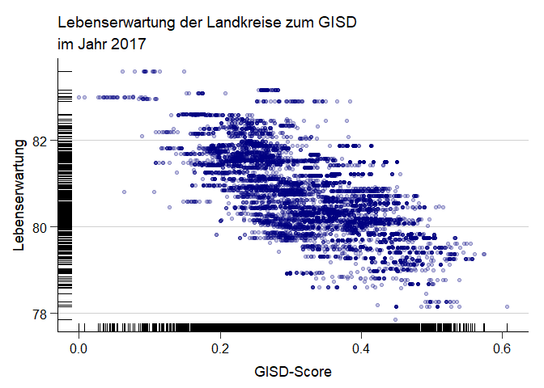
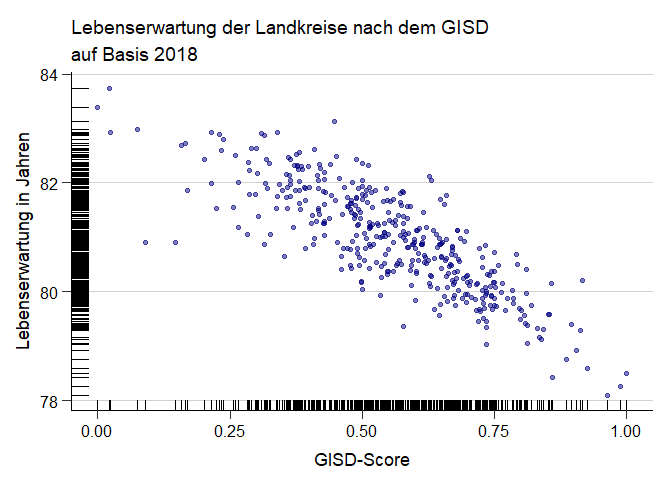
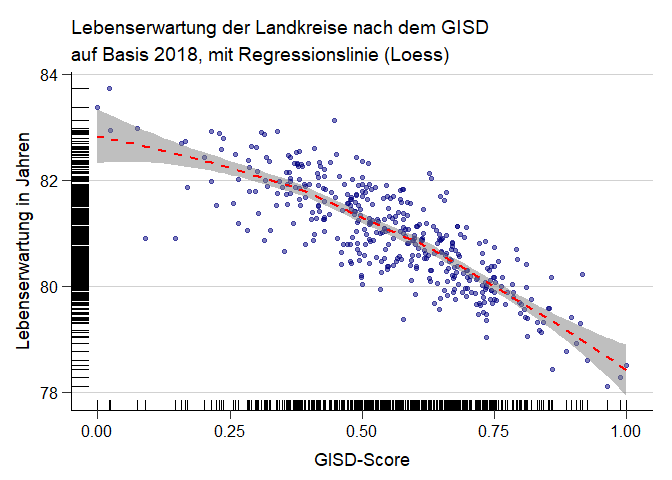
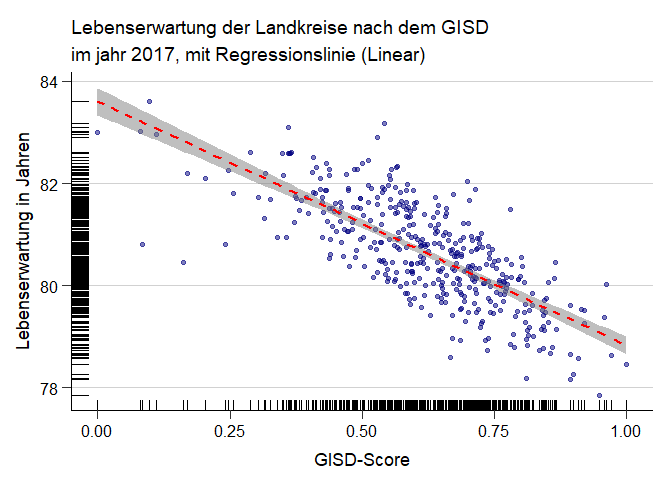

```r
Lebenserwartung_dat <- read.csv2("C:/git_projects/GISD/INKAR_Lebenswerwartung_Kreise.csv")

Lebenserwartung_dat <- Lebenserwartung_dat %>% mutate(Kreis = as.numeric(ï..Kennziffer)) %>% select(-ï..Kennziffer)

Resultdataset <- readRDS("C:/git_projects/GISD/Outfiles/Resultdataset.rds") %>% filter(Jahr == 2017)

Impdata.imputed <- readRDS("C:/git_projects/GISD/Outfiles/Impdata_check.rds") %>% filter(Jahr == 2017)

GISD_data_Kreis <- left_join(Resultdataset, Impdata.imputed, by = "Gemeindekennziffer") %>% select(Kreis, GISD_Score) %>% distinct(Kreis, .keep_all = TRUE) %>% unique()

GISD_Lebenserw_Kreis <- left_join(GISD_data_Kreis, Lebenserwartung_dat, by = "Kreis") %>% select(-Aggregat)
```


```r
ggplot(GISD_Lebenserw_Kreis, aes(x = GISD_Score, y = Lebenserwartung)) +
  geom_point(size = 1.5, alpha = 0.5, col = "navy") +
  geom_rug(size = 0.5) + 
  labs(x = "GISD-Score", title = "Lebenserwartung der Landkreise zum GISD", subtitle = "im Jahr 2017") +
  theme_rki()
```

<!-- -->


```r
ggplot(GISD_Lebenserw_Kreis, aes(x = GISD_Score, y = Lebenserwartung)) +
  geom_point(size = 1.5, alpha = 0.5, col = "navy") +
  geom_rug(size = 0.5) +
  geom_smooth(method = loess, col = "red", linetype = "dashed", fill = "grey50", alpha = 0.5) +
  labs(x = "GISD-Score", title = "Lebenserwartung der Landkreise zum GISD", subtitle =  "im Jahr 2017, mit Regressionslinie (Loess)",
       y = "Lebenserwartung in Jahren") +
  theme_rki()
```

```
## `geom_smooth()` using formula 'y ~ x'
```

<!-- -->


```r
ggplot(GISD_Lebenserw_Kreis, aes(x = GISD_Score, y = Lebenserwartung)) +
  geom_point(size = 1.5, alpha = 0.5, col = "navy") +
  geom_rug(size = 0.5) +
  geom_smooth(method = lm,col = "red", linetype = "dashed", fill = "grey50", alpha = 0.5) +
  labs(x = "GISD-Score", title = "Lebenserwartung der Landkreise zum GISD", subtitle = "im jahr 2017, mit Regressionslinie (Linear)",
       y = "Lebenserwartung in Jahren") +
  theme_rki()
```

```
## `geom_smooth()` using formula 'y ~ x'
```

<!-- -->


```r
ggplot(GISD_Lebenserw_Kreis, aes(x = GISD_Score, y = Lebenserwartung)) +
  geom_point(size = 1, alpha = 0.5) +
  geom_density2d(size = 1, col = "navy", alpha = 0.5) +
  labs(x = "GISD-Score", title = "Lebenserwartung der Landkreise zum GISD (Density)", subtitle = "im Jahr 2017",
       y = "Lebenserwartung in Jahren") +
  theme_rki()
```

<!-- -->
