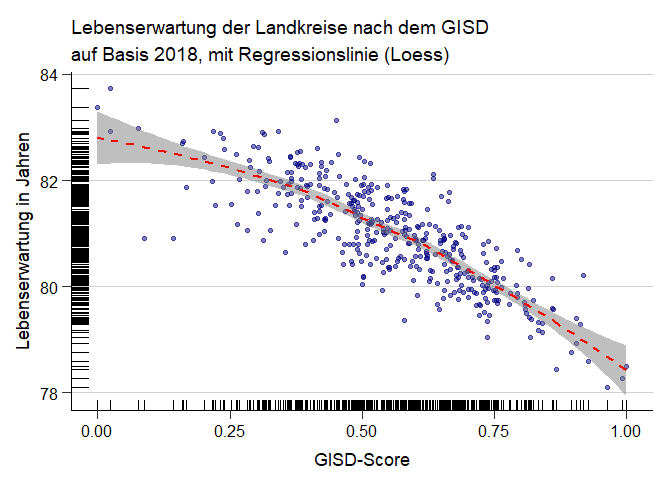

```r
Lebenserwartung_dat <- read_excel("Data/Lebenserwartung/Lebenserwartung_17_18_19.xlsx", skip = 1, sheet = "Daten")
names(Lebenserwartung_dat)[1] <- "Kreis"
Lebenserwartung_dat[2:3] <- NULL
Lebenserwartung_dat <- Lebenserwartung_dat %>% gather(key = "Jahr", value = "Value" , -"Kreis", convert=T, na.rm = T) %>% mutate(Kreis = as.numeric(Kreis))

Lebenserwartung_dat <- Lebenserwartung_dat %>% group_by(Kreis) %>% mutate(Lebenserwartung = mean(Value)) %>% ungroup() %>% filter(Jahr == 2018) %>% select(-Jahr, -Value)

GISD_data_Kreis <- read.csv("Outfiles/2022/Bund/Kreis/Kreis.csv") %>% filter(Jahr == 2018)

GISD_data_Kreis <- GISD_data_Kreis %>% mutate(Kreis = Kreiskennziffer) %>% select(Kreis, GISD_Score) %>% distinct(Kreis, .keep_all = TRUE) %>% unique()

GISD_Lebenserw_Kreis <- left_join(GISD_data_Kreis, Lebenserwartung_dat, by = "Kreis")
```


```r
#Normalization
GISD_Lebenserw_Kreis$GISD_Score <- (GISD_Lebenserw_Kreis$GISD_Score -min(GISD_Lebenserw_Kreis$GISD_Score ))/(max(GISD_Lebenserw_Kreis$GISD_Score )-min(GISD_Lebenserw_Kreis$GISD_Score ))
```


```r
ggplot(GISD_Lebenserw_Kreis, aes(x = GISD_Score, y = Lebenserwartung)) +
  geom_point(size = 1.5, alpha = 0.5, col = "navy") +
  geom_rug(size = 0.5) + 
  labs(x = "GISD-Score", title = "Lebenserwartung der Landkreise nach dem GISD", subtitle = "auf Basis 2018", y = "Lebenserwartung in Jahren") +
  theme_rki()
```

<!-- -->


```r
ggplot(GISD_Lebenserw_Kreis, aes(x = GISD_Score, y = Lebenserwartung)) +
  geom_point(size = 1.5, alpha = 0.5, col = "navy") +
  geom_rug(size = 0.5) +
  geom_smooth(method = loess, col = "red", linetype = "dashed", fill = "grey50", alpha = 0.5) +
  labs(x = "GISD-Score", title = "Lebenserwartung der Landkreise nach dem GISD", subtitle =  "auf Basis 2018, mit Regressionslinie (Loess)", y = "Lebenserwartung in Jahren") +
  theme_rki()
```

```
## `geom_smooth()` using formula 'y ~ x'
```

<!-- -->


```r
ggplot(GISD_Lebenserw_Kreis, aes(x = GISD_Score, y = Lebenserwartung)) +
  geom_point(size = 1.5, alpha = 0.5, col = "navy") +
  geom_rug(size = 0.5) +
  geom_smooth(method = lm,col = "red", linetype = "dashed", fill = "grey50", alpha = 0.5) +
  labs(x = "GISD-Score", title = "Lebenserwartung der Landkreise nach dem GISD", subtitle = "auf Basis 2018, mit Regressionslinie (Linear)", y = "Lebenserwartung in Jahren") +
  theme_rki()
```

```
## `geom_smooth()` using formula 'y ~ x'
```

<!-- -->


```r
ggplot(GISD_Lebenserw_Kreis, aes(x = GISD_Score, y = Lebenserwartung)) +
  geom_point(size = 1, alpha = 0.5) +
  geom_density2d(size = 1, col = "navy", alpha = 0.5) +
  labs(x = "GISD-Score", title = "Lebenserwartung der Landkreise nach dem GISD (Density)", subtitle = "auf Basis 2018", y = "Lebenserwartung in Jahren") +
  theme_rki()
```

<!-- -->
