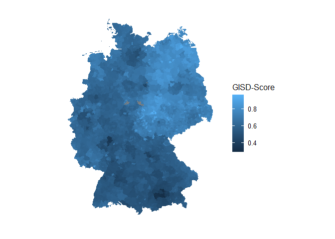

```r
Resultdataset <- readRDS("C:/git_projects/GISD/Outfiles/Resultdataset.rds")

Impdata.imputed <- readRDS("C:/git_projects/GISD/Outfiles/Impdata_check.rds")

GISD_data <- left_join(Resultdataset, Impdata.imputed, by = c("Gemeindekennziffer", "Jahr")) %>% lazy_dt() %>% select(Kreis, GISD_Score) %>% distinct(Kreis, .keep_all = TRUE) %>% unique() %>% lazy_dt()

Kreise_data <- readRDS("C:/git_projects/GISD/kreise_bkg.rds") %>% lazy_dt() %>% mutate(Kreis = as.numeric(id)) %>% select(-id) %>% left_join(GISD_data, by = "Kreis") %>% lazy_dt()

Kreise_data <- as_tibble(Kreise_data)
```


## GISD-Score auf Kreisebene

```r
ggplot(Kreise_data, aes(long, lat, group = group, fill=GISD_Score)) +
  geom_polygon(col = "black", size = 0.05) +
  scale_color_rki() +
  coord_equal() +
  theme_void() +
  labs(fill = "GISD-Score")
```

<!-- -->


