## Info


## Deskription: Wie verteilt sich die Variation der Indikatoren in den GISD-Scores über die Zeit und Gemeinden?


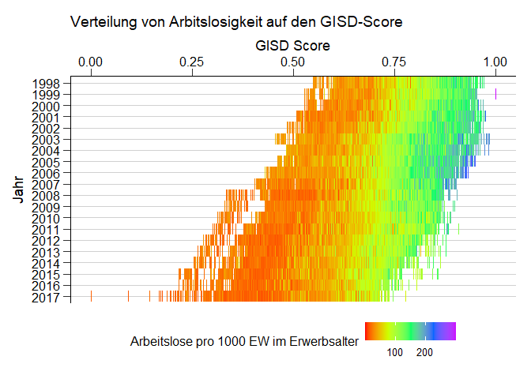<!-- -->

```
## Saving 7 x 5 in image
```

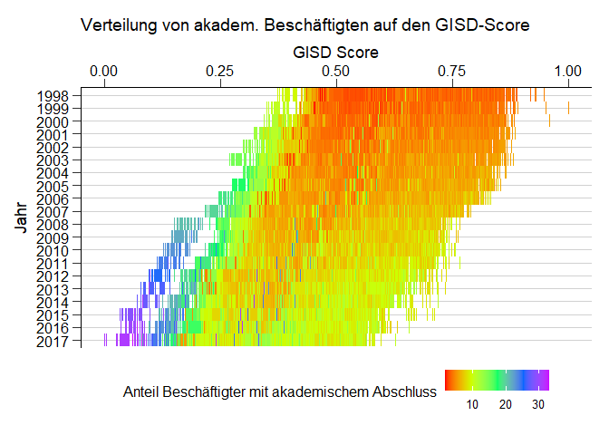<!-- -->

```
## Saving 7 x 5 in image
```

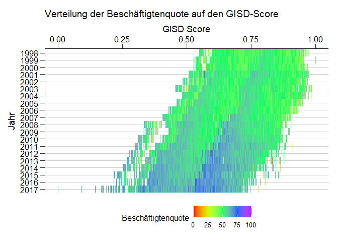<!-- -->

```
## Saving 7 x 5 in image
```

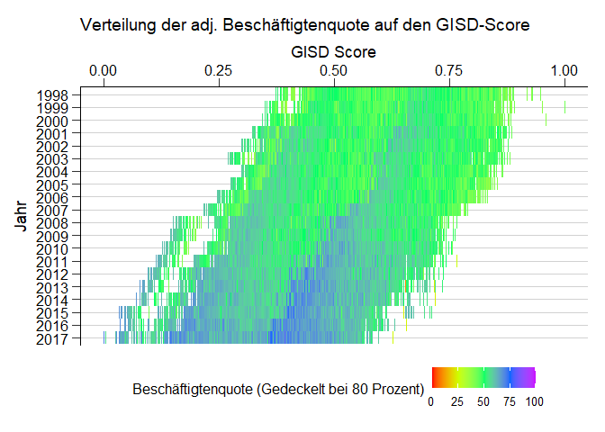<!-- -->

```
## Saving 7 x 5 in image
```

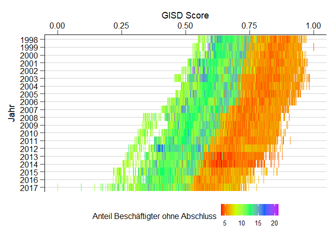<!-- -->

```
## Saving 7 x 5 in image
```

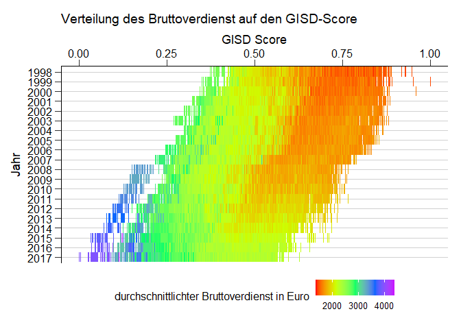<!-- -->

```
## Saving 7 x 5 in image
```

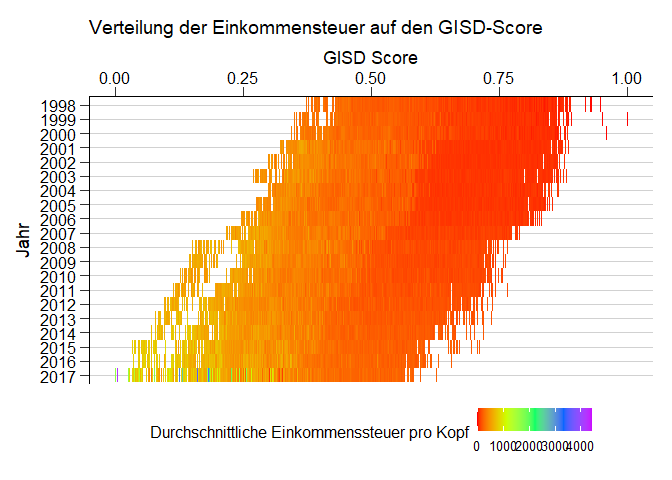<!-- -->

```
## Saving 7 x 5 in image
```

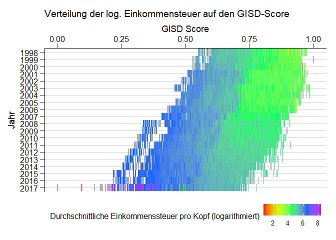<!-- -->

```
## Saving 7 x 5 in image
```

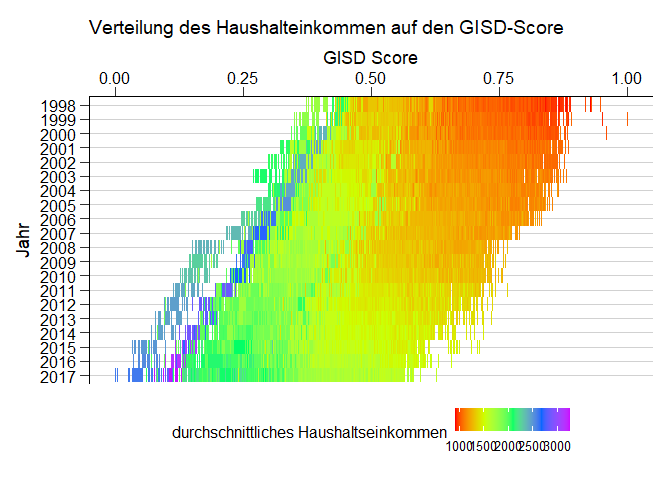<!-- -->

```
## Saving 7 x 5 in image
```

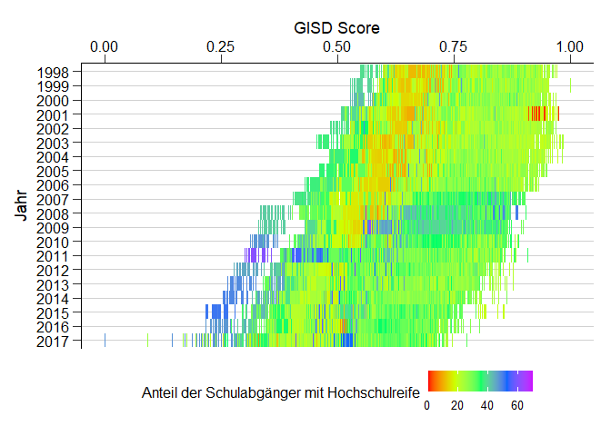<!-- -->

```
## Saving 7 x 5 in image
```

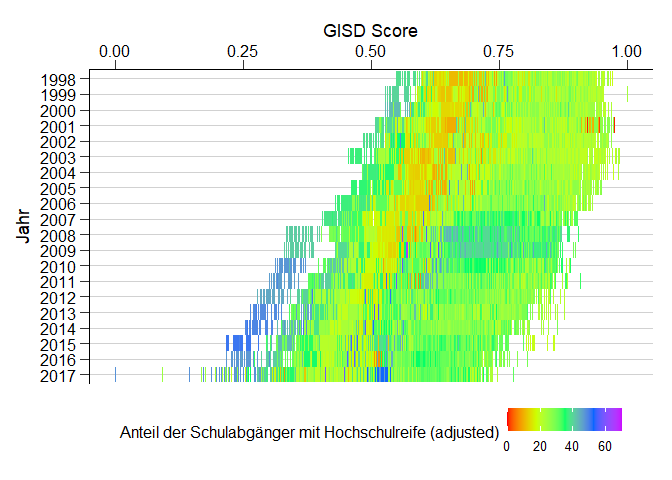<!-- -->

```
## Saving 7 x 5 in image
```

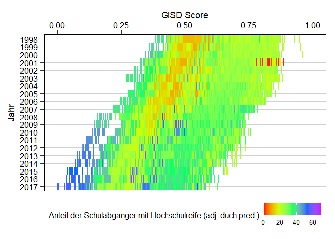<!-- -->

```
## Saving 7 x 5 in image
```

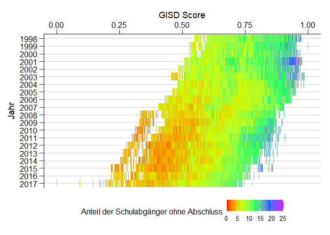<!-- -->

```
## Saving 7 x 5 in image
```

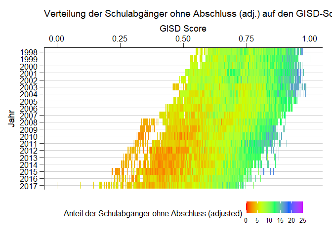<!-- -->

```
## Saving 7 x 5 in image
```

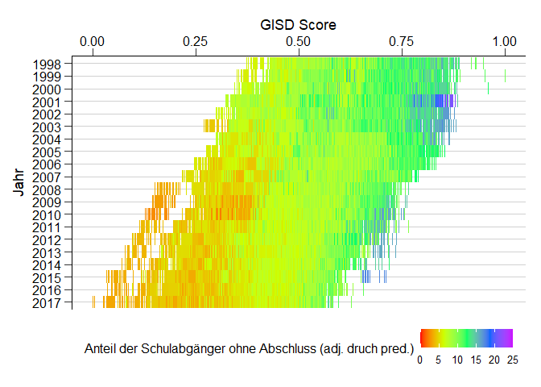<!-- -->

```
## Saving 7 x 5 in image
```

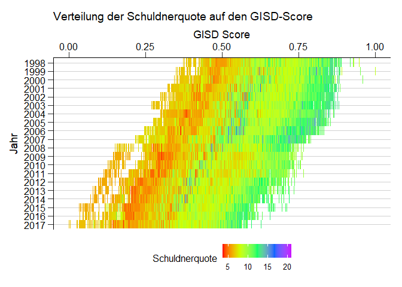<!-- -->

```
## Saving 7 x 5 in image
```

## Erklärung einiger Ausreißer - G8 Reformen


Ausreißer 2008 bis 2017: Einführung von G8 in verschiedenen BL, Beispiele:

- Ausreißer 2003: Einführung von G8 in Bayern reduziert sich der Nenner (alle Schulabgänger) für die Berechnung der Schulabgängeranteile in diesem Jahr, dadurch steigen die QUoten der Abgänger ohne Abschluss https://de.wikipedia.org/wiki/Abitur_in_Bayern_(G8)#%C3%9Cbergangsphase


Ausreißer 2001

- In Sachsen-Anhalt galt bis 2000 das 12-jährige Abitur, ab 2001 wurde G9 bei den Abschlüssen wirksam. Dadurch reduzierte sich für 2001 einmalig der Nenner (alle Schulabgänger) für die Berechnung der Schulabgängeranteile in diesem Jahr. Die Quoten der Abgänger ohne Abschluss fiel und die Abiturientenquote stieg.Die erneute Einführung von G8 2003/4 kam 2007 mit höheren Abschlussquoten zum Tragen. 

Besonderheit Thüringen vor 2004

-  In Thüringen gab es bis 2003 keine Regelung für Abgänger_innen aus der gymnasialen Oberstufe. Diese galten als Schulabgänger ohne Abschluss. Danach wurde mit Versetzung in die 10. Klasse der Haupt- bei Versetzung in die 11. Klasse der Realschulabschluss anerkannt (siehe Eichhorn & Huter 2004) ähnlich wie in den anderen Bundesländern.

"S:/OE/FG28/205 Regionale Unterschiede/GISD/Eichhorn & Huter 2004.pdf"


## Identifikation der Ausreißer

```r
Corr_data$outl <- "Kein Ausreißer"
Corr_data$outl[Corr_data$Kreis %in% c("9184", "11000", "7317")] <- "Ausreißer"

ggplot(Corr_data, aes(GISD_Score, Jahr)) + geom_tile(aes(color = outl), alpha = 0.5, size =0.5) + 
  theme_rki() + theme(legend.position="bottom") + scale_y_discrete(limits=rev) + 
  scale_x_continuous(position = "top") +
  labs(colour = "Ausreißer", x = "GISD Score")
```

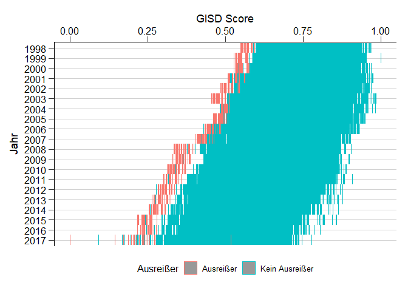<!-- -->

```r
ggsave("Outfiles/Outliers.png")
```

```
## Saving 7 x 5 in image
```
