## Info


## Deskription: Wie verteilt sich die Variation der Indikatoren in den GISD-Scores über die Zeit und Gemeinden? {.tabset}

### Arbeitsdimension
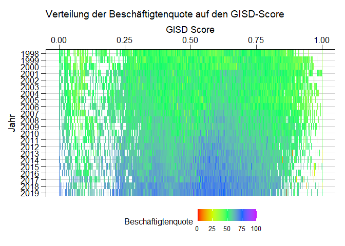<!-- -->

```
## Saving 7 x 5 in image
```

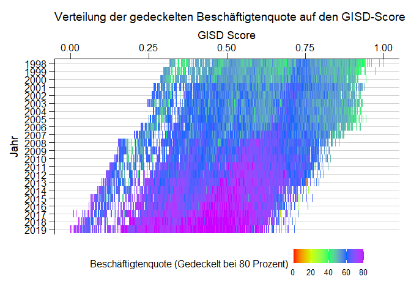<!-- -->

```
## Saving 7 x 5 in image
```

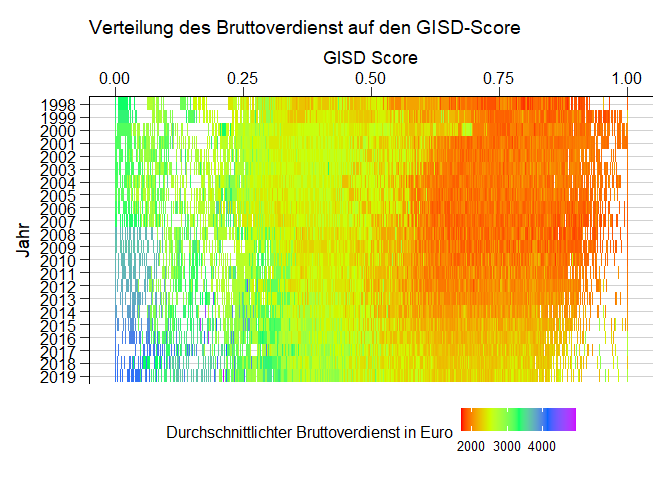<!-- -->

```
## Saving 7 x 5 in image
```

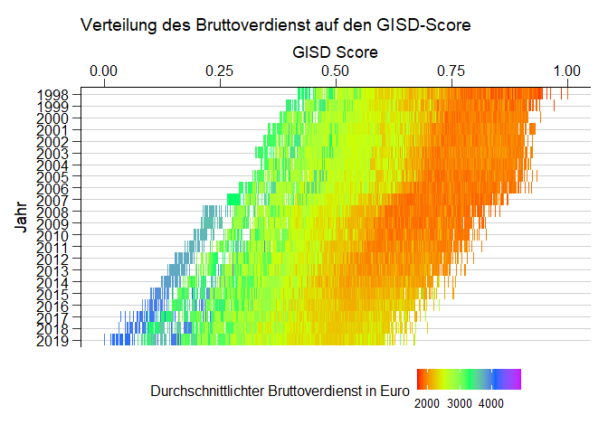<!-- -->

```
## Saving 7 x 5 in image
```

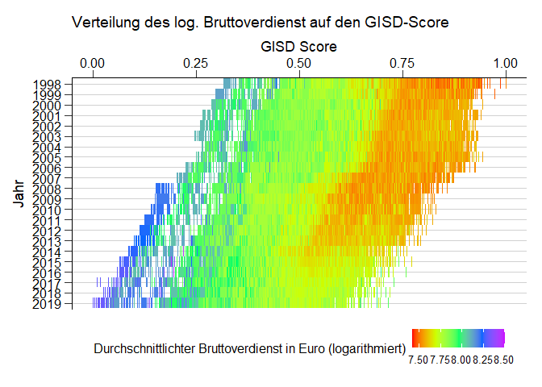<!-- -->

```
## Saving 7 x 5 in image
```

### Einkommensdimension

```r
ggplot(Corr_data, aes(GISD_Score, Jahr, color = Einkommensteuer)) + geom_tile(alpha = 0.5, size =0.5) + 
  theme_rki() + theme(legend.position="bottom") + 
  scale_color_gradientn(colours = rainbow(5)) + scale_y_discrete(limits=rev) + 
  scale_x_continuous(position = "top") +
  labs(colour = "Durchschnittliche Einkommenssteuer pro Kopf", x = "GISD Score", title = "Verteilung der Einkommensteuer auf den GISD-Score") 
```

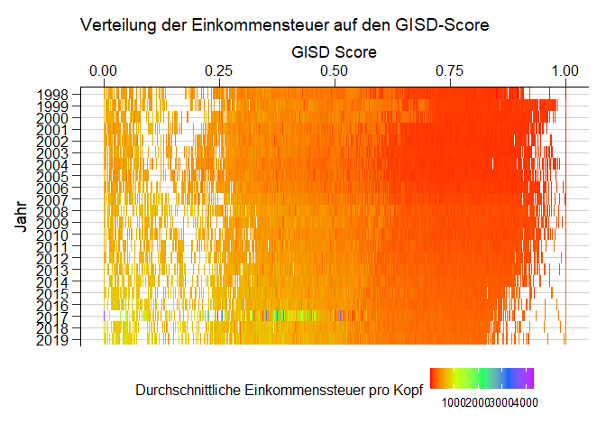<!-- -->

```r
ggsave("Outfiles/einkommensteuer.png")
```

```
## Saving 7 x 5 in image
```

```r
Corr_data <- Corr_data %>% mutate(Einkommensteuer_ln = ifelse(Einkommensteuer > 0, log(Einkommensteuer), 1))

ggplot(Corr_data, aes(GISD_Score, Jahr, color = Einkommensteuer_ln)) + geom_tile(alpha = 0.5, size =0.5) + 
  theme_rki() + theme(legend.position="bottom") + 
  scale_color_gradientn(colours = rainbow(5)) + scale_y_discrete(limits=rev) + 
  scale_x_continuous(position = "top") +
  labs(colour = "Durchschnittliche Einkommenssteuer pro Kopf (logarithmiert)", x = "GISD Score", title = "Verteilung der log. Einkommensteuer auf den GISD-Score")
```

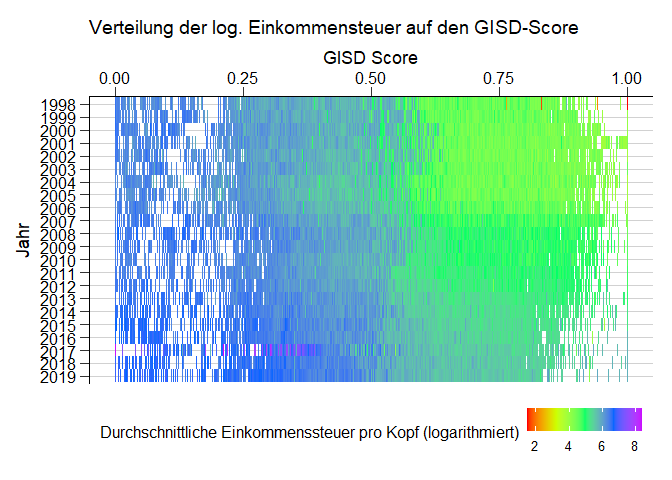<!-- -->

```r
ggsave("Outfiles/einkommensteuer_log.png")
```

```
## Saving 7 x 5 in image
```

```r
ggplot(Corr_data, aes(GISD_Score, Jahr, color = Haushaltseinkommen)) + geom_tile(alpha = 0.5, size =0.5) + 
  theme_rki() + theme(legend.position="bottom") + 
  scale_color_gradientn(colours = rainbow(5)) + scale_y_discrete(limits=rev) + 
  scale_x_continuous(position = "top") +
  labs(colour = "Durchschnittliches Haushaltseinkommen", x = "GISD Score", title = "Verteilung des Haushalteinkommen auf den GISD-Score") 
```

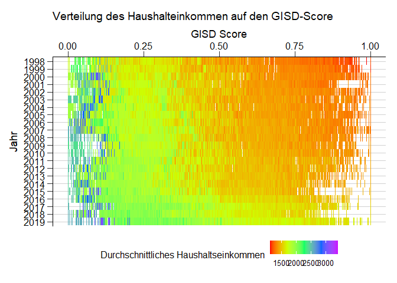<!-- -->

```r
ggsave("Outfiles/hheink.png")
```

```
## Saving 7 x 5 in image
```

```r
Corr_data <- Corr_data %>% mutate(Haushaltseinkommen_ln = log(Haushaltseinkommen))

ggplot(Corr_data, aes(GISD_Score, Jahr, color = Haushaltseinkommen_ln)) + geom_tile(alpha = 0.5, size =0.5) + 
  theme_rki() + theme(legend.position="bottom") + 
  scale_color_gradientn(colours = rainbow(5)) + scale_y_discrete(limits=rev) + 
  scale_x_continuous(position = "top") +
  labs(colour = "durchschnittliches Haushaltseinkommen (logarithmiert)", x = "GISD Score", title = "Verteilung des log. Haushalteinkommen auf den GISD-Score") 
```

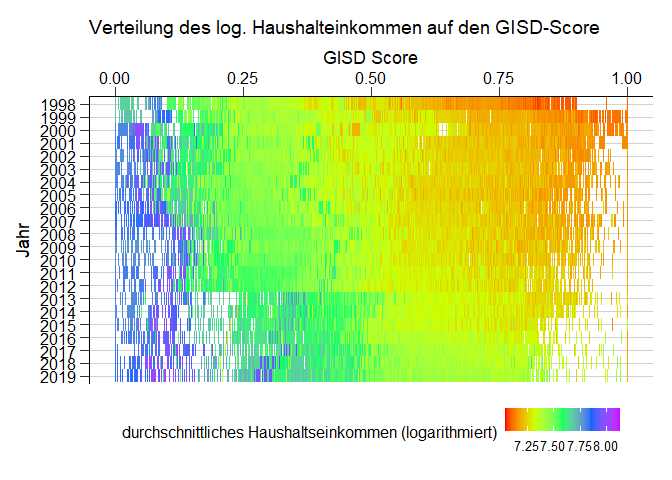<!-- -->

```r
ggsave("Outfiles/hheink_log.png")
```

```
## Saving 7 x 5 in image
```

```r
ggplot(Corr_data, aes(GISD_Score, Jahr, color = Schuldnerquote)) + geom_tile(alpha = 0.5, size =0.5) + 
  theme_rki() + theme(legend.position="bottom") + 
  scale_color_gradientn(colours = rainbow(5)) + scale_y_discrete(limits=rev) + 
  scale_x_continuous(position = "top") +
  labs(colour = "Schuldnerquote", x = "GISD Score", title = "Verteilung der Schuldnerquote auf den GISD-Score") 
```

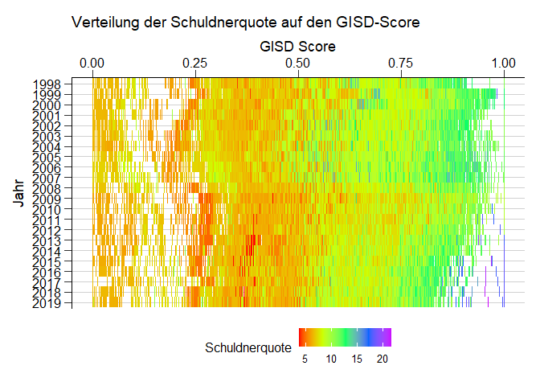<!-- -->

```r
ggsave("Outfiles/schuldner.png")
```

```
## Saving 7 x 5 in image
```

### Bildungsdimension

```r
ggplot(Corr_data, aes(GISD_Score, Jahr, color = BeschaeftigtemitakadAbschluss)) + geom_tile(alpha = 0.5, size = 0.5) +
  theme_rki() + theme(legend.position="bottom") + 
  scale_color_gradientn(colours = rainbow(5)) + scale_y_discrete(limits=rev) + 
  scale_x_continuous(position = "top") +
  labs(colour = "Anteil Beschäftigter mit akademischem Abschluss", x = "GISD Score", title = "Verteilung von akadem. Beschäftigten auf den GISD-Score") 
```

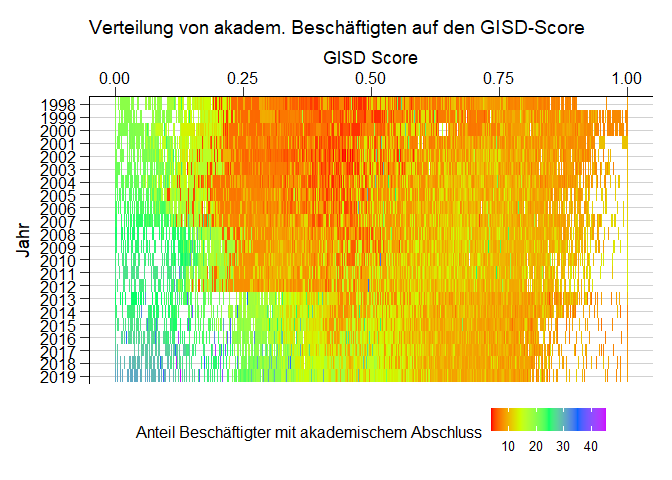<!-- -->

```r
ggsave("Outfiles/beschAkad.png")
```

```
## Saving 7 x 5 in image
```

```r
ggplot(Corr_data, aes(GISD_Score, Jahr, color = BeschaeftigteohneAbschluss)) + geom_tile(alpha = 0.5, size =0.5) + 
  theme_rki() + theme(legend.position="bottom") + 
  scale_color_gradientn(colours = rainbow(5)) + scale_y_discrete(limits=rev) + 
  scale_x_continuous(position = "top") +
  labs(colour = "Anteil Beschäftigter ohne Abschluss", x = "GISD Score", title = "Verteilung der Beschäftigten ohne Abschluss auf den GISD-Score") 
```

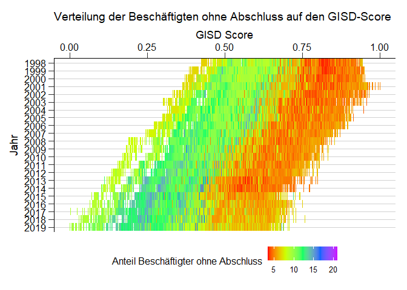<!-- -->

```r
ggsave("Outfiles/beschoA.png")
```

```
## Saving 7 x 5 in image
```

```r
ggplot(Corr_data, aes(GISD_Score, Jahr, color = BeschaeftigteohneAbschluss_adj)) + geom_tile(alpha = 0.5, size =0.5) +
  theme_rki() + theme(legend.position="bottom") + 
  scale_color_gradientn(colours = rainbow(5)) + scale_y_discrete(limits=rev) + 
  scale_x_continuous(position = "top") +
  labs(colour = "Anteil Beschäftigter ohne Abschluss (adjusted)", x = "GISD Score", title = "Verteilung der Beschäftigten ohne Abschluss (adj.) auf den GISD-Score")
```

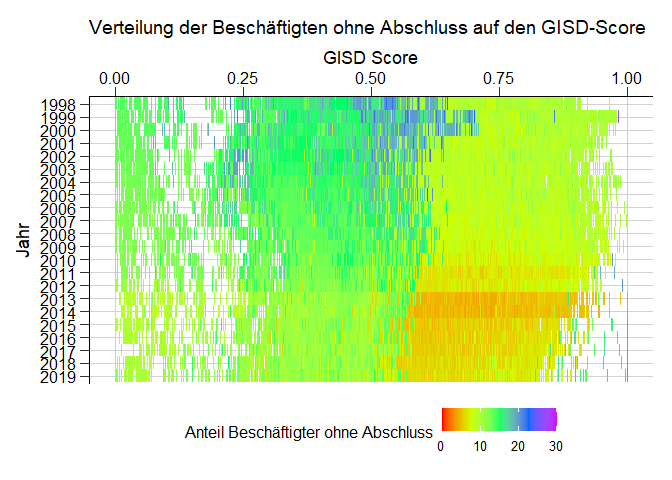<!-- -->

```r
ggsave("Outfiles/beschoA_adj.png")
```

```
## Saving 7 x 5 in image
```

```r
ggplot(Corr_data, aes(GISD_Score, Jahr, color = SchulabgaengerohneAbschluss)) + geom_tile(alpha = 0.5, size =0.5) + 
  theme_rki() + theme(legend.position="bottom") + 
  scale_color_gradientn(colours = rainbow(5)) + scale_y_discrete(limits=rev) + 
  scale_x_continuous(position = "top") +
  labs(colour = "Anteil der Schulabgänger ohne Abschluss", x = "GISD Score", title = "Verteilung der Schulabgänger ohne Abschluss auf den GISD-Score") 
```

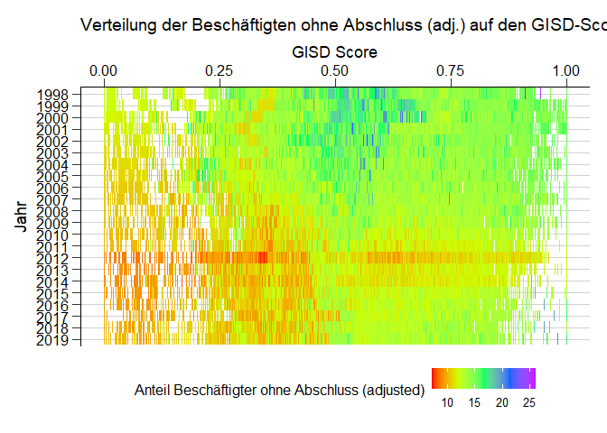<!-- -->

```r
ggsave("Outfiles/anteilohneab.png")
```

```
## Saving 7 x 5 in image
```

```r
ggplot(Corr_data, aes(GISD_Score, Jahr, color = SchulabgaengerohneAbschluss_adj)) + geom_tile(alpha = 0.5, size =0.5) + theme_rki() + theme(legend.position="bottom") + 
  scale_color_gradientn(colours = rainbow(5)) + scale_y_discrete(limits=rev) + 
  scale_x_continuous(position = "top") +
  labs(colour = "Anteil der Schulabgänger ohne Abschluss (adjusted)", x = "GISD Score", title = "Verteilung der Schulabgänger ohne Abschluss (adj.) auf den GISD-Score") 
```

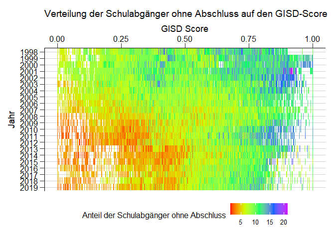<!-- -->

```r
ggsave("Outfiles/anteilohneab_adj.png")
```

```
## Saving 7 x 5 in image
```

```r
ggplot(Corr_data, aes(GISD_Score, Jahr, color = SchulabgaengermitHochschulreife)) + geom_tile(alpha = 0.5, size =0.5) + theme_rki() + theme(legend.position="bottom") + 
  scale_color_gradientn(colours = rainbow(5), limits=c(0,70)) + scale_y_discrete(limits=rev) + 
  scale_x_continuous(position = "top") +
  labs(colour = "Anteil der Schulabgänger mit Hochschulreife", x = "GISD Score", title = "Verteilung der Schulabg. mit Hochschulreife auf den GISD-Score") 
```

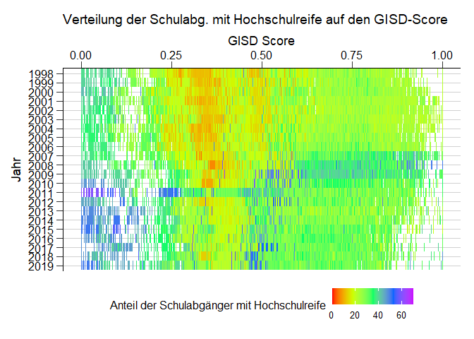<!-- -->

```r
ggsave("Outfiles/anteilabi.png")
```

```
## Saving 7 x 5 in image
```

```r
ggplot(Corr_data, aes(GISD_Score, Jahr, color = SchulabgaengermitHochschulreife_adj)) + geom_tile(alpha = 0.5, size =0.5) +
  theme_rki() + theme(legend.position="bottom") + 
  scale_color_gradientn(colours = rainbow(5), limits=c(0,70)) + scale_y_discrete(limits=rev) + 
  scale_x_continuous(position = "top") +
  labs(colour = "Anteil der Schulabgänger mit Hochschulreife (adjusted)", x = "GISD Score", title = "Verteilung der Schulabg. mit Hochschulreife (adj.) auf den GISD-Score")
```

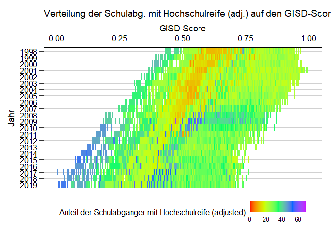<!-- -->

```r
ggsave("Outfiles/anteilabi_adj.png")
```

```
## Saving 7 x 5 in image
```


#### Erklärung einiger Ausreißer - G8 Reformen


Ausreißer 2008 bis 2017: Einführung von G8 in verschiedenen BL, Beispiele:

- Ausreißer 2003: Einführung von G8 in Bayern reduziert sich der Nenner (alle Schulabgänger) für die Berechnung der Schulabgängeranteile in diesem Jahr, dadurch steigen die QUoten der Abgänger ohne Abschluss https://de.wikipedia.org/wiki/Abitur_in_Bayern_(G8)#%C3%9Cbergangsphase


Ausreißer 2001

- In Sachsen-Anhalt galt bis 2000 das 12-jährige Abitur, ab 2001 wurde G9 bei den Abschlüssen wirksam. Dadurch reduzierte sich für 2001 einmalig der Nenner (alle Schulabgänger) für die Berechnung der Schulabgängeranteile in diesem Jahr. Die Quoten der Abgänger ohne Abschluss fiel und die Abiturientenquote stieg.Die erneute Einführung von G8 2003/4 kam 2007 mit höheren Abschlussquoten zum Tragen. 

Besonderheit Thüringen vor 2004

-  In Thüringen gab es bis 2003 keine Regelung für Abgänger_innen aus der gymnasialen Oberstufe. Diese galten als Schulabgänger ohne Abschluss. Danach wurde mit Versetzung in die 10. Klasse der Haupt- bei Versetzung in die 11. Klasse der Realschulabschluss anerkannt (siehe Eichhorn & Huter 2004) ähnlich wie in den anderen Bundesländern.

"S:/OE/FG28/205 Regionale Unterschiede/GISD/Eichhorn & Huter 2004.pdf"


## Identifikation von Ausreißern

```r
Corr_data$outl <- "Kein Ausreißer"
Corr_data$outl[Corr_data$Kreis %in% c("9184", "11000", "7317", "16053", "12054", "9188", "6434")] <- "Ausreißer"

ggplot(Corr_data, aes(GISD_Score, Jahr)) + geom_tile(aes(color = outl), alpha = 0.5, size =0.5) + 
  theme_rki() + theme(legend.position="bottom") + scale_y_discrete(limits=rev) + 
  scale_color_rki() +
  geom_tile(data = Corr_data[Corr_data$outl == "Ausreißer",], size = 1) +
  scale_x_continuous(position = "top") +
  labs(colour = "Ausreißer", x = "GISD Score", "Ausreißer im GISD-Score")
```

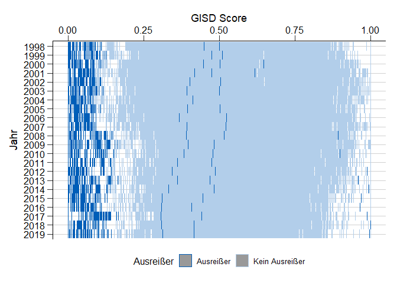<!-- -->

```r
ggsave("Outfiles/Outliers.png")
```

```
## Saving 7 x 5 in image
```

```r
Corr_data$outl <- "Andere Kreise"
Corr_data$outl[Corr_data$Kreis %in% c("9184")] <- "München"

ggplot(Corr_data, aes(GISD_Score, Jahr)) + geom_tile(aes(color = outl), alpha = 0.5, size =0.5) +
  scale_color_rki()+
  geom_tile(data = Corr_data[Corr_data$outl == "München",], color = "lightblue", size = 1.5) +
  theme_rki() + theme(legend.position="bottom") + scale_y_discrete(limits=rev) + 
  scale_x_continuous(position = "top") +
  labs(colour = "Ausreißer", x = "GISD Score")
```

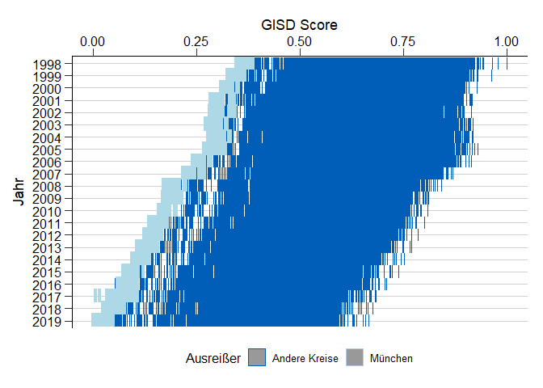<!-- -->

```r
ggsave("Outfiles/Outliers_München.png")
```

```
## Saving 7 x 5 in image
```

```r
Corr_data$outl <- "Andere Kreise"
Corr_data$outl[Corr_data$Kreis %in% c("11000")] <- "Berlin"

ggplot(Corr_data, aes(GISD_Score, Jahr)) + geom_tile(aes(color = outl), alpha = 0.5, size =0.5) + 
  scale_color_rki() +
  geom_tile(data = Corr_data[Corr_data$outl == "Berlin",], color = "lightblue", size = 1.5) +
  theme_rki() + theme(legend.position="bottom") + scale_y_discrete(limits=rev) + 
  scale_x_continuous(position = "top") +
  labs(colour = "Ausreißer", x = "GISD Score")
```

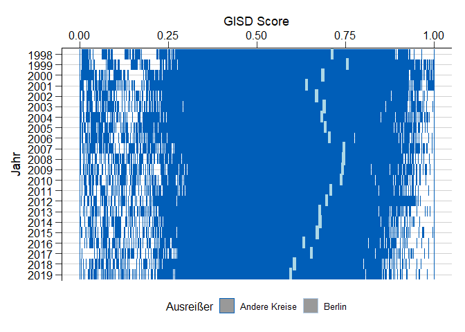<!-- -->

```r
ggsave("Outfiles/Outliers_Berlin.png")
```

```
## Saving 7 x 5 in image
```

```r
Corr_data$outl <- "Andere Kreise"
Corr_data$outl[Corr_data$Kreis %in% c("7317")] <- "Primasens"

ggplot(Corr_data, aes(GISD_Score, Jahr)) + geom_tile(aes(color = outl), alpha = 0.5, size =0.5) +
  scale_color_rki() +
  geom_tile(data = Corr_data[Corr_data$outl == "Primasens",], color = "lightblue", size = 1.5) +
  theme_rki() + theme(legend.position="bottom") + scale_y_discrete(limits=rev) + 
  scale_x_continuous(position = "top") +
  labs(colour = "Ausreißer", x = "GISD Score")
```

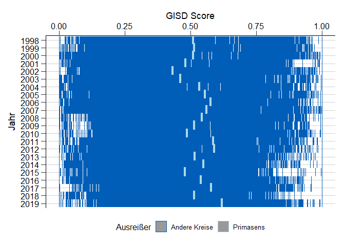<!-- -->

```r
ggsave("Outfiles/Outliers_Primasens.png")
```

```
## Saving 7 x 5 in image
```

```r
Corr_data$outl <- "Andere Kreise"
Corr_data$outl[Corr_data$Kreis %in% c("16053")] <- "Jena"

ggplot(Corr_data, aes(GISD_Score, Jahr)) + geom_tile(aes(color = outl), alpha = 0.5, size =0.5) +
  scale_color_rki() +
  geom_tile(data = Corr_data[Corr_data$outl == "Jena",], color = "lightblue", size = 1.5) +
  theme_rki() + theme(legend.position="bottom") + scale_y_discrete(limits=rev) + 
  scale_x_continuous(position = "top") +
  labs(colour = "Ausreißer", x = "GISD Score")
```

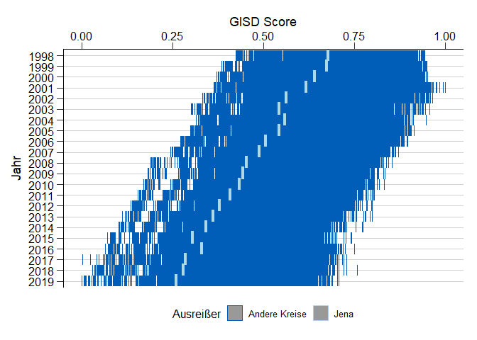<!-- -->

```r
ggsave("Outfiles/Outliers_Jena.png")
```

```
## Saving 7 x 5 in image
```

```r
Corr_data$outl <- "Andere Kreise"
Corr_data$outl[Corr_data$Kreis %in% c("12054")] <- "Potsdam"

ggplot(Corr_data, aes(GISD_Score, Jahr)) + geom_tile(aes(color = outl), alpha = 0.5, size =0.5) +
  scale_color_rki() +
  geom_tile(data = Corr_data[Corr_data$outl == "Potsdam",], color = "lightblue", size = 1.5) +
  theme_rki() + theme(legend.position="bottom") + scale_y_discrete(limits=rev) + 
  scale_x_continuous(position = "top") +
  labs(colour = "Ausreißer", x = "GISD Score")
```

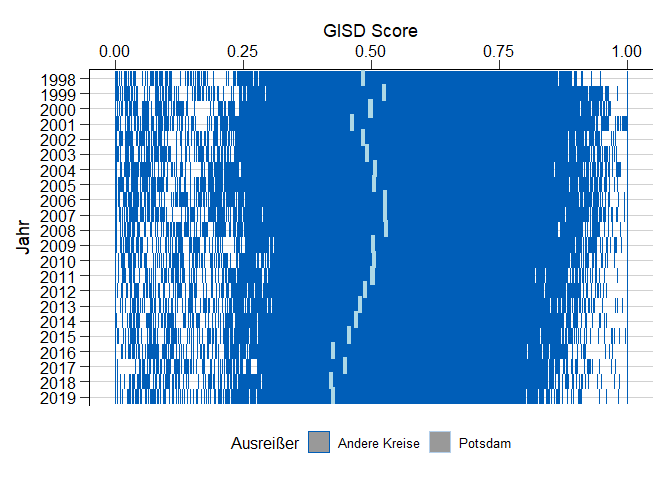<!-- -->

```r
ggsave("Outfiles/Outliers_Potsdam.png")
```

```
## Saving 7 x 5 in image
```

```r
Corr_data$outl <- "Andere Kreise"
Corr_data$outl[Corr_data$Kreis %in% c("9188")] <- "Starnberg"

ggplot(Corr_data, aes(GISD_Score, Jahr)) + geom_tile(aes(color = outl), alpha = 0.5, size =0.5) +
  scale_color_rki() +
  geom_tile(data = Corr_data[Corr_data$outl == "Starnberg",], color = "lightblue", size = 1.5) +
  theme_rki() + theme(legend.position="bottom") + scale_y_discrete(limits=rev) + 
  scale_x_continuous(position = "top") +
  labs(colour = "Ausreißer", x = "GISD Score")
```

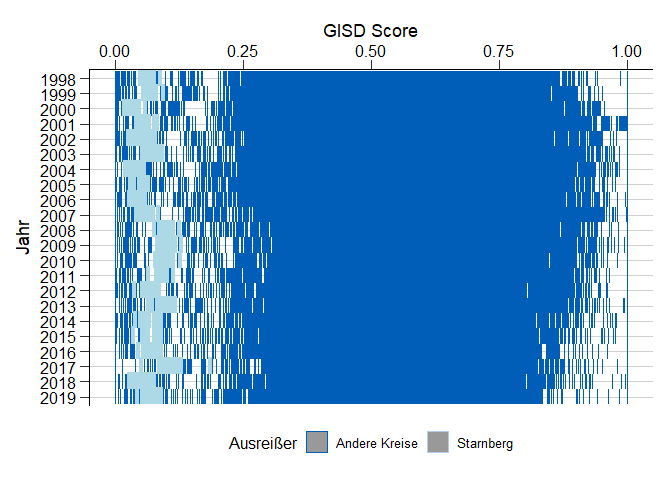<!-- -->

```r
ggsave("Outfiles/Outliers_Starnberg.png")
```

```
## Saving 7 x 5 in image
```

```r
Corr_data$outl <- "Andere Kreise"
Corr_data$outl[Corr_data$Kreis %in% c("6434")] <- "Hochtaunuskreis"

ggplot(Corr_data, aes(GISD_Score, Jahr)) + geom_tile(aes(color = outl), alpha = 0.5, size =0.5) +
  scale_color_rki() +
  geom_tile(data = Corr_data[Corr_data$outl == "Hochtaunuskreis",], color = "lightblue", size = 1.5) +
  theme_rki() + theme(legend.position="bottom") + scale_y_discrete(limits=rev) + 
  scale_x_continuous(position = "top") +
  labs(colour = "Ausreißer", x = "GISD Score")
```

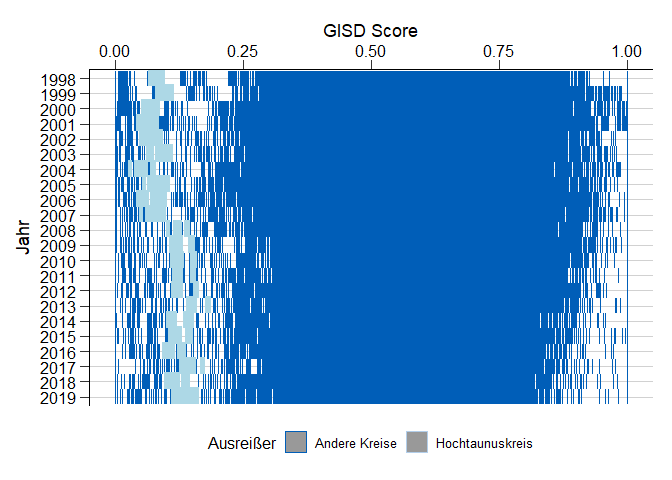<!-- -->

```r
ggsave("Outfiles/Outliers_Hochtaunuskreis.png")
```

```
## Saving 7 x 5 in image
```

## Verteilung des GISD

```r
Corr_data$ow <- "Ost"
Corr_data$ow[Corr_data$Kreis < 11000] <- "West"

ggplot(Corr_data, aes(GISD_Score, Jahr)) + geom_tile(aes(color = ow), alpha = 0.5, size =0.5) + 
  theme_rki() + theme(legend.position="bottom") + scale_y_discrete(limits=rev) +
  scale_color_rki() +
  scale_x_continuous(position = "top") +
  labs(colour = "Ost und west", x = "GISD Score", title = "GISD-Score nach ost- und westdeutschen Landkreisen")
```

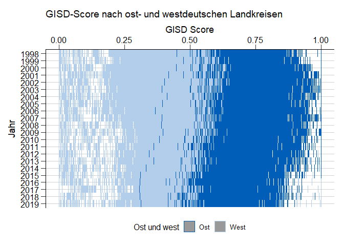<!-- -->

```r
ggsave("Outfiles/OstWest.png")
```

```
## Saving 7 x 5 in image
```
