## Info


## Deskription: Wie verteilt sich die Variation der Indikatoren in den GISD-Scores über die Zeit und Gemeinden?


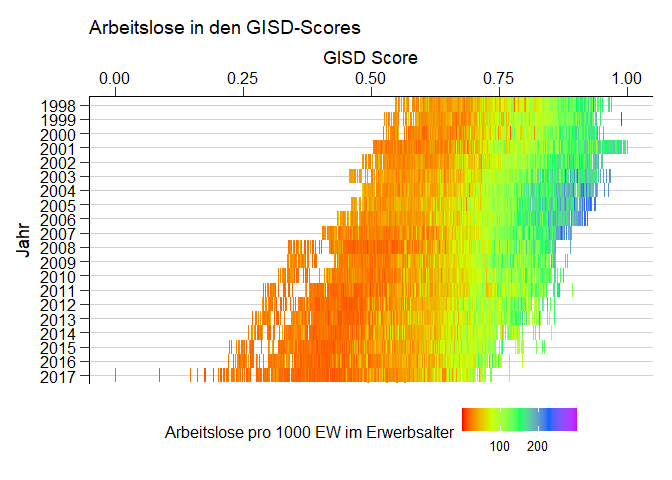<!-- -->

```
## Saving 7 x 5 in image
```

<!-- -->

```
## Saving 7 x 5 in image
```

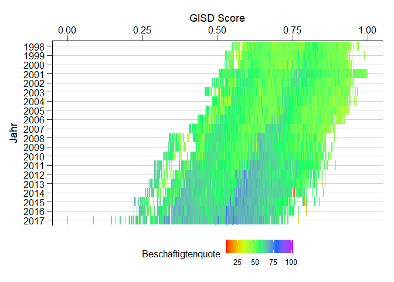<!-- -->

```
## Saving 7 x 5 in image
```

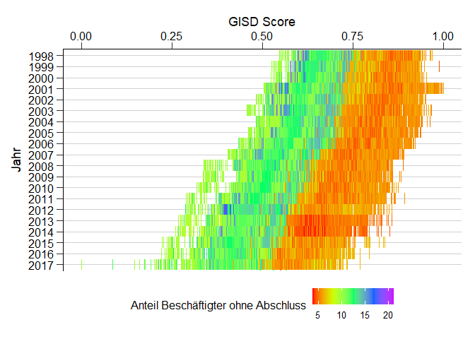<!-- -->

```
## Saving 7 x 5 in image
```

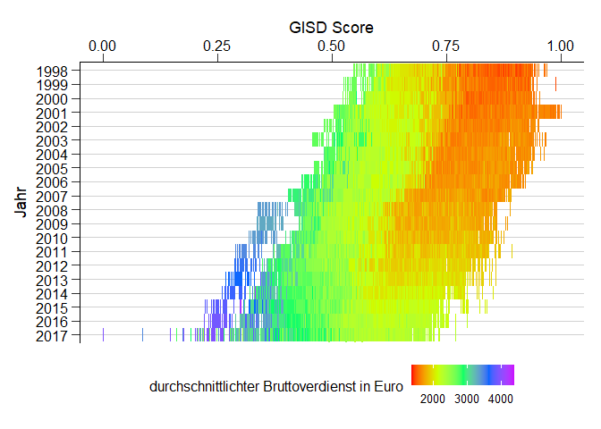<!-- -->

```
## Saving 7 x 5 in image
```

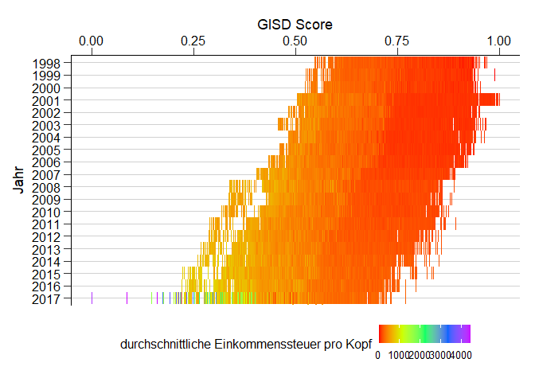<!-- -->

```
## Saving 7 x 5 in image
```

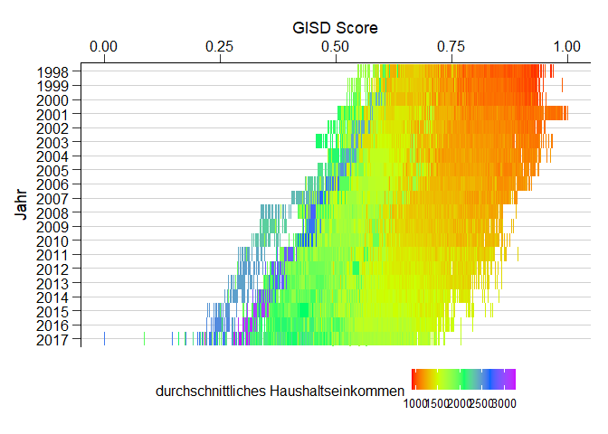<!-- -->

```
## Saving 7 x 5 in image
```

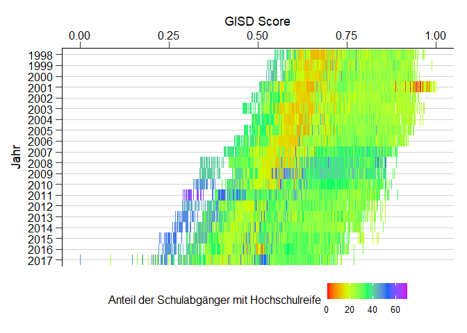<!-- -->

```
## Saving 7 x 5 in image
```

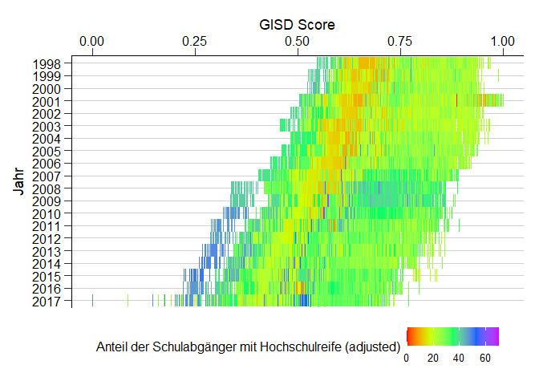<!-- -->

```
## Saving 7 x 5 in image
```

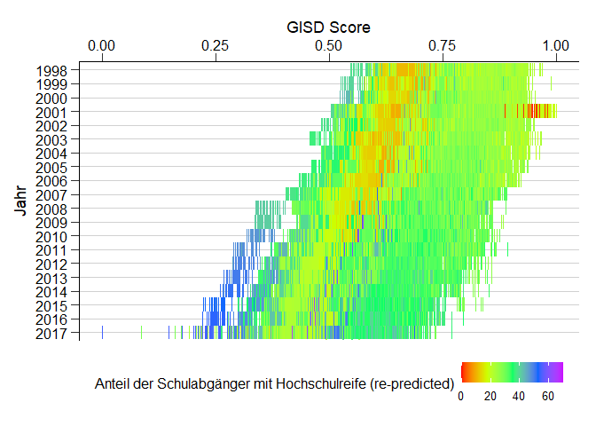<!-- -->

```
## Saving 7 x 5 in image
```

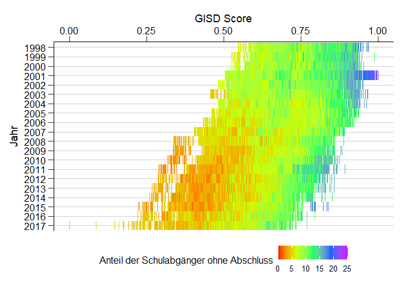<!-- -->

```
## Saving 7 x 5 in image
```

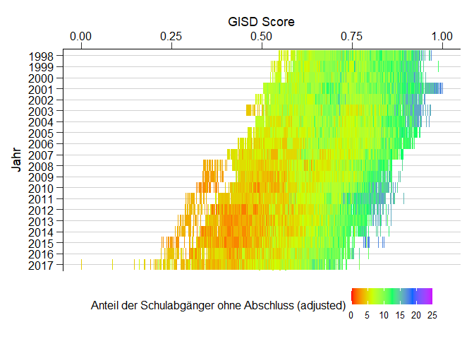<!-- -->

```
## Saving 7 x 5 in image
```

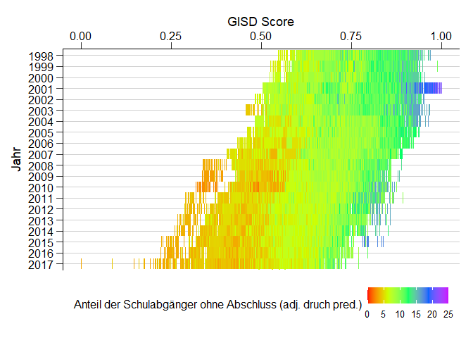<!-- -->

```
## Saving 7 x 5 in image
```

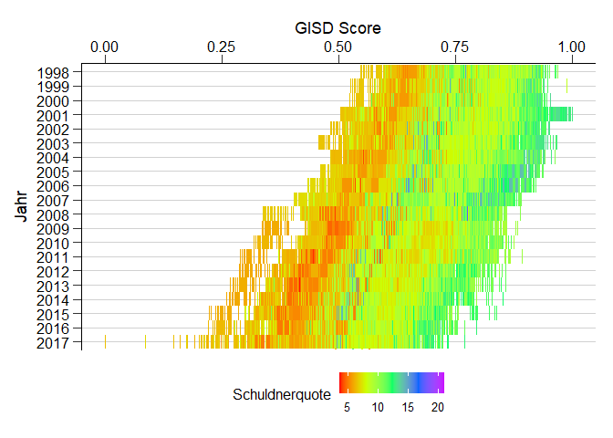<!-- -->

```
## Saving 7 x 5 in image
```

## Erklärung einiger Ausreißer - G8 Reformen

Ausreißer 2001: Durch die Einführung des 13. Schuljahres in Sachsen-Anhalt reduziert sich der Nenner (alle Schulabgänger) für die Berechnung der Schulabgängeranteile in diesem Jahr, dadurch steigen die Quoten der Abgänger ohne Abschluss und Fallen die Abiquoten


Ausreißer 2003: Einführung von G8 in Bayern reduziert sich der Nenner (alle Schulabgänger) für die Berechnung der Schulabgängeranteile in diesem Jahr , dadurch steigen die QUoten der Abgänger ohne Abschluss 
https://de.wikipedia.org/wiki/Abitur_in_Bayern_(G8)#%C3%9Cbergangsphase


Ausreißer 2008 bis 2017: Einführung von G8 in verschiedenen BL


## Was man noch machen könnte

Einzelne Gemeinden Highlighten:
https://stackoverflow.com/questions/32640557/label-specific-point-in-ggplot2


